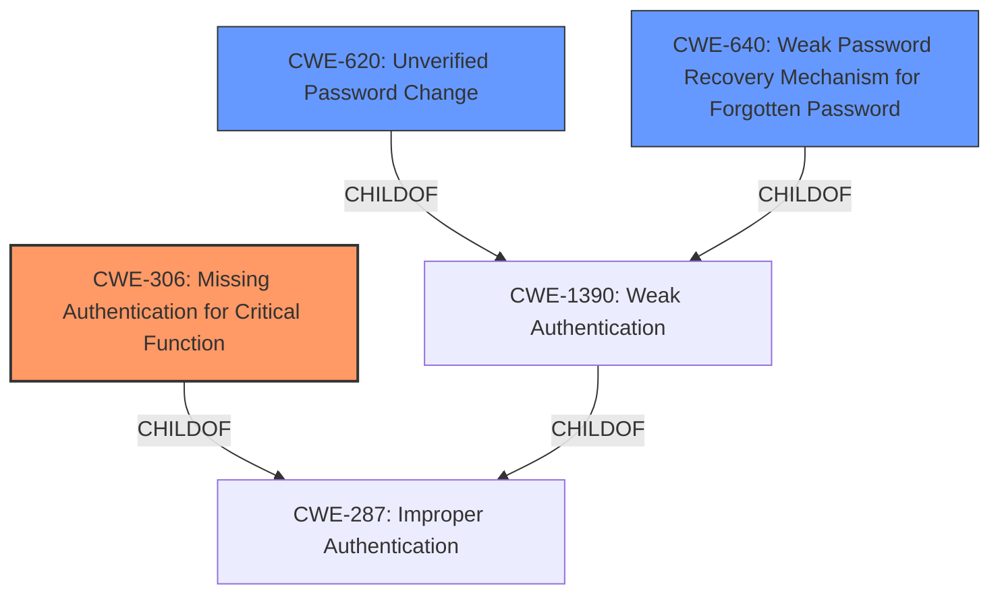

# Enhanced Analysis for CVE-2020-25566

# Summary
| CWE ID | CWE Name | Confidence | CWE Abstraction Level | CWE Vulnerability Mapping Label | CWE-Vulnerability Mapping Notes |
|---|---|---|---|---|---|
| CWE-306 | Missing Authentication for Critical Function | 1.0 | Base | Primary | Allowed |
| CWE-620 | Unverified Password Change | 0.75 | Base | Secondary | Allowed |
| CWE-640 | Weak Password Recovery Mechanism for Forgotten Password | 0.5 | Base | Secondary | Allowed-with-Review |

## Evidence and Confidence

*   **Confidence Score:** 0.85
*   **Evidence Strength:** HIGH

## Relationship Analysis
The primary weakness identified is CWE-306, which directly addresses the **missing authentication** in the `Save_Password` form. CWE-620 and CWE-640 are related, focusing on the password change and recovery mechanisms, respectively, and are both children of CWE-1390. The hierarchical relationships helped to narrow down the selection to the most specific and relevant CWEs.



## Vulnerability Chain
The vulnerability chain starts with the **missing authentication** (CWE-306) for the `Save_Password` form. This leads to the ability to perform an **unverified password change** (CWE-620), effectively creating a **weak password recovery mechanism** (CWE-640). The final impact is complete account compromise.

## Summary of Analysis
The primary CWE is CWE-306 because the root cause is that the `Save_Password` form lacks authentication. The vulnerability description explicitly states that a JSESSIONID is not required, allowing anyone to reset a user's password. This aligns perfectly with the description of CWE-306: "The product does not perform any authentication for functionality that requires a provable user identity or consumes a significant amount of resources." The CVE Reference Links Content Summary confirms this: "The vulnerability stems from the **lack of proper session handling or authentication checks** in the `Save_Password` form."

CWE-620 ("When setting a new password for a user, the product does not require knowledge of the original password, or using another form of authentication") is included as a secondary CWE because the **missing authentication** directly leads to the ability to change passwords without verification.

CWE-640 ("The product contains a mechanism for users to recover or change their passwords without knowing the original password, but the mechanism is weak.") is included as a secondary CWE because the **lack of authentication** on the password reset form means the password recovery mechanism is weak. However, this is less directly applicable than CWE-306, as it is not explicitly a "recovery" mechanism.

Other CWEs considered but not used:

*   CWE-798: Use of Hard-coded Credentials - This CWE was not selected because there is no mention of **hard-coded credentials**. The vulnerability is due to **missing authentication**, not the use of default passwords.
*   CWE-472: External Control of Assumed-Immutable Web Parameter - This CWE was not selected because while the username parameter is being modified, the core issue is the **lack of authentication** rather than the improper validation of the modified parameter.
*   CWE-287: Improper Authentication - This CWE is too high-level (Class). CWE-306 is a more specific (Base) CWE that better describes the vulnerability.
*   CWE-259: Use of Hard-coded Password - Similar to CWE-798, there is no evidence of **hard-coded passwords** being used.

The selected CWEs are at the optimal level of specificity, with CWE-306 directly addressing the **missing authentication**, and CWE-620/CWE-640 highlighting the consequences related to password change and recovery.


## CWE Relationship Analysis

Current CWEs represent these abstraction levels: .


### Vulnerability Chain Analysis

**Chain starting from CWE-640:**
- 640 (Weak Password Recovery Mechanism for Forgotten Password) - ROOT


**Chain starting from CWE-306:**
- 306 (Missing Authentication for Critical Function) - ROOT


### CWE Relationship Diagram

```mermaid
graph TD
    classDef primary fill:#f96,stroke:#333,stroke-width:2px
    classDef secondary fill:#69f,stroke:#333
    classDef tertiary fill:#9e9,stroke:#333
```