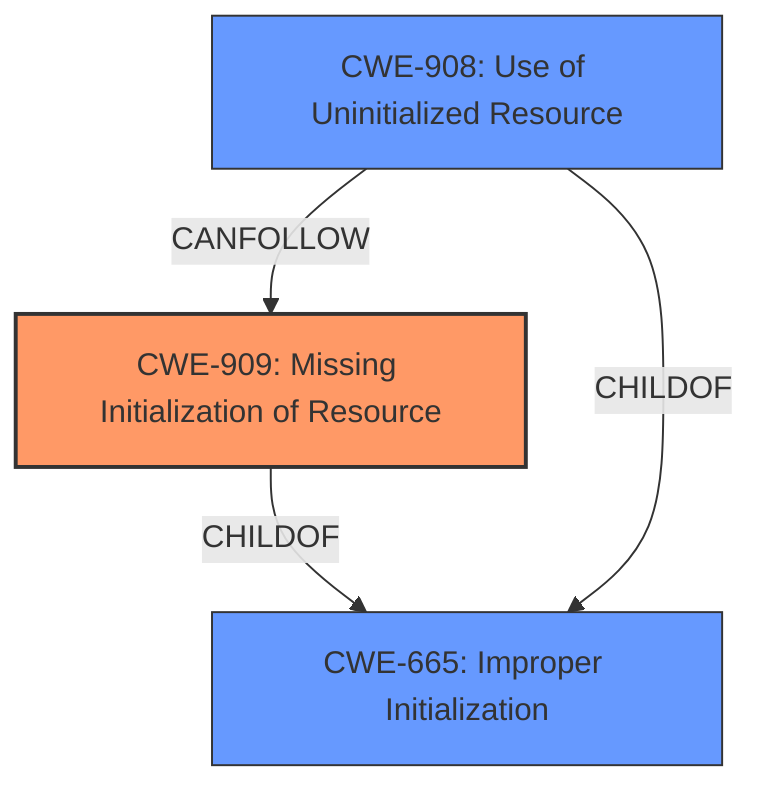

# Enhanced Analysis for CVE-2020-25578

# Summary
| CWE ID | CWE Name | Confidence | CWE Abstraction Level | CWE Vulnerability Mapping Label | CWE-Vulnerability Mapping Notes |
|---|---|---|---|---|---|
| CWE-909 | Missing Initialization of Resource | 0.9 | Class | Allowed-with-Review | Primary: The vulnerability is caused by the failure to initialize the `d_off` field in the `dirent` structure by certain file systems. |
| CWE-908 | Use of Uninitialized Resource | 0.7 | Base | Allowed | Secondary: Results from the missing initialization, potentially exposing uninitialized data. |
| CWE-665 | Improper Initialization | 0.6 | Class | Discouraged | Secondary: A more general class that encompasses the missing initialization. |

## Evidence and Confidence

*   **Confidence Score:** 0.8
*   **Evidence Strength:** HIGH

## Relationship Analysis
The primary relationship influencing the decision is the parent-child relationship between CWE-665 (Improper Initialization), CWE-909 (Missing Initialization of Resource), and CWE-908 (Use of Uninitialized Resource).


CWE-909 is chosen as the primary CWE because the **root cause** is the **missing initialization**. CWE-908 represents the direct consequence of using the uninitialized resource. CWE-665 is a higher level class that describes initialization issues in general.

## Vulnerability Chain
The vulnerability chain starts with a **missing initialization** of the `d_off` field (CWE-909), which leads to the **use of uninitialized resource** (CWE-908), and results in an information leak.

## Summary of Analysis
The analysis is based on the provided vulnerability description and CVE reference link content summary. The key evidence supporting the selection of CWE-909 as the primary CWE is the **root cause**: "**improper initialization of d_off field in dirent structures**" and "**uninitialized kernel stack bytes**".

The detailed CVE Reference Links Content Summary explicitly states that the `d_off` field in the `dirent` structure was not being initialized. This aligns directly with the description of CWE-909, "The product does not initialize a critical resource." The impact, the leakage of kernel stack memory to userspace, is a direct consequence of using this uninitialized resource, making CWE-908 relevant as a secondary CWE.

The relationship graph highlights that CWE-908 (Use of Uninitialized Resource) can follow CWE-909 (Missing Initialization of Resource), representing the flow of the vulnerability. CWE-665 (Improper Initialization) is a more general class that encompasses both missing and incorrect initialization.

CWE-909 is chosen because it is a more specific description of the vulnerability's root cause than CWE-665. While CWE-908 describes the result of the vulnerability. Therefore, these are the optimal levels of specificity.

Relevant CWE Information:

# Enhanced Context (25 CWEs)
The following CWEs were identified as potentially relevant to this vulnerability:

## CWE-667: Improper Locking
**Abstraction Level**: Class
**Similarity Score**: 0.79
**Source**: dense

**Description**:
The product does not properly acquire or release a lock on a resource, leading to unexpected resource state changes and behaviors.

**Mapping Guidance**:
- Usage: Allowed-with-Review
- Rationale: This CWE entry is a Class and might have Base-level children that would be more appropriate

*Rationale for not using:* This vulnerability is about initialization, not locking.

## CWE-665: Improper Initialization
**Abstraction Level**: Class
**Similarity Score**: 0.78
**Source**: dense

**Description**:
The product does not initialize or incorrectly initializes a resource, which might leave the resource in an unexpected state when it is accessed or used.

**Mapping Guidance**:
- Usage: Discouraged
- Rationale: This CWE entry is a level-1 Class (i.e., a child of a Pillar). It might have lower-level children that would be more appropriate

*Rationale for using:* Considered as a more general class encompassing the **missing initialization**.

## CWE-754: Improper Check for Unusual or Exceptional Conditions
**Abstraction Level**: Class
**Similarity Score**: 0.78
**Source**: dense

**Description**:
The product does not check or incorrectly checks for unusual or exceptional conditions that are not expected to occur frequently during day to day operation of the product.

**Mapping Guidance**:
- Usage: Allowed-with-Review
- Rationale: This CWE entry is a Class and might have Base-level children that would be more appropriate

*Rationale for not using:* The vulnerability isn't related to checking for unusual conditions.

## CWE-404: Improper Resource Shutdown or Release
**Abstraction Level**: Class
**Similarity Score**: 0.78
**Source**: dense

**Description**:
The product does not release or incorrectly releases a resource before it is made available for re-use.

**Mapping Guidance**:
- Usage: Allowed-with-Review
- Rationale: This CWE entry is a Class and might have Base-level children that would be more appropriate

*Rationale for not using:* This vulnerability is about initialization, not shutdown or release.

## CWE-252: Unchecked Return Value
**Abstraction Level**: Base
**Similarity Score**: 0.78
**Source**: dense

**Description**:
The product does not check the return value from a method or function, which can prevent it from detecting unexpected states and conditions.

**Mapping Guidance**:
- Usage: Allowed
- Rationale: This CWE entry is at the Base level of abstraction, which is a preferred level of abstraction for mapping to the root causes of vulnerabilities.

*Rationale for not using:* The vulnerability isn't directly related to unchecked return values.

## CWE-362: Concurrent Execution using Shared Resource with Improper Synchronization ('Race Condition')
**Abstraction Level**: Class
**Similarity Score**: 0.78
**Source**: dense

**Description**:
The product contains a concurrent code sequence that requires temporary, exclusive access to a shared resource, but a timing window exists in which the shared resource can be modified by another code sequence operating concurrently.

**Mapping Guidance**:
- Usage: Allowed-with-Review
- Rationale: This CWE entry is a Class and might have Base-level children that would be more appropriate

*Rationale for not using:* While there might be concurrency, the core issue is the missing initialization, not a race condition.

## CWE-1289: Improper Validation of Unsafe Equivalence in Input
**Abstraction Level**: Base
**Similarity Score**: 0.78
**Source**: dense

**Description**:
The product receives an input value that is used as a resource identifier or other type of reference, but it does not validate or incorrectly validates that the input is equivalent to a potentially-unsafe value.

**Mapping Guidance**:
- Usage: Allowed
- Rationale: This CWE entry is at the Base level of abstraction, which is a preferred level of abstraction for mapping to the root causes of vulnerabilities.

*Rationale for not using:* The vulnerability doesn't involve validating equivalence of input.

## CWE-909: Missing Initialization of Resource
**Abstraction Level**: Class
**Similarity Score**: 0.78
**Source**: dense

**Description**:
The product does not initialize a critical resource.

**Mapping Guidance**:
- Usage: Allowed-with-Review
- Rationale: This CWE entry is a Class and might have Base-level children that would be more appropriate

*Rationale for using:* Matches the **root cause** described: "**improper initialization of d_off field in dirent structures**"

## CWE-476: NULL Pointer Dereference
**Abstraction Level**: Base
**Similarity Score**: 0.77
**Source**: dense

**Description**:
The product dereferences a pointer that it expects to be valid but is NULL.

**Mapping Guidance**:
- Usage: Allowed
- Rationale: This CWE entry is at the Base level of abstraction, which is a preferred level of abstraction for mapping to the root causes of vulnerabilities.

*Rationale for not using:* The vulnerability is about leaking **uninitialized** memory, not necessarily a NULL pointer dereference.

## CWE-908: Use of Uninitialized Resource
**Abstraction Level**: Base
**Similarity Score**: 0.77
**Source**: dense

**Description**:
The product uses or accesses a resource that has not been initialized.

**Mapping Guidance**:
- Usage: Allowed
- Rationale: This CWE entry is at the Base


## CWE Relationship Analysis

Current CWEs represent these abstraction levels: .


### Vulnerability Chain Analysis

**Chain starting from CWE-667:**
- 667 (Improper Locking) - ROOT


**Chain starting from CWE-754:**
- 754 (Improper Check for Unusual or Exceptional Conditions) - ROOT


### CWE Relationship Diagram

```mermaid
graph TD
    classDef primary fill:#f96,stroke:#333,stroke-width:2px
    classDef secondary fill:#69f,stroke:#333
    classDef tertiary fill:#9e9,stroke:#333
```