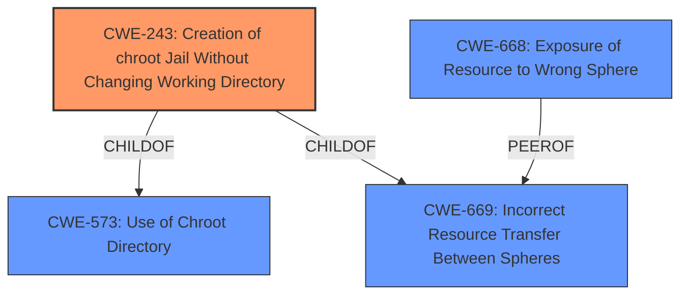

# Analysis for CVE-2020-25582

# Summary
| CWE ID | CWE Name | Confidence | CWE Abstraction Level | CWE Vulnerability Mapping Label | CWE-Vulnerability Mapping Notes |
|---|---|---|---|---|---|
| CWE-243 | Creation of chroot Jail Without Changing Working Directory | 0.9 | Variant | Allowed | Primary CWE |
| CWE-668 | Exposure of Resource to Wrong Sphere | 0.6 | Class | Discouraged | Secondary Candidate |

## Evidence and Confidence

*   **Confidence Score:** 0.9
*   **Evidence Strength:** HIGH

## Relationship Analysis
The primary CWE is CWE-243, which is a variant that is more specific than its parents. CWE-243 is a child of CWE-573 (Use of Chroot Directory) and CWE-669 (Incorrect Resource Transfer Between Spheres). The relationship analysis helps confirm that CWE-243 is a good fit, being a variant that directly addresses the specific issue of not changing the working directory after creating a chroot jail.

## Vulnerability Chain
The vulnerability chain involves the following steps:
1.  `jail_attach(2)` is called to enter a jail.
2.  The current working directory is **not changed** after the jail is created.
3.  The jailed root can then use `ptrace(2)` to attach to the process before the working directory is changed, leading to potential privilege escalation.

The root cause is the **failure to change the working directory** after creating the chroot jail. This allows a malicious actor (jailed root) to use `ptrace(2)` and potentially escape the jail.

## Summary of Analysis
The initial analysis pointed to several potential CWEs, including those related to race conditions and improper resource handling. However, after carefully reviewing the vulnerability description and the CVE Reference Links Content Summary, the most relevant CWE is CWE-243 (Creation of chroot Jail Without Changing Working Directory).

The CVE Reference Links Content Summary explicitly mentions that the vulnerability occurs because the jailed root can attach using `ptrace(2)` **before the current working directory is changed**. This aligns directly with the description of CWE-243, which states, "The product uses the chroot() system call to create a jail, but **does not change the working directory afterward**. This does not prevent access to files outside of the jail."

The other CWEs considered, such as CWE-362 (Race Condition) and CWE-667 (Improper Locking), were not as directly relevant to the root cause described in the CVE. While a race condition might exist, the primary issue is the **failure to change the working directory**. Similarly, while resource handling is involved, it is the specific failure to change the directory that leads to the vulnerability.

CWE-668 (Exposure of Resource to Wrong Sphere) was considered because the jailed root is gaining access to resources outside the intended control sphere. However, CWE-243 is more specific and directly addresses the mechanism by which this occurs.

Therefore, CWE-243 is the most appropriate mapping because it directly reflects the **root cause** of the vulnerability: the **failure to change the working directory after creating the chroot jail**. This allows an attacker to potentially escape the jail using `ptrace(2)`.

Relevant CWE Information:

# Enhanced Context (25 CWEs)
The following CWEs were identified as potentially relevant to this vulnerability:

## CWE-243: Creation of chroot Jail Without Changing Working Directory
**Abstraction Level**: Variant
**Similarity Score**: 0.121
**Source**: sparse

**Description**:
The product uses the chroot() system call to create a jail, but does not change the working directory afterward. This does not prevent access to files outside of the jail.

**Mapping Guidance**:
- Usage: Allowed
- Rationale: This CWE entry is at the Variant level of abstraction, which is a preferred level of abstraction for mapping to the root causes of vulnerabilities.

## CWE-668: Exposure of Resource to Wrong Sphere
**Abstraction Level**: Class
**Similarity Score**: 0.77
**Source**: dense

**Description**:
The product exposes a resource to the wrong control sphere, providing unintended actors with inappropriate access to the resource.

**Mapping Guidance**:
- Usage: Discouraged
- Rationale: CWE-668 is high-level and is often misused as a catch-all when lower-level CWE IDs might be applicable. It is sometimes used for low-information vulnerability reports [REF-1287]. It is a level-1 Class (i.e., a child of a Pillar). It is not useful for trend analysis.

### Explanation of why other CWEs were not selected:
*   CWE-667, CWE-404, CWE-754, CWE-665, CWE-226, CWE-664, CWE-703, CWE-755, CWE-252, CWE-427, CWE-362, CWE-367, CWE-22, CWE-476, CWE-190, CWE-1284, CWE-125, CWE-787, CWE-822, CWE-416, CWE-789, CWE-781, CWE-697, CWE-908 were considered but deemed less appropriate because they do not directly address the specific **root cause** of the vulnerability, which is the **failure to change the working directory after creating the chroot jail**. They represent more general weaknesses or different aspects of the vulnerability. For example, CWE-362 (Race Condition) and CWE-667 (Improper Locking) are related to concurrency issues, which may be present, but the primary issue is the **missing step of changing the working directory**. Similarly, CWE-668 (Exposure of Resource to Wrong Sphere) is a more general weakness, while CWE-243 specifically addresses the mechanism of failing to change the directory.