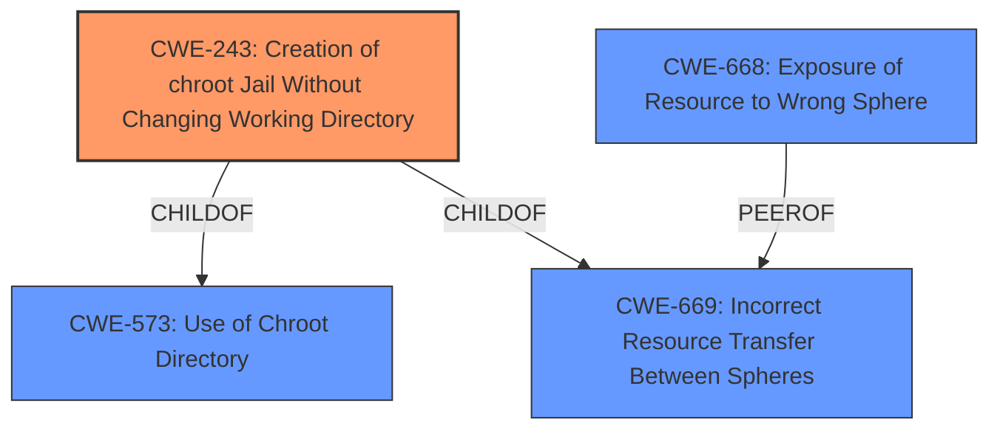

# Analysis for CVE-2020-25582

# Summary
| CWE ID | CWE Name | Confidence | CWE Abstraction Level | CWE Vulnerability Mapping Label | CWE-Vulnerability Mapping Notes |
|---|---|---|---|---|---|
| CWE-243 | Creation of chroot Jail Without Changing Working Directory | 0.9 | Variant | Allowed | Primary CWE |
| CWE-668 | Exposure of Resource to Wrong Sphere | 0.6 | Class | Discouraged | Secondary Candidate |

## Evidence and Confidence

*   **Confidence Score:** 0.9
*   **Evidence Strength:** HIGH

## Relationship Analysis
The primary CWE is CWE-243, which is a variant that is more specific than its parents. CWE-243 is a child of CWE-573 (Use of Chroot Directory) and CWE-669 (Incorrect Resource Transfer Between Spheres). The relationship analysis helps confirm that CWE-243 is a good fit, being a variant that directly addresses the specific issue of not changing the working directory after creating a chroot jail.



## Vulnerability Chain
The vulnerability chain involves the following steps:
1.  `jail_attach(2)` is called to enter a jail.
2.  The current working directory is **not changed** after the jail is created.
3.  The jailed root can then use `ptrace(2)` to attach to the process before the working directory is changed, leading to potential privilege escalation.

The root cause is the **failure to change the working directory** after creating the chroot jail. This allows a malicious actor (jailed root) to use `ptrace(2)` and potentially escape the jail.

## Summary of Analysis
The initial analysis pointed to several potential CWEs, including those related to race conditions and improper resource handling. However, after carefully reviewing the vulnerability description and the CVE Reference Links Content Summary, the most relevant CWE is CWE-243 (Creation of chroot Jail Without Changing Working Directory).

The CVE Reference Links Content Summary explicitly mentions that the vulnerability occurs because the jailed root can attach using `ptrace(2)` **before the current working directory is changed**. This aligns directly with the description of CWE-243, which states, "The product uses the chroot() system call to create a jail, but **does not change the working directory afterward**. This does not prevent access to files outside of the jail."

The other CWEs considered, such as CWE-362 (Race Condition) and CWE-667 (Improper Locking), were not as directly relevant to the root cause described in the CVE. While a race condition might exist, the primary issue is the **failure to change the working directory**. Similarly, while resource handling is involved, it is the specific failure to change the directory that leads to the vulnerability.

CWE-668 (Exposure of Resource to Wrong Sphere) was considered because the jailed root is gaining access to resources outside the intended control sphere. However, CWE-243 is more specific and directly addresses the mechanism by which this occurs.

Therefore, CWE-243 is the most appropriate mapping because it directly reflects the **root cause** of the vulnerability: the **failure to change the working directory after creating the chroot jail**. This allows an attacker to potentially escape the jail using `ptrace(2)`.

Relevant CWE Information:

# Enhanced Context (25 CWEs)
The following CWEs were identified as potentially relevant to this vulnerability:

## CWE-243: Creation of chroot Jail Without Changing Working Directory
**Abstraction Level**: Variant
**Similarity Score**: 0.121
**Source**: sparse

**Description**:
The product uses the chroot() system call to create a jail, but does not change the working directory afterward. This does not prevent access to files outside of the jail.

**Mapping Guidance**:
- Usage: Allowed
- Rationale: This CWE entry is at the Variant level of abstraction, which is a preferred level of abstraction for mapping to the root causes of vulnerabilities.

## CWE-668: Exposure of Resource to Wrong Sphere
**Abstraction Level**: Class
**Similarity Score**: 0.77
**Source**: dense

**Description**:
The product exposes a resource to the wrong control sphere, providing unintended actors with inappropriate access to the resource.

**Mapping Guidance**:
- Usage: Discouraged
- Rationale: CWE-668 is high-level and is often misused as a catch-all when lower-level CWE IDs might be applicable. It is sometimes used for low-information vulnerability reports [REF-1287]. It is a level-1 Class (i.e., a child of a Pillar). It is not useful for trend analysis.

### Explanation of why other CWEs were not selected:
*   CWE-667, CWE-404, CWE-754, CWE-665, CWE-226, CWE-664, CWE-703, CWE-755, CWE-252, CWE-427, CWE-362, CWE-367, CWE-22, CWE-476, CWE-190, CWE-1284, CWE-125, CWE-787, CWE-822, CWE-416, CWE-789, CWE-781, CWE-697, CWE-908 were considered but deemed less appropriate because they do not directly address the specific **root cause** of the vulnerability, which is the **failure to change the working directory after creating the chroot jail**. They represent more general weaknesses or different aspects of the vulnerability. For example, CWE-362 (Race Condition) and CWE-667 (Improper Locking) are related to concurrency issues, which may be present, but the primary issue is the **missing step of changing the working directory**. Similarly, CWE-668 (Exposure of Resource to Wrong Sphere) is a more general weakness, while CWE-243 specifically addresses the mechanism of failing to change the directory.

# Enhanced Query for CVE-2020-25582

## Vulnerability Description
In FreeBSD 12.2-STABLE before r369334, 11.4-STABLE before r369335, 12.2-RELEASE before p4 and 11.4-RELEASE before p8 when a process, such as jexec(8) or killall(1), calls jail_attach(2) to enter a jail, the jailed root can attach to it using ptrace(2) before the current working directory is changed.

### Vulnerability Description Key Phrases
- **vector:** call to ptrace(2)
- **attacker:** jailed root
- **product:** FreeBSD
- **version:** multiple versions

## CVE Reference Links Content Summary
```
{
  "vulnerability_data": [
    {
      "cve": "CVE-2020-25582",
      "description": "Multiple NetApp products incorporate FreeBSD. All supported versions of FreeBSD are susceptible to a vulnerability which when successfully exploited could lead to disclosure of sensitive information or addition or modification of data.",
      "affected_products": [
        "None."
      ],
      "not_affected_products": [
        "7-Mode Transition Tool",
        "AFF Baseboard Management Controller (BMC) - A700s",
        "ATTO FibreBridge - 6500N",
        "ATTO FibreBridge - 7500N",
        "ATTO FibreBridge - 7600N",
        "Active IQ Unified Manager for Linux",
        "Active IQ Unified Manager for Microsoft Windows",
        "Active IQ Unified Manager for VMware vSphere",
        "Active IQ mobile app",
        "Brocade Fabric Operating System Firmware",
        "Brocade SAN Navigator (SANnav)",
        "Cloud Insights Telegraf Agent",
        "Cloud Manager",
        "Cloud Volumes ONTAP Mediator",
        "Clustered Data ONTAP",
        "Clustered Data ONTAP Antivirus Connector",
        "E-Series BIOS",
        "E-Series SANtricity OS Controller Baseboard Management Controller (BMC) - EF600A",
        "E-Series SANtricity OS Controller Software 11.x",
        "E-Series SANtricity Storage Manager",
        "E-Series SANtricity Web Services (REST API) for Web Services Proxy",
        "Element .NET SDK",
        "Element HealthTools",
        "Element JAVA SDK",
        "Element Plug-in for vCenter Server",
        "Element Python SDK",
        "FAS/AFF BIOS",
        "FAS/AFF Baseboard Management Controller (BMC)",
        "FAS/AFF Baseboard Management Controller (BMC) - 8300/8700/A400",
        "FAS/AFF Baseboard Management Controller (BMC) - A250/500f",
        "Host Utilities - SAN for Linux",
        "Host Utilities - SAN for Windows",
        "Inventory Collect Tool",
        "Management Services for Element Software and NetApp HCI",
        "MetroCluster Tiebreaker for clustered Data ONTAP",
        "NetApp Cloud Backup (formerly AltaVault)",
        "NetApp Cloud Backup OST Plug-in (formerly AltaVault OST Plug-in)",
        "NetApp Converged Systems Advisor Agent",
        "NetApp E-Series Performance Analyzer",
        "NetApp HCI Baseboard Management Controller (BMC) - H300S/H500S/H700S/H300E/H500E/H700E/H410S",
        "NetApp HCI Baseboard Management Controller (BMC) - H410C",
        "NetApp HCI Baseboard Management Controller (BMC) - H610C",
        "NetApp HCI Baseboard Management Controller (BMC) - H610S",
        "NetApp HCI Baseboard Management Controller (BMC) - H615C",
        "NetApp HCI Compute Node (Bootstrap OS)",
        "NetApp HCI Compute Node BIOS",
        "NetApp HCI Storage Node BIOS",
        "NetApp Manageability SDK",
        "NetApp NFS Plug-in for VMware VAAI",
        "NetApp SANtricity Cloud Connector",
        "NetApp SANtricity SMI-S Provider",
        "NetApp SMI-S Provider",
        "NetApp SolidFire & HCI Management Node",
        "NetApp SolidFire & HCI Storage Node (Element Software)",
        "NetApp SolidFire BIOS",
        "NetApp SolidFire Baseboard Management Controller (BMC)",
        "NetApp SolidFire Plug-in for vRealize Orchestrator (SolidFire vRO)",
         "NetApp Storage Encryption",
        "NetApp VASA Provider for Clustered Data ONTAP 9.6 and above",
        "NetApp XCP NFS",
        "NetApp XCP SMB",
        "ONTAP Mediator",
        "ONTAP Select Deploy administration utility",
        "OnCommand API Services",
        "OnCommand Insight",
        "OnCommand Unified Manager Core Package",
        "OnCommand Workflow Automation",
        "Open Systems SnapVault Agent",
        "SANtricity Unified Manager",
        "SAS Firmware",
        "SRA Plugin for Linux",
        "SRA Plugin for Windows",
        "Service Processor",
        "Single Mailbox Recovery",
        "Snap Creator Framework",
        "SnapCenter",
        "SnapCenter Plug-in for VMware vSphere",
        "SnapDrive for Unix",
        "SnapDrive for Windows",
        "SnapManager for Exchange",
        "SnapManager for Hyper-V",
        "SnapManager for MS SQL",
        "SnapManager for Oracle",
        "SnapManager for SAP",
         "SnapManager for Sharepoint",
        "SolidFire Storage Replication Adapter",
        "Storage Replication Adapter for Clustered Data ONTAP for VMware vSphere 9.6 and above",
        "Storage Services Connector",
        "StorageGRID (formerly StorageGRID Webscale)",
        "StorageGRID BIOS SG1000/SG100",
        "StorageGRID BIOS SG5660/SG5612/SG5760/SG5712",
        "StorageGRID BIOS SG6060/SGF6024",
        "StorageGRID Baseboard Management Controller (BMC)",
        "StorageGRID9 (9.x and prior)",
        "System Manager 9.x",
        "Trident",
        "Virtual Storage Console for VMware vSphere 9.6 and above"
      ],
      "root_cause": "The jail_attach(2) system call in FreeBSD allows a non-jailed process to move into an existing jail. The vulnerability arises because the jailed root user can attach to the process using ptrace(2) before the current working directory is changed.",
      "weaknesses": [
        "Improper handling of the current working directory during jail attachment",
        "Insufficient privilege separation during jail attachment and ptrace"
      ],
      "impact": "A process with superuser privileges running inside a jail could change the root directory outside of the jail, thereby gaining full read and writing access to all files and directories in the system.",
       "attack_vector": "A process with superuser privileges running inside a jail calls jail_attach(2) to enter the jail. The jailed root user can then attach to it using ptrace(2) before the current working directory is changed.",
       "required_capabilities": "The attacker requires superuser privileges within a jail environment."
    },
    {
    "cve": "CVE-2020-25582",
    "description": "All supported versions of FreeBSD are susceptible to a vulnerability which when successfully exploited could lead to disclosure of sensitive information or addition or modification of data.",
        "affected_products": [
            "All supported versions of FreeBSD."
        ],
        "not_affected_products": [],
    "root_cause": "The jail_attach(2) system call relies on the caller to change the current working directory, which can be exploited by a malicious process inside a jail to change the root directory outside of the jail before its cwd is changed.",
    "weaknesses": [
      "Insufficient privilege separation",
      "Improper handling of current working directory"
    ],
    "impact": "A process with superuser privileges running inside a jail could change the root directory outside of the jail, thereby gaining full read and writing access to all files and directories in the system.",
        "attack_vector": "A process with superuser privileges inside a jail uses jail_attach(2) and ptrace(2) system calls to exploit the vulnerability before the current working directory is changed.",
    "required_capabilities": "Attacker needs superuser privileges inside a jail."
    }
  ]
}
```

## Retriever Results

### Top Combined Results

| Rank | CWE ID | Name | Abstraction | Usage  | Retrievers | Individual Scores |
|------|--------|------|-------------|-------|------------|-------------------|
| 1 | 243 | Creation of chroot Jail Without Changing Working Directory | Variant | Allowed | sparse | 0.121 |
| 2 | 697 | Incorrect Comparison | Pillar | Discouraged | sparse | 0.103 |
| 3 | 822 | Untrusted Pointer Dereference | Base | Allowed | sparse | 0.095 |
| 4 | 362 | Concurrent Execution using Shared Resource with Improper Synchronization ('Race Condition') | Class | Allowed-with-Review | sparse | 0.093 |
| 5 | 427 | Uncontrolled Search Path Element | Base | Allowed | sparse | 0.091 |
| 6 | 667 | Improper Locking | Class | Allowed-with-Review | dense | 0.359 |
| 7 | 787 | Out-of-bounds Write | Base | Allowed | graph | 0.002 |
| 8 | 665 | Improper Initialization | Class | Discouraged | sparse | 0.090 |
| 9 | 1284 | Improper Validation of Specified Quantity in Input | Base | Allowed | sparse | 0.090 |
| 10 | 908 | Use of Uninitialized Resource | Base | Allowed | sparse | 0.090 |


# Complete CWE Specifications


## CWE-243: Creation of chroot Jail Without Changing Working Directory
**Abstraction:** Variant
**Status:** Draft

### Description
The product uses the chroot() system call to create a jail, but does not change the working directory afterward. This does not prevent access to files outside of the jail.

### Extended Description
Improper use of chroot() may allow attackers to escape from the chroot jail. The chroot() function call does not change the process's current working directory, so relative paths may still refer to file system resources outside of the chroot jail after chroot() has been called.

### Alternative Terms
None

### Relationships
ChildOf -> CWE-573
ChildOf -> CWE-669

### Mapping Guidance
**Usage:** Allowed
**Rationale:** This CWE entry is at the Variant level of abstraction, which is a preferred level of abstraction for mapping to the root causes of vulnerabilities.
**Comments:** Carefully read both the name and description to ensure that this mapping is an appropriate fit. Do not try to 'force' a mapping to a lower-level Base/Variant simply to comply with this preferred level of abstraction.
**Reasons:**
- Acceptable-Use


## CWE-697: Incorrect Comparison
**Abstraction:** Pillar
**Status:** Incomplete

### Description
The product compares two entities in a security-relevant context, but the comparison is incorrect, which may lead to resultant weaknesses.

### Extended Description


This Pillar covers several possibilities:


  - the comparison checks one factor incorrectly;

  - the comparison should consider multiple factors, but it does not check at least one of those factors at all;

  - the comparison checks the wrong factor.


### Alternative Terms
None

### Relationships
None

### Mapping Guidance
**Usage:** Discouraged
**Rationale:** This CWE entry is extremely high-level, a Pillar. However, sometimes this weakness is forced to be used due to the lack of in-depth weakness research. See Research Gaps.
**Comments:** Where feasible, consider children or descendants of this entry instead.
**Reasons:**
- Abstraction


### Additional Notes
**[Research Gap]** 

Weaknesses related to this Pillar appear to be under-studied, especially with respect to classification schemes. Input from academic and other communities could help identify and resolve gaps or organizational difficulties within CWE.


**[Maintenance]** This entry likely has some relationships with case sensitivity (CWE-178), but case sensitivity is a factor in other types of weaknesses besides comparison. Also, in cryptography, certain attacks are possible when certain comparison operations do not take place in constant time, causing a timing-related information leak (CWE-208).


### Observed Examples
- **CVE-2021-3116:** Chain: Python-based HTTP Proxy server uses the wrong boolean operators (CWE-480) causing an incorrect comparison (CWE-697) that identifies an authN failure if all three conditions are met instead of only one, allowing bypass of the proxy authentication (CWE-1390)
- **CVE-2020-15811:** Chain: Proxy uses a substring search instead of parsing the Transfer-Encoding header (CWE-697), allowing request splitting (CWE-113) and cache poisoning
- **CVE-2016-10003:** Proxy performs incorrect comparison of request headers, leading to infoleak


## CWE-822: Untrusted Pointer Dereference
**Abstraction:** Base
**Status:** Incomplete

### Description
The product obtains a value from an untrusted source, converts this value to a pointer, and dereferences the resulting pointer.

### Extended Description


An attacker can supply a pointer for memory locations that the product is not expecting. If the pointer is dereferenced for a write operation, the attack might allow modification of critical state variables, cause a crash, or execute code. If the dereferencing operation is for a read, then the attack might allow reading of sensitive data, cause a crash, or set a variable to an unexpected value (since the value will be read from an unexpected memory location).


There are several variants of this weakness, including but not necessarily limited to:


  - The untrusted value is directly invoked as a function call.

  - In OS kernels or drivers where there is a boundary between "userland" and privileged memory spaces, an untrusted pointer might enter through an API or system call (see CWE-781 for one such example).

  - Inadvertently accepting the value from an untrusted control sphere when it did not have to be accepted as input at all. This might occur when the code was originally developed to be run by a single user in a non-networked environment, and the code is then ported to or otherwise exposed to a networked environment.


### Alternative Terms
None

### Relationships
ChildOf -> CWE-119
ChildOf -> CWE-119
ChildOf -> CWE-119
CanPrecede -> CWE-125
CanPrecede -> CWE-787

### Mapping Guidance
**Usage:** Allowed
**Rationale:** This CWE entry is at the Base level of abstraction, which is a preferred level of abstraction for mapping to the root causes of vulnerabilities.
**Comments:** Carefully read both the name and description to ensure that this mapping is an appropriate fit. Do not try to 'force' a mapping to a lower-level Base/Variant simply to comply with this preferred level of abstraction.
**Reasons:**
- Acceptable-Use


### Additional Notes
**[Maintenance]** There are close relationships between incorrect pointer dereferences and other weaknesses related to buffer operations. There may not be sufficient community agreement regarding these relationships. Further study is needed to determine when these relationships are chains, composites, perspective/layering, or other types of relationships. As of September 2010, most of the relationships are being captured as chains.

**[Terminology]** Many weaknesses related to pointer dereferences fall under the general term of "memory corruption" or "memory safety." As of September 2010, there is no commonly-used terminology that covers the lower-level variants.


### Observed Examples
- **CVE-2007-5655:** message-passing framework interprets values in packets as pointers, causing a crash.
- **CVE-2010-2299:** labeled as a "type confusion" issue, also referred to as a "stale pointer." However, the bug ID says "contents are simply interpreted as a pointer... renderer ordinarily doesn't supply this pointer directly". The "handle" in the untrusted area is replaced in one function, but not another - thus also, effectively, exposure to wrong sphere (CWE-668).
- **CVE-2009-1719:** Untrusted dereference using undocumented constructor.


## CWE-362: Concurrent Execution using Shared Resource with Improper Synchronization ('Race Condition')
**Abstraction:** Class
**Status:** Draft

### Description
The product contains a concurrent code sequence that requires temporary, exclusive access to a shared resource, but a timing window exists in which the shared resource can be modified by another code sequence operating concurrently.

### Extended Description


A race condition occurs within concurrent environments, and it is effectively a property of a code sequence. Depending on the context, a code sequence may be in the form of a function call, a small number of instructions, a series of program invocations, etc.


A race condition violates these properties, which are closely related:


  - Exclusivity - the code sequence is given exclusive access to the shared resource, i.e., no other code sequence can modify properties of the shared resource before the original sequence has completed execution.

  - Atomicity - the code sequence is behaviorally atomic, i.e., no other thread or process can concurrently execute the same sequence of instructions (or a subset) against the same resource.

A race condition exists when an "interfering code sequence" can still access the shared resource, violating exclusivity.

The interfering code sequence could be "trusted" or "untrusted." A trusted interfering code sequence occurs within the product; it cannot be modified by the attacker, and it can only be invoked indirectly. An untrusted interfering code sequence can be authored directly by the attacker, and typically it is external to the vulnerable product.


### Alternative Terms
Race Condition

### Relationships
ChildOf -> CWE-691
CanPrecede -> CWE-416
CanPrecede -> CWE-476

### Mapping Guidance
**Usage:** Allowed-with-Review
**Rationale:** This CWE entry is a Class and might have Base-level children that would be more appropriate
**Comments:** Examine children of this entry to see if there is a better fit
**Reasons:**
- Abstraction


### Additional Notes
**[Maintenance]** The relationship between race conditions and synchronization problems (CWE-662) needs to be further developed. They are not necessarily two perspectives of the same core concept, since synchronization is only one technique for avoiding race conditions, and synchronization can be used for other purposes besides race condition prevention.

**[Research Gap]** Race conditions in web applications are under-studied and probably under-reported. However, in 2008 there has been growing interest in this area.

**[Research Gap]** Much of the focus of race condition research has been in Time-of-check Time-of-use (TOCTOU) variants (CWE-367), but many race conditions are related to synchronization problems that do not necessarily require a time-of-check.

**[Research Gap]** From a classification/taxonomy perspective, the relationships between concurrency and program state need closer investigation and may be useful in organizing related issues.


### Observed Examples
- **CVE-2022-29527:** Go application for cloud management creates a world-writable sudoers file that allows local attackers to inject sudo rules and escalate privileges to root by winning a race condition.
- **CVE-2021-1782:** Chain: improper locking (CWE-667) leads to race condition (CWE-362), as exploited in the wild per CISA KEV.
- **CVE-2021-0920:** Chain: mobile platform race condition (CWE-362) leading to use-after-free (CWE-416), as exploited in the wild per CISA KEV.


## CWE-427: Uncontrolled Search Path Element
**Abstraction:** Base
**Status:** Draft

### Description
The product uses a fixed or controlled search path to find resources, but one or more locations in that path can be under the control of unintended actors.

### Extended Description


Although this weakness can occur with any type of resource, it is frequently introduced when a product uses a directory search path to find executables or code libraries, but the path contains a directory that can be modified by an attacker, such as "/tmp" or the current working directory.


In Windows-based systems, when the LoadLibrary or LoadLibraryEx function is called with a DLL name that does not contain a fully qualified path, the function follows a search order that includes two path elements that might be uncontrolled:


  - the directory from which the program has been loaded

  - the current working directory

In some cases, the attack can be conducted remotely, such as when SMB or WebDAV network shares are used.

One or more locations in that path could include the Windows drive root or its subdirectories. This often exists in Linux-based code assuming the controlled nature of the root directory (/) or its subdirectories (/etc, etc), or a code that recursively accesses the parent directory. In Windows, the drive root and some of its subdirectories have weak permissions by default, which makes them uncontrolled.


In some Unix-based systems, a PATH might be created that contains an empty element, e.g. by splicing an empty variable into the PATH. This empty element can be interpreted as equivalent to the current working directory, which might be an untrusted search element.


In software package management frameworks (e.g., npm, RubyGems, or PyPi), the framework may identify dependencies on third-party libraries or other packages, then consult a repository that contains the desired package. The framework may search a public repository before a private repository. This could be exploited by attackers by placing a malicious package in the public repository that has the same name as a package from the private repository. The search path might not be directly under control of the developer relying on the framework, but this search order effectively contains an untrusted element.


### Alternative Terms
DLL preloading: This term is one of several that are used to describe exploitation of untrusted search path elements in Windows systems, which received wide attention in August 2010. From a weakness perspective, the term is imprecise because it can apply to both CWE-426 and CWE-427.
Binary planting: This term is one of several that are used to describe exploitation of untrusted search path elements in Windows systems, which received wide attention in August 2010. From a weakness perspective, the term is imprecise because it can apply to both CWE-426 and CWE-427.
Insecure library loading: This term is one of several that are used to describe exploitation of untrusted search path elements in Windows systems, which received wide attention in August 2010. From a weakness perspective, the term is imprecise because it can apply to both CWE-426 and CWE-427.
Dependency confusion: As of February 2021, this term is used to describe CWE-427 in the context of managing installation of software package dependencies, in which attackers release packages on public sites where the names are the same as package names used by private repositories, and the search for the dependent package tries the public site first, downloading untrusted code. It may also be referred to as a "substitution attack."

### Relationships
ChildOf -> CWE-668
ChildOf -> CWE-668

### Mapping Guidance
**Usage:** Allowed
**Rationale:** This CWE entry is at the Base level of abstraction, which is a preferred level of abstraction for mapping to the root causes of vulnerabilities.
**Comments:** Carefully read both the name and description to ensure that this mapping is an appropriate fit. Do not try to 'force' a mapping to a lower-level Base/Variant simply to comply with this preferred level of abstraction.
**Reasons:**
- Acceptable-Use


### Additional Notes
**[Relationship]** Unlike untrusted search path (CWE-426), which inherently involves control over the definition of a control sphere (i.e., modification of a search path), this entry concerns a fixed control sphere in which some part of the sphere may be under attacker control (i.e., the search path cannot be modified by an attacker, but one element of the path can be under attacker control).

**[Theoretical]** This weakness is not a clean fit under CWE-668 or CWE-610, which suggests that the control sphere model might need enhancement or clarification.


### Observed Examples
- **CVE-2023-25815:** chain: a change in an underlying package causes the gettext function to use implicit initialization with a hard-coded path (CWE-1419) under the user-writable C:\ drive, introducing an untrusted search path element (CWE-427) that enables spoofing of messages.
- **CVE-2022-4826:** Go-based git extension on Windows can search for and execute a malicious "..exe" in a repository because Go searches the current working directory if git.exe is not found in the PATH
- **CVE-2020-26284:** A Static Site Generator built in Go, when running on Windows, searches the current working directory for a command, possibly allowing code execution using a malicious .exe or .bat file with the name being searched


## CWE-667: Improper Locking
**Abstraction:** Class
**Status:** Draft

### Description
The product does not properly acquire or release a lock on a resource, leading to unexpected resource state changes and behaviors.

### Extended Description


Locking is a type of synchronization behavior that ensures that multiple independently-operating processes or threads do not interfere with each other when accessing the same resource. All processes/threads are expected to follow the same steps for locking. If these steps are not followed precisely - or if no locking is done at all - then another process/thread could modify the shared resource in a way that is not visible or predictable to the original process. This can lead to data or memory corruption, denial of service, etc.


### Alternative Terms
None

### Relationships
ChildOf -> CWE-662
ChildOf -> CWE-662
ChildOf -> CWE-662
ChildOf -> CWE-662

### Mapping Guidance
**Usage:** Allowed-with-Review
**Rationale:** This CWE entry is a Class and might have Base-level children that would be more appropriate
**Comments:** Examine children of this entry to see if there is a better fit
**Reasons:**
- Abstraction


### Additional Notes
**[Maintenance]** Deeper research is necessary for synchronization and related mechanisms, including locks, mutexes, semaphores, and other mechanisms. Multiple entries are dependent on this research, which includes relationships to concurrency, race conditions, reentrant functions, etc. CWE-662 and its children - including CWE-667, CWE-820, CWE-821, and others - may need to be modified significantly, along with their relationships.


### Observed Examples
- **CVE-2021-1782:** Chain: improper locking (CWE-667) leads to race condition (CWE-362), as exploited in the wild per CISA KEV.
- **CVE-2009-0935:** Attacker provides invalid address to a memory-reading function, causing a mutex to be unlocked twice
- **CVE-2010-4210:** function in OS kernel unlocks a mutex that was not previously locked, causing a panic or overwrite of arbitrary memory.


## CWE-787: Out-of-bounds Write
**Abstraction:** Base
**Status:** Draft

### Description
The product writes data past the end, or before the beginning, of the intended buffer.

### Extended Description
Not provided

### Alternative Terms
Memory Corruption: Often used to describe the consequences of writing to memory outside the bounds of a buffer, or to memory that is otherwise invalid.

### Relationships
ChildOf -> CWE-119
ChildOf -> CWE-119
ChildOf -> CWE-119
ChildOf -> CWE-119

### Mapping Guidance
**Usage:** Allowed
**Rationale:** This CWE entry is at the Base level of abstraction, which is a preferred level of abstraction for mapping to the root causes of vulnerabilities.
**Comments:** Carefully read both the name and description to ensure that this mapping is an appropriate fit. Do not try to 'force' a mapping to a lower-level Base/Variant simply to comply with this preferred level of abstraction.
**Reasons:**
- Acceptable-Use


### Observed Examples
- **CVE-2023-1017:** The reference implementation code for a Trusted Platform Module does not implement length checks on data, allowing for an attacker to write 2 bytes past the end of a buffer.
- **CVE-2021-21220:** Chain: insufficient input validation (CWE-20) in browser allows heap corruption (CWE-787), as exploited in the wild per CISA KEV.
- **CVE-2021-28664:** GPU kernel driver allows memory corruption because a user can obtain read/write access to read-only pages, as exploited in the wild per CISA KEV.


## CWE-665: Improper Initialization
**Abstraction:** Class
**Status:** Draft

### Description
The product does not initialize or incorrectly initializes a resource, which might leave the resource in an unexpected state when it is accessed or used.

### Extended Description
This can have security implications when the associated resource is expected to have certain properties or values, such as a variable that determines whether a user has been authenticated or not.

### Alternative Terms
None

### Relationships
ChildOf -> CWE-664

### Mapping Guidance
**Usage:** Discouraged
**Rationale:** This CWE entry is a level-1 Class (i.e., a child of a Pillar). It might have lower-level children that would be more appropriate
**Comments:** Examine children of this entry to see if there is a better fit
**Reasons:**
- Abstraction


### Observed Examples
- **CVE-2001-1471:** chain: an invalid value prevents a library file from being included, skipping initialization of key variables, leading to resultant eval injection.
- **CVE-2008-3637:** Improper error checking in protection mechanism produces an uninitialized variable, allowing security bypass and code execution.
- **CVE-2008-4197:** Use of uninitialized memory may allow code execution.


## CWE-1284: Improper Validation of Specified Quantity in Input
**Abstraction:** Base
**Status:** Incomplete

### Description
The product receives input that is expected to specify a quantity (such as size or length), but it does not validate or incorrectly validates that the quantity has the required properties.

### Extended Description


Specified quantities include size, length, frequency, price, rate, number of operations, time, and others. Code may rely on specified quantities to allocate resources, perform calculations, control iteration, etc. When the quantity is not properly validated, then attackers can specify malicious quantities to cause excessive resource allocation, trigger unexpected failures, enable buffer overflows, etc.


### Alternative Terms
None

### Relationships
ChildOf -> CWE-20
ChildOf -> CWE-20
CanPrecede -> CWE-789

### Mapping Guidance
**Usage:** Allowed
**Rationale:** This CWE entry is at the Base level of abstraction, which is a preferred level of abstraction for mapping to the root causes of vulnerabilities.
**Comments:** Carefully read both the name and description to ensure that this mapping is an appropriate fit. Do not try to 'force' a mapping to a lower-level Base/Variant simply to comply with this preferred level of abstraction.
**Reasons:**
- Acceptable-Use


### Additional Notes
**[Maintenance]** This entry is still under development and will continue to see updates and content improvements.


### Observed Examples
- **CVE-2022-21668:** Chain: Python library does not limit the resources used to process images that specify a very large number of bands (CWE-1284), leading to excessive memory consumption (CWE-789) or an integer overflow (CWE-190).
- **CVE-2008-1440:** lack of validation of length field leads to infinite loop
- **CVE-2008-2374:** lack of validation of string length fields allows memory consumption or buffer over-read


## CWE-908: Use of Uninitialized Resource
**Abstraction:** Base
**Status:** Incomplete

### Description
The product uses or accesses a resource that has not been initialized.

### Extended Description
When a resource has not been properly initialized, the product may behave unexpectedly. This may lead to a crash or invalid memory access, but the consequences vary depending on the type of resource and how it is used within the product.

### Alternative Terms
None

### Relationships
ChildOf -> CWE-665
ChildOf -> CWE-665

### Mapping Guidance
**Usage:** Allowed
**Rationale:** This CWE entry is at the Base level of abstraction, which is a preferred level of abstraction for mapping to the root causes of vulnerabilities.
**Comments:** Carefully read both the name and description to ensure that this mapping is an appropriate fit. Do not try to 'force' a mapping to a lower-level Base/Variant simply to comply with this preferred level of abstraction.
**Reasons:**
- Acceptable-Use


### Observed Examples
- **CVE-2019-9805:** Chain: Creation of the packet client occurs before initialization is complete (CWE-696) resulting in a read from uninitialized memory (CWE-908), causing memory corruption.
- **CVE-2008-4197:** Use of uninitialized memory may allow code execution.
- **CVE-2008-2934:** Free of an uninitialized pointer leads to crash and possible code execution.

