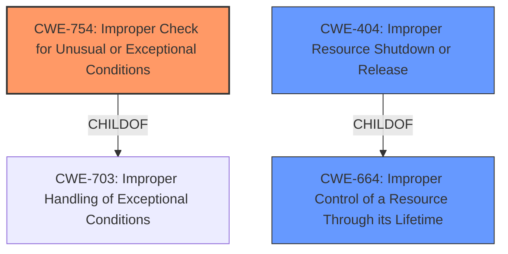

# Analysis Report for CVE-2020-25597

# Vulnerability Analysis Report: CVE-2020-25597

## Description


## Analysis (with Relationship Data)

# Summary
| CWE ID  | CWE Name                                                                                                                              | Confidence | CWE Abstraction Level | CWE Vulnerability Mapping Label | CWE-Vulnerability Mapping Notes |
| :-------- | :------------------------------------------------------------------------------------------------------------------------------------- | :---------- | :---------------------- | :-------------------------------- | :-------------------------------- |
| CWE-754   | Improper Check for Unusual or Exceptional Conditions                                                                                | 0.85       | Class                   | Primary CWE                       | Allowed-with-Review               |
| CWE-664 | Improper Control of a Resource Through its Lifetime | 0.65       | Pillar                   | Secondary Candidate                      | Discouraged              |
| CWE-404   | Improper Resource Shutdown or Release                                                                                                 | 0.60       | Class                   | Secondary Candidate                      | Allowed-with-Review               |

## Evidence and Confidence

*   **Confidence Score:** 0.80
*   **Evidence Strength:** HIGH

## Relationship Analysis
The analysis focused on hierarchical relationships, particularly the ChildOf relationships, to find a CWE that best represents the **mishandling of the constraint**. CWE-754's relationship to CWE-703 (Improper Handling of Exceptional Conditions) was considered. The parent-child structure helped in understanding the general nature of the flaw. The chain relationships (CanPrecede, CanFollow) were reviewed to see potential points of failure or exploitation that might be relevant, but were ultimately not as central as the immediate root cause. The abstraction levels were important; a Class-level CWE was chosen because the provided information was not granular enough to select a Base or Variant level with complete certainty.



## Vulnerability Chain
The vulnerability chain involves a **mishandling of a constraint** leading to a crash and denial of service.
  - Initial Flaw: **Mishandling of the constraint** that once-valid event channels may not turn invalid.
  - Resulting Impact: Crash of the host, leading to a Denial of Service (DoS).

The chain highlights a single key weakness that directly results in a significant impact.

## Summary of Analysis
Initially, the analysis focused on identifying the most accurate CWE based on the provided vulnerability description and supporting evidence. The primary focus was on the **mishandling of the constraint** related to event channels in Xen.

The final decision to assign CWE-754 was influenced by its direct relevance to the **incorrect handling of conditions** related to event channel validity. The description for CWE-754, "The product does not check or incorrectly checks for unusual or exceptional conditions," closely aligns with the vulnerability where Xen **mishandles the constraint** that once-valid event channels may not turn invalid.

The supporting evidence from the "CVE Reference Links Content Summary" reinforces this decision, particularly the root cause identified as "**Mishandling of the constraint** that once-valid event channels may not turn invalid during event channel resetting operations."

The choice of a Class-level CWE reflects the level of detail available. While more specific Base or Variant CWEs might exist, the current evidence does not definitively point to them.

Relevant CWE Information:

# Enhanced Context (25 CWEs)
The following CWEs were identified as potentially relevant to this vulnerability:

## CWE-667: Improper Locking
**Abstraction Level**: Class
**Similarity Score**: 0.73
**Source**: dense

**Description**:
The product does not properly acquire or release a lock on a resource, leading to unexpected resource state changes and behaviors.

**Mapping Guidance**:
- Usage: Allowed-with-Review
- Rationale: This CWE entry is a Class and might have Base-level children that would be more appropriate

## CWE-404: Improper Resource Shutdown or Release
**Abstraction Level**: Class
**Similarity Score**: 0.73
**Source**: dense

**Description**:
The product does not release or incorrectly releases a resource before it is made available for re-use.

**Mapping Guidance**:
- Usage: Allowed-with-Review
- Rationale: This CWE entry is a Class and might have Base-level children that would be more appropriate

## CWE-362: Concurrent Execution using Shared Resource with Improper Synchronization ('Race Condition')
**Abstraction Level**: Class
**Similarity Score**: 0.73
**Source**: dense

**Description**:
The product contains a concurrent code sequence that requires temporary, exclusive access to a shared resource, but a timing window exists in which the shared resource can be modified by another code sequence operating concurrently.

**Mapping Guidance**:
- Usage: Allowed-with-Review
- Rationale: This CWE entry is a Class and might have Base-level children that would be more appropriate

## CWE-662: Improper Synchronization
**Abstraction Level**: Class
**Similarity Score**: 0.72
**Source**: dense

**Description**:
The product utilizes multiple threads or processes to allow temporary access to a shared resource that can only be exclusive to one process at a time, but it does not properly synchronize these actions, which might cause simultaneous accesses of this resource by multiple threads or processes.

**Mapping Guidance**:
- Usage: Discouraged
- Rationale: This CWE entry is a level-1 Class (i.e., a child of a Pillar). It might have lower-level children that would be more appropriate

## CWE-366: Race Condition within a Thread
**Abstraction Level**: Base
**Similarity Score**: 0.72
**Source**: dense

**Description**:
If two threads of execution use a resource simultaneously, there exists the possibility that resources may be used while invalid, in turn making the state of execution undefined.

**Mapping Guidance**:
- Usage: Allowed
- Rationale: This CWE entry is at the Base level of abstraction, which is a preferred level of abstraction for mapping to the root causes of vulnerabilities.

## CWE-754: Improper Check for Unusual or Exceptional Conditions
**Abstraction Level**: Class
**Similarity Score**: 0.70
**Source**: dense

**Description**:
The product does not check or incorrectly checks for unusual or exceptional conditions that are not expected to occur frequently during day to day operation of the product.

**Mapping Guidance**:
- Usage: Allowed-with-Review
- Rationale: This CWE entry is a Class and might have Base-level children that would be more appropriate

## CWE-226: Sensitive Information in Resource Not Removed Before Reuse
**Abstraction Level**: Base
**Similarity Score**: 0.70
**Source**: dense

**Description**:
The product releases a resource such as memory or a file so that it can be made available for reuse, but it does not clear or "zeroize" the information contained in the resource before the product performs a critical state transition or makes the resource available for reuse by other entities.

**Mapping Guidance**:
- Usage: Allowed
- Rationale: This CWE entry is at the Base level of abstraction, which is a preferred level of abstraction for mapping to the root causes of vulnerabilities.

## CWE-653: Improper Isolation or Compartmentalization
**Abstraction Level**: Class
**Similarity Score**: 0.70
**Source**: dense

**Description**:
The product does not properly compartmentalize or isolate functionality, processes, or resources that require different privilege levels, rights, or permissions.

**Mapping Guidance**:
- Usage: Allowed
- Rationale: This CWE entry is at the Base level of abstraction, which is a preferred level of abstraction for mapping to the root causes of vulnerabilities.

## CWE-367: Time-of-check Time-of-use (TOCTOU) Race Condition
**Abstraction Level**: Base
**Similarity Score**: 0.70
**Source**: dense

**Description**:
The product checks the state of a resource before using that resource, but the resource's state can change between the check and the use in a way that invalidates the results of the check. This can cause the product to perform invalid actions when the resource is in an unexpected state.

**Mapping Guidance**:
- Usage: Allowed
- Rationale: This CWE entry is at the Base level of abstraction, which is a preferred level of abstraction for mapping to the root causes of vulnerabilities.

## CWE-664: Improper Control of a Resource Through its Lifetime
**Abstraction Level**: Pillar
**Similarity Score**: 0.70
**Source**: dense

**Description**:
The product does not maintain or incorrectly maintains control over a resource throughout its lifetime of creation, use, and release.

**Mapping Guidance**:
- Usage: Discouraged
- Rationale: This CWE entry is high-level when lower-level children


## CWE Relationship Analysis

Current CWEs represent these abstraction levels: .


### Vulnerability Chain Analysis

**Chain starting from CWE-754:**
- 754 (Improper Check for Unusual or Exceptional Conditions) - ROOT


**Chain starting from CWE-667:**
- 667 (Improper Locking) - ROOT


### CWE Relationship Diagram

```mermaid
graph TD
    classDef primary fill:#f96,stroke:#333,stroke-width:2px
    classDef secondary fill:#69f,stroke:#333
    classDef tertiary fill:#9e9,stroke:#333
```


*Report generated on 2025-04-02 04:18:03*
