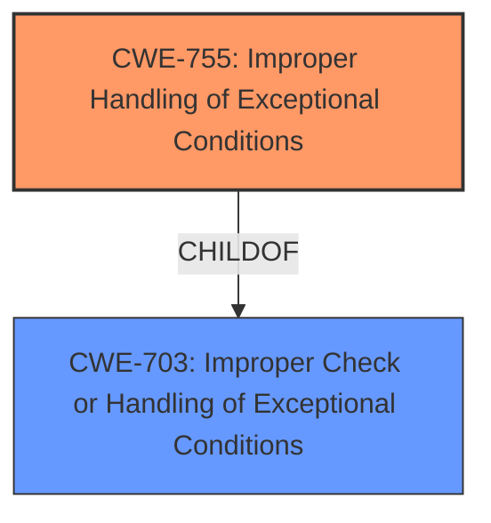

# Analysis for CVE-2020-25602

# Summary
| CWE ID | CWE Name | Confidence | CWE Abstraction Level | CWE Vulnerability Mapping Label | CWE-Vulnerability Mapping Notes |
|---|---|---|---|---|---|
| CWE-755 | Improper Handling of Exceptional Conditions | 0.9 | Class | Primary | Allowed-with-Review |

## Evidence and Confidence

*   **Confidence Score:** 0.9
*   **Evidence Strength:** HIGH

## Relationship Analysis
The primary CWE selected is CWE-755 Improper Handling of Exceptional Conditions. This CWE is a class-level weakness and a child of CWE-703 Improper Check or Handling of Exceptional Conditions (Pillar). No specific child CWE of CWE-755 fits the scenario better, making it the most appropriate choice given the available information.



## Vulnerability Chain
The vulnerability chain starts with the **lack of error handling** for a #GP fault when Xen attempts to read the MISC_ENABLE MSR on non-Intel hardware. This **improper handling of the exceptional condition** leads to a host OS crash, resulting in a denial of service.

## Summary of Analysis
The analysis focuses on the **lack of error handling** within the Xen hypervisor when a guest attempts to access the MSR_MISC_ENABLE register on non-Intel hardware. The vulnerability description explicitly states that the read operation is performed "without error handling for a #GP fault." The root cause is the **improper handling of an exceptional condition** (the #GP fault), which directly leads to a system crash.

The selection of CWE-755 is based on the evidence of **missing error handling** for a specific fault condition. This directly aligns with the CWE's description of "The product does not handle or incorrectly handles an exceptional condition." While other CWEs were considered, such as CWE-754 (Improper Check for Unusual or Exceptional Conditions), CWE-755 is more fitting because the issue is not about a missing check, but the handling of the exceptional condition itself.

The CWE's abstraction level is Class, which is higher than Base or Variant. However, no specific child of CWE-755 adequately captures the nuance of the vulnerability, making it the most appropriate choice. The "Mapping Guidance" for CWE-755 suggests examining children for a better fit, but in this case, the general description of **improper handling** is the most accurate.

The confidence score is 0.9 due to the clear evidence provided in the vulnerability description and the direct alignment with CWE-755. The evidence strength is HIGH because the description explicitly mentions the **lack of error handling**, which is the core of the weakness.

Relevant CWE Information:

# Enhanced Context (25 CWEs)
The following CWEs were identified as potentially relevant to this vulnerability:

## CWE-667: Improper Locking
**Abstraction Level**: Class
**Similarity Score**: 0.80
**Source**: dense

**Description**:
The product does not properly acquire or release a lock on a resource, leading to unexpected resource state changes and behaviors.

**Mapping Guidance**:
- Usage: Allowed-with-Review
- Rationale: This CWE entry is a Class and might have Base-level children that would be more appropriate

## CWE-404: Improper Resource Shutdown or Release
**Abstraction Level**: Class
**Similarity Score**: 0.79
**Source**: dense

**Description**:
The product does not release or incorrectly releases a resource before it is made available for re-use.

**Mapping Guidance**:
- Usage: Allowed-with-Review
- Rationale: This CWE entry is a Class and might have Base-level children that would be more appropriate

## CWE-703: Improper Check or Handling of Exceptional Conditions
**Abstraction Level**: Pillar
**Similarity Score**: 0.78
**Source**: dense

**Description**:
The product does not properly anticipate or handle exceptional conditions that rarely occur during normal operation of the product.

**Mapping Guidance**:
- Usage: Discouraged
- Rationale: This CWE entry is extremely high-level, a Pillar.

## CWE-754: Improper Check for Unusual or Exceptional Conditions
**Abstraction Level**: Class
**Similarity Score**: 0.78
**Source**: dense

**Description**:
The product does not check or incorrectly checks for unusual or exceptional conditions that are not expected to occur frequently during day to day operation of the product.

**Mapping Guidance**:
- Usage: Allowed-with-Review
- Rationale: This CWE entry is a Class and might have Base-level children that would be more appropriate

## CWE-755: Improper Handling of Exceptional Conditions
**Abstraction Level**: Class
**Similarity Score**: 0.77
**Source**: dense

**Description**:
The product does not handle or incorrectly handles an exceptional condition.

**Mapping Guidance**:
- Usage: Discouraged
- Rationale: This CWE entry is a level-1 Class (i.e., a child of a Pillar). It might have lower-level children that would be more appropriate

## CWE-131: Incorrect Calculation of Buffer Size
**Abstraction Level**: Base
**Similarity Score**: 0.77
**Source**: dense

**Description**:
The product does not correctly calculate the size to be used when allocating a buffer, which could lead to a buffer overflow.

**Mapping Guidance**:
- Usage: Allowed
- Rationale: This CWE entry is at the Base level of abstraction, which is a preferred level of abstraction for mapping to the root causes of vulnerabilities.

## CWE-362: Concurrent Execution using Shared Resource with Improper Synchronization ('Race Condition')
**Abstraction Level**: Class
**Similarity Score**: 0.77
**Source**: dense

**Description**:
The product contains a concurrent code sequence that requires temporary, exclusive access to a shared resource, but a timing window exists in which the shared resource can be modified by another code sequence operating concurrently.

**Mapping Guidance**:
- Usage: Allowed-with-Review
- Rationale: This CWE entry is a Class and might have Base-level children that would be more appropriate

## CWE-226: Sensitive Information in Resource Not Removed Before Reuse
**Abstraction Level**: Base
**Similarity Score**: 0.77
**Source**: dense

**Description**:
The product releases a resource such as memory or a file so that it can be made available for reuse, but it does not clear or "zeroize" the information contained in the resource before the product performs a critical state transition or makes the resource available for reuse by other entities.

**Mapping Guidance**:
- Usage: Allowed
- Rationale: This CWE entry is at the Base level of abstraction, which is a preferred level of abstraction for mapping to the root causes of vulnerabilities.

## CWE-1289: Improper Validation of Unsafe Equivalence in Input
**Abstraction Level**: Base
**Similarity Score**: 0.77
**Source**: dense

**Description**:
The product receives an input value that is used as a resource identifier or other type of reference, but it does not validate or incorrectly validates that the input is equivalent to a potentially-unsafe value.

**Mapping Guidance**:
- Usage: Allowed
- Rationale: This CWE entry is at the Base level of abstraction, which is a preferred level of abstraction for mapping to the root causes of vulnerabilities.

## CWE-125: Out-of-bounds Read
**Abstraction Level**: Base
**Similarity Score**: 0.77
**Source**: dense

**Description**:
The product reads data past the end, or before the beginning, of the intended buffer.

**Mapping Guidance**:
- Usage: Allowed
- Rationale: This CWE entry is at the Base level of abstraction, which is a preferred level of abstraction for mapping to the root causes of vulnerabilities.

## CWE-755: Improper Handling of Exceptional Conditions
**Abstraction Level**: Class
**Similarity Score**: 6297.98
**Source**: sparse

**Description**:
The product does not handle or incorrectly handles an exceptional condition.

**Mapping Guidance**:
- Usage: Discouraged
- Rationale: This CWE entry is a level-1 Class (i.e., a child of a Pillar). It might have lower-level children that would be more appropriate

## CWE-1342: Information Exposure through Microarchitectural State after Transient Execution
**Abstraction Level**: Base
**Similarity Score**: 6021.09
**Source**: sparse

**Description**:
The processor does not properly clear microarchitectural state after incorrect microcode assists or speculative execution, resulting in transient execution.

**Mapping Guidance**:
- Usage: Allowed
- Rationale: This CWE entry is at the Base level of abstraction, which is a preferred level of abstraction for mapping to the root causes of vulnerabilities.

## CWE-362: Concurrent Execution using Shared Resource with Improper Synchronization ('Race Condition')
**Abstraction Level**: Class
**Similarity

# Enhanced Query for CVE-2020-25602

## Vulnerability Description
An issue was discovered in Xen through 4.14.x. **An x86 PV guest can trigger a host OS crash** when handling guest access to MSR_MISC_ENABLE. When a guest accesses certain Model Specific Registers, Xen first reads the value from hardware to use as the basis for auditing the guest access. For the MISC_ENABLE MSR, which is an Intel specific MSR, this MSR read is performed without error handling for a #GP fault, which is the consequence of trying to read this MSR on non-Intel hardware. A buggy or malicious PV guest administrator can crash Xen, resulting in a host Denial of Service. Only x86 systems are vulnerable. ARM systems are not vulnerable. Only Xen versions 4.11 and onwards are vulnerable. 4.10 and earlier are not vulnerable. Only x86 systems that do not implement the MISC_ENABLE MSR (0x1a0) are vulnerable. AMD and Hygon systems do not implement this MSR and are vulnerable. Intel systems do implement this MSR and are not vulnerable. Other manufacturers have not been checked. Only x86 PV guests can exploit the vulnerability. x86 HVM/PVH guests cannot exploit the vulnerability.

### Vulnerability Description Key Phrases
- **weakness:** **An x86 PV guest can trigger a host OS crash**
- **impact:** host denial of service
- **vector:** guest access to MSR_MISC_ENABLE
- **attacker:** x86 PV guest
- **product:** Xen
- **version:** through 4.14.x

## CVE Reference Links Content Summary
```
{
  "CVE-2020-25602": {
    "description": "An issue was discovered in Xen through 4.14.x. An x86 PV guest can trigger a host OS crash when handling guest access to MSR_MISC_ENABLE. When a guest accesses certain Model Specific Registers, Xen first reads the value from hardware to use as the basis for auditing the guest access. For the MISC_ENABLE MSR, which is an Intel specific MSR, this MSR read is performed without error handling for a #GP fault, which is the consequence of trying to read this MSR on non-Intel hardware. A buggy or malicious PV guest administrator can crash Xen, resulting in a host Denial of Service. Only x86 systems are vulnerable. ARM systems are not vulnerable. Only Xen versions 4.11 and onwards are vulnerable. 4.10 and earlier are not vulnerable. Only x86 systems that do not implement the MISC_ENABLE MSR (0x1a0) are vulnerable. AMD and Hygon systems do not implement this MSR and are vulnerable. Intel systems do implement this MSR and are not vulnerable. Other manufacturers have not been checked. Only x86 PV guests can exploit the vulnerability. x86 HVM/PVH guests cannot exploit the vulnerability.",
    "root_cause": "The vulnerability stems from the lack of error handling when Xen attempts to read the MISC_ENABLE MSR on non-Intel hardware, which results in a #GP fault.",
    "vulnerabilities": [
      "Lack of error handling for a #GP fault during MSR access",
      "Unvalidated read of Model Specific Registers"
    ],
    "impact": "A malicious or buggy PV guest administrator can crash the Xen hypervisor, leading to a host Denial of Service.",
    "attack_vectors": [
      "Accessing the MISC_ENABLE MSR from a PV guest",
      "Exploitation via a buggy or malicious PV guest administrator"
    ],
    "attacker_capabilities": "Attacker must have administrative privileges within a PV (paravirtualized) guest operating on a system with a vulnerable Xen version and architecture (x86, excluding Intel)",
    "affected_systems": [
      "x86 systems (excluding those with Intel CPUs)",
      "Xen versions 4.11 and onwards",
      "Paravirtualized (PV) guests",
	  "AMD and Hygon systems"
    ],
     "unaffected_systems":[
       "ARM systems",
        "Xen versions prior to 4.11",
        "Intel x86 systems (due to implementing MSR)",
        "HVM/PVH guests (can not exploit the issue)",
       ]
  }
}
```

## Retriever Results

### Top Combined Results

| Rank | CWE ID | Name | Abstraction | Usage  | Retrievers | Individual Scores |
|------|--------|------|-------------|-------|------------|-------------------|
| 1 | 755 | Improper Handling of Exceptional Conditions | Class | Discouraged | sparse | 1.738 |
| 2 | 1342 | Information Exposure through Microarchitectural State after Transient Execution | Base | Allowed | sparse | 1.135 |
| 3 | 754 | Improper Check for Unusual or Exceptional Conditions | Class | Allowed-with-Review | sparse | 1.039 |
| 4 | 362 | Concurrent Execution using Shared Resource with Improper Synchronization ('Race Condition') | Class | Allowed-with-Review | sparse | 1.028 |
| 5 | 1250 | Improper Preservation of Consistency Between Independent Representations of Shared State | Base | Allowed | sparse | 0.991 |
| 6 | 1256 | Improper Restriction of Software Interfaces to Hardware Features | Base | Allowed | dense | 0.598 |
| 7 | 476 | NULL Pointer Dereference | Base | Allowed | graph | 0.003 |
| 8 | 833 | Deadlock | Base | Allowed | sparse | 0.965 |
| 9 | 125 | Out-of-bounds Read | Base | Allowed | sparse | 0.948 |
| 10 | 1284 | Improper Validation of Specified Quantity in Input | Base | Allowed | sparse | 0.924 |


# Complete CWE Specifications


## CWE-755: Improper Handling of Exceptional Conditions
**Abstraction:** Class
**Status:** Incomplete

### Description
The product does not handle or incorrectly handles an exceptional condition.

### Extended Description
Not provided

### Alternative Terms
None

### Relationships
ChildOf -> CWE-703

### Mapping Guidance
**Usage:** Discouraged
**Rationale:** This CWE entry is a level-1 Class (i.e., a child of a Pillar). It might have lower-level children that would be more appropriate
**Comments:** Examine children of this entry to see if there is a better fit
**Reasons:**
- Abstraction


### Observed Examples
- **CVE-2023-41151:** SDK for OPC Unified Architecture (OPC UA) server has uncaught exception when a socket is blocked for writing but the server tries to send an error
- **[REF-1374]:** Chain: JavaScript-based cryptocurrency library can fall back to the insecure Math.random() function instead of reporting a failure (CWE-392), thus reducing the entropy (CWE-332) and leading to generation of non-unique cryptographic keys for Bitcoin wallets (CWE-1391)
- **CVE-2021-3011:** virtual interrupt controller in a virtualization product allows crash of host by writing a certain invalid value to a register, which triggers a fatal error instead of returning an error code


## CWE-1342: Information Exposure through Microarchitectural State after Transient Execution
**Abstraction:** Base
**Status:** Incomplete

### Description
The processor does not properly clear microarchitectural state after incorrect microcode assists or speculative execution, resulting in transient execution.

### Extended Description


In many processor architectures an exception, mis-speculation, or microcode assist results in a flush operation to clear results that are no longer required. This action prevents these results from influencing architectural state that is intended to be visible from software. However, traces of this transient execution may remain in microarchitectural buffers, resulting in a change in microarchitectural state that can expose sensitive information to an attacker using side-channel analysis. For example, Load Value Injection (LVI) [REF-1202] can exploit direct injection of erroneous values into intermediate load and store buffers.


Several conditions may need to be fulfilled for a successful attack:


  1. incorrect transient execution that results in remanence of sensitive information;

  1. attacker has the ability to provoke microarchitectural exceptions;

  1. operations and structures in victim code that can be exploited must be identified.


### Alternative Terms
None

### Relationships
ChildOf -> CWE-226
ChildOf -> CWE-226

### Mapping Guidance
**Usage:** Allowed
**Rationale:** This CWE entry is at the Base level of abstraction, which is a preferred level of abstraction for mapping to the root causes of vulnerabilities.
**Comments:** Carefully read both the name and description to ensure that this mapping is an appropriate fit. Do not try to 'force' a mapping to a lower-level Base/Variant simply to comply with this preferred level of abstraction.
**Reasons:**
- Acceptable-Use


### Additional Notes
**[Relationship]** CWE-1342 differs from CWE-1303, which is related to misprediction and biasing microarchitectural components, while CWE-1342 addresses illegal data flows and retention. For example, Spectre is an instance of CWE-1303 biasing branch prediction to steer the transient execution indirectly.

**[Maintenance]** As of CWE 4.9, members of the CWE Hardware SIG are closely analyzing this entry and others to improve CWE's coverage of transient execution weaknesses, which include issues related to Spectre, Meltdown, and other attacks. Additional investigation may include other weaknesses related to microarchitectural state. As a result, this entry might change significantly in CWE 4.10.


### Observed Examples
- **CVE-2020-0551:** Load value injection in some processors utilizing speculative execution may allow an authenticated user to enable information disclosure via a side-channel with local access.


## CWE-754: Improper Check for Unusual or Exceptional Conditions
**Abstraction:** Class
**Status:** Incomplete

### Description
The product does not check or incorrectly checks for unusual or exceptional conditions that are not expected to occur frequently during day to day operation of the product.

### Extended Description


The programmer may assume that certain events or conditions will never occur or do not need to be worried about, such as low memory conditions, lack of access to resources due to restrictive permissions, or misbehaving clients or components. However, attackers may intentionally trigger these unusual conditions, thus violating the programmer's assumptions, possibly introducing instability, incorrect behavior, or a vulnerability.


Note that this entry is not exclusively about the use of exceptions and exception handling, which are mechanisms for both checking and handling unusual or unexpected conditions.


### Alternative Terms
None

### Relationships
ChildOf -> CWE-703
CanPrecede -> CWE-416

### Mapping Guidance
**Usage:** Allowed-with-Review
**Rationale:** This CWE entry is a Class and might have Base-level children that would be more appropriate
**Comments:** Examine children of this entry to see if there is a better fit
**Reasons:**
- Abstraction


### Additional Notes
**[Relationship]** Sometimes, when a return value can be used to indicate an error, an unchecked return value is a code-layer instance of a missing application-layer check for exceptional conditions. However, return values are not always needed to communicate exceptional conditions. For example, expiration of resources, values passed by reference, asynchronously modified data, sockets, etc. may indicate exceptional conditions without the use of a return value.


### Observed Examples
- **CVE-2023-49286:** Chain: function in web caching proxy does not correctly check a return value (CWE-253) leading to a reachable assertion (CWE-617)
- **CVE-2007-3798:** Unchecked return value leads to resultant integer overflow and code execution.
- **CVE-2006-4447:** Program does not check return value when invoking functions to drop privileges, which could leave users with higher privileges than expected by forcing those functions to fail.


## CWE-362: Concurrent Execution using Shared Resource with Improper Synchronization ('Race Condition')
**Abstraction:** Class
**Status:** Draft

### Description
The product contains a concurrent code sequence that requires temporary, exclusive access to a shared resource, but a timing window exists in which the shared resource can be modified by another code sequence operating concurrently.

### Extended Description


A race condition occurs within concurrent environments, and it is effectively a property of a code sequence. Depending on the context, a code sequence may be in the form of a function call, a small number of instructions, a series of program invocations, etc.


A race condition violates these properties, which are closely related:


  - Exclusivity - the code sequence is given exclusive access to the shared resource, i.e., no other code sequence can modify properties of the shared resource before the original sequence has completed execution.

  - Atomicity - the code sequence is behaviorally atomic, i.e., no other thread or process can concurrently execute the same sequence of instructions (or a subset) against the same resource.

A race condition exists when an "interfering code sequence" can still access the shared resource, violating exclusivity.

The interfering code sequence could be "trusted" or "untrusted." A trusted interfering code sequence occurs within the product; it cannot be modified by the attacker, and it can only be invoked indirectly. An untrusted interfering code sequence can be authored directly by the attacker, and typically it is external to the vulnerable product.


### Alternative Terms
Race Condition

### Relationships
ChildOf -> CWE-691
CanPrecede -> CWE-416
CanPrecede -> CWE-476

### Mapping Guidance
**Usage:** Allowed-with-Review
**Rationale:** This CWE entry is a Class and might have Base-level children that would be more appropriate
**Comments:** Examine children of this entry to see if there is a better fit
**Reasons:**
- Abstraction


### Additional Notes
**[Maintenance]** The relationship between race conditions and synchronization problems (CWE-662) needs to be further developed. They are not necessarily two perspectives of the same core concept, since synchronization is only one technique for avoiding race conditions, and synchronization can be used for other purposes besides race condition prevention.

**[Research Gap]** Race conditions in web applications are under-studied and probably under-reported. However, in 2008 there has been growing interest in this area.

**[Research Gap]** Much of the focus of race condition research has been in Time-of-check Time-of-use (TOCTOU) variants (CWE-367), but many race conditions are related to synchronization problems that do not necessarily require a time-of-check.

**[Research Gap]** From a classification/taxonomy perspective, the relationships between concurrency and program state need closer investigation and may be useful in organizing related issues.


### Observed Examples
- **CVE-2022-29527:** Go application for cloud management creates a world-writable sudoers file that allows local attackers to inject sudo rules and escalate privileges to root by winning a race condition.
- **CVE-2021-1782:** Chain: improper locking (CWE-667) leads to race condition (CWE-362), as exploited in the wild per CISA KEV.
- **CVE-2021-0920:** Chain: mobile platform race condition (CWE-362) leading to use-after-free (CWE-416), as exploited in the wild per CISA KEV.


## CWE-1250: Improper Preservation of Consistency Between Independent Representations of Shared State
**Abstraction:** Base
**Status:** Incomplete

### Description
The product has or supports multiple distributed components or sub-systems that are each required to keep their own local copy of shared data - such as state or cache - but the product does not ensure that all local copies remain consistent with each other.

### Extended Description


In highly distributed environments, or on systems with distinct physical components that operate independently, there is often a need for each component to store and update its own local copy of key data such as state or cache, so that all components have the same "view" of the overall system and operate in a coordinated fashion. For example, users of a social media service or a massively multiplayer online game might be using their own personal computers while also interacting with different physical hosts in a globally distributed service, but all participants must be able to have the same "view" of the world. Alternately, a processor's Memory Management Unit (MMU) might have "shadow" MMUs to distribute its workload, and all shadow MMUs are expected to have the same accessible ranges of memory.


In such environments, it becomes critical for the product to ensure that this "shared state" is consistently modified across all distributed systems. If state is not consistently maintained across all systems, then critical transactions might take place out of order, or some users might not get the same data as other users. When this inconsistency affects correctness of operations, it can introduce vulnerabilities in mechanisms that depend on consistent state.


### Alternative Terms
None

### Relationships
ChildOf -> CWE-664

### Mapping Guidance
**Usage:** Allowed
**Rationale:** This CWE entry is at the Base level of abstraction, which is a preferred level of abstraction for mapping to the root causes of vulnerabilities.
**Comments:** Carefully read both the name and description to ensure that this mapping is an appropriate fit. Do not try to 'force' a mapping to a lower-level Base/Variant simply to comply with this preferred level of abstraction.
**Reasons:**
- Acceptable-Use


### Additional Notes
**[Research Gap]** Issues related to state and cache - creation, preservation, and update - are a significant gap in CWE that is expected to be addressed in future versions. It likely has relationships to concurrency and synchronization, incorrect behavior order, and other areas that already have some coverage in CWE, although the focus has typically been on independent processes on the same operating system - not on independent systems that are all a part of a larger system-of-systems.


## CWE-1256: Improper Restriction of Software Interfaces to Hardware Features
**Abstraction:** Base
**Status:** Stable

### Description
The product provides software-controllable
			device functionality for capabilities such as power and
			clock management, but it does not properly limit
			functionality that can lead to modification of
			hardware memory or register bits, or the ability to
			observe physical side channels.

### Extended Description


It is frequently assumed that physical attacks such as fault injection and side-channel analysis require an attacker to have physical access to the target device. This assumption may be false if the device has improperly secured power management features, or similar features. For mobile devices, minimizing power consumption is critical, but these devices run a wide variety of applications with different performance requirements. Software-controllable mechanisms to dynamically scale device voltage and frequency and monitor power consumption are common features in today's chipsets, but they also enable attackers to mount fault injection and side-channel attacks without having physical access to the device.


Fault injection attacks involve strategic manipulation of bits in a device to achieve a desired effect such as skipping an authentication step, elevating privileges, or altering the output of a cryptographic operation. Manipulation of the device clock and voltage supply is a well-known technique to inject faults and is cheap to implement with physical device access. Poorly protected power management features allow these attacks to be performed from software. Other features, such as the ability to write repeatedly to DRAM at a rapid rate from unprivileged software, can result in bit flips in other memory locations (Rowhammer, [REF-1083]).


Side channel analysis requires gathering measurement traces of physical quantities such as power consumption. Modern processors often include power metering capabilities in the hardware itself (e.g., Intel RAPL) which if not adequately protected enable attackers to gather measurements necessary for performing side-channel attacks from software.


### Alternative Terms
None

### Relationships
ChildOf -> CWE-285

### Mapping Guidance
**Usage:** Allowed
**Rationale:** This CWE entry is at the Base level of abstraction, which is a preferred level of abstraction for mapping to the root causes of vulnerabilities.
**Comments:** Carefully read both the name and description to ensure that this mapping is an appropriate fit. Do not try to 'force' a mapping to a lower-level Base/Variant simply to comply with this preferred level of abstraction.
**Reasons:**
- Acceptable-Use


### Observed Examples
- **CVE-2019-11157:** Plundervolt: Improper conditions check in voltage settings for some Intel(R) Processors may allow a privileged user to potentially enable escalation of privilege and/or information disclosure via local access [REF-1081].
- **CVE-2020-8694:** PLATYPUS Attack: Insufficient access control in the Linux kernel driver for some Intel processors allows information disclosure.
- **CVE-2020-8695:** Observable discrepancy in the RAPL interface for some Intel processors allows information disclosure.


## CWE-476: NULL Pointer Dereference
**Abstraction:** Base
**Status:** Stable

### Description
The product dereferences a pointer that it expects to be valid but is NULL.

### Extended Description
Not provided

### Alternative Terms
NPD: Common abbreviation for Null Pointer Dereference
null deref: Common abbreviation for Null Pointer Dereference
NPE: Common abbreviation for Null Pointer Exception
nil pointer dereference: used for access of nil in Go programs

### Relationships
ChildOf -> CWE-710
ChildOf -> CWE-754
ChildOf -> CWE-754

### Mapping Guidance
**Usage:** Allowed
**Rationale:** This CWE entry is at the Base level of abstraction, which is a preferred level of abstraction for mapping to the root causes of vulnerabilities.
**Comments:** Carefully read both the name and description to ensure that this mapping is an appropriate fit. Do not try to 'force' a mapping to a lower-level Base/Variant simply to comply with this preferred level of abstraction.
**Reasons:**
- Acceptable-Use


### Observed Examples
- **CVE-2005-3274:** race condition causes a table to be corrupted if a timer activates while it is being modified, leading to resultant NULL dereference; also involves locking.
- **CVE-2002-1912:** large number of packets leads to NULL dereference
- **CVE-2005-0772:** packet with invalid error status value triggers NULL dereference


## CWE-833: Deadlock
**Abstraction:** Base
**Status:** Incomplete

### Description
The product contains multiple threads or executable segments that are waiting for each other to release a necessary lock, resulting in deadlock.

### Extended Description
Not provided

### Alternative Terms
None

### Relationships
ChildOf -> CWE-667
ChildOf -> CWE-662

### Mapping Guidance
**Usage:** Allowed
**Rationale:** This CWE entry is at the Base level of abstraction, which is a preferred level of abstraction for mapping to the root causes of vulnerabilities.
**Comments:** Carefully read both the name and description to ensure that this mapping is an appropriate fit. Do not try to 'force' a mapping to a lower-level Base/Variant simply to comply with this preferred level of abstraction.
**Reasons:**
- Acceptable-Use


### Observed Examples
- **CVE-1999-1476:** A bug in some Intel Pentium processors allow DoS (hang) via an invalid "CMPXCHG8B" instruction, causing a deadlock
- **CVE-2009-2857:** OS deadlock
- **CVE-2009-1961:** OS deadlock involving 3 separate functions


## CWE-125: Out-of-bounds Read
**Abstraction:** Base
**Status:** Draft

### Description
The product reads data past the end, or before the beginning, of the intended buffer.

### Extended Description
Not provided

### Alternative Terms
OOB read: Shorthand for "Out of bounds" read

### Relationships
ChildOf -> CWE-119
ChildOf -> CWE-119
ChildOf -> CWE-119
ChildOf -> CWE-119

### Mapping Guidance
**Usage:** Allowed
**Rationale:** This CWE entry is at the Base level of abstraction, which is a preferred level of abstraction for mapping to the root causes of vulnerabilities.
**Comments:** Carefully read both the name and description to ensure that this mapping is an appropriate fit. Do not try to 'force' a mapping to a lower-level Base/Variant simply to comply with this preferred level of abstraction.
**Reasons:**
- Acceptable-Use


### Observed Examples
- **CVE-2023-1018:** The reference implementation code for a Trusted Platform Module does not implement length checks on data, allowing for an attacker to read 2 bytes past the end of a buffer.
- **CVE-2020-11899:** Out-of-bounds read in IP stack used in embedded systems, as exploited in the wild per CISA KEV.
- **CVE-2014-0160:** Chain: "Heartbleed" bug receives an inconsistent length parameter (CWE-130) enabling an out-of-bounds read (CWE-126), returning memory that could include private cryptographic keys and other sensitive data.


## CWE-1284: Improper Validation of Specified Quantity in Input
**Abstraction:** Base
**Status:** Incomplete

### Description
The product receives input that is expected to specify a quantity (such as size or length), but it does not validate or incorrectly validates that the quantity has the required properties.

### Extended Description


Specified quantities include size, length, frequency, price, rate, number of operations, time, and others. Code may rely on specified quantities to allocate resources, perform calculations, control iteration, etc. When the quantity is not properly validated, then attackers can specify malicious quantities to cause excessive resource allocation, trigger unexpected failures, enable buffer overflows, etc.


### Alternative Terms
None

### Relationships
ChildOf -> CWE-20
ChildOf -> CWE-20
CanPrecede -> CWE-789

### Mapping Guidance
**Usage:** Allowed
**Rationale:** This CWE entry is at the Base level of abstraction, which is a preferred level of abstraction for mapping to the root causes of vulnerabilities.
**Comments:** Carefully read both the name and description to ensure that this mapping is an appropriate fit. Do not try to 'force' a mapping to a lower-level Base/Variant simply to comply with this preferred level of abstraction.
**Reasons:**
- Acceptable-Use


### Additional Notes
**[Maintenance]** This entry is still under development and will continue to see updates and content improvements.


### Observed Examples
- **CVE-2022-21668:** Chain: Python library does not limit the resources used to process images that specify a very large number of bands (CWE-1284), leading to excessive memory consumption (CWE-789) or an integer overflow (CWE-190).
- **CVE-2008-1440:** lack of validation of length field leads to infinite loop
- **CVE-2008-2374:** lack of validation of string length fields allows memory consumption or buffer over-read

