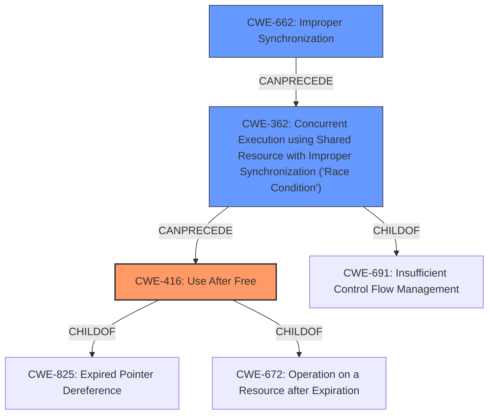

# Analysis for CVE-2020-25668

# Summary
| CWE ID | CWE Name | Confidence | CWE Abstraction Level | CWE Vulnerability Mapping Label | CWE-Vulnerability Mapping Notes |
|---|---|---|---|---|---|
| CWE-416 | Use After Free | 0.9 | Variant | Allowed | Primary CWE |
| CWE-362 | Concurrent Execution using Shared Resource with Improper Synchronization ('Race Condition') | 0.8 | Class | Allowed-with-Review | Secondary CWE |
| CWE-662 | Improper Synchronization | 0.7 | Class | Discouraged | Secondary CWE |

## Evidence and Confidence

*   **Confidence Score:** 0.85
*   **Evidence Strength:** HIGH

## Relationship Analysis
The primary weakness is a **Use After Free (UAF)**, represented by CWE-416, which occurs because **access to the global variable fg_console is not properly synchronized**. This lack of synchronization introduces a race condition (CWE-362).

CWE-416 is a Variant of CWE-825 (Expired Pointer Dereference) and CWE-672 (Operation on a Resource after Expiration). CWE-362 is a Class and a child of CWE-691 (Insufficient Control Flow Management). CWE-362 can precede CWE-416 in a vulnerability chain. The general synchronization issue is represented by CWE-662, which is a Class and the parent of CWE-667 (Improper Locking) and CWE-820 (Missing Synchronization).

## Vulnerability Chain
The vulnerability chain starts with **improper synchronization** (CWE-662), which leads to a **race condition** (CWE-362). The race condition allows the **use of freed memory** (CWE-416), resulting in a denial of service or potential privilege escalation.

## Summary of Analysis
The analysis is primarily based on the provided vulnerability description and the CVE reference summary. The key phrases identified the **improper synchronization** as the root cause, leading to a **use-after-free**.

The graph relationships show how the lack of synchronization (CWE-662) can result in a race condition (CWE-362), ultimately causing a use-after-free (CWE-416). The selection of CWE-416 as the primary CWE is based on the fact that it is the direct consequence and manifestation of the vulnerability, while CWE-362 and CWE-662 explain the underlying reasons.

CWE-416 is chosen as the most specific CWE because the vulnerability is a use-after-free condition. CWE-362 and CWE-662 provide context on how the use-after-free occurs due to concurrency issues.

Relevant CWE Information:

*   **CWE-416: Use After Free**
    *   **Technical Explanation:** The `con_font_op` function attempts to access freed memory due to a race condition. The `fg_console` value is changed concurrently, causing the memory associated with the old console data to be freed.
    *   **Security Implications:** Denial of service, potential privilege escalation.
    *   **Relationship:** Variant of CWE-825 (Expired Pointer Dereference).
    *   **Mapping Guidance:** Allowed.
*   **CWE-362: Concurrent Execution using Shared Resource with Improper Synchronization ('Race Condition')**
    *   **Technical Explanation:** The vulnerability exists because the `fg_console` variable is accessed concurrently without proper synchronization, leading to a race condition.
    *   **Security Implications:** The race condition allows a thread to free memory while another thread is still using it.
    *   **Relationship:** Class, can precede CWE-416.
    *   **Mapping Guidance:** Allowed-with-Review.
*   **CWE-662: Improper Synchronization**
    *   **Technical Explanation:** The root cause is the **lack of proper synchronization** when accessing the global variable `fg_console`.
    *   **Security Implications:** Leads to race conditions and use-after-free.
    *   **Relationship:** Class, parent of CWE-667 and CWE-820.
    *   **Mapping Guidance:** Discouraged, but included as it represents the broad class of the synchronization issue.

**CWEs Considered but Not Used:**

*   CWE-366: Race Condition within a Thread - While related, CWE-362 is a broader class that covers the specific scenario better.
*   CWE-367: Time-of-check Time-of-use (TOCTOU) Race Condition - This is too specific; the race condition isn't necessarily a TOCTOU issue.
*   CWE-772: Missing Release of Resource after Effective Lifetime - Not applicable, as the resource is released, but used after being released due to a race.
*   CWE-908: Use of Uninitialized Resource - Not applicable, as the resource is freed, not uninitialized.