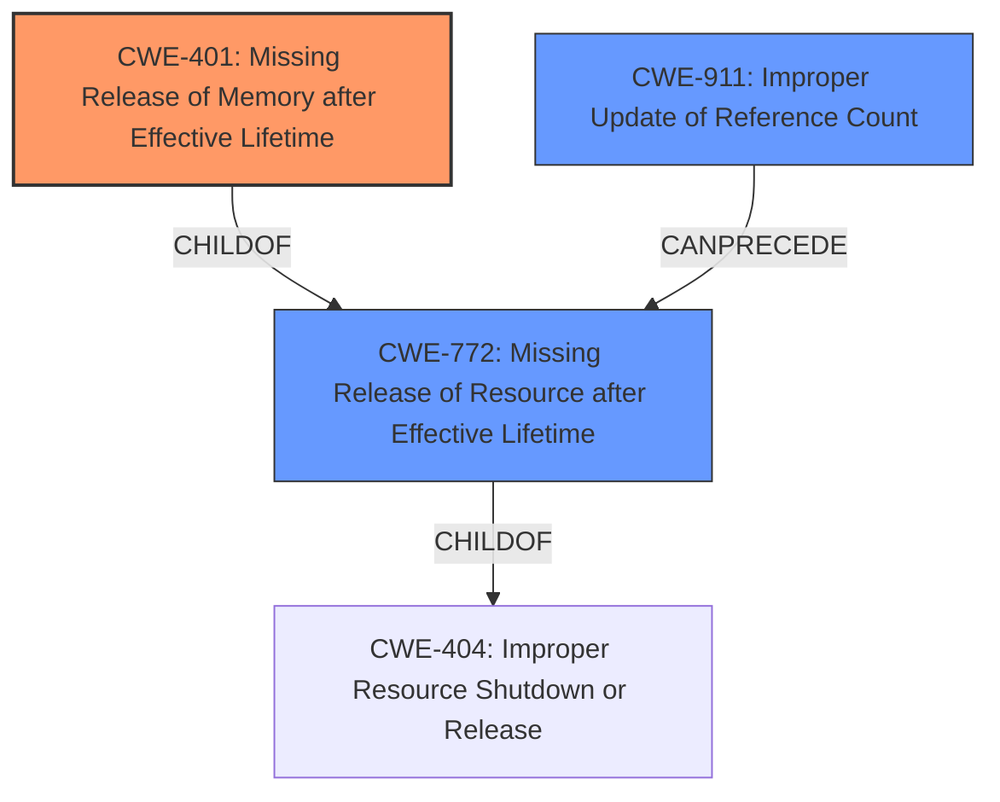

# Enhanced Analysis for CVE-2020-25673

# Summary
| CWE ID | CWE Name | Confidence | CWE Abstraction Level | CWE Vulnerability Mapping Label | CWE-Vulnerability Mapping Notes |
|---|---|---|---|---|---|
| CWE-401 | Missing Release of Memory after Effective Lifetime | 0.9 | Variant | Allowed | Primary CWE |
| CWE-772 | Missing Release of Resource after Effective Lifetime | 0.7 | Base | Allowed | Secondary Candidate |
| CWE-911 | Improper Update of Reference Count | 0.6 | Base | Allowed | Secondary Candidate |

## Evidence and Confidence

*   **Confidence Score:** 0.9
*   **Evidence Strength:** HIGH

## Relationship Analysis
The primary CWE selected is CWE-401, a Variant of CWE-772, which in turn is a ChildOf CWE-404. CWE-911 can precede CWE-772, indicating a possible chain. The choice of CWE-401 is due to the specific mention of memory leakage in the vulnerability description and CVE summary.



## Vulnerability Chain
The vulnerability chain starts with improper handling of non-blocking sockets, leading to resources not being freed, culminating in a **resource leak** (CWE-401) and system hang.
  - Improper Handling of Non-Blocking Socket
  - Socket resources not freed
  - **Missing Release of Memory after Effective Lifetime (CWE-401)**

## Summary of Analysis
The initial analysis pointed towards a resource leak due to the improper handling of non-blocking sockets. The CVE summary explicitly mentions "resource leak" and that resources are "not freed." This aligns with CWE-401 (Missing Release of Memory after Effective Lifetime), which is a Variant-level CWE and therefore more specific than its parent class. CWE-772 (Missing Release of Resource after Effective Lifetime) and CWE-911 (Improper Update of Reference Count) are also considered as they are related to resource management issues, but CWE-401 is the most accurate representation of the vulnerability based on the provided evidence.

The primary evidence is in the "CVE Reference Links Content Summary":
"This leaves the socket in a state where resources such as `llcp_sock->dev`, `llcp_sock->local`, `llcp_sock->ssap`, and `llcp_sock->service_name` are **not freed**. Also the socket is linked to `local->connecting_sockets`. Repeated calls to `llcp_sock_connect()` with a non-blocking socket and invalid service name leads to **resource leakage**."

CWE-909 (Missing Initialization of Resource), CWE-362 (Concurrent Execution using Shared Resource with Improper Synchronization ('Race Condition')), CWE-822 (Untrusted Pointer Dereference), CWE-833 (Deadlock), CWE-787 (Out-of-bounds Write), CWE-125 (Out-of-bounds Read), CWE-476 (NULL Pointer Dereference), and CWE-392 (Missing Report of Error Condition) were considered but deemed less relevant.

Relevant CWE Information:
- **CWE-401: Missing Release of Memory after Effective Lifetime**
  - **Technical Explanation:** The `llcp_sock_connect()` function fails to release allocated memory for socket resources when a non-blocking socket is used and the connection attempt fails. This leads to a memory leak over time.
  - **Security Implications:** Repeated connection attempts with invalid service names consume memory, eventually leading to a denial of service.
  - **Relationship:** Variant of CWE-772 (Missing Release of Resource after Effective Lifetime), ChildOf CWE-404 (Improper Resource Shutdown or Release).
  - **MITRE Mapping Guidance:** Usage: Allowed. This CWE entry is at the Variant level of abstraction, which is a preferred level of abstraction for mapping to the root causes of vulnerabilities.

- **CWE-772: Missing Release of Resource after Effective Lifetime**
  - **Technical Explanation:** The more general case of failing to release a resource. While memory is the specific resource here, this CWE could apply if other resources besides memory were leaked.
  - **Security Implications:** Resource exhaustion leading to denial of service.
  - **Relationship:** Parent of CWE-401.
  - **MITRE Mapping Guidance:** Usage: Allowed.

- **CWE-911: Improper Update of Reference Count**
  - **Technical Explanation:** While not directly stated, a reference count issue could be the root cause of the memory leak. If the reference count is not properly decremented, the memory might not be released.
  - **Security Implications:** Could lead to premature or delayed resource release, causing instability or denial of service.
  - **Relationship:** Can precede CWE-772.
  - **MITRE Mapping Guidance:** Usage: Allowed.


## CWE Relationship Analysis

Current CWEs represent these abstraction levels: .


### Vulnerability Chain Analysis

**Chain starting from CWE-476:**
- 476 (NULL Pointer Dereference) - ROOT


**Chain starting from CWE-787:**
- 787 (Out-of-bounds Write) - ROOT


### CWE Relationship Diagram

```mermaid
graph TD
    classDef primary fill:#f96,stroke:#333,stroke-width:2px
    classDef secondary fill:#69f,stroke:#333
    classDef tertiary fill:#9e9,stroke:#333
```