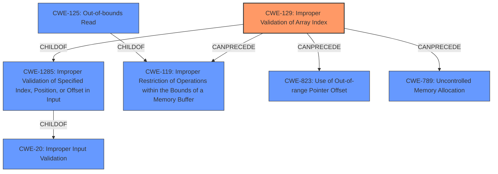

# Raw Analyzer Response for CVE-2020-25713

# Summary
| CWE ID | CWE Name | Confidence | CWE Abstraction Level | CWE Vulnerability Mapping Label | CWE-Vulnerability Mapping Notes |
|---|---|---|---|---|---|
| CWE-129 | Improper Validation of Array Index | 0.9 | Variant | Allowed | Primary CWE |
| CWE-125 | Out-of-bounds Read | 0.7 | Base | Allowed | Secondary Candidate |

## Evidence and Confidence

*   **Confidence Score:** 0.8
*   **Evidence Strength:** HIGH

## Relationship Analysis
The primary CWE identified is CWE-129 (Improper Validation of Array Index), which is a Variant of CWE-1285 (Improper Validation of Specified Index, Position, or Offset in Input) and CWE-20 (Improper Input Validation). It can precede CWE-119 (Improper Restriction of Operations within the Bounds of a Memory Buffer), CWE-823 (Use of Out-of-range Pointer Offset), and CWE-789 (Uncontrolled Memory Allocation).

CWE-125 (Out-of-bounds Read) is a Base CWE and a ChildOf CWE-119.

The selection of CWE-129 is based on the root cause involving improper validation leading to an out-of-bounds access. The relationship analysis confirms the hierarchical structure, moving from a general input validation issue (CWE-20) to a more specific array index validation problem (CWE-129).

## Vulnerability Chain
The chain of events is:
1.  Malformed input file
2.  **Improper Validation of Array Index (CWE-129)**
3.  Out-of-bounds array access
4.  Segfault

## Summary of Analysis
The initial analysis focused on the **out of bounds array access** identified as the **rootcause** in the vulnerability description. The Retriever results suggested several CWEs, including CWE-129, CWE-125, and CWE-191.

The primary decision driver was the evidence from the "Vulnerability Description Key Phrases" section, which states the **rootcause** as "**out of bounds array access**." The CVE Reference Links Content Summary confirms this, stating that the vulnerability stems from an out-of-bounds array access within the `raptor_xml_writer_start_element_common` function due to a malformed input file and that the code expects `nspace_declarations_count` to be less than `element->attribute_count`, but a crafted input can violate this condition. This confirms that the array index is not properly validated.

CWE-129 (Improper Validation of Array Index) was selected as the primary CWE because it precisely describes the **rootcause**: the product does not validate or incorrectly validates the array index to ensure it references a valid position within the array. This aligns with the detailed description of the vulnerability.

CWE-125 (Out-of-bounds Read) was considered a secondary candidate. While the vulnerability results in an out-of-bounds access, the **rootcause** is the missing or improper validation of the array index, making CWE-129 a more accurate representation of the underlying weakness.

The graph relationships emphasize the chain, with improper input validation (CWE-129) leading to potential memory corruption (CWE-119).

The selected CWE (CWE-129) is at the optimal level of specificity (Variant), as it directly addresses the **rootcause** of the vulnerability: **improper validation of the array index**. Other CWEs, such as CWE-20 (Improper Input Validation), are more general and do not capture the specific nature of the weakness.