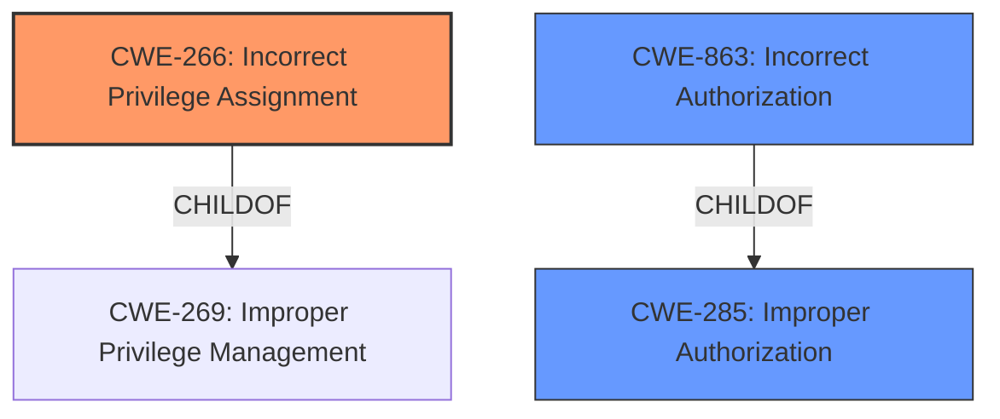

# Enhanced Analysis for CVE-2020-25716

# Summary
| CWE ID | CWE Name | Confidence | CWE Abstraction Level | CWE Vulnerability Mapping Label | CWE-Vulnerability Mapping Notes |
|---|---|---|---|---|---|
| CWE-266 | Incorrect Privilege Assignment | 0.9 | Base | Primary | Allowed |
| CWE-863 | Incorrect Authorization | 0.7 | Class | Secondary | Allowed-with-Review |
| CWE-285 | Improper Authorization | 0.6 | Class | Secondary | Discouraged |

## Evidence and Confidence

*   **Confidence Score:** 0.9
*   **Evidence Strength:** HIGH

## Relationship Analysis
The primary CWE selected is CWE-266 (Incorrect Privilege Assignment), which is a Base level CWE. It is a child of CWE-269 (Improper Privilege Management), which is a Class level CWE. CWE-266 represents the specific flaw where a privilege is incorrectly assigned, leading to an unintended sphere of control.
CWE-863 (Incorrect Authorization) and CWE-285 (Improper Authorization) are higher-level Class CWEs that describe authorization failures in general. They are considered secondary because CWE-266 more precisely describes the root cause.


## Vulnerability Chain
The vulnerability chain starts with an **incorrect privilege assignment** (CWE-266) that allows an attacker with a specific group to perform actions restricted to system administrators, leading to **role-based privilege escalation**. This results in the ability to **export or import administrator files**, impacting **data confidentiality and integrity**.

## Summary of Analysis
The initial analysis focused on the **role-based privileges escalation** reported in the vulnerability description. The retriever results pointed to several authorization-related CWEs. Based on the provided evidence, the most specific and relevant CWE is CWE-266 (Incorrect Privilege Assignment).

The vulnerability description states that an **attacker with a specific group can perform actions restricted only to system administrator**, which indicates an **incorrect assignment of privileges**. The CVE Reference Links Content Summary confirms that the **vulnerability is due to an incomplete fix for CVE-2020-10783**, which initially only addressed the issue for the `EVM-Operator` group. This means other groups were incorrectly assigned privileges that allowed them to perform actions they should not have been able to.

The mapping guidance for CWE-266 states that it is a Base level of abstraction, which is a preferred level for mapping to root causes. The description of CWE-266, **"A product incorrectly assigns a privilege to a particular actor, creating an unintended sphere of control for that actor"**, aligns perfectly with the vulnerability description.

While CWE-863 (Incorrect Authorization) and CWE-285 (Improper Authorization) are also relevant, they are higher-level Class CWEs. CWE-266 is a more specific representation of the underlying weakness.

The evidence directly supports the selection of CWE-266 as the primary CWE, with CWE-863 and CWE-285 as secondary considerations. The selected CWEs are at the optimal level of specificity, providing a clear understanding of the root cause and potential impact of the vulnerability.

Relevant CWE Information:

# Enhanced Context (25 CWEs)
The following CWEs were identified as potentially relevant to this vulnerability:

## CWE-274: Improper Handling of Insufficient Privileges
**Abstraction Level**: Base
**Similarity Score**: 0.77
**Source**: dense

**Description**:
The product does not handle or incorrectly handles when it has insufficient privileges to perform an operation, leading to resultant weaknesses.

**Mapping Guidance**:
- Usage: Discouraged
- Rationale: This CWE entry could be deprecated in a future version of CWE.

**Why Not Used:** This CWE is about insufficient privileges, while the vulnerability is about excessive privileges due to incorrect assignment.

## CWE-266: Incorrect Privilege Assignment
**Abstraction Level**: Base
**Similarity Score**: 0.76
**Source**: dense

**Description**:
A product incorrectly assigns a privilege to a particular actor, creating an unintended sphere of control for that actor.

**Mapping Guidance**:
- Usage: Allowed
- Rationale: This CWE entry is at the Base level of abstraction, which is a preferred level of abstraction for mapping to the root causes of vulnerabilities.

**Why Used:** This CWE directly matches the vulnerability description, where a specific group can perform actions restricted to system administrators due to an incorrect privilege assignment.

## CWE-653: Improper Isolation or Compartmentalization
**Abstraction Level**: Class
**Similarity Score**: 0.76
**Source**: dense

**Description**:
The product does not properly compartmentalize or isolate functionality, processes, or resources that require different privilege levels, rights, or permissions.

**Mapping Guidance**:
- Usage: Allowed
- Rationale: This CWE entry is at the Base level of abstraction, which is a preferred level of abstraction for mapping to the root causes of vulnerabilities.

**Why Not Used:** While related to privilege levels, this CWE is more about the lack of isolation between different functionalities, rather than the specific incorrect assignment of a privilege.

## CWE-280: Improper Handling of Insufficient Permissions or Privileges
**Abstraction Level**: Base
**Similarity Score**: 0.76
**Source**: dense

**Description**:
The product does not handle or incorrectly handles when it has insufficient privileges to access resources or functionality as specified by their permissions. This may cause it to follow unexpected code paths that may leave the product in an invalid state.

**Mapping Guidance**:
- Usage: Allowed
- Rationale: This CWE entry is at the Base level of abstraction, which is a preferred level of abstraction for mapping to the root causes of vulnerabilities.

**Why Not Used:** Similar to CWE-274, this CWE focuses on insufficient privileges, not the excessive privileges caused by incorrect assignment.

## CWE-1390: Weak Authentication
**Abstraction Level**: Class
**Similarity Score**: 0.76
**Source**: dense

**Description**:
The product uses an authentication mechanism to restrict access to specific users or identities, but the mechanism does not sufficiently prove that the claimed identity is correct.

**Mapping Guidance**:
- Usage: Allowed-with-Review
- Rationale: This CWE entry is a Class and might have Base-level children that would be more appropriate

**Why Not Used:** The vulnerability is not directly related to authentication, but rather to authorization and privilege management after authentication.

## CWE-807: Reliance on Untrusted Inputs in a Security Decision
**Abstraction Level**: Base
**Similarity Score**: 0.76
**Source**: dense

**Description**:
The product uses a protection mechanism that relies on the existence or values of an input, but the input can be modified by an untrusted actor in a way that bypasses the protection mechanism.

**Mapping Guidance**:
- Usage: Allowed
- Rationale: This CWE entry is at the Base level of abstraction, which is a preferred level of abstraction for mapping to the root causes of vulnerabilities.

**Why Not Used:** There is no indication in the vulnerability description that untrusted inputs are directly involved in the privilege escalation.

## CWE-267: Privilege Defined With Unsafe Actions
**Abstraction Level**: Base
**Similarity Score**: 0.76
**Source**: dense

**Description**:
A particular privilege, role, capability, or right can be used to perform unsafe actions that were not intended, even when it is assigned to the correct entity.

**Mapping Guidance**:
- Usage: Allowed
- Rationale: This CWE entry is at the Base level of abstraction, which is a preferred level of abstraction for mapping to the root causes of vulnerabilities.

**Why Not Used:** This CWE is about the definition of a privilege itself being unsafe. The described vulnerability is about the incorrect *assignment* of existing privileges.

## CWE-303: Incorrect Implementation of Authentication Algorithm
**Abstraction Level**: Base
**Similarity Score**: 0.76
**Source**: dense

**Description**:
The requirements for the product dictate the use of an established authentication algorithm, but the implementation of the algorithm is incorrect.

**Mapping Guidance**:
- Usage: Allowed
- Rationale: This CWE entry is at the Base level of abstraction, which is a preferred level of abstraction for mapping to the root causes of vulnerabilities.

**Why Not Used:** The vulnerability is not related to the implementation of an authentication algorithm.

## CWE-639: Authorization Bypass Through User-Controlled Key
**Abstraction Level**: Base
**Similarity Score**: 0.76
**Source**: dense

**Description**:
The system's authorization functionality does not


## CWE Relationship Analysis

Current CWEs represent these abstraction levels: .


### Vulnerability Chain Analysis

**Chain starting from CWE-303:**
- 303 (Incorrect Implementation of Authentication Algorithm) - ROOT


**Chain starting from CWE-653:**
- 653 (Improper Isolation or Compartmentalization) - ROOT


### CWE Relationship Diagram

```mermaid
graph TD
    classDef primary fill:#f96,stroke:#333,stroke-width:2px
    classDef secondary fill:#69f,stroke:#333
    classDef tertiary fill:#9e9,stroke:#333
```