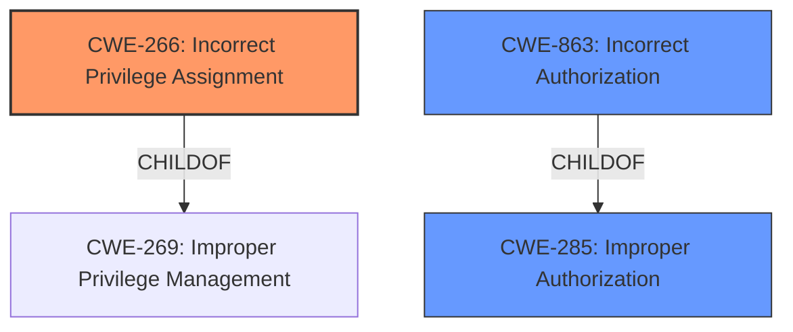

# Analysis for CVE-2020-25716

# Summary
| CWE ID | CWE Name | Confidence | CWE Abstraction Level | CWE Vulnerability Mapping Label | CWE-Vulnerability Mapping Notes |
|---|---|---|---|---|---|
| CWE-266 | Incorrect Privilege Assignment | 0.9 | Base | Primary | Allowed |
| CWE-863 | Incorrect Authorization | 0.7 | Class | Secondary | Allowed-with-Review |
| CWE-285 | Improper Authorization | 0.6 | Class | Secondary | Discouraged |

## Evidence and Confidence

*   **Confidence Score:** 0.9
*   **Evidence Strength:** HIGH

## Relationship Analysis
The primary CWE selected is CWE-266 (Incorrect Privilege Assignment), which is a Base level CWE. It is a child of CWE-269 (Improper Privilege Management), which is a Class level CWE. CWE-266 represents the specific flaw where a privilege is incorrectly assigned, leading to an unintended sphere of control.
CWE-863 (Incorrect Authorization) and CWE-285 (Improper Authorization) are higher-level Class CWEs that describe authorization failures in general. They are considered secondary because CWE-266 more precisely describes the root cause.


## Vulnerability Chain
The vulnerability chain starts with an **incorrect privilege assignment** (CWE-266) that allows an attacker with a specific group to perform actions restricted to system administrators, leading to **role-based privilege escalation**. This results in the ability to **export or import administrator files**, impacting **data confidentiality and integrity**.

## Summary of Analysis
The initial analysis focused on the **role-based privileges escalation** reported in the vulnerability description. The retriever results pointed to several authorization-related CWEs. Based on the provided evidence, the most specific and relevant CWE is CWE-266 (Incorrect Privilege Assignment).

The vulnerability description states that an **attacker with a specific group can perform actions restricted only to system administrator**, which indicates an **incorrect assignment of privileges**. The CVE Reference Links Content Summary confirms that the **vulnerability is due to an incomplete fix for CVE-2020-10783**, which initially only addressed the issue for the `EVM-Operator` group. This means other groups were incorrectly assigned privileges that allowed them to perform actions they should not have been able to.

The mapping guidance for CWE-266 states that it is a Base level of abstraction, which is a preferred level for mapping to root causes. The description of CWE-266, **"A product incorrectly assigns a privilege to a particular actor, creating an unintended sphere of control for that actor"**, aligns perfectly with the vulnerability description.

While CWE-863 (Incorrect Authorization) and CWE-285 (Improper Authorization) are also relevant, they are higher-level Class CWEs. CWE-266 is a more specific representation of the underlying weakness.

The evidence directly supports the selection of CWE-266 as the primary CWE, with CWE-863 and CWE-285 as secondary considerations. The selected CWEs are at the optimal level of specificity, providing a clear understanding of the root cause and potential impact of the vulnerability.

Relevant CWE Information:

# Enhanced Context (25 CWEs)
The following CWEs were identified as potentially relevant to this vulnerability:

## CWE-274: Improper Handling of Insufficient Privileges
**Abstraction Level**: Base
**Similarity Score**: 0.77
**Source**: dense

**Description**:
The product does not handle or incorrectly handles when it has insufficient privileges to perform an operation, leading to resultant weaknesses.

**Mapping Guidance**:
- Usage: Discouraged
- Rationale: This CWE entry could be deprecated in a future version of CWE.

**Why Not Used:** This CWE is about insufficient privileges, while the vulnerability is about excessive privileges due to incorrect assignment.

## CWE-266: Incorrect Privilege Assignment
**Abstraction Level**: Base
**Similarity Score**: 0.76
**Source**: dense

**Description**:
A product incorrectly assigns a privilege to a particular actor, creating an unintended sphere of control for that actor.

**Mapping Guidance**:
- Usage: Allowed
- Rationale: This CWE entry is at the Base level of abstraction, which is a preferred level of abstraction for mapping to the root causes of vulnerabilities.

**Why Used:** This CWE directly matches the vulnerability description, where a specific group can perform actions restricted to system administrators due to an incorrect privilege assignment.

## CWE-653: Improper Isolation or Compartmentalization
**Abstraction Level**: Class
**Similarity Score**: 0.76
**Source**: dense

**Description**:
The product does not properly compartmentalize or isolate functionality, processes, or resources that require different privilege levels, rights, or permissions.

**Mapping Guidance**:
- Usage: Allowed
- Rationale: This CWE entry is at the Base level of abstraction, which is a preferred level of abstraction for mapping to the root causes of vulnerabilities.

**Why Not Used:** While related to privilege levels, this CWE is more about the lack of isolation between different functionalities, rather than the specific incorrect assignment of a privilege.

## CWE-280: Improper Handling of Insufficient Permissions or Privileges
**Abstraction Level**: Base
**Similarity Score**: 0.76
**Source**: dense

**Description**:
The product does not handle or incorrectly handles when it has insufficient privileges to access resources or functionality as specified by their permissions. This may cause it to follow unexpected code paths that may leave the product in an invalid state.

**Mapping Guidance**:
- Usage: Allowed
- Rationale: This CWE entry is at the Base level of abstraction, which is a preferred level of abstraction for mapping to the root causes of vulnerabilities.

**Why Not Used:** Similar to CWE-274, this CWE focuses on insufficient privileges, not the excessive privileges caused by incorrect assignment.

## CWE-1390: Weak Authentication
**Abstraction Level**: Class
**Similarity Score**: 0.76
**Source**: dense

**Description**:
The product uses an authentication mechanism to restrict access to specific users or identities, but the mechanism does not sufficiently prove that the claimed identity is correct.

**Mapping Guidance**:
- Usage: Allowed-with-Review
- Rationale: This CWE entry is a Class and might have Base-level children that would be more appropriate

**Why Not Used:** The vulnerability is not directly related to authentication, but rather to authorization and privilege management after authentication.

## CWE-807: Reliance on Untrusted Inputs in a Security Decision
**Abstraction Level**: Base
**Similarity Score**: 0.76
**Source**: dense

**Description**:
The product uses a protection mechanism that relies on the existence or values of an input, but the input can be modified by an untrusted actor in a way that bypasses the protection mechanism.

**Mapping Guidance**:
- Usage: Allowed
- Rationale: This CWE entry is at the Base level of abstraction, which is a preferred level of abstraction for mapping to the root causes of vulnerabilities.

**Why Not Used:** There is no indication in the vulnerability description that untrusted inputs are directly involved in the privilege escalation.

## CWE-267: Privilege Defined With Unsafe Actions
**Abstraction Level**: Base
**Similarity Score**: 0.76
**Source**: dense

**Description**:
A particular privilege, role, capability, or right can be used to perform unsafe actions that were not intended, even when it is assigned to the correct entity.

**Mapping Guidance**:
- Usage: Allowed
- Rationale: This CWE entry is at the Base level of abstraction, which is a preferred level of abstraction for mapping to the root causes of vulnerabilities.

**Why Not Used:** This CWE is about the definition of a privilege itself being unsafe. The described vulnerability is about the incorrect *assignment* of existing privileges.

## CWE-303: Incorrect Implementation of Authentication Algorithm
**Abstraction Level**: Base
**Similarity Score**: 0.76
**Source**: dense

**Description**:
The requirements for the product dictate the use of an established authentication algorithm, but the implementation of the algorithm is incorrect.

**Mapping Guidance**:
- Usage: Allowed
- Rationale: This CWE entry is at the Base level of abstraction, which is a preferred level of abstraction for mapping to the root causes of vulnerabilities.

**Why Not Used:** The vulnerability is not related to the implementation of an authentication algorithm.

## CWE-639: Authorization Bypass Through User-Controlled Key
**Abstraction Level**: Base
**Similarity Score**: 0.76
**Source**: dense

**Description**:
The system's authorization functionality does not

# Enhanced Query for CVE-2020-25716

## Vulnerability Description
A flaw was found in Cloudforms. A role-based privileges escalation flaw where export or import of administrator files is possible. An attacker with a specific group can perform actions restricted only to system administrator. This is the affect of an incomplete fix for CVE-2020-10783. The highest threat from this vulnerability is to data confidentiality and integrity. Versions before cfme 5.11.10.1 are affected

### Vulnerability Description Key Phrases
- **impact:** role-based privileges escalation
- **vector:** export or import of administrator files
- **attacker:** attacker with a specific group
- **product:** Cloudforms
- **version:** before cfme 5.11.10.1

## CVE Reference Links Content Summary
Based on the provided information, here's an analysis of CVE-2020-25716:

**Root Cause:**
- The vulnerability is due to an incomplete fix for CVE-2020-10783. The initial fix for CVE-2020-10783 only addressed the issue for the `EVM-Operator` group, leaving other groups vulnerable.

**Weaknesses/Vulnerabilities:**
- **Role-based privilege escalation:** An attacker with a specific group (other than `EVM-Operator`, which was addressed by the initial CVE-2020-10783 fix) can perform actions restricted to the `EVM-Super-administrator` group.
- This allows for the export or import of administrator files, which should only be possible by a system administrator.

**Impact of Exploitation:**
- **Data confidentiality and integrity:**  The vulnerability poses a high threat to data confidentiality and integrity. Exploitation could lead to unauthorized access to sensitive information or modification of critical system settings through imported files.

**Attack Vectors:**
- The attack vector is through the Cloudforms web interface or API, where an authenticated user belonging to a vulnerable group can perform privileged actions.

**Required Attacker Capabilities/Position:**
- The attacker needs to be an authenticated user with membership in a specific group that is not the `EVM-Operator` group, as this group's vulnerability was addressed by a previous fix.
- The attacker needs to be able to access the Cloudforms interface.

**Additional Details:**
- The bug report indicates that Cloudforms versions 4.7 and 5 are affected.
- The issue was resolved in CloudForms Management Engine 5.11.10.1.
- The fix is available in RHSA-2020:5554
- The vulnerability was discovered by Purnachand Pulahari (IBM) and Ranjit Kumar Singh (IBM).

## Retriever Results

### Top Combined Results

| Rank | CWE ID | Name | Abstraction | Usage  | Retrievers | Individual Scores |
|------|--------|------|-------------|-------|------------|-------------------|
| 1 | 285 | Improper Authorization | Class | Discouraged | sparse | 0.151 |
| 2 | 863 | Incorrect Authorization | Class | Allowed-with-Review | sparse | 0.144 |
| 3 | 267 | Privilege Defined With Unsafe Actions | Base | Allowed | sparse | 0.140 |
| 4 | 732 | Incorrect Permission Assignment for Critical Resource | Class | Allowed-with-Review | sparse | 0.139 |
| 5 | 269 | Improper Privilege Management | Class | Discouraged | sparse | 0.134 |
| 6 | 266 | Incorrect Privilege Assignment | Base | Allowed | dense | 0.596 |
| 7 | 276 | Incorrect Default Permissions | Base | Allowed | graph | 0.002 |
| 8 | 754 | Improper Check for Unusual or Exceptional Conditions | Class | Allowed-with-Review | sparse | 0.133 |
| 9 | 367 | Time-of-check Time-of-use (TOCTOU) Race Condition | Base | Allowed | sparse | 0.132 |
| 10 | 1390 | Weak Authentication | Class | Allowed-with-Review | sparse | 0.131 |


# Complete CWE Specifications


## CWE-285: Improper Authorization
**Abstraction:** Class
**Status:** Draft

### Description
The product does not perform or incorrectly performs an authorization check when an actor attempts to access a resource or perform an action.

### Extended Description


Assuming a user with a given identity, authorization is the process of determining whether that user can access a given resource, based on the user's privileges and any permissions or other access-control specifications that apply to the resource.


When access control checks are not applied consistently - or not at all - users are able to access data or perform actions that they should not be allowed to perform. This can lead to a wide range of problems, including information exposures, denial of service, and arbitrary code execution.


### Alternative Terms
AuthZ: "AuthZ" is typically used as an abbreviation of "authorization" within the web application security community. It is distinct from "AuthN" (or, sometimes, "AuthC") which is an abbreviation of "authentication." The use of "Auth" as an abbreviation is discouraged, since it could be used for either authentication or authorization.

### Relationships
ChildOf -> CWE-284
ChildOf -> CWE-284

### Mapping Guidance
**Usage:** Discouraged
**Rationale:** CWE-285 is high-level and lower-level CWEs can frequently be used instead. It is a level-1 Class (i.e., a child of a Pillar).
**Comments:** Look at CWE-285's children and consider mapping to CWEs such as CWE-862: Missing Authorization, CWE-863: Incorrect Authorization, CWE-732: Incorrect Permission Assignment for Critical Resource, or others.
**Reasons:**
- Abstraction
**Suggested Alternatives:**
- CWE-862: Missing Authorization
- CWE-863: Incorrect Authorization
- CWE-732: Incorrect Permission Assignment for Critical Resource


### Observed Examples
- **CVE-2022-24730:** Go-based continuous deployment product does not check that a user has certain privileges to update or create an app, allowing adversaries to read sensitive repository information
- **CVE-2009-3168:** Web application does not restrict access to admin scripts, allowing authenticated users to reset administrative passwords.
- **CVE-2009-2960:** Web application does not restrict access to admin scripts, allowing authenticated users to modify passwords of other users.


## CWE-863: Incorrect Authorization
**Abstraction:** Class
**Status:** Incomplete

### Description
The product performs an authorization check when an actor attempts to access a resource or perform an action, but it does not correctly perform the check.

### Extended Description
Not provided

### Alternative Terms
AuthZ: "AuthZ" is typically used as an abbreviation of "authorization" within the web application security community. It is distinct from "AuthN" (or, sometimes, "AuthC") which is an abbreviation of "authentication." The use of "Auth" as an abbreviation is discouraged, since it could be used for either authentication or authorization.

### Relationships
ChildOf -> CWE-285
ChildOf -> CWE-284

### Mapping Guidance
**Usage:** Allowed-with-Review
**Rationale:** This CWE entry is a Class and might have Base-level children that would be more appropriate
**Comments:** Examine children of this entry to see if there is a better fit
**Reasons:**
- Abstraction


### Additional Notes
**[Terminology]** 

Assuming a user with a given identity, authorization is the process of determining whether that user can access a given resource, based on the user's privileges and any permissions or other access-control specifications that apply to the resource.


### Observed Examples
- **CVE-2021-39155:** Chain: A microservice integration and management platform compares the hostname in the HTTP Host header in a case-sensitive way (CWE-178, CWE-1289), allowing bypass of the authorization policy (CWE-863) using a hostname with mixed case or other variations.
- **CVE-2019-15900:** Chain: sscanf() call is used to check if a username and group exists, but the return value of sscanf() call is not checked (CWE-252), causing an uninitialized variable to be checked (CWE-457), returning success to allow authorization bypass for executing a privileged (CWE-863).
- **CVE-2009-2213:** Gateway uses default "Allow" configuration for its authorization settings.


## CWE-267: Privilege Defined With Unsafe Actions
**Abstraction:** Base
**Status:** Incomplete

### Description
A particular privilege, role, capability, or right can be used to perform unsafe actions that were not intended, even when it is assigned to the correct entity.

### Extended Description
Not provided

### Alternative Terms
None

### Relationships
ChildOf -> CWE-269

### Mapping Guidance
**Usage:** Allowed
**Rationale:** This CWE entry is at the Base level of abstraction, which is a preferred level of abstraction for mapping to the root causes of vulnerabilities.
**Comments:** Carefully read both the name and description to ensure that this mapping is an appropriate fit. Do not try to 'force' a mapping to a lower-level Base/Variant simply to comply with this preferred level of abstraction.
**Reasons:**
- Acceptable-Use


### Additional Notes
**[Maintenance]** 

Note: there are 2 separate sub-categories here:

```
		- privilege incorrectly allows entities to perform certain actions
		- object is incorrectly accessible to entities with a given privilege
```


### Observed Examples
- **CVE-2002-1981:** Roles have access to dangerous procedures (Accessible entities).
- **CVE-2002-1671:** Untrusted object/method gets access to clipboard (Accessible entities).
- **CVE-2004-2204:** Gain privileges using functions/tags that should be restricted (Accessible entities).


## CWE-732: Incorrect Permission Assignment for Critical Resource
**Abstraction:** Class
**Status:** Draft

### Description
The product specifies permissions for a security-critical resource in a way that allows that resource to be read or modified by unintended actors.

### Extended Description
When a resource is given a permission setting that provides access to a wider range of actors than required, it could lead to the exposure of sensitive information, or the modification of that resource by unintended parties. This is especially dangerous when the resource is related to program configuration, execution, or sensitive user data. For example, consider a misconfigured storage account for the cloud that can be read or written by a public or anonymous user.

### Alternative Terms
None

### Relationships
ChildOf -> CWE-285
ChildOf -> CWE-668

### Mapping Guidance
**Usage:** Allowed-with-Review
**Rationale:** While the name itself indicates an assignment of permissions for resources, this is often misused for vulnerabilities in which "permissions" are not checked, which is an "authorization" weakness (CWE-285 or descendants) within CWE's model [REF-1287].
**Comments:** Closely analyze the specific mistake that is allowing the resource to be exposed, and perform a CWE mapping for that mistake.
**Reasons:**
- Frequent Misuse


### Additional Notes
**[Maintenance]** The relationships between privileges, permissions, and actors (e.g. users and groups) need further refinement within the Research view. One complication is that these concepts apply to two different pillars, related to control of resources (CWE-664) and protection mechanism failures (CWE-693).


### Observed Examples
- **CVE-2022-29527:** Go application for cloud management creates a world-writable sudoers file that allows local attackers to inject sudo rules and escalate privileges to root by winning a race condition.
- **CVE-2009-3482:** Anti-virus product sets insecure "Everyone: Full Control" permissions for files under the "Program Files" folder, allowing attackers to replace executables with Trojan horses.
- **CVE-2009-3897:** Product creates directories with 0777 permissions at installation, allowing users to gain privileges and access a socket used for authentication.


## CWE-269: Improper Privilege Management
**Abstraction:** Class
**Status:** Draft

### Description
The product does not properly assign, modify, track, or check privileges for an actor, creating an unintended sphere of control for that actor.

### Extended Description
Not provided

### Alternative Terms
None

### Relationships
ChildOf -> CWE-284

### Mapping Guidance
**Usage:** Discouraged
**Rationale:** CWE-269 is commonly misused. It can be conflated with "privilege escalation," which is a technical impact that is listed in many low-information vulnerability reports [REF-1287]. It is not useful for trend analysis.
**Comments:** If an error or mistake allows privilege escalation, then use the CWE ID for that mistake. Avoid using CWE-269 when only phrases such as "privilege escalation" or "gain privileges" are available, as these indicate technical impact of the vulnerability - not the root cause weakness. If the root cause seems to be directly related to privileges, then examine the children of CWE-269 for additional hints, such as Execution with Unnecessary Privileges (CWE-250) or Incorrect Privilege Assignment (CWE-266).
**Reasons:**
- Frequent Misuse


### Additional Notes
**[Maintenance]** The relationships between privileges, permissions, and actors (e.g. users and groups) need further refinement within the Research view. One complication is that these concepts apply to two different pillars, related to control of resources (CWE-664) and protection mechanism failures (CWE-693).


### Observed Examples
- **CVE-2001-1555:** Terminal privileges are not reset when a user logs out.
- **CVE-2001-1514:** Does not properly pass security context to child processes in certain cases, allows privilege escalation.
- **CVE-2001-0128:** Does not properly compute roles.


## CWE-266: Incorrect Privilege Assignment
**Abstraction:** Base
**Status:** Draft

### Description
A product incorrectly assigns a privilege to a particular actor, creating an unintended sphere of control for that actor.

### Extended Description
Not provided

### Alternative Terms
None

### Relationships
ChildOf -> CWE-269
CanAlsoBe -> CWE-286

### Mapping Guidance
**Usage:** Allowed
**Rationale:** This CWE entry is at the Base level of abstraction, which is a preferred level of abstraction for mapping to the root causes of vulnerabilities.
**Comments:** Carefully read both the name and description to ensure that this mapping is an appropriate fit. Do not try to 'force' a mapping to a lower-level Base/Variant simply to comply with this preferred level of abstraction.
**Reasons:**
- Acceptable-Use


### Observed Examples
- **CVE-1999-1193:** untrusted user placed in unix "wheel" group
- **CVE-2005-2741:** Product allows users to grant themselves certain rights that can be used to escalate privileges.
- **CVE-2005-2496:** Product uses group ID of a user instead of the group, causing it to run with different privileges. This is resultant from some other unknown issue.


## CWE-276: Incorrect Default Permissions
**Abstraction:** Base
**Status:** Draft

### Description
During installation, installed file permissions are set to allow anyone to modify those files.

### Extended Description
Not provided

### Alternative Terms
None

### Relationships
ChildOf -> CWE-732
ChildOf -> CWE-732

### Mapping Guidance
**Usage:** Allowed
**Rationale:** This CWE entry is at the Base level of abstraction, which is a preferred level of abstraction for mapping to the root causes of vulnerabilities.
**Comments:** Carefully read both the name and description to ensure that this mapping is an appropriate fit. Do not try to 'force' a mapping to a lower-level Base/Variant simply to comply with this preferred level of abstraction.
**Reasons:**
- Acceptable-Use


### Observed Examples
- **CVE-2005-1941:** Executables installed world-writable.
- **CVE-2002-1713:** Home directories installed world-readable.
- **CVE-2001-1550:** World-writable log files allow information loss; world-readable file has cleartext passwords.


## CWE-754: Improper Check for Unusual or Exceptional Conditions
**Abstraction:** Class
**Status:** Incomplete

### Description
The product does not check or incorrectly checks for unusual or exceptional conditions that are not expected to occur frequently during day to day operation of the product.

### Extended Description


The programmer may assume that certain events or conditions will never occur or do not need to be worried about, such as low memory conditions, lack of access to resources due to restrictive permissions, or misbehaving clients or components. However, attackers may intentionally trigger these unusual conditions, thus violating the programmer's assumptions, possibly introducing instability, incorrect behavior, or a vulnerability.


Note that this entry is not exclusively about the use of exceptions and exception handling, which are mechanisms for both checking and handling unusual or unexpected conditions.


### Alternative Terms
None

### Relationships
ChildOf -> CWE-703
CanPrecede -> CWE-416

### Mapping Guidance
**Usage:** Allowed-with-Review
**Rationale:** This CWE entry is a Class and might have Base-level children that would be more appropriate
**Comments:** Examine children of this entry to see if there is a better fit
**Reasons:**
- Abstraction


### Additional Notes
**[Relationship]** Sometimes, when a return value can be used to indicate an error, an unchecked return value is a code-layer instance of a missing application-layer check for exceptional conditions. However, return values are not always needed to communicate exceptional conditions. For example, expiration of resources, values passed by reference, asynchronously modified data, sockets, etc. may indicate exceptional conditions without the use of a return value.


### Observed Examples
- **CVE-2023-49286:** Chain: function in web caching proxy does not correctly check a return value (CWE-253) leading to a reachable assertion (CWE-617)
- **CVE-2007-3798:** Unchecked return value leads to resultant integer overflow and code execution.
- **CVE-2006-4447:** Program does not check return value when invoking functions to drop privileges, which could leave users with higher privileges than expected by forcing those functions to fail.


## CWE-367: Time-of-check Time-of-use (TOCTOU) Race Condition
**Abstraction:** Base
**Status:** Incomplete

### Description
The product checks the state of a resource before using that resource, but the resource's state can change between the check and the use in a way that invalidates the results of the check. This can cause the product to perform invalid actions when the resource is in an unexpected state.

### Extended Description
This weakness can be security-relevant when an attacker can influence the state of the resource between check and use. This can happen with shared resources such as files, memory, or even variables in multithreaded programs.

### Alternative Terms
TOCTTOU: The TOCTTOU acronym expands to "Time Of Check To Time Of Use".
TOCCTOU: The TOCCTOU acronym is most likely a typo of TOCTTOU, but it has been used in some influential documents, so the typo is repeated fairly frequently.

### Relationships
ChildOf -> CWE-362
ChildOf -> CWE-362

### Mapping Guidance
**Usage:** Allowed
**Rationale:** This CWE entry is at the Base level of abstraction, which is a preferred level of abstraction for mapping to the root causes of vulnerabilities.
**Comments:** Carefully read both the name and description to ensure that this mapping is an appropriate fit. Do not try to 'force' a mapping to a lower-level Base/Variant simply to comply with this preferred level of abstraction.
**Reasons:**
- Acceptable-Use


### Additional Notes
**[Relationship]** TOCTOU issues do not always involve symlinks, and not every symlink issue is a TOCTOU problem.

**[Research Gap]** Non-symlink TOCTOU issues are not reported frequently, but they are likely to occur in code that attempts to be secure.


### Observed Examples
- **CVE-2015-1743:** TOCTOU in sandbox process allows installation of untrusted browser add-ons by replacing a file after it has been verified, but before it is executed
- **CVE-2003-0813:** A multi-threaded race condition allows remote attackers to cause a denial of service (crash or reboot) by causing two threads to process the same RPC request, which causes one thread to use memory after it has been freed.
- **CVE-2004-0594:** PHP flaw allows remote attackers to execute arbitrary code by aborting execution before the initialization of key data structures is complete.


## CWE-1390: Weak Authentication
**Abstraction:** Class
**Status:** Incomplete

### Description
The product uses an authentication mechanism to restrict access to specific users or identities, but the mechanism does not sufficiently prove that the claimed identity is correct.

### Extended Description


Attackers may be able to bypass weak authentication faster and/or with less effort than expected.


### Alternative Terms
None

### Relationships
ChildOf -> CWE-287

### Mapping Guidance
**Usage:** Allowed-with-Review
**Rationale:** This CWE entry is a Class and might have Base-level children that would be more appropriate
**Comments:** Examine children of this entry to see if there is a better fit
**Reasons:**
- Abstraction


### Observed Examples
- **CVE-2022-30034:** Chain: Web UI for a Python RPC framework does not use regex anchors to validate user login emails (CWE-777), potentially allowing bypass of OAuth (CWE-1390).
- **CVE-2022-35248:** Chat application skips validation when Central Authentication Service (CAS) is enabled, effectively removing the second factor from two-factor authentication
- **CVE-2021-3116:** Chain: Python-based HTTP Proxy server uses the wrong boolean operators (CWE-480) causing an incorrect comparison (CWE-697) that identifies an authN failure if all three conditions are met instead of only one, allowing bypass of the proxy authentication (CWE-1390)

