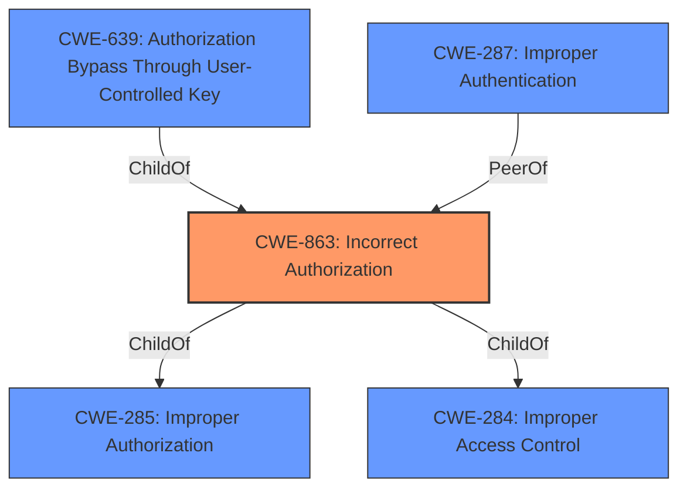

# Enhanced Analysis for CVE-2020-25718

# Summary
| CWE ID | CWE Name | Confidence | CWE Abstraction Level | CWE Vulnerability Mapping Label | CWE-Vulnerability Mapping Notes |
|---|---|---|---|---|---|
| **CWE-863** | **Incorrect Authorization** | 0.9 | Class | Primary | Allowed-with-Review |
| CWE-287 | Improper Authentication | 0.5 | Class | Secondary Candidate | Discouraged |
| CWE-639 | Authorization Bypass Through User-Controlled Key | 0.5 | Base | Secondary Candidate | Allowed |

## Evidence and Confidence

*   **Confidence Score:** 0.9
*   **Evidence Strength:** HIGH

## Relationship Analysis
The primary CWE is CWE-863, which is a Class-level CWE. It has child relationships to CWE-285 (Improper Authorization) and CWE-284 (Improper Access Control). The relationship analysis indicates that a more specific Base-level CWE may exist under CWE-863, but given the information provided, CWE-863 is the most accurate. CWE-287 (Improper Authentication) is a peer and potential alternative, but the vulnerability is more about incorrect authorization than a complete lack of authentication. CWE-639 is a child of CWE-863 and might be a better fit but there is no mention of User-Controlled Key in the provided text.



## Vulnerability Chain
The vulnerability chain starts with the **incorrect authorization** in the Samba AD DC, leading to the ability for a compromised RODC to print administrator tickets, ultimately resulting in potential domain compromise and privilege escalation.

## Summary of Analysis
The initial assessment identified the vulnerability as primarily related to **incorrect authorization**, specifically in the context of Samba AD DC's handling of RODC ticket requests. The analysis focused on the root cause: the **missing authorization check** for RODCs when issuing Kerberos tickets.

The evidence supporting this is:
- Vulnerability Description Key Phrases: "impact: print administrator tickets"
- CVE Reference Links Content Summary: "**Insufficient Access Control:** The Samba AD DC failed to check the `msDS-NeverRevealGroup` and `msDS-RevealOnDemandGroup` attributes to determine if the RODC had the necessary permissions to generate tickets for a given user. These groups are intended to control which RODCs can access specific user credentials.", "**Missing Authorization Check:** The Samba AD DC was missing a check to ensure RODCs only print tickets for users they are authorized to print tickets for."

The selected CWE, CWE-863 (Incorrect Authorization), aligns with the **missing authorization check**, as the Samba AD DC did not correctly perform the authorization check to ensure RODCs are authorized to issue tickets for specific users. CWE-863 is at the Class level, and while a more specific Base level CWE would be ideal, none of the child CWEs of CWE-863 appear to be a better fit based on the provided information.

CWE-287 (Improper Authentication) was considered but deemed less appropriate because the issue isn't about a complete lack of authentication, but rather an **incorrect authorization** process after authentication.

CWE-639 (Authorization Bypass Through User-Controlled Key) was considered because it is a child of CWE-863, but the description doesn't mention anything about a user-controlled key.

CWE-863 is the optimal level of specificity given the available evidence. The vulnerability lies in the **incorrect execution of an authorization check**, allowing unauthorized actions (printing administrator tickets) to occur.


## CWE Relationship Analysis

Current CWEs represent these abstraction levels: .


### Vulnerability Chain Analysis

**Chain starting from CWE-284:**
- 284 (Improper Access Control) - ROOT


**Chain starting from CWE-285:**
- 285 (Improper Authorization) - ROOT


### CWE Relationship Diagram

```mermaid
graph TD
    classDef primary fill:#f96,stroke:#333,stroke-width:2px
    classDef secondary fill:#69f,stroke:#333
    classDef tertiary fill:#9e9,stroke:#333
```