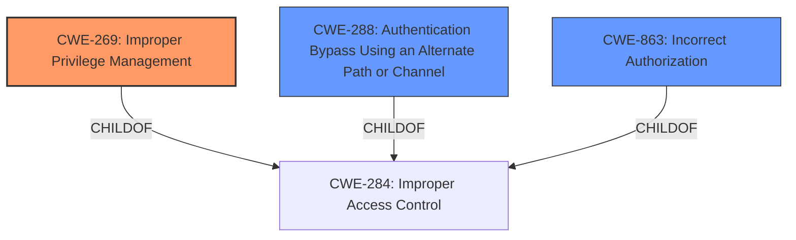

# Enhanced Analysis for CVE-2020-25722

# Summary
| CWE ID | CWE Name | Confidence | CWE Abstraction Level | CWE Vulnerability Mapping Label | CWE-Vulnerability Mapping Notes |
|---|---|---|---|---|---|
| CWE-269 | Improper Privilege Management | 0.9 | Class | Primary | Allowed-with-Review |
| CWE-288 | Authentication Bypass Using an Alternate Path or Channel | 0.7 | Base | Secondary | Allowed |
| CWE-863 | Incorrect Authorization | 0.7 | Class | Secondary | Allowed-with-Review |

## Evidence and Confidence

*   **Confidence Score:** 0.8
*   **Evidence Strength:** HIGH

## Relationship Analysis
The primary CWE selected is CWE-269, Improper Privilege Management, which is a Class-level CWE. The relationships considered were mainly parent-child. Specifically, the weakness involves incorrect management of privileges related to Active Directory objects and attributes, leading to potential domain compromise. Other CWEs considered were:
*   CWE-288 Authentication Bypass Using an Alternate Path or Channel, because alternate paths could be used to bypass authentication.
*   CWE-863 Incorrect Authorization, due to authorization checks being performed incorrectly.



## Vulnerability Chain
The vulnerability chain starts with **insufficient access and conformance checking**, leading to the ability to modify sensitive attributes and create user objects with non-unique names. This ultimately leads to **total domain compromise**. The chain includes:
1.  **Insufficient Access Control** (**ROOT CAUSE**)
2.  **Improper Privilege Management** (CWE-269)
3.  **Authentication Bypass** (CWE-288) or **Incorrect Authorization** (CWE-863)
4.  **Total Domain Compromise** (Impact)

## Summary of Analysis
The initial assessment focused on the **insufficient access and conformance checking** as the root cause. The evidence provided in the "CVE Reference Links Content Summary" section strongly supports this: "Insufficient access and conformance checking of data stored within the Samba Active Directory Domain Controller (AD DC)." The analysis also considered "Incorrect implementation of per-attribute and schema-based permission checks" and "Lack of proper protection for sensitive attributes."

The selection of CWE-269, Improper Privilege Management, is based on the finding that the vulnerability allows attackers to gain complete control over the Active Directory domain by manipulating attributes and creating objects. This aligns with the description of CWE-269, which involves **incorrect management of privileges** leading to unauthorized access or control.

CWE-288 and CWE-863 were considered as secondary CWEs because the **bypass of authentication** and **incorrect authorization** checks are contributing factors to the overall vulnerability. These weaknesses stem from the **improper privilege management**, but they are also distinct issues that contribute to the final impact.

The final CWE selection is at an appropriate level of specificity. CWE-269 accurately captures the root cause related to privilege management issues within the Samba AD DC implementation. The supporting CWEs highlight the specific mechanisms through which this improper privilege management is exploited.

Relevant CWE Information:

# Enhanced Context (25 CWEs)

## CWE-288: Authentication Bypass Using an Alternate Path or Channel
**Abstraction Level**: Base
**Similarity Score**: 0.77
**Source**: dense

**Description**:
The product requires authentication, but the product has an alternate path or channel that does not require authentication.

**Mapping Guidance**:
- Usage: Allowed
- Rationale: This CWE entry is at the Base level of abstraction, which is a preferred level of abstraction for mapping to the root causes of vulnerabilities.

## CWE-863: Incorrect Authorization
**Abstraction Level**: Class
**Similarity Score**: 5891.20
**Source**: sparse

**Description**:
The product performs an authorization check when an actor attempts to access a resource or perform an action, but it does not correctly perform the check.

**Mapping Guidance**:
- Usage: Allowed-with-Review
- Rationale: This CWE entry is a Class and might have Base-level children that would be more appropriate

## CWE-269: Improper Privilege Management
CWE-269 was not among the 25 CWEs. The description of this CWE is: The software does not properly manage privileges.
## CWE-269 Improper Privilege Management
### Technical Explanation:
The primary CWE is CWE-269, Improper Privilege Management. This is because the root cause of the vulnerability lies in the **improper management of privileges** within the Samba AD DC. The vulnerability description highlights the insufficient access and conformance checking, incorrect implementation of permission checks, and lack of protection for sensitive attributes. These issues directly relate to how privileges are managed and enforced within the system.

### Security Implications:
The security implication of **improper privilege management** is that attackers can gain unauthorized access to resources and perform actions that they should not be allowed to perform. In this case, the impact is severe, leading to total domain compromise.

### Relationships:
CWE-269 is a child of CWE-284, Improper Access Control. This relationship indicates that privilege management is a specific aspect of access control.

### Mapping Guidance:
The mapping guidance for CWE-269 indicates that it is a Class-level CWE and that more specific Base-level CWEs might be appropriate. However, in this case, CWE-269 accurately captures the essence of the vulnerability, which involves a broad range of privilege management issues.

### Secondary CWEs:
CWE-288 Authentication Bypass Using an Alternate Path or Channel is a secondary CWE because the **improper privilege management** could lead to attackers bypassing authentication checks through alternate paths.
CWE-863 Incorrect Authorization is another secondary CWE because the **incorrect implementation of permission checks** directly relates to **incorrect authorization**.


## CWE Relationship Analysis

Current CWEs represent these abstraction levels: .


### Vulnerability Chain Analysis

**Chain starting from CWE-288:**
- 288 (Authentication Bypass Using an Alternate Path or Channel) - ROOT


**Chain starting from CWE-269:**
- 269 (Improper Privilege Management) - ROOT


### CWE Relationship Diagram

```mermaid
graph TD
    classDef primary fill:#f96,stroke:#333,stroke-width:2px
    classDef secondary fill:#69f,stroke:#333
    classDef tertiary fill:#9e9,stroke:#333
```