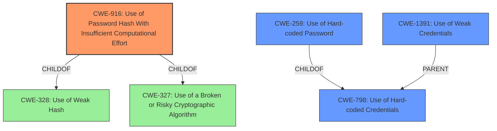

# Raw Analyzer Response for CVE-2020-25754

# Summary
| CWE ID | CWE Name | Confidence | CWE Abstraction Level | CWE Vulnerability Mapping Label | CWE-Vulnerability Mapping Notes |
|---|---|---|---|---|---|
| CWE-916 | Use of Password Hash With Insufficient Computational Effort | 0.9 | Base | Allowed | Primary CWE |
| CWE-798 | Use of Hard-coded Credentials | 0.7 | Base | Allowed | Secondary Candidate |
| CWE-259 | Use of Hard-coded Password | 0.6 | Variant | Allowed | Secondary Candidate |
| CWE-1391 | Use of Weak Credentials | 0.5 | Class | Allowed-with-Review | Secondary Candidate |

## Evidence and Confidence

*   **Confidence Score:** 0.8
*   **Evidence Strength:** HIGH

## Relationship Analysis
The primary CWE is CWE-916, which falls under the parent CWE-328 (Use of Weak Hash) and CWE-327 (Use of a Broken or Risky Cryptographic Algorithm). CWE-798 (Use of Hard-coded Credentials) is related as it can lead to weak authentication schemes. CWE-259 is a variant of CWE-798. CWE-1391 is a class that encompasses several ways credentials can be weak. The selection favors CWE-916 due to the explicit mention of MD5 hashing with insufficient computational effort, making it the most specific and relevant.

## Vulnerability Chain
The vulnerability chain starts with the **weak password** scheme utilizing an MD5 hash (CWE-916), derived from the username and serial number. The serial number's public availability exacerbates the weakness. This leads to an authentication bypass, granting unauthorized access to the Enphase Envoy devices.

## Summary of Analysis
The initial assessment pointed towards several CWEs, but a critical review of the evidence strongly supports CWE-916 as the primary weakness. The vulnerability description explicitly states, "This module uses a password derived from the MD5 hash of the username and serial number." The **weakness** here is the use of MD5, which is computationally inexpensive and thus easily crackable. While CWE-798 (Use of Hard-coded Credentials) and CWE-259 (Use of Hard-coded Password) are relevant, they don't fully capture the essence of the vulnerability. The MD5 hash introduces a layer of complexity that hardcoded credentials do not have by default. Therefore, CWE-916 is the most accurate and specific representation of the root cause. The other weakness is the ability for an **attacker** to get the serial number.

*   **CWE-916: Use of Password Hash With Insufficient Computational Effort**
    *   **Technical Explanation:** The vulnerability stems from using MD5 to hash passwords, a practice known to be weak due to the algorithm's susceptibility to cracking with modern computing power. The use of MD5, combined with a publicly available serial number, makes the password easily predictable.
    *   **Security Implications:** Attackers can bypass authentication by calculating the MD5 hash of the username and serial number, gaining unauthorized access to the device.
    *   **Relationship Analysis:** This is a Base-level CWE that falls under the broader categories of CWE-328 (Use of Weak Hash) and CWE-327 (Use of a Broken or Risky Cryptographic Algorithm).
    *   **Mapping Guidance:** Allowed, as it directly reflects the vulnerability's root cause.
*   **CWE-798: Use of Hard-coded Credentials**
    *   **Technical Explanation:** While not strictly hardcoded, the password generation method using MD5 makes the password predictable, functioning similarly to a hardcoded password.
    *   **Security Implications:** Enables unauthorized access, data manipulation, and potential botnet inclusion.
    *   **Relationship Analysis:** A Base-level CWE, which is a parent of CWE-259.
    *   **Mapping Guidance:** Allowed, but less specific than CWE-916.
*   **CWE-259: Use of Hard-coded Password**
    *   **Technical Explanation:** The password is not literally hardcoded, but it's derived from predictable data, making it functionally equivalent.
    *   **Security Implications:** Attackers can easily determine the password, bypassing authentication.
    *   **Relationship Analysis:** A Variant of CWE-798.
    *   **Mapping Guidance:** Allowed, but less specific than CWE-916.
*   **CWE-1391: Use of Weak Credentials**
    *   **Technical Explanation:** Encompasses the general issue of weak credentials, but doesn't pinpoint the exact weakness.
    *   **Security Implications:** Leads to unauthorized access and potential system compromise.
    *   **Relationship Analysis:** Class-level CWE, a parent of several more specific CWEs.
    *   **Mapping Guidance:** Allowed-with-Review, but a more specific CWE should be preferred.

CWEs Considered But Not Used:

*   **CWE-328: Use of Weak Hash:** While related, CWE-916 is more specific in pinpointing the insufficient computational effort.
*   **CWE-327: Use of a Broken or Risky Cryptographic Algorithm:** This is a broader category; CWE-916 is more precise.

The final selection of CWE-916 is at the optimal level of specificity, accurately representing the root cause of the vulnerability as described in the provided evidence.