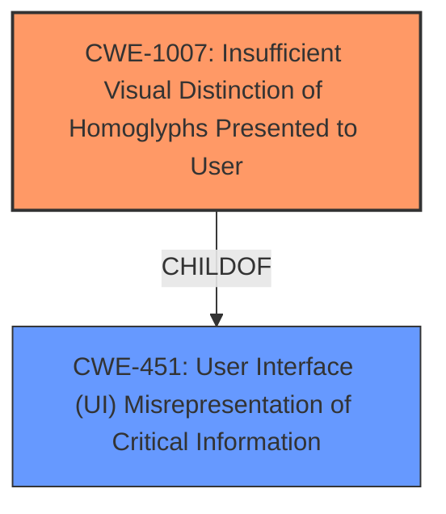

# Analysis for CVE-2020-25779

# Summary
| CWE ID    | CWE Name                                                       | Confidence | CWE Abstraction Level | CWE Vulnerability Mapping Label | CWE-Vulnerability Mapping Notes |
| :--------- | :------------------------------------------------------------- | :--------- | :---------------------- | :------------------------------ | :------------------------------ |
| CWE-1007  | Insufficient Visual Distinction of Homoglyphs Presented to User | 0.9        | Base                    | Primary CWE                     | Allowed                       |

## Evidence and Confidence

*   **Confidence Score:** 0.9
*   **Evidence Strength:** HIGH

## Relationship Analysis

The primary relationship influencing the choice of CWE-1007 is its direct relevance to the vulnerability description, which explicitly mentions an Internationalized Domain Name homograph attack (Puny-code). CWE-1007 focuses on the visual similarity of glyphs, which is the core issue in this vulnerability. The Retriever Results also list CWE-1007 as the top combined result, further supporting this selection. CWE-1007 is a child of CWE-451.

## Vulnerability Chain

The vulnerability chain starts with the attacker's use of Punycode to create a homograph. This leads to the Trend Micro Antivirus software **incorrectly identifying** the malicious domain as legitimate due to **insufficient visual distinction** (CWE-1007). The software then adds the malicious website to the approved list, bypassing the web threat protection feature. The final impact is that the attacker can bypass web threat protection.

## Summary of Analysis

The initial analysis focused on identifying the root cause of the vulnerability, which is the **insufficient visual distinction of homoglyphs** leading to the bypass of web threat protection. The supporting evidence is the vulnerability description, which explicitly mentions the use of a Internationalized Domain Name homograph attack (Puny-code) to bypass the web threat protection feature. The "CVE Reference Links Content Summary" section states the root cause of vulnerability is "An Internationalized Domain Name (IDN) homograph attack, using Punycode, could be used to bypass the web threat protection feature in Trend Micro Antivirus for Mac 2020 (Consumer)."

The selection of CWE-1007 is based on its direct relevance to the vulnerability description and its presence as the top combined result in the Retriever Results. Other CWEs were considered but deemed less relevant. For instance, CWE-250 (Execution with Unnecessary Privileges) was considered but rejected as the vulnerability is not directly related to the execution of code with unnecessary privileges. Similarly, CWE-59 (Improper Link Resolution Before File Access ('Link Following')) was deemed less relevant as the attack does not involve link following.

The chosen CWE is at the optimal level of specificity, as it directly addresses the root cause of the vulnerability: the insufficient visual distinction of homoglyphs.