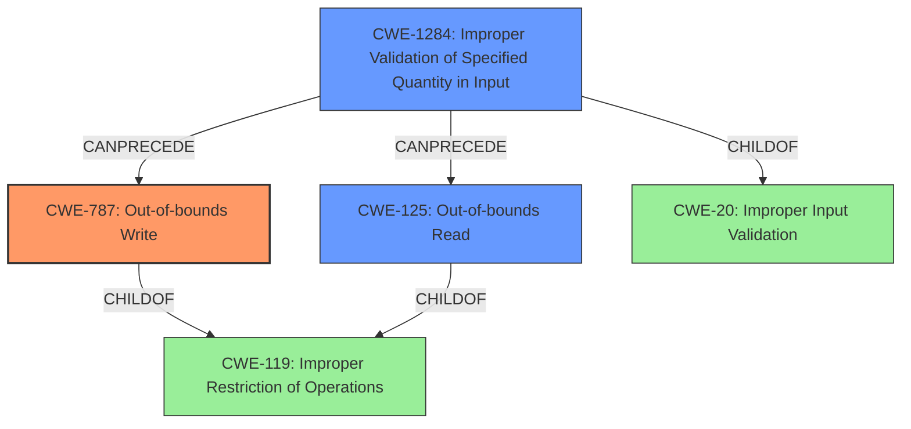

# Raw Analyzer Response for CVE-2020-25928

# Summary
| CWE ID | CWE Name | Confidence | CWE Abstraction Level | CWE Vulnerability Mapping Label | CWE-Vulnerability Mapping Notes |
|---|---|---|---|---|---|
| CWE-787 | Out-of-bounds Write | 1.0 | Base | Allowed | Primary CWE. The **out-of-bounds write** is the root cause. |
| CWE-125 | Out-of-bounds Read | 0.8 | Base | Allowed | Secondary CWE. The description mentions **out-of-bounds read**, but the primary issue leads to a write. |
| CWE-1284 | Improper Validation of Specified Quantity in Input | 0.6 | Base | Allowed | The DNS response data length field is not validated. |

## Evidence and Confidence

*   **Confidence Score:** 0.9
*   **Evidence Strength:** HIGH

## Relationship Analysis
The primary weakness is CWE-787, **Out-of-bounds Write**, which occurs because the software **does not check the response data length field**, enabling a write beyond the allocated buffer. CWE-125, **Out-of-bounds Read**, is a related issue that could also occur, but the primary evidence supports writing outside buffer boundaries. CWE-1284, **Improper Validation of Specified Quantity in Input**, highlights the lack of validation of the DNS response data length, which leads to the **out-of-bounds write**.

## Vulnerability Chain
1.  **Improper Validation of Input:** The software **fails to validate the DNS response data length field** (CWE-1284).
2.  **Out-of-bounds Write:** This lack of validation allows the software to write data past the end of the intended buffer (CWE-787).
3.  **Out-of-bounds Read:** This lack of validation allows the software to read data past the end of the intended buffer (CWE-125).
4.  **Impact:** This can lead to remote code execution, denial of service, or information leak.

## Summary of Analysis
The initial assessment identified **out-of-bounds write** (CWE-787) as the primary weakness because the vulnerability description and the CVE Reference Links Content Summary both emphasize the lack of validation leading to potential memory corruption through writing beyond buffer limits. The graph relationships confirm that the **improper input validation** (CWE-1284) can precede the **out-of-bounds write** (CWE-787).

The vulnerability description states: "The code **does not check the response data length field** of individual DNS answers, which may cause **out-of-bounds read/write operations**, leading to Information leak, Denial-or-Service, or Remote Code Execution, depending on the context." The CVE Reference Links Content Summary provides more detail: "The vulnerability lies in the NicheStack's DNSv4 response parsing routine. Specifically, the code **does not validate the "response data length" field** of individual DNS answers... **Out-of-bounds Read/Write (OOB-R/W):** The lack of proper validation allows the parsing routine to read or write beyond the allocated memory bounds, potentially causing a crash, information disclosure, or remote code execution."

The selected CWEs are at the optimal level of specificity because they directly address the root cause (**out-of-bounds write** due to **missing input validation**) and potential consequence (**out-of-bounds read**).

Relevant CWE Information:

# Enhanced Context (25 CWEs)

## CWE-1289: Improper Validation of Unsafe Equivalence in Input
Not selected because the vulnerability is not about validating the equivalence of an input to an unsafe value. The primary issue is the lack of length validation on a DNS response field.

## CWE-297: Improper Validation of Certificate with Host Mismatch
Not selected because the vulnerability does not involve certificate validation or host mismatch. It's related to DNS response parsing and buffer overflows.

## CWE-191: Integer Underflow (Wrap or Wraparound)
Not selected because the vulnerability is not directly caused by integer underflow. While an integer overflow/underflow could hypothetically occur during length calculations, it is not the primary weakness described.

## CWE-125: Out-of-bounds Read
Selected as a secondary CWE. While the primary issue is the **out-of-bounds write**, the vulnerability description mentions that **out-of-bounds read operations** may occur as well due to the same root cause (lack of validation of DNS answer length).

## CWE-193: Off-by-one Error
Not selected because the vulnerability is not specifically an off-by-one error. The lack of validation is more general than a simple off-by-one calculation error.

## CWE-74: Improper Neutralization of Special Elements in Output Used by a Downstream Component ('Injection')
Not selected because the vulnerability does not involve injection.

## CWE-131: Incorrect Calculation of Buffer Size
Not selected because the root cause is not the incorrect calculation of a buffer size. The code does not check the size field, leading to an overflow, rather than incorrectly calculating the size.

## CWE-617: Reachable Assertion
Not selected because there's no mention of assertions in the vulnerability description.

## CWE-129: Improper Validation of Array Index
Not selected because the vulnerability is related to DNS data length not array indices.

## CWE-941: Incorrectly Specified Destination in a Communication Channel
Not selected because it is not related to specifying an incorrect destination.

## CWE-190: Integer Overflow or Wraparound
Not selected because, while an integer overflow could hypothetically occur in calculating buffer sizes based on the length field, it is not the main vulnerability.

## CWE-1284: Improper Validation of Specified Quantity in Input
Selected as a secondary CWE. The vulnerability lies in the NicheStack's DNSv4 response parsing routine, and specifically, the code **does not validate the "response data length" field** of individual DNS answers.

## CWE-119: Improper Restriction of Operations within the Bounds of a Memory Buffer
Not selected because this is too high-level. CWE-787 and CWE-125 are more specific and more accurately describe the vulnerability.

## CWE-825: Expired Pointer Dereference
Not selected because the vulnerability does not involve expired pointers.

## CWE-787: Out-of-bounds Write
Selected as the primary CWE. The vulnerability description explicitly mentions **out-of-bounds write operations**. The CVE Reference Links Content Summary reinforces this: "The lack of proper validation allows the parsing routine to ... write beyond the allocated memory bounds."

## CWE-170: Improper Null Termination
Not selected because the vulnerability does not involve null termination issues.

## CWE-22: Improper Limitation of a Pathname to a Restricted Directory ('Path Traversal')
Not selected because the vulnerability does not involve path traversal.

## CWE-770: Allocation of Resources Without Limits or Throttling
Not selected because the vulnerability does not involve resource allocation without limits or throttling.

## CWE-73: External Control of File Name or Path
Not selected because the vulnerability does not involve external control of file names or paths.

## CWE-681: Incorrect Conversion between Numeric Types
Not selected because the vulnerability does not involve incorrect conversion between numeric types.

## CWE-476: NULL Pointer Dereference
Not selected because the vulnerability does not involve null pointer dereferences.

## CWE-346: Origin Validation Error
Not selected because the vulnerability is not about origin validation.