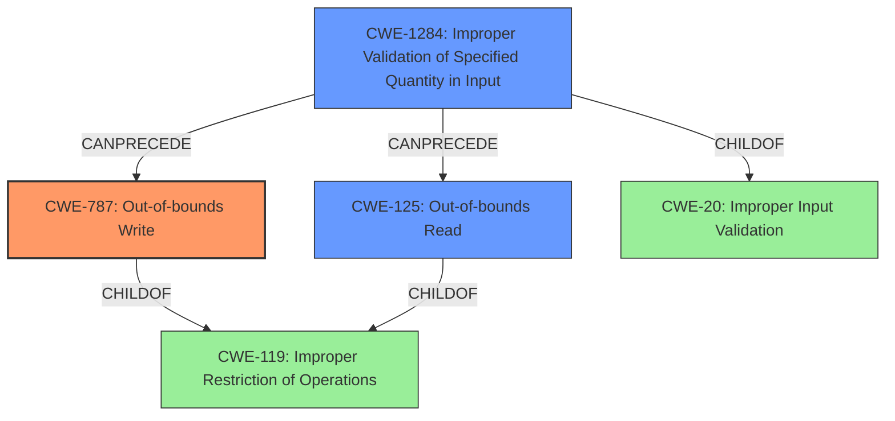

# Analysis for CVE-2020-25928

# Summary
| CWE ID | CWE Name | Confidence | CWE Abstraction Level | CWE Vulnerability Mapping Label | CWE-Vulnerability Mapping Notes |
|---|---|---|---|---|---|
| CWE-787 | Out-of-bounds Write | 1.0 | Base | Allowed | Primary CWE. The **out-of-bounds write** is the root cause. |
| CWE-125 | Out-of-bounds Read | 0.8 | Base | Allowed | Secondary CWE. The description mentions **out-of-bounds read**, but the primary issue leads to a write. |
| CWE-1284 | Improper Validation of Specified Quantity in Input | 0.6 | Base | Allowed | The DNS response data length field is not validated. |

## Evidence and Confidence

*   **Confidence Score:** 0.9
*   **Evidence Strength:** HIGH

## Relationship Analysis
The primary weakness is CWE-787, **Out-of-bounds Write**, which occurs because the software **does not check the response data length field**, enabling a write beyond the allocated buffer. CWE-125, **Out-of-bounds Read**, is a related issue that could also occur, but the primary evidence supports writing outside buffer boundaries. CWE-1284, **Improper Validation of Specified Quantity in Input**, highlights the lack of validation of the DNS response data length, which leads to the **out-of-bounds write**.

## Vulnerability Chain
1.  **Improper Validation of Input:** The software **fails to validate the DNS response data length field** (CWE-1284).
2.  **Out-of-bounds Write:** This lack of validation allows the software to write data past the end of the intended buffer (CWE-787).
3.  **Out-of-bounds Read:** This lack of validation allows the software to read data past the end of the intended buffer (CWE-125).
4.  **Impact:** This can lead to remote code execution, denial of service, or information leak.

## Summary of Analysis
The initial assessment identified **out-of-bounds write** (CWE-787) as the primary weakness because the vulnerability description and the CVE Reference Links Content Summary both emphasize the lack of validation leading to potential memory corruption through writing beyond buffer limits. The graph relationships confirm that the **improper input validation** (CWE-1284) can precede the **out-of-bounds write** (CWE-787).

The vulnerability description states: "The code **does not check the response data length field** of individual DNS answers, which may cause **out-of-bounds read/write operations**, leading to Information leak, Denial-or-Service, or Remote Code Execution, depending on the context." The CVE Reference Links Content Summary provides more detail: "The vulnerability lies in the NicheStack's DNSv4 response parsing routine. Specifically, the code **does not validate the "response data length" field** of individual DNS answers... **Out-of-bounds Read/Write (OOB-R/W):** The lack of proper validation allows the parsing routine to read or write beyond the allocated memory bounds, potentially causing a crash, information disclosure, or remote code execution."

The selected CWEs are at the optimal level of specificity because they directly address the root cause (**out-of-bounds write** due to **missing input validation**) and potential consequence (**out-of-bounds read**).

Relevant CWE Information:

# Enhanced Context (25 CWEs)

## CWE-1289: Improper Validation of Unsafe Equivalence in Input
Not selected because the vulnerability is not about validating the equivalence of an input to an unsafe value. The primary issue is the lack of length validation on a DNS response field.

## CWE-297: Improper Validation of Certificate with Host Mismatch
Not selected because the vulnerability does not involve certificate validation or host mismatch. It's related to DNS response parsing and buffer overflows.

## CWE-191: Integer Underflow (Wrap or Wraparound)
Not selected because the vulnerability is not directly caused by integer underflow. While an integer overflow/underflow could hypothetically occur during length calculations, it is not the primary weakness described.

## CWE-125: Out-of-bounds Read
Selected as a secondary CWE. While the primary issue is the **out-of-bounds write**, the vulnerability description mentions that **out-of-bounds read operations** may occur as well due to the same root cause (lack of validation of DNS answer length).

## CWE-193: Off-by-one Error
Not selected because the vulnerability is not specifically an off-by-one error. The lack of validation is more general than a simple off-by-one calculation error.

## CWE-74: Improper Neutralization of Special Elements in Output Used by a Downstream Component ('Injection')
Not selected because the vulnerability does not involve injection.

## CWE-131: Incorrect Calculation of Buffer Size
Not selected because the root cause is not the incorrect calculation of a buffer size. The code does not check the size field, leading to an overflow, rather than incorrectly calculating the size.

## CWE-617: Reachable Assertion
Not selected because there's no mention of assertions in the vulnerability description.

## CWE-129: Improper Validation of Array Index
Not selected because the vulnerability is related to DNS data length not array indices.

## CWE-941: Incorrectly Specified Destination in a Communication Channel
Not selected because it is not related to specifying an incorrect destination.

## CWE-190: Integer Overflow or Wraparound
Not selected because, while an integer overflow could hypothetically occur in calculating buffer sizes based on the length field, it is not the main vulnerability.

## CWE-1284: Improper Validation of Specified Quantity in Input
Selected as a secondary CWE. The vulnerability lies in the NicheStack's DNSv4 response parsing routine, and specifically, the code **does not validate the "response data length" field** of individual DNS answers.

## CWE-119: Improper Restriction of Operations within the Bounds of a Memory Buffer
Not selected because this is too high-level. CWE-787 and CWE-125 are more specific and more accurately describe the vulnerability.

## CWE-825: Expired Pointer Dereference
Not selected because the vulnerability does not involve expired pointers.

## CWE-787: Out-of-bounds Write
Selected as the primary CWE. The vulnerability description explicitly mentions **out-of-bounds write operations**. The CVE Reference Links Content Summary reinforces this: "The lack of proper validation allows the parsing routine to ... write beyond the allocated memory bounds."

## CWE-170: Improper Null Termination
Not selected because the vulnerability does not involve null termination issues.

## CWE-22: Improper Limitation of a Pathname to a Restricted Directory ('Path Traversal')
Not selected because the vulnerability does not involve path traversal.

## CWE-770: Allocation of Resources Without Limits or Throttling
Not selected because the vulnerability does not involve resource allocation without limits or throttling.

## CWE-73: External Control of File Name or Path
Not selected because the vulnerability does not involve external control of file names or paths.

## CWE-681: Incorrect Conversion between Numeric Types
Not selected because the vulnerability does not involve incorrect conversion between numeric types.

## CWE-476: NULL Pointer Dereference
Not selected because the vulnerability does not involve null pointer dereferences.

## CWE-346: Origin Validation Error
Not selected because the vulnerability is not about origin validation.

# Enhanced Query for CVE-2020-25928

## Vulnerability Description
The DNS feature in InterNiche NicheStack TCP/IP 4.0.1 is affected by Buffer Overflow. The impact is execute arbitrary code (remote). The component is DNS response processing functions dns_upcall(), getoffset(), dnc_set_answer(). The attack vector is a specific DNS response packet. The code does not check the response data length field of individual DNS answers, which may cause **out-of-bounds read/write operations**, leading to Information leak, Denial-or-Service, or Remote Code Execution, depending on the context.

### Vulnerability Description Key Phrases
- **weakness:** **out-of-bounds read/write operations**
- **impact:** execute arbitrary code
- **vector:** specific DNS response packet
- **product:** InterNiche NicheStack TCP/IP
- **version:** 4.0.1
- **component:** DNS response processing functions dns_upcall(), getoffset(), dnc_set_answer()

## CVE Reference Links Content Summary
Based on the provided content, here's a breakdown of the vulnerability information related to CVE-2020-25928:

**Root Cause of Vulnerability:**

*   The vulnerability lies in the NicheStack's DNSv4 response parsing routine. Specifically, the code does not validate the "response data length" field of individual DNS answers.

**Weaknesses/Vulnerabilities Present:**

*   **Out-of-bounds Read/Write (OOB-R/W):** The lack of proper validation allows the parsing routine to read or write beyond the allocated memory bounds, potentially causing a crash, information disclosure, or remote code execution.

**Impact of Exploitation:**

*   **Remote Code Execution (RCE):**  Successful exploitation of this vulnerability can lead to remote code execution on the affected device.

**Attack Vectors:**

*   **Network-based:** The vulnerability can be exploited remotely by sending a specially crafted DNS response to a device using the vulnerable NicheStack.

**Required Attacker Capabilities/Position:**

*   **Network Access:** The attacker needs to be able to send network traffic to the target device, usually by being on the same network or having some routing capabilities to the target network.
*   **DNS Spoofing:** To trigger the vulnerability, the attacker needs to be able to inject or alter the DNS response received by the target device.  This could involve a man-in-the-middle attack or by poisoning the DNS cache of a device.

**Additional Information:**

*   The vulnerability is part of a set of 14 vulnerabilities collectively called "INFRA:HALT" affecting the NicheStack TCP/IP stack.
*   The vulnerable code is in the DNSv4 client component of the stack.
*   All versions of NicheStack before version 4.3 (including NicheLite) are affected.
*   A video demonstration of the exploit is available.
*   The Forescout blog and CERT vulnerability note include mitigation recommendations.
*   Forescout has released tools for detecting vulnerable devices and for detecting exploitation attempts.
*   The vulnerability is rated as critical with a CVSSv3.1 score of 9.8.

The provided content offers significantly more detail than the typical CVE description, explaining the vulnerability's impact, attack vectors, and offering mitigation strategies, as well as linking to research and vendor advisories.

## Retriever Results

### Top Combined Results

| Rank | CWE ID | Name | Abstraction | Usage  | Retrievers | Individual Scores |
|------|--------|------|-------------|-------|------------|-------------------|
| 1 | 125 | Out-of-bounds Read | Base | Allowed | sparse | 0.556 |
| 2 | 1284 | Improper Validation of Specified Quantity in Input | Base | Allowed | sparse | 0.442 |
| 3 | 119 | Improper Restriction of Operations within the Bounds of a Memory Buffer | Class | Discouraged | sparse | 0.433 |
| 4 | 20 | Improper Input Validation | Class | Discouraged | sparse | 0.431 |
| 5 | 787 | Out-of-bounds Write | Base | Allowed | sparse | 0.428 |
| 6 | 350 | Reliance on Reverse DNS Resolution for a Security-Critical Action | Variant | Allowed | dense | 0.570 |
| 7 | 825 | Expired Pointer Dereference | Base | Allowed | graph | 0.003 |
| 8 | 122 | Heap-based Buffer Overflow | Variant | Allowed | sparse | 0.422 |
| 9 | 190 | Integer Overflow or Wraparound | Base | Allowed | sparse | 0.422 |
| 10 | 346 | Origin Validation Error | Class | Allowed-with-Review | sparse | 0.421 |

# Complete CWE Specifications

## CWE-125: Out-of-bounds Read
**Abstraction:** Base
**Status:** Draft

### Description
The product reads data past the end, or before the beginning, of the intended buffer.

### Extended Description
Not provided

### Alternative Terms
OOB read: Shorthand for "Out of bounds" read

### Relationships
ChildOf -> CWE-119
ChildOf -> CWE-119
ChildOf -> CWE-119
ChildOf -> CWE-119

### Mapping Guidance
**Usage:** Allowed
**Rationale:** This CWE entry is at the Base level of abstraction, which is a preferred level of abstraction for mapping to the root causes of vulnerabilities.
**Comments:** Carefully read both the name and description to ensure that this mapping is an appropriate fit. Do not try to 'force' a mapping to a lower-level Base/Variant simply to comply with this preferred level of abstraction.
**Reasons:**
- Acceptable-Use

### Observed Examples
- **CVE-2023-1018:** The reference implementation code for a Trusted Platform Module does not implement length checks on data, allowing for an attacker to read 2 bytes past the end of a buffer.
- **CVE-2020-11899:** Out-of-bounds read in IP stack used in embedded systems, as exploited in the wild per CISA KEV.
- **CVE-2014-0160:** Chain: "Heartbleed" bug receives an inconsistent length parameter (CWE-130) enabling an out-of-bounds read (CWE-126), returning memory that could include private cryptographic keys and other sensitive data.

## CWE-1284: Improper Validation of Specified Quantity in Input
**Abstraction:** Base
**Status:** Incomplete

### Description
The product receives input that is expected to specify a quantity (such as size or length), but it does not validate or incorrectly validates that the quantity has the required properties.

### Extended Description

Specified quantities include size, length, frequency, price, rate, number of operations, time, and others. Code may rely on specified quantities to allocate resources, perform calculations, control iteration, etc. When the quantity is not properly validated, then attackers can specify malicious quantities to cause excessive resource allocation, trigger unexpected failures, enable buffer overflows, etc.

### Alternative Terms
None

### Relationships
ChildOf -> CWE-20
ChildOf -> CWE-20
CanPrecede -> CWE-789

### Mapping Guidance
**Usage:** Allowed
**Rationale:** This CWE entry is at the Base level of abstraction, which is a preferred level of abstraction for mapping to the root causes of vulnerabilities.
**Comments:** Carefully read both the name and description to ensure that this mapping is an appropriate fit. Do not try to 'force' a mapping to a lower-level Base/Variant simply to comply with this preferred level of abstraction.
**Reasons:**
- Acceptable-Use

### Additional Notes
**[Maintenance]** This entry is still under development and will continue to see updates and content improvements.

### Observed Examples
- **CVE-2022-21668:** Chain: Python library does not limit the resources used to process images that specify a very large number of bands (CWE-1284), leading to excessive memory consumption (CWE-789) or an integer overflow (CWE-190).
- **CVE-2008-1440:** lack of validation of length field leads to infinite loop
- **CVE-2008-2374:** lack of validation of string length fields allows memory consumption or buffer over-read

## CWE-119: Improper Restriction of Operations within the Bounds of a Memory Buffer
**Abstraction:** Class
**Status:** Stable

### Description
The product performs operations on a memory buffer, but it reads from or writes to a memory location outside the buffer's intended boundary. This may result in read or write operations on unexpected memory locations that could be linked to other variables, data structures, or internal program data.

### Extended Description
Not provided

### Alternative Terms
Buffer Overflow: This term has many different meanings to different audiences. From a CWE mapping perspective, this term should be avoided where possible. Some researchers, developers, and tools intend for it to mean "write past the end of a buffer," whereas others use the same term to mean "any read or write outside the boundaries of a buffer, whether before the beginning of the buffer or after the end of the buffer." Others could mean "any action after the end of a buffer, whether it is a read or write." Since the term is commonly used for exploitation and for vulnerabilities, it further confuses things.
buffer overrun: Some prominent vendors and researchers use the term "buffer overrun," but most people use "buffer overflow." See the alternate term for "buffer overflow" for context.
memory safety: Generally used for techniques that avoid weaknesses related to memory access, such as those identified by CWE-119 and its descendants. However, the term is not formal, and there is likely disagreement between practitioners as to which weaknesses are implicitly covered by the "memory safety" term.

### Relationships
ChildOf -> CWE-118
ChildOf -> CWE-20

### Mapping Guidance
**Usage:** Discouraged
**Rationale:** CWE-119 is commonly misused in low-information vulnerability reports when lower-level CWEs could be used instead, or when more details about the vulnerability are available.
**Comments:** Look at CWE-119's children and consider mapping to CWEs such as CWE-787: Out-of-bounds Write, CWE-125: Out-of-bounds Read, or others.
**Reasons:**
- Frequent Misuse

### Additional Notes
**[Applicable Platform]** 

It is possible in any programming languages without memory management support to attempt an operation outside of the bounds of a memory buffer, but the consequences will vary widely depending on the language, platform, and chip architecture.

### Observed Examples
- **CVE-2021-22991:** Incorrect URI normalization in application traffic product leads to buffer overflow, as exploited in the wild per CISA KEV.
- **CVE-2020-29557:** Buffer overflow in Wi-Fi router web interface, as exploited in the wild per CISA KEV.
- **CVE-2009-2550:** Classic stack-based buffer overflow in media player using a long entry in a playlist

## CWE-20: Improper Input Validation
**Abstraction:** Class
**Status:** Stable

### Description
The product receives input or data, but it does
        not validate or incorrectly validates that the input has the
        properties that are required to process the data safely and
        correctly.

### Extended Description

Input validation is a frequently-used technique for checking potentially dangerous inputs in order to ensure that the inputs are safe for processing within the code, or when communicating with other components. When software does not validate input properly, an attacker is able to craft the input in a form that is not expected by the rest of the application. This will lead to parts of the system receiving unintended input, which may result in altered control flow, arbitrary control of a resource, or arbitrary code execution.

Input validation is not the only technique for processing input, however. Other techniques attempt to transform potentially-dangerous input into something safe, such as filtering (CWE-790) - which attempts to remove dangerous inputs - or encoding/escaping (CWE-116), which attempts to ensure that the input is not misinterpreted when it is included in output to another component. Other techniques exist as well (see CWE-138 for more examples.)

Input validation can be applied to:

  - raw data - strings, numbers, parameters, file contents, etc.

  - metadata - information about the raw data, such as headers or size

Data can be simple or structured. Structured data can be composed of many nested layers, composed of combinations of metadata and raw data, with other simple or structured data.

Many properties of raw data or metadata may need to be validated upon entry into the code, such as:

  - specified quantities such as size, length, frequency, price, rate, number of operations, time, etc.

  - implied or derived quantities, such as the actual size of a file instead of a specified size

  - indexes, offsets, or positions into more complex data structures

  - symbolic keys or other elements into hash tables, associative arrays, etc.

  - well-formedness, i.e. syntactic correctness - compliance with expected syntax 

  - lexical token correctness - compliance with rules for what is treated as a token

  - specified or derived type - the actual type of the input (or what the input appears to be)

  - consistency - between individual data elements, between raw data and metadata, between references, etc.

  - conformance to domain-specific rules, e.g. business logic 

  - equivalence - ensuring that equivalent inputs are treated the same

  - authenticity, ownership, or other attestations about the input, e.g. a cryptographic signature to prove the source of the data

Implied or derived properties of data must often be calculated or inferred by the code itself. Errors in deriving properties may be considered a contributing factor to improper input validation. 

Note that "input validation" has very different meanings to different people, or within different classification schemes. Caution must be used when referencing this CWE entry or mapping to it. For example, some weaknesses might involve inadvertently giving control to an attacker over an input when they should not be able to provide an input at all, but sometimes this is referred to as input validation.

Finally, it is important to emphasize that the distinctions between input validation and output escaping are often blurred, and developers must be careful to understand the difference, including how input validation is not always sufficient to prevent vulnerabilities, especially when less stringent data types must be supported, such as free-form text. Consider a SQL injection scenario in which a person's last name is inserted into a query. The name "O'Reilly" would likely pass the validation step since it is a common last name in the English language. However, this valid name cannot be directly inserted into the database because it contains the "'" apostrophe character, which would need to be escaped or otherwise transformed. In this case, removing the apostrophe might reduce the risk of SQL injection, but it would produce incorrect behavior because the wrong name would be recorded.

### Alternative Terms
None

### Relationships
ChildOf -> CWE-707
PeerOf -> CWE-345
CanPrecede -> CWE-22
CanPrecede -> CWE-41
CanPrecede -> CWE-74
CanPrecede -> CWE-119
CanPrecede -> CWE-770

### Mapping Guidance
**Usage:** Discouraged
**Rationale:** CWE-20 is commonly misused in low-information vulnerability reports when lower-level CWEs could be used instead, or when more details about the vulnerability are available [REF-1287]. It is not useful for trend analysis. It is also a level-1 Class (i.e., a child of a Pillar).
**Comments:** Consider lower-level children such as Improper Use of Validation Framework (CWE-1173) or improper validation involving specific types or properties of input such as Specified Quantity (CWE-1284); Specified Index, Position, or Offset (CWE-1285); Syntactic Correctness (CWE-1286); Specified Type (CWE-1287); Consistency within Input (CWE-1288); or Unsafe Equivalence (CWE-1289).
**Reasons:**
- Frequent Misuse
**Suggested Alternatives:**
- CWE-1284: Specified Quantity
- CWE-1285: Specified Index, Position, or Offset
- CWE-1286: Syntactic Correctness
- CWE-1287: Specified Type
- CWE-1288: Consistency within Input
- CWE-1289: Unsafe Equivalence
- CWE-116: Improper Encoding or Escaping of Output

### Additional Notes
**[Relationship]** 

CWE-116 and CWE-20 have a close association because, depending on the nature of the structured message, proper input validation can indirectly prevent special characters from changing the meaning of a structured message. For example, by validating that a numeric ID field should only contain the 0-9 characters, the programmer effectively prevents injection attacks.

**[Maintenance]** As of 2020, this entry is used more often than preferred, and it is a source of frequent confusion. It is being actively modified for CWE 4.1 and subsequent versions.

**[Maintenance]** Concepts such as validation, data transformation, and neutralization are being refined, so relationships between CWE-20 and other entries such as CWE-707 may change in future versions, along with an update to the Vulnerability Theory document.

**[Maintenance]** Input validation - whether missing or incorrect - is such an essential and widespread part of secure development that it is implicit in many different weaknesses. Traditionally, problems such as buffer overflows and XSS have been classified as input validation problems by many security professionals. However, input validation is not necessarily the only protection mechanism available for avoiding such problems, and in some cases it is not even sufficient. The CWE team has begun capturing these subtleties in chains within the Research Concepts view (CWE-1000), but more work is needed.

**[Terminology]** 

The "input validation" term is extremely common, but it is used in many different ways. In some cases its usage can obscure the real underlying weakness or otherwise hide chaining and composite relationships.

Some people use "input validation" as a general term that covers many different neutralization techniques for ensuring that input is appropriate, such as filtering, canonicalization, and escaping. Others use the term in a more narrow context to simply mean "checking if an input conforms to expectations without changing it." CWE uses this more narrow interpretation.

### Observed Examples
- **CVE-2024-37032:** Large language model (LLM) management tool does not validate the format of a digest value (CWE-1287) from a private, untrusted model registry, enabling relative path traversal (CWE-23), a.k.a. Probllama
- **CVE-2022-45918:** Chain: a learning management tool debugger uses external input to locate previous session logs (CWE-73) and does not properly validate the given path (CWE-20), allowing for filesystem path traversal using "../" sequences (CWE-24)
- **CVE-2021-30860:** Chain: improper input validation (CWE-20) leads to integer overflow (CWE-190) in mobile OS, as exploited in the wild per CISA KEV.

## CWE-787: Out-of-bounds Write
**Abstraction:** Base
**Status:** Draft

### Description
The product writes data past the end, or before the beginning, of the intended buffer.

### Extended Description
Not provided

### Alternative Terms
Memory Corruption: Often used to describe the consequences of writing to memory outside the bounds of a buffer, or to memory that is otherwise invalid.

### Relationships
ChildOf -> CWE-119
ChildOf -> CWE-119
ChildOf -> CWE-119
ChildOf -> CWE-119

### Mapping Guidance
**Usage:** Allowed
**Rationale:** This CWE entry is at the Base level of abstraction, which is a preferred level of abstraction for mapping to the root causes of vulnerabilities.
**Comments:** Carefully read both the name and description to ensure that this mapping is an appropriate fit. Do not try to 'force' a mapping to a lower-level Base/Variant simply to comply with this preferred level of abstraction.
**Reasons:**
- Acceptable-Use

### Observed Examples
- **CVE-2023-1017:** The reference implementation code for a Trusted Platform Module does not implement length checks on data, allowing for an attacker to write 2 bytes past the end of a buffer.
- **CVE-2021-21220:** Chain: insufficient input validation (CWE-20) in browser allows heap corruption (CWE-787), as exploited in the wild per CISA KEV.
- **CVE-2021-28664:** GPU kernel driver allows memory corruption because a user can obtain read/write access to read-only pages, as exploited in the wild per CISA KEV.

## CWE-350: Reliance on Reverse DNS Resolution for a Security-Critical Action
**Abstraction:** Variant
**Status:** Draft

### Description
The product performs reverse DNS resolution on an IP address to obtain the hostname and make a security decision, but it does not properly ensure that the IP address is truly associated with the hostname.

### Extended Description

Since DNS names can be easily spoofed or misreported, and it may be difficult for the product to detect if a trusted DNS server has been compromised, DNS names do not constitute a valid authentication mechanism.

When the product performs a reverse DNS resolution for an IP address, if an attacker controls the DNS server for that IP address, then the attacker can cause the server to return an arbitrary hostname. As a result, the attacker may be able to bypass authentication, cause the wrong hostname to be recorded in log files to hide activities, or perform other attacks.

Attackers can spoof DNS names by either (1) compromising a DNS server and modifying its records (sometimes called DNS cache poisoning), or (2) having legitimate control over a DNS server associated with their IP address.

### Alternative Terms
None

### Relationships
ChildOf -> CWE-290
ChildOf -> CWE-807
CanPrecede -> CWE-923

### Mapping Guidance
**Usage:** Allowed
**Rationale:** This CWE entry is at the Variant level of abstraction, which is a preferred level of abstraction for mapping to the root causes of vulnerabilities.
**Comments:** Carefully read both the name and description to ensure that this mapping is an appropriate fit. Do not try to 'force' a mapping to a lower-level Base/Variant simply to comply with this preferred level of abstraction.
**Reasons:**
- Acceptable-Use

### Additional Notes
**[Maintenance]** CWE-350, CWE-247, and CWE-292 were merged into CWE-350 in CWE 2.5. CWE-247 was originally derived from Seven Pernicious Kingdoms, CWE-350 from PLOVER, and CWE-292 from CLASP. All taxonomies focused closely on the use of reverse DNS for authentication of incoming requests.

### Observed Examples
- **CVE-2001-1488:** Does not do double-reverse lookup to prevent DNS spoofing.
- **CVE-2001-1500:** Does not verify reverse-resolved hostnames in DNS.
- **CVE-2000-1221:** Authentication bypass using spoofed reverse-resolved DNS hostnames.

## CWE-825: Expired Pointer Dereference
**Abstraction:** Base
**Status:** Incomplete

### Description
The product dereferences a pointer that contains a location for memory that was previously valid, but is no longer valid.

### Extended Description
When a product releases memory, but it maintains a pointer to that memory, then the memory might be re-allocated at a later time. If the original pointer is accessed to read or write data, then this could cause the product to read or modify data that is in use by a different function or process. Depending on how the newly-allocated memory is used, this could lead to a denial of service, information exposure, or code execution.

### Alternative Terms
Dangling pointer

### Relationships
ChildOf -> CWE-119
ChildOf -> CWE-119
ChildOf -> CWE-119
ChildOf -> CWE-672
CanPrecede -> CWE-125
CanPrecede -> CWE-787

### Mapping Guidance
**Usage:** Allowed
**Rationale:** This CWE entry is at the Base level of abstraction, which is a preferred level of abstraction for mapping to the root causes of vulnerabilities.
**Comments:** Carefully read both the name and description to ensure that this mapping is an appropriate fit. Do not try to 'force' a mapping to a lower-level Base/Variant simply to comply with this preferred level of abstraction.
**Reasons:**
- Acceptable-Use

### Additional Notes
**[Maintenance]** There are close relationships between incorrect pointer dereferences and other weaknesses related to buffer operations. There may not be sufficient community agreement regarding these relationships. Further study is needed to determine when these relationships are chains, composites, perspective/layering, or other types of relationships. As of September 2010, most of the relationships are being captured as chains.

**[Terminology]** Many weaknesses related to pointer dereferences fall under the general term of "memory corruption" or "memory safety." As of September 2010, there is no commonly-used terminology that covers the lower-level variants.

### Observed Examples
- **CVE-2008-5013:** access of expired memory address leads to arbitrary code execution
- **CVE-2010-3257:** stale pointer issue leads to denial of service and possibly other consequences
- **CVE-2008-0062:** Chain: a message having an unknown message type may cause a reference to uninitialized memory resulting in a null pointer dereference (CWE-476) or dangling pointer (CWE-825), possibly crashing the system or causing heap corruption.

## CWE-122: Heap-based Buffer Overflow
**Abstraction:** Variant
**Status:** Draft

### Description
A heap overflow condition is a buffer overflow, where the buffer that can be overwritten is allocated in the heap portion of memory, generally meaning that the buffer was allocated using a routine such as malloc().

### Extended Description
Not provided

### Alternative Terms
None

### Relationships
ChildOf -> CWE-788
ChildOf -> CWE-787

### Mapping Guidance
**Usage:** Allowed
**Rationale:** This CWE entry is at the Variant level of abstraction, which is a preferred level of abstraction for mapping to the root causes of vulnerabilities.
**Comments:** Carefully read both the name and description to ensure that this mapping is an appropriate fit. Do not try to 'force' a mapping to a lower-level Base/Variant simply to comply with this preferred level of abstraction.
**Reasons:**
- Acceptable-Use

### Additional Notes
**[Relationship]** Heap-based buffer overflows are usually just as dangerous as stack-based buffer overflows.

### Observed Examples
- **CVE-2021-43537:** Chain: in a web browser, an unsigned 64-bit integer is forcibly cast to a 32-bit integer (CWE-681) and potentially leading to an integer overflow (CWE-190). If an integer overflow occurs, this can cause heap memory corruption (CWE-122)
- **CVE-2007-4268:** Chain: integer signedness error (CWE-195) passes signed comparison, leading to heap overflow (CWE-122)
- **CVE-2009-2523:** Chain: product does not handle when an input string is not NULL terminated (CWE-170), leading to buffer over-read (CWE-125) or heap-based buffer overflow (CWE-122).

## CWE-190: Integer Overflow or Wraparound
**Abstraction:** Base
**Status:** Stable

### Description
The product performs a calculation that can
         produce an integer overflow or wraparound when the logic
         assumes that the resulting value will always be larger than
         the original value. This occurs when an integer value is
         incremented to a value that is too large to store in the
         associated representation. When this occurs, the value may
         become a very small or negative number.

### Extended Description
Not provided

### Alternative Terms
Overflow: The terms "overflow" and "wraparound" are used interchangeably by some people, but they can have more precise distinctions by others. See Terminology Notes.
Wraparound: The terms "overflow" and "wraparound" are used interchangeably by some people, but they can have more precise distinctions by others. See Terminology Notes.
wrap, wrap-around, wrap around: Alternate spellings of "wraparound"

### Relationships
ChildOf -> CWE-682
ChildOf -> CWE-682
ChildOf -> CWE-20
CanPrecede -> CWE-119

### Mapping Guidance
**Usage:** Allowed
**Rationale:** This CWE entry is at the Base level of abstraction, which is a preferred level of abstraction for mapping to the root causes of vulnerabilities.
**Comments:** Be careful of terminology problems with "overflow," "underflow," and "wraparound" - see Terminology Notes. Carefully read both the name and description to ensure that this mapping is an appropriate fit. Do not try to 'force' a mapping to a lower-level Base/Variant simply to comply with this preferred level of abstraction.
**Reasons:**
- Acceptable-Use
**Suggested Alternatives:**
- CWE-191: Integer Underflow (Wrap or Wraparound). Consider CWE-191 when the result is less than the minimum value that can be represented (sometimes called "underflows").

### Additional Notes
**[Relationship]** Integer overflows can be primary to buffer overflows when they cause less memory to be allocated than expected.

**[Terminology]** 

"Integer overflow" is sometimes used to cover several types of errors, including signedness errors, or buffer overflows that involve manipulation of integer data types instead of characters. Part of the confusion results from the fact that 0xffffffff is -1 in a signed context. Other confusion also arises because of the role that integer overflows have in chains.

A "wraparound" is a well-defined, standard behavior that follows specific rules for how to handle situations when the intended numeric value is too large or too small to be represented, as specified in standards such as C11.

"Overflow" is sometimes conflated with "wraparound" but typically indicates a non-standard or undefined behavior.

The "overflow" term is sometimes used to indicate cases where either the maximum or the minimum is exceeded, but others might only use "overflow" to indicate exceeding the maximum while using "underflow" for exceeding the minimum.

Some people use "overflow" to mean any value outside the representable range - whether greater than the maximum, or less than the minimum - but CWE uses "underflow" for cases in which the intended result is less than the minimum.

See [REF-1440] for additional explanation of the ambiguity of terminology.

**[Other]** While there may be circumstances in which the logic intentionally relies on wrapping - such as with modular arithmetic in timers or counters - it can have security consequences if the wrap is unexpected. This is especially the case if the integer overflow can be triggered using user-supplied inputs.

### Observed Examples
- **CVE-2021-43537:** Chain: in a web browser, an unsigned 64-bit integer is forcibly cast to a 32-bit integer (CWE-681) and potentially leading to an integer overflow (CWE-190). If an integer overflow occurs, this can cause heap memory corruption (CWE-122)
- **CVE-2022-21668:** Chain: Python library does not limit the resources used to process images that specify a very large number of bands (CWE-1284), leading to excessive memory consumption (CWE-789) or an integer overflow (CWE-190).
- **CVE-2022-0545:** Chain: 3D renderer has an integer overflow (CWE-190) leading to write-what-where condition (CWE-123) using a crafted image.

## CWE-346: Origin Validation Error
**Abstraction:** Class
**Status:** Draft

### Description
The product does not properly verify that the source of data or communication is valid.

### Extended Description
Not provided

### Alternative Terms
None

### Relationships
ChildOf -> CWE-345
ChildOf -> CWE-345
ChildOf -> CWE-284

### Mapping Guidance
**Usage:** Allowed-with-Review
**Rationale:** This CWE entry is a Class and might have Base-level children that would be more appropriate
**Comments:** Examine children of this entry to see if there is a better fit
**Reasons:**
- Abstraction

### Additional Notes
**[Maintenance]** This entry has some significant overlap with other CWE entries and may need some clarification. See terminology notes.

**[Terminology]** The "Origin Validation Error" term was originally used in a 1995 thesis [REF-324]. Although not formally defined, an issue is considered to be an origin validation error if either (1) "an object [accepts] input from an unauthorized subject," or (2) "the system [fails] to properly or completely authenticate a subject." A later section says that an origin validation error can occur when the system (1) "does not properly authenticate a user or process" or (2) "does not properly authenticate the shared data or libraries." The only example provided in the thesis (covered by OSVDB:57615) involves a setuid program running command-line arguments without dropping privileges. So, this definition (and its examples in the thesis) effectively cover other weaknesses such as CWE-287 (Improper Authentication), CWE-285 (Improper Authorization), and CWE-250 (Execution with Unnecessary Privileges). There appears to be little usage of this term today, except in the SecurityFocus vulnerability database, where the term is used for a variety of issues, including web-browser problems that allow violation of the Same Origin Policy and improper validation of the source of an incoming message.

### Observed Examples
- **CVE-2000-1218:** DNS server can accept DNS updates from hosts that it did not query, leading to cache poisoning
- **CVE-2005-0877:** DNS server can accept DNS updates from hosts that it did not query, leading to cache poisoning
- **CVE-2001-1452:** DNS server caches glue records received from non-delegated name servers

