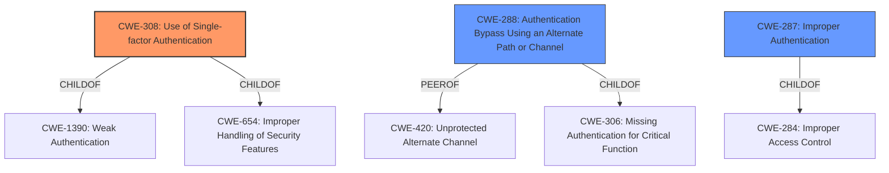

# Enhanced Analysis for CVE-2020-26136

# Summary
| CWE ID | CWE Name | Confidence | CWE Abstraction Level | CWE Vulnerability Mapping Label | CWE-Vulnerability Mapping Notes |
|---|---|---|---|---|---|
| CWE-308 | Use of Single-factor Authentication | 1.0 | Base | Allowed | Primary CWE |
| CWE-288 | Authentication Bypass Using an Alternate Path or Channel | 0.7 | Base | Allowed | Secondary Candidate |
| CWE-287 | Improper Authentication | 0.6 | Class | Discouraged | Secondary Candidate |

## Evidence and Confidence

*   **Confidence Score:** 0.9
*   **Evidence Strength:** HIGH

## Relationship Analysis
The primary CWE selected is CWE-308, which has parent relationships with CWE-1390 (Weak Authentication) and CWE-654 (Improper Handling of Security Features). CWE-288 (Authentication Bypass Using an Alternate Path or Channel) is a peer of CWE-420 (Unprotected Alternate Channel) and child of CWE-306 (Missing Authentication for Critical Function). CWE-287 (Improper Authentication) is a child of CWE-284 (Improper Access Control). The selection of CWE-308 is at the Base level, offering a more specific classification than its parent, CWE-1390. The relationships indicate that the vulnerability involves authentication issues and potential bypass mechanisms.



## Vulnerability Chain
The vulnerability chain starts with the **weakness** that GraphQL in SilverStripe through 4.6.0-rc1 **doesn't honor MFA when using basic authentication**. This leads to the following sequence:
1.  **Root Cause:** Default configuration of GraphQL module enables basic authentication.
2.  **Weakness:** MFA bypass because basic authentication is accepted.
3.  **Impact:** Unauthorized access to user accounts and potential data breach/manipulation.

## Summary of Analysis
Initial analysis focused on the fact that the GraphQL module in Silverstripe CMS accepts basic authentication, allowing a bypass of Multi-Factor Authentication (MFA). The **Vulnerability Description Key Phrases** indicated that the main impact was that the system "**doesn't honour MFA (multi-factor authentication) when using basic authentication**".

The CVE Reference Links Content Summary clearly stated that the **root cause** of the vulnerability was the GraphQL module accepting basic authentication by default, which allowed attackers to bypass MFA.

The Retriever Results listed CWE-308 (Use of Single-factor Authentication) as the top candidate. Given the **weakness** is the bypassing of MFA, and the system is reverting to single-factor authentication (username/password), CWE-308 is the most appropriate primary CWE. The mapping guidance for CWE-308 states "This CWE entry is at the Base level of abstraction, which is a preferred level of abstraction for mapping to the root causes of vulnerabilities." and "Carefully read both the name and description to ensure that this mapping is an appropriate fit".

CWE-288 (Authentication Bypass Using an Alternate Path or Channel) was considered as a secondary CWE because the basic authentication acts as an alternate channel that bypasses the MFA.

CWE-287 (Improper Authentication) was also considered, but it is too general and discouraged by its mapping guidance, which suggests using CWE-1390 or CWE-306 instead.

The selected CWEs are at the optimal level of specificity because they accurately represent the root cause (CWE-308), and a bypass scenario (CWE-288).

Relevant CWE Information:

# Enhanced Context (25 CWEs)
The following CWEs were identified as potentially relevant to this vulnerability:

## CWE-308: Use of Single-factor Authentication
**CWE-308 (Use of Single-factor Authentication)** is the primary CWE. The vulnerability description clearly states that MFA is bypassed, effectively reverting to single-factor authentication. The "CVE Reference Links Content Summary" confirms this by stating that the default configuration of the GraphQL module enabled basic authentication, which was the main **weakness** here, leading to the MFA bypass. This aligns perfectly with the description of CWE-308, which addresses the risks associated with relying solely on single-factor authentication.
## CWE-288: Authentication Bypass Using an Alternate Path or Channel
**CWE-288 (Authentication Bypass Using an Alternate Path or Channel)** is a secondary candidate. The vulnerability allows bypassing MFA through the use of basic authentication. The "CVE Reference Links Content Summary" confirms this bypass.
## CWE-287: Improper Authentication
**CWE-287 (Improper Authentication)** was considered but deemed too general. While the vulnerability does involve authentication issues, CWE-308 and CWE-288 provide a more precise characterization of the weakness. The mapping guidance for CWE-287 discourages its use when lower-level CWE entries are applicable.


## CWE Relationship Analysis

Current CWEs represent these abstraction levels: .


### Vulnerability Chain Analysis

**Chain starting from CWE-288:**
- 288 (Authentication Bypass Using an Alternate Path or Channel) - ROOT


**Chain starting from CWE-308:**
- 308 (Use of Single-factor Authentication) - ROOT


### CWE Relationship Diagram

```mermaid
graph TD
    classDef primary fill:#f96,stroke:#333,stroke-width:2px
    classDef secondary fill:#69f,stroke:#333
    classDef tertiary fill:#9e9,stroke:#333
```