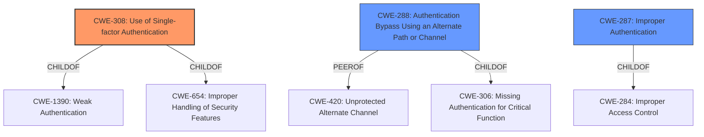

# Analysis for CVE-2020-26136

# Summary
| CWE ID | CWE Name | Confidence | CWE Abstraction Level | CWE Vulnerability Mapping Label | CWE-Vulnerability Mapping Notes |
|---|---|---|---|---|---|
| CWE-308 | Use of Single-factor Authentication | 1.0 | Base | Allowed | Primary CWE |
| CWE-288 | Authentication Bypass Using an Alternate Path or Channel | 0.7 | Base | Allowed | Secondary Candidate |
| CWE-287 | Improper Authentication | 0.6 | Class | Discouraged | Secondary Candidate |

## Evidence and Confidence

*   **Confidence Score:** 0.9
*   **Evidence Strength:** HIGH

## Relationship Analysis
The primary CWE selected is CWE-308, which has parent relationships with CWE-1390 (Weak Authentication) and CWE-654 (Improper Handling of Security Features). CWE-288 (Authentication Bypass Using an Alternate Path or Channel) is a peer of CWE-420 (Unprotected Alternate Channel) and child of CWE-306 (Missing Authentication for Critical Function). CWE-287 (Improper Authentication) is a child of CWE-284 (Improper Access Control). The selection of CWE-308 is at the Base level, offering a more specific classification than its parent, CWE-1390. The relationships indicate that the vulnerability involves authentication issues and potential bypass mechanisms.

## Vulnerability Chain
The vulnerability chain starts with the **weakness** that GraphQL in SilverStripe through 4.6.0-rc1 **doesn't honor MFA when using basic authentication**. This leads to the following sequence:
1.  **Root Cause:** Default configuration of GraphQL module enables basic authentication.
2.  **Weakness:** MFA bypass because basic authentication is accepted.
3.  **Impact:** Unauthorized access to user accounts and potential data breach/manipulation.

## Summary of Analysis
Initial analysis focused on the fact that the GraphQL module in Silverstripe CMS accepts basic authentication, allowing a bypass of Multi-Factor Authentication (MFA). The **Vulnerability Description Key Phrases** indicated that the main impact was that the system "**doesn't honour MFA (multi-factor authentication) when using basic authentication**".

The CVE Reference Links Content Summary clearly stated that the **root cause** of the vulnerability was the GraphQL module accepting basic authentication by default, which allowed attackers to bypass MFA.

The Retriever Results listed CWE-308 (Use of Single-factor Authentication) as the top candidate. Given the **weakness** is the bypassing of MFA, and the system is reverting to single-factor authentication (username/password), CWE-308 is the most appropriate primary CWE. The mapping guidance for CWE-308 states "This CWE entry is at the Base level of abstraction, which is a preferred level of abstraction for mapping to the root causes of vulnerabilities." and "Carefully read both the name and description to ensure that this mapping is an appropriate fit".

CWE-288 (Authentication Bypass Using an Alternate Path or Channel) was considered as a secondary CWE because the basic authentication acts as an alternate channel that bypasses the MFA.

CWE-287 (Improper Authentication) was also considered, but it is too general and discouraged by its mapping guidance, which suggests using CWE-1390 or CWE-306 instead.

The selected CWEs are at the optimal level of specificity because they accurately represent the root cause (CWE-308), and a bypass scenario (CWE-288).

Relevant CWE Information:

# Enhanced Context (25 CWEs)
The following CWEs were identified as potentially relevant to this vulnerability:

## CWE-308: Use of Single-factor Authentication
**CWE-308 (Use of Single-factor Authentication)** is the primary CWE. The vulnerability description clearly states that MFA is bypassed, effectively reverting to single-factor authentication. The "CVE Reference Links Content Summary" confirms this by stating that the default configuration of the GraphQL module enabled basic authentication, which was the main **weakness** here, leading to the MFA bypass. This aligns perfectly with the description of CWE-308, which addresses the risks associated with relying solely on single-factor authentication.
## CWE-288: Authentication Bypass Using an Alternate Path or Channel
**CWE-288 (Authentication Bypass Using an Alternate Path or Channel)** is a secondary candidate. The vulnerability allows bypassing MFA through the use of basic authentication. The "CVE Reference Links Content Summary" confirms this bypass.
## CWE-287: Improper Authentication
**CWE-287 (Improper Authentication)** was considered but deemed too general. While the vulnerability does involve authentication issues, CWE-308 and CWE-288 provide a more precise characterization of the weakness. The mapping guidance for CWE-287 discourages its use when lower-level CWE entries are applicable.

# Enhanced Query for CVE-2020-26136

## Vulnerability Description
In SilverStripe through 4.6.0-rc1, GraphQL doesnt honour MFA (multi-factor authentication) when using basic authentication.

### Vulnerability Description Key Phrases
- **impact:** doesnt honour MFA (multi-factor authentication) when using basic authentication
- **product:** SilverStripe
- **version:** through 4.6.0-rc1
- **component:** GraphQL

## CVE Reference Links Content Summary
Based on the provided content, here's a breakdown of the vulnerability:

**CVE ID:** CVE-2020-26136

**Root Cause of Vulnerability:**
The GraphQL module in Silverstripe CMS, by default, accepts basic authentication. This allows a bypass of Multi-Factor Authentication (MFA) if the `silverstripe/mfa` module is installed.

**Weaknesses/Vulnerabilities Present:**
-   **MFA Bypass:** The vulnerability allows attackers to bypass MFA, which is intended to add an extra layer of security.
-   **Basic Authentication Default:** The default configuration of the GraphQL module enabled basic authentication, which was the main weakness here.

**Impact of Exploitation:**
-   **Compromised User Accounts:** An attacker could gain unauthorized access to user accounts by bypassing MFA, provided they have the user's password.
-   **Data Breach/Manipulation:** Successful exploitation could lead to unauthorized access and potential manipulation of data, depending on the compromised user's permissions.

**Attack Vectors:**
-   **Basic Authentication:** The attacker leverages the GraphQL module's basic authentication to bypass MFA.

**Required Attacker Capabilities/Position:**
-   **User Credentials:** The attacker needs a valid username and password to exploit this vulnerability.
-   **Network Access:** The attacker needs to access the GraphQL endpoint which was exposing the vulnerability.

**Additional Information:**
-   **Affected Versions:** `silverstripe/graphql` versions `^3.0.0` and `^4.0.0-alpha1`.
-   **Fixed Versions:** `silverstripe/graphql` versions `^3.5.0` and `^4.0.0-alpha2`.
-   **Severity:** Medium.
-   **Mitigation:** Basic authentication has been removed as a default method. It can be re-enabled, if desired, through configuration.
-   **CVSS Score:** 4.2 (AV:N/AC:H/PR:L/UI:N/S:U/C:L/I:L/A:N)
-   **Reporter:** Maxime Rainville from Silverstripe Ltd.

## Retriever Results

### Top Combined Results

| Rank | CWE ID | Name | Abstraction | Usage  | Retrievers | Individual Scores |
|------|--------|------|-------------|-------|------------|-------------------|
| 1 | 308 | Use of Single-factor Authentication | Base | Allowed | sparse | 0.069 |
| 2 | 288 | Authentication Bypass Using an Alternate Path or Channel | Base | Allowed | sparse | 0.028 |
| 3 | 287 | Improper Authentication | Class | Discouraged | sparse | 0.027 |
| 4 | 41 | Improper Resolution of Path Equivalence | Base | Allowed | sparse | 0.026 |
| 5 | 1289 | Improper Validation of Unsafe Equivalence in Input | Base | Allowed | sparse | 0.025 |
| 6 | 304 | Missing Critical Step in Authentication | Base | Allowed | dense | 0.419 |
| 7 | 52 | Path Equivalence: '/multiple/trailing/slash//' | Variant | Allowed | graph | 0.003 |
| 8 | 1390 | Weak Authentication | Class | Allowed-with-Review | sparse | 0.024 |
| 9 | 697 | Incorrect Comparison | Pillar | Discouraged | sparse | 0.024 |
| 10 | 291 | Reliance on IP Address for Authentication | Variant | Allowed | sparse | 0.022 |

# Complete CWE Specifications

## CWE-308: Use of Single-factor Authentication
**Abstraction:** Base
**Status:** Draft

### Description
The use of single-factor authentication can lead to unnecessary risk of compromise when compared with the benefits of a dual-factor authentication scheme.

### Extended Description
While the use of multiple authentication schemes is simply piling on more complexity on top of authentication, it is inestimably valuable to have such measures of redundancy. The use of weak, reused, and common passwords is rampant on the internet. Without the added protection of multiple authentication schemes, a single mistake can result in the compromise of an account. For this reason, if multiple schemes are possible and also easy to use, they should be implemented and required.

### Alternative Terms
None

### Relationships
ChildOf -> CWE-1390
ChildOf -> CWE-654
PeerOf -> CWE-309

### Mapping Guidance
**Usage:** Allowed
**Rationale:** This CWE entry is at the Base level of abstraction, which is a preferred level of abstraction for mapping to the root causes of vulnerabilities.
**Comments:** Carefully read both the name and description to ensure that this mapping is an appropriate fit. Do not try to 'force' a mapping to a lower-level Base/Variant simply to comply with this preferred level of abstraction.
**Reasons:**
- Acceptable-Use

### Observed Examples
- **CVE-2022-35248:** Chat application skips validation when Central Authentication Service (CAS) is enabled, effectively removing the second factor from two-factor authentication

## CWE-288: Authentication Bypass Using an Alternate Path or Channel
**Abstraction:** Base
**Status:** Incomplete

### Description
The product requires authentication, but the product has an alternate path or channel that does not require authentication.

### Extended Description
Not provided

### Alternative Terms
None

### Relationships
ChildOf -> CWE-306
ChildOf -> CWE-284
PeerOf -> CWE-420

### Mapping Guidance
**Usage:** Allowed
**Rationale:** This CWE entry is at the Base level of abstraction, which is a preferred level of abstraction for mapping to the root causes of vulnerabilities.
**Comments:** Carefully read both the name and description to ensure that this mapping is an appropriate fit. Do not try to 'force' a mapping to a lower-level Base/Variant simply to comply with this preferred level of abstraction.
**Reasons:**
- Acceptable-Use

### Additional Notes
**[Relationship]** overlaps Unprotected Alternate Channel

### Observed Examples
- **CVE-2000-1179:** Router allows remote attackers to read system logs without authentication by directly connecting to the login screen and typing certain control characters.
- **CVE-1999-1454:** Attackers with physical access to the machine may bypass the password prompt by pressing the ESC (Escape) key.
- **CVE-1999-1077:** OS allows local attackers to bypass the password protection of idled sessions via the programmer's switch or CMD-PWR keyboard sequence, which brings up a debugger that the attacker can use to disable the lock.

## CWE-287: Improper Authentication
**Abstraction:** Class
**Status:** Draft

### Description
When an actor claims to have a given identity, the product does not prove or insufficiently proves that the claim is correct.

### Extended Description
Not provided

### Alternative Terms
authentification: An alternate term is "authentification", which appears to be most commonly used by people from non-English-speaking countries.
AuthN: "AuthN" is typically used as an abbreviation of "authentication" within the web application security community. It is also distinct from "AuthZ," which is an abbreviation of "authorization." The use of "Auth" as an abbreviation is discouraged, since it could be used for either authentication or authorization.
AuthC: "AuthC" is used as an abbreviation of "authentication," but it appears to used less frequently than "AuthN."

### Relationships
ChildOf -> CWE-284
ChildOf -> CWE-284

### Mapping Guidance
**Usage:** Discouraged
**Rationale:** This CWE entry might be misused when lower-level CWE entries are likely to be applicable. It is a level-1 Class (i.e., a child of a Pillar).
**Comments:** Consider children or descendants, beginning with CWE-1390: Weak Authentication or CWE-306: Missing Authentication for Critical Function.
**Reasons:**
- Frequent Misuse
**Suggested Alternatives:**
- CWE-1390: Weak Authentication
- CWE-306: Missing Authentication for Critical Function

### Additional Notes
**[Relationship]** This can be resultant from SQL injection vulnerabilities and other issues.

**[Maintenance]** The Taxonomy_Mappings to ISA/IEC 62443 were added in CWE 4.10, but they are still under review and might change in future CWE versions. These draft mappings were performed by members of the "Mapping CWE to 62443" subgroup of the CWE-CAPEC ICS/OT Special Interest Group (SIG), and their work is incomplete as of CWE 4.10. The mappings are included to facilitate discussion and review by the broader ICS/OT community, and they are likely to change in future CWE versions.

### Observed Examples
- **CVE-2022-35248:** Chat application skips validation when Central Authentication Service (CAS) is enabled, effectively removing the second factor from two-factor authentication
- **CVE-2022-36436:** Python-based authentication proxy does not enforce password authentication during the initial handshake, allowing the client to bypass authentication by specifying a 'None' authentication type.
- **CVE-2022-30034:** Chain: Web UI for a Python RPC framework does not use regex anchors to validate user login emails (CWE-777), potentially allowing bypass of OAuth (CWE-1390).

## CWE-41: Improper Resolution of Path Equivalence
**Abstraction:** Base
**Status:** Incomplete

### Description
The product is vulnerable to file system contents disclosure through path equivalence. Path equivalence involves the use of special characters in file and directory names. The associated manipulations are intended to generate multiple names for the same object.

### Extended Description
Path equivalence is usually employed in order to circumvent access controls expressed using an incomplete set of file name or file path representations. This is different from path traversal, wherein the manipulations are performed to generate a name for a different object.

### Alternative Terms
None

### Relationships
ChildOf -> CWE-706

### Mapping Guidance
**Usage:** Allowed
**Rationale:** This CWE entry is at the Base level of abstraction, which is a preferred level of abstraction for mapping to the root causes of vulnerabilities.
**Comments:** Carefully read both the name and description to ensure that this mapping is an appropriate fit. Do not try to 'force' a mapping to a lower-level Base/Variant simply to comply with this preferred level of abstraction.
**Reasons:**
- Acceptable-Use

### Additional Notes
**[Relationship]** Some of these manipulations could be effective in path traversal issues, too.

### Observed Examples
- **CVE-2000-1114:** Source code disclosure using trailing dot
- **CVE-2002-1986:** Source code disclosure using trailing dot
- **CVE-2004-2213:** Source code disclosure using trailing dot or trailing encoding space "%20"

## CWE-1289: Improper Validation of Unsafe Equivalence in Input
**Abstraction:** Base
**Status:** Incomplete

### Description
The product receives an input value that is used as a resource identifier or other type of reference, but it does not validate or incorrectly validates that the input is equivalent to a potentially-unsafe value.

### Extended Description

Attackers can sometimes bypass input validation schemes by finding inputs that appear to be safe, but will be dangerous when processed at a lower layer or by a downstream component. For example, a simple XSS protection mechanism might try to validate that an input has no "<script>" tags using case-sensitive matching, but since HTML is case-insensitive when processed by web browsers, an attacker could inject "<ScrIpT>" and trigger XSS.

### Alternative Terms
None

### Relationships
ChildOf -> CWE-20
PeerOf -> CWE-41
PeerOf -> CWE-178

### Mapping Guidance
**Usage:** Allowed
**Rationale:** This CWE entry is at the Base level of abstraction, which is a preferred level of abstraction for mapping to the root causes of vulnerabilities.
**Comments:** Carefully read both the name and description to ensure that this mapping is an appropriate fit. Do not try to 'force' a mapping to a lower-level Base/Variant simply to comply with this preferred level of abstraction.
**Reasons:**
- Acceptable-Use

### Additional Notes
**[Maintenance]** This entry is still under development and will continue to see updates and content improvements.

### Observed Examples
- **CVE-2021-39155:** Chain: A microservice integration and management platform compares the hostname in the HTTP Host header in a case-sensitive way (CWE-178, CWE-1289), allowing bypass of the authorization policy (CWE-863) using a hostname with mixed case or other variations.
- **CVE-2020-11053:** Chain: Go-based Oauth2 reverse proxy can send the authenticated user to another site at the end of the authentication flow. A redirect URL with HTML-encoded whitespace characters can bypass the validation (CWE-1289) to redirect to a malicious site (CWE-601)
- **CVE-2005-0269:** File extension check in forum software only verifies extensions that contain all lowercase letters, which allows remote attackers to upload arbitrary files via file extensions that include uppercase letters.

## CWE-304: Missing Critical Step in Authentication
**Abstraction:** Base
**Status:** Draft

### Description
The product implements an authentication technique, but it skips a step that weakens the technique.

### Extended Description
Authentication techniques should follow the algorithms that define them exactly, otherwise authentication can be bypassed or more easily subjected to brute force attacks.

### Alternative Terms
None

### Relationships
ChildOf -> CWE-303
ChildOf -> CWE-573

### Mapping Guidance
**Usage:** Allowed
**Rationale:** This CWE entry is at the Base level of abstraction, which is a preferred level of abstraction for mapping to the root causes of vulnerabilities.
**Comments:** Carefully read both the name and description to ensure that this mapping is an appropriate fit. Do not try to 'force' a mapping to a lower-level Base/Variant simply to comply with this preferred level of abstraction.
**Reasons:**
- Acceptable-Use

### Observed Examples
- **CVE-2004-2163:** Shared secret not verified in a RADIUS response packet, allowing authentication bypass by spoofing server replies.
- **CVE-2005-3327:** Chain: Authentication bypass by skipping the first startup step as required by the protocol.

## CWE-52: Path Equivalence: '/multiple/trailing/slash//'
**Abstraction:** Variant
**Status:** Incomplete

### Description
The product accepts path input in the form of multiple trailing slash ('/multiple/trailing/slash//') without appropriate validation, which can lead to ambiguous path resolution and allow an attacker to traverse the file system to unintended locations or access arbitrary files.

### Extended Description
Not provided

### Alternative Terms
None

### Relationships
ChildOf -> CWE-41
ChildOf -> CWE-163
CanPrecede -> CWE-289

### Mapping Guidance
**Usage:** Allowed
**Rationale:** This CWE entry is at the Variant level of abstraction, which is a preferred level of abstraction for mapping to the root causes of vulnerabilities.
**Comments:** Carefully read both the name and description to ensure that this mapping is an appropriate fit. Do not try to 'force' a mapping to a lower-level Base/Variant simply to comply with this preferred level of abstraction.
**Reasons:**
- Acceptable-Use

### Observed Examples
- **CVE-2002-1078:** Directory listings in web server using multiple trailing slash

## CWE-1390: Weak Authentication
**Abstraction:** Class
**Status:** Incomplete

### Description
The product uses an authentication mechanism to restrict access to specific users or identities, but the mechanism does not sufficiently prove that the claimed identity is correct.

### Extended Description

Attackers may be able to bypass weak authentication faster and/or with less effort than expected.

### Alternative Terms
None

### Relationships
ChildOf -> CWE-287

### Mapping Guidance
**Usage:** Allowed-with-Review
**Rationale:** This CWE entry is a Class and might have Base-level children that would be more appropriate
**Comments:** Examine children of this entry to see if there is a better fit
**Reasons:**
- Abstraction

### Observed Examples
- **CVE-2022-30034:** Chain: Web UI for a Python RPC framework does not use regex anchors to validate user login emails (CWE-777), potentially allowing bypass of OAuth (CWE-1390).
- **CVE-2022-35248:** Chat application skips validation when Central Authentication Service (CAS) is enabled, effectively removing the second factor from two-factor authentication
- **CVE-2021-3116:** Chain: Python-based HTTP Proxy server uses the wrong boolean operators (CWE-480) causing an incorrect comparison (CWE-697) that identifies an authN failure if all three conditions are met instead of only one, allowing bypass of the proxy authentication (CWE-1390)

## CWE-697: Incorrect Comparison
**Abstraction:** Pillar
**Status:** Incomplete

### Description
The product compares two entities in a security-relevant context, but the comparison is incorrect, which may lead to resultant weaknesses.

### Extended Description

This Pillar covers several possibilities:

  - the comparison checks one factor incorrectly;

  - the comparison should consider multiple factors, but it does not check at least one of those factors at all;

  - the comparison checks the wrong factor.

### Alternative Terms
None

### Relationships
None

### Mapping Guidance
**Usage:** Discouraged
**Rationale:** This CWE entry is extremely high-level, a Pillar. However, sometimes this weakness is forced to be used due to the lack of in-depth weakness research. See Research Gaps.
**Comments:** Where feasible, consider children or descendants of this entry instead.
**Reasons:**
- Abstraction

### Additional Notes
**[Research Gap]** 

Weaknesses related to this Pillar appear to be under-studied, especially with respect to classification schemes. Input from academic and other communities could help identify and resolve gaps or organizational difficulties within CWE.

**[Maintenance]** This entry likely has some relationships with case sensitivity (CWE-178), but case sensitivity is a factor in other types of weaknesses besides comparison. Also, in cryptography, certain attacks are possible when certain comparison operations do not take place in constant time, causing a timing-related information leak (CWE-208).

### Observed Examples
- **CVE-2021-3116:** Chain: Python-based HTTP Proxy server uses the wrong boolean operators (CWE-480) causing an incorrect comparison (CWE-697) that identifies an authN failure if all three conditions are met instead of only one, allowing bypass of the proxy authentication (CWE-1390)
- **CVE-2020-15811:** Chain: Proxy uses a substring search instead of parsing the Transfer-Encoding header (CWE-697), allowing request splitting (CWE-113) and cache poisoning
- **CVE-2016-10003:** Proxy performs incorrect comparison of request headers, leading to infoleak

## CWE-291: Reliance on IP Address for Authentication
**Abstraction:** Variant
**Status:** Incomplete

### Description
The product uses an IP address for authentication.

### Extended Description
IP addresses can be easily spoofed. Attackers can forge the source IP address of the packets they send, but response packets will return to the forged IP address. To see the response packets, the attacker has to sniff the traffic between the victim machine and the forged IP address. In order to accomplish the required sniffing, attackers typically attempt to locate themselves on the same subnet as the victim machine. Attackers may be able to circumvent this requirement by using source routing, but source routing is disabled across much of the Internet today. In summary, IP address verification can be a useful part of an authentication scheme, but it should not be the single factor required for authentication.

### Alternative Terms
None

### Relationships
ChildOf -> CWE-290
ChildOf -> CWE-923
ChildOf -> CWE-471

### Mapping Guidance
**Usage:** Allowed
**Rationale:** This CWE entry is at the Variant level of abstraction, which is a preferred level of abstraction for mapping to the root causes of vulnerabilities.
**Comments:** Carefully read both the name and description to ensure that this mapping is an appropriate fit. Do not try to 'force' a mapping to a lower-level Base/Variant simply to comply with this preferred level of abstraction.
**Reasons:**
- Acceptable-Use

### Observed Examples
- **CVE-2022-30319:** S-bus functionality in a home automation product performs access control using an IP allowlist, which can be bypassed by a forged IP address.

