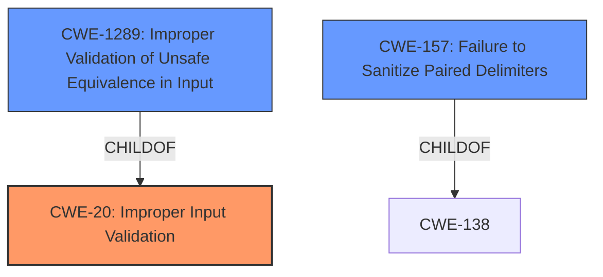

# Enhanced Analysis for CVE-2020-26138

# Summary
| CWE ID  | CWE Name                                                                        | Confidence | CWE Abstraction Level | CWE Vulnerability Mapping Label | CWE-Vulnerability Mapping Notes |
| :-------- | :------------------------------------------------------------------------------ | :--------- | :---------------------- | :------------------------------ | :------------------------------ |
| CWE-20    | Improper Input Validation                                                     | 0.9        | Class                   | Primary                         | Allowed                         |
| CWE-1289  | Improper Validation of Unsafe Equivalence in Input                          | 0.7        | Base                    | Secondary                       | Allowed                         |
| CWE-157   | Failure to Sanitize Paired Delimiters                                         | 0.6        | Variant                 | Secondary                       | Allowed                         |

## Evidence and Confidence

*   **Confidence Score:** 0.8
*   **Evidence Strength:** HIGH

## Relationship Analysis
The primary relationship that influenced the CWE selection was the parent-child relationship between CWE-20 and CWE-1289. CWE-20 is a high-level class, while CWE-1289 is a more specific base. The description indicates a validation issue, which aligns with CWE-20. However, the specifics of the validation bypass using array-like form field names lead to considering CWE-1289, which addresses unsafe equivalence in input validation. CWE-157 was considered because of square brackets, but the issue is not about sanitizing but about validation, so it's a weaker fit.



## Vulnerability Chain
The vulnerability chain starts with **improper input validation** (CWE-20), which leads to the bypass of file extension restrictions. The chain includes **inconsistent handling of array-like form field names**, culminating in the potential execution of malicious code on the server.

## Summary of Analysis
The initial analysis focused on identifying the root cause of the vulnerability, which is the **improper input validation** in SilverStripe's `FileField` class. The CVE Reference Links Content Summary clearly states this: "The `FileField` class in Silverstripe CMS does not properly validate file uploads when the field name includes square brackets (`[]`), which are used to submit multiple values in HTML forms." This aligns directly with CWE-20 (Improper Input Validation), which is a broad but relevant class.

However, considering the specific mechanism of the bypass (square brackets in field names), CWE-1289 (Improper Validation of Unsafe Equivalence in Input) was also considered as a secondary CWE. This is because the square brackets lead to an equivalence issue where the input is treated differently than expected, bypassing validation.

CWE-157 (Failure to Sanitize Paired Delimiters) was considered due to the presence of square brackets, but it ultimately does not fit because the problem isn't about sanitizing the brackets themselves, but about how the presence of these brackets alters the validation process.

The selected CWEs are at the optimal level of specificity because CWE-20 captures the overall **improper input validation**, while CWE-1289 highlights the specific mechanism of the bypass related to the interpretation of square brackets in field names.

Relevant CWE Information:

# Enhanced Context (25 CWEs)
The following CWEs were identified as potentially relevant to this vulnerability:

## CWE-611: Improper Restriction of XML External Entity Reference
**Abstraction Level**: Base
**Similarity Score**: 0.84
**Source**: dense

**Description**:
The product processes an XML document that can contain XML entities with URIs that resolve to documents outside of the intended sphere of control, causing the product to embed incorrect documents into its output.

**Mapping Guidance**:
- Usage: Allowed
- Rationale: This CWE entry is at the Base level of abstraction, which is a preferred level of abstraction for mapping to the root causes of vulnerabilities.


## CWE-1289: Improper Validation of Unsafe Equivalence in Input
**Abstraction Level**: Base
**Similarity Score**: 0.78
**Source**: dense

**Description**:
The product receives an input value that is used as a resource identifier or other type of reference, but it does not validate or incorrectly validates that the input is equivalent to a potentially-unsafe value.

**Mapping Guidance**:
- Usage: Allowed
- Rationale: This CWE entry is at the Base level of abstraction, which is a preferred level of abstraction for mapping to the root causes of vulnerabilities.


## CWE-80: Improper Neutralization of Script-Related HTML Tags in a Web Page (Basic XSS)
**Abstraction Level**: Variant
**Similarity Score**: 0.78
**Source**: dense

**Description**:
The product receives input from an upstream component, but it does not neutralize or incorrectly neutralizes special characters such as "<", ">", and "&" that could be interpreted as web-scripting elements when they are sent to a downstream component that processes web pages.

**Mapping Guidance**:
- Usage: Allowed
- Rationale: This CWE entry is at the Variant level of abstraction, which is a preferred level of abstraction for mapping to the root causes of vulnerabilities.


## CWE-776: Improper Restriction of Recursive Entity References in DTDs ('XML Entity Expansion')
**Abstraction Level**: Base
**Similarity Score**: 0.77
**Source**: dense

**Description**:
The product uses XML documents and allows their structure to be defined with a Document Type Definition (DTD), but it does not properly control the number of recursive definitions of entities.

**Mapping Guidance**:
- Usage: Allowed
- Rationale: This CWE entry is at the Base level of abstraction, which is a preferred level of abstraction for mapping to the root causes of vulnerabilities.


## CWE-610: Externally Controlled Reference to a Resource in Another Sphere
**Abstraction Level**: Class
**Similarity Score**: 0.76
**Source**: dense

**Description**:
The product uses an externally controlled name or reference that resolves to a resource that is outside of the intended control sphere.

**Mapping Guidance**:
- Usage: Discouraged
- Rationale: This CWE entry is a level-1 Class (i.e., a child of a Pillar). It might have lower-level children that would be more appropriate


## CWE-41: Improper Resolution of Path Equivalence
**Abstraction Level**: Base
**Similarity Score**: 0.76
**Source**: dense

**Description**:
The product is vulnerable to file system contents disclosure through path equivalence. Path equivalence involves the use of special characters in file and directory names. The associated manipulations are intended to generate multiple names for the same object.

**Mapping Guidance**:
- Usage: Allowed
- Rationale: This CWE entry is at the Base level of abstraction, which is a preferred level of abstraction for mapping to the root causes of vulnerabilities.


## CWE-116: Improper Encoding or Escaping of Output
**Abstraction Level**: Class
**Similarity Score**: 0.76
**Source**: dense

**Description**:
The product prepares a structured message for communication with another component, but encoding or escaping of the data is either missing or done incorrectly. As a result, the intended structure of the message is not preserved.

**Mapping Guidance**:
- Usage: Allowed-with-Review
- Rationale: This CWE entry is a Class and might have Base-level children that would be more appropriate


## CWE-184: Incomplete List of Disallowed Inputs
**Abstraction Level**: Base
**Similarity Score**: 0.76
**Source**: dense

**Description**:
The product implements a protection mechanism that relies on a list of inputs (or properties of inputs) that are not allowed by policy or otherwise require other action to neutralize before additional processing takes place, but the list is incomplete.

**Mapping Guidance**:
- Usage: Allowed
- Rationale: This CWE entry is at the Base level of abstraction, which is a preferred level of abstraction for mapping to the root causes of vulnerabilities.


## CWE-74: Improper Neutralization of Special Elements in Output Used by a Downstream Component ('Injection')
**Abstraction Level**: Class
**Similarity Score**: 0.76
**Source**: dense

**Description**:
The product constructs all or part of a command, data structure, or record using externally-influenced input from an upstream component, but it does not neutralize or incorrectly neutralizes special elements that could modify how it is parsed or interpreted when it is sent to a downstream component.

**Mapping Guidance**:
- Usage: Discouraged
- Rationale: CWE-74 is high-level and often misused when lower-level weaknesses are more appropriate.


## CWE-23: Relative Path Traversal
**Abstraction


## CWE Relationship Analysis

Current CWEs represent these abstraction levels: .


### Vulnerability Chain Analysis

**Chain starting from CWE-610:**
- 610 (Externally Controlled Reference to a Resource in Another Sphere) - ROOT


**Chain starting from CWE-80:**
- 80 (Improper Neutralization of Script-Related HTML Tags in a Web Page (Basic XSS)) - ROOT


### CWE Relationship Diagram

```mermaid
graph TD
    classDef primary fill:#f96,stroke:#333,stroke-width:2px
    classDef secondary fill:#69f,stroke:#333
    classDef tertiary fill:#9e9,stroke:#333
```