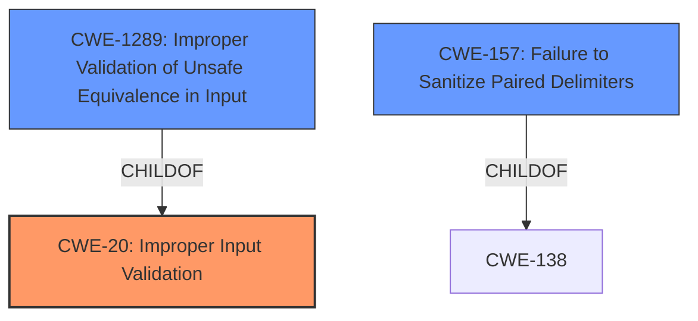

# Analysis for CVE-2020-26138

# Summary
| CWE ID  | CWE Name                                                                        | Confidence | CWE Abstraction Level | CWE Vulnerability Mapping Label | CWE-Vulnerability Mapping Notes |
| :-------- | :------------------------------------------------------------------------------ | :--------- | :---------------------- | :------------------------------ | :------------------------------ |
| CWE-20    | Improper Input Validation                                                     | 0.9        | Class                   | Primary                         | Allowed                         |
| CWE-1289  | Improper Validation of Unsafe Equivalence in Input                          | 0.7        | Base                    | Secondary                       | Allowed                         |
| CWE-157   | Failure to Sanitize Paired Delimiters                                         | 0.6        | Variant                 | Secondary                       | Allowed                         |

## Evidence and Confidence

*   **Confidence Score:** 0.8
*   **Evidence Strength:** HIGH

## Relationship Analysis
The primary relationship that influenced the CWE selection was the parent-child relationship between CWE-20 and CWE-1289. CWE-20 is a high-level class, while CWE-1289 is a more specific base. The description indicates a validation issue, which aligns with CWE-20. However, the specifics of the validation bypass using array-like form field names lead to considering CWE-1289, which addresses unsafe equivalence in input validation. CWE-157 was considered because of square brackets, but the issue is not about sanitizing but about validation, so it's a weaker fit.



## Vulnerability Chain
The vulnerability chain starts with **improper input validation** (CWE-20), which leads to the bypass of file extension restrictions. The chain includes **inconsistent handling of array-like form field names**, culminating in the potential execution of malicious code on the server.

## Summary of Analysis
The initial analysis focused on identifying the root cause of the vulnerability, which is the **improper input validation** in SilverStripe's `FileField` class. The CVE Reference Links Content Summary clearly states this: "The `FileField` class in Silverstripe CMS does not properly validate file uploads when the field name includes square brackets (`[]`), which are used to submit multiple values in HTML forms." This aligns directly with CWE-20 (Improper Input Validation), which is a broad but relevant class.

However, considering the specific mechanism of the bypass (square brackets in field names), CWE-1289 (Improper Validation of Unsafe Equivalence in Input) was also considered as a secondary CWE. This is because the square brackets lead to an equivalence issue where the input is treated differently than expected, bypassing validation.

CWE-157 (Failure to Sanitize Paired Delimiters) was considered due to the presence of square brackets, but it ultimately does not fit because the problem isn't about sanitizing the brackets themselves, but about how the presence of these brackets alters the validation process.

The selected CWEs are at the optimal level of specificity because CWE-20 captures the overall **improper input validation**, while CWE-1289 highlights the specific mechanism of the bypass related to the interpretation of square brackets in field names.

Relevant CWE Information:

# Enhanced Context (25 CWEs)
The following CWEs were identified as potentially relevant to this vulnerability:

## CWE-611: Improper Restriction of XML External Entity Reference
**Abstraction Level**: Base
**Similarity Score**: 0.84
**Source**: dense

**Description**:
The product processes an XML document that can contain XML entities with URIs that resolve to documents outside of the intended sphere of control, causing the product to embed incorrect documents into its output.

**Mapping Guidance**:
- Usage: Allowed
- Rationale: This CWE entry is at the Base level of abstraction, which is a preferred level of abstraction for mapping to the root causes of vulnerabilities.


## CWE-1289: Improper Validation of Unsafe Equivalence in Input
**Abstraction Level**: Base
**Similarity Score**: 0.78
**Source**: dense

**Description**:
The product receives an input value that is used as a resource identifier or other type of reference, but it does not validate or incorrectly validates that the input is equivalent to a potentially-unsafe value.

**Mapping Guidance**:
- Usage: Allowed
- Rationale: This CWE entry is at the Base level of abstraction, which is a preferred level of abstraction for mapping to the root causes of vulnerabilities.


## CWE-80: Improper Neutralization of Script-Related HTML Tags in a Web Page (Basic XSS)
**Abstraction Level**: Variant
**Similarity Score**: 0.78
**Source**: dense

**Description**:
The product receives input from an upstream component, but it does not neutralize or incorrectly neutralizes special characters such as "<", ">", and "&" that could be interpreted as web-scripting elements when they are sent to a downstream component that processes web pages.

**Mapping Guidance**:
- Usage: Allowed
- Rationale: This CWE entry is at the Variant level of abstraction, which is a preferred level of abstraction for mapping to the root causes of vulnerabilities.


## CWE-776: Improper Restriction of Recursive Entity References in DTDs ('XML Entity Expansion')
**Abstraction Level**: Base
**Similarity Score**: 0.77
**Source**: dense

**Description**:
The product uses XML documents and allows their structure to be defined with a Document Type Definition (DTD), but it does not properly control the number of recursive definitions of entities.

**Mapping Guidance**:
- Usage: Allowed
- Rationale: This CWE entry is at the Base level of abstraction, which is a preferred level of abstraction for mapping to the root causes of vulnerabilities.


## CWE-610: Externally Controlled Reference to a Resource in Another Sphere
**Abstraction Level**: Class
**Similarity Score**: 0.76
**Source**: dense

**Description**:
The product uses an externally controlled name or reference that resolves to a resource that is outside of the intended control sphere.

**Mapping Guidance**:
- Usage: Discouraged
- Rationale: This CWE entry is a level-1 Class (i.e., a child of a Pillar). It might have lower-level children that would be more appropriate


## CWE-41: Improper Resolution of Path Equivalence
**Abstraction Level**: Base
**Similarity Score**: 0.76
**Source**: dense

**Description**:
The product is vulnerable to file system contents disclosure through path equivalence. Path equivalence involves the use of special characters in file and directory names. The associated manipulations are intended to generate multiple names for the same object.

**Mapping Guidance**:
- Usage: Allowed
- Rationale: This CWE entry is at the Base level of abstraction, which is a preferred level of abstraction for mapping to the root causes of vulnerabilities.


## CWE-116: Improper Encoding or Escaping of Output
**Abstraction Level**: Class
**Similarity Score**: 0.76
**Source**: dense

**Description**:
The product prepares a structured message for communication with another component, but encoding or escaping of the data is either missing or done incorrectly. As a result, the intended structure of the message is not preserved.

**Mapping Guidance**:
- Usage: Allowed-with-Review
- Rationale: This CWE entry is a Class and might have Base-level children that would be more appropriate


## CWE-184: Incomplete List of Disallowed Inputs
**Abstraction Level**: Base
**Similarity Score**: 0.76
**Source**: dense

**Description**:
The product implements a protection mechanism that relies on a list of inputs (or properties of inputs) that are not allowed by policy or otherwise require other action to neutralize before additional processing takes place, but the list is incomplete.

**Mapping Guidance**:
- Usage: Allowed
- Rationale: This CWE entry is at the Base level of abstraction, which is a preferred level of abstraction for mapping to the root causes of vulnerabilities.


## CWE-74: Improper Neutralization of Special Elements in Output Used by a Downstream Component ('Injection')
**Abstraction Level**: Class
**Similarity Score**: 0.76
**Source**: dense

**Description**:
The product constructs all or part of a command, data structure, or record using externally-influenced input from an upstream component, but it does not neutralize or incorrectly neutralizes special elements that could modify how it is parsed or interpreted when it is sent to a downstream component.

**Mapping Guidance**:
- Usage: Discouraged
- Rationale: CWE-74 is high-level and often misused when lower-level weaknesses are more appropriate.


## CWE-23: Relative Path Traversal
**Abstraction

# Enhanced Query for CVE-2020-26138

## Vulnerability Description
In SilverStripe through 4.6.0-rc1, a FormField with square brackets in the field name skips validation.

### Vulnerability Description Key Phrases
- **product:** SilverStripe
- **version:** through 4.6.0-rc1
- **component:** FormField

## CVE Reference Links Content Summary
```
{
  "vulnerability": {
    "root_cause": "The `FileField` class in Silverstripe CMS does not properly validate file uploads when the field name includes square brackets (`[]`), which are used to submit multiple values in HTML forms. This allows bypassing of file extension restrictions and other validations.",
    "weaknesses": [
      "Improper input validation",
      "Inconsistent handling of array-like form field names",
      "Bypass of extension restrictions",
       "Reliance on form system validation in controller logic"
    ],
    "impact": "An attacker can upload files with disallowed extensions, potentially leading to the execution of malicious code on the server or other security issues if the uploaded files are mishandled by custom controller logic.",
    "attack_vectors": [
      "Submitting a file upload form with a `FileField` that uses a name ending in `[]`"
    ],
    "required_capabilities": "The attacker needs the ability to submit a form on a Silverstripe CMS website with a specially crafted field name.",
    "additional_details": "The issue is specific to the `FileField` class and does not affect the `UploadField` used within the CMS. It is also mentioned that controller logic should not rely on the form system to perform input validation.",
    "affected_versions": "silverstripe/framework: ^3.0.0, ^4.0.0",
     "fixed_versions": "silverstripe/framework: ^4.7.4, ^4.8.0"
  }
}
```

## Retriever Results

### Top Combined Results

| Rank | CWE ID | Name | Abstraction | Usage  | Retrievers | Individual Scores |
|------|--------|------|-------------|-------|------------|-------------------|
| 1 | 1289 | Improper Validation of Unsafe Equivalence in Input | Base | Allowed | sparse | 0.070 |
| 2 | 308 | Use of Single-factor Authentication | Base | Allowed | sparse | 0.042 |
| 3 | 157 | Failure to Sanitize Paired Delimiters | Variant | Allowed | sparse | 0.033 |
| 4 | 295 | Improper Certificate Validation | Base | Allowed | sparse | 0.031 |
| 5 | 297 | Improper Validation of Certificate with Host Mismatch | Variant | Allowed | sparse | 0.031 |
| 6 | 105 | Struts: Form Field Without Validator | Variant | Allowed | dense | 0.493 |
| 7 | 370 | Missing Check for Certificate Revocation after Initial Check | Variant | Allowed | graph | 0.002 |
| 8 | 407 | Inefficient Algorithmic Complexity | Class | Allowed-with-Review | sparse | 0.030 |
| 9 | 79 | Improper Neutralization of Input During Web Page Generation ('Cross-site Scripting') | Base | Allowed | sparse | 0.029 |
| 10 | 611 | Improper Restriction of XML External Entity Reference | Base | Allowed | sparse | 0.028 |


# Complete CWE Specifications


## CWE-1289: Improper Validation of Unsafe Equivalence in Input
**Abstraction:** Base
**Status:** Incomplete

### Description
The product receives an input value that is used as a resource identifier or other type of reference, but it does not validate or incorrectly validates that the input is equivalent to a potentially-unsafe value.

### Extended Description


Attackers can sometimes bypass input validation schemes by finding inputs that appear to be safe, but will be dangerous when processed at a lower layer or by a downstream component. For example, a simple XSS protection mechanism might try to validate that an input has no "<script>" tags using case-sensitive matching, but since HTML is case-insensitive when processed by web browsers, an attacker could inject "<ScrIpT>" and trigger XSS.


### Alternative Terms
None

### Relationships
ChildOf -> CWE-20
PeerOf -> CWE-41
PeerOf -> CWE-178

### Mapping Guidance
**Usage:** Allowed
**Rationale:** This CWE entry is at the Base level of abstraction, which is a preferred level of abstraction for mapping to the root causes of vulnerabilities.
**Comments:** Carefully read both the name and description to ensure that this mapping is an appropriate fit. Do not try to 'force' a mapping to a lower-level Base/Variant simply to comply with this preferred level of abstraction.
**Reasons:**
- Acceptable-Use


### Additional Notes
**[Maintenance]** This entry is still under development and will continue to see updates and content improvements.


### Observed Examples
- **CVE-2021-39155:** Chain: A microservice integration and management platform compares the hostname in the HTTP Host header in a case-sensitive way (CWE-178, CWE-1289), allowing bypass of the authorization policy (CWE-863) using a hostname with mixed case or other variations.
- **CVE-2020-11053:** Chain: Go-based Oauth2 reverse proxy can send the authenticated user to another site at the end of the authentication flow. A redirect URL with HTML-encoded whitespace characters can bypass the validation (CWE-1289) to redirect to a malicious site (CWE-601)
- **CVE-2005-0269:** File extension check in forum software only verifies extensions that contain all lowercase letters, which allows remote attackers to upload arbitrary files via file extensions that include uppercase letters.


## CWE-308: Use of Single-factor Authentication
**Abstraction:** Base
**Status:** Draft

### Description
The use of single-factor authentication can lead to unnecessary risk of compromise when compared with the benefits of a dual-factor authentication scheme.

### Extended Description
While the use of multiple authentication schemes is simply piling on more complexity on top of authentication, it is inestimably valuable to have such measures of redundancy. The use of weak, reused, and common passwords is rampant on the internet. Without the added protection of multiple authentication schemes, a single mistake can result in the compromise of an account. For this reason, if multiple schemes are possible and also easy to use, they should be implemented and required.

### Alternative Terms
None

### Relationships
ChildOf -> CWE-1390
ChildOf -> CWE-654
PeerOf -> CWE-309

### Mapping Guidance
**Usage:** Allowed
**Rationale:** This CWE entry is at the Base level of abstraction, which is a preferred level of abstraction for mapping to the root causes of vulnerabilities.
**Comments:** Carefully read both the name and description to ensure that this mapping is an appropriate fit. Do not try to 'force' a mapping to a lower-level Base/Variant simply to comply with this preferred level of abstraction.
**Reasons:**
- Acceptable-Use


### Observed Examples
- **CVE-2022-35248:** Chat application skips validation when Central Authentication Service (CAS) is enabled, effectively removing the second factor from two-factor authentication


## CWE-157: Failure to Sanitize Paired Delimiters
**Abstraction:** Variant
**Status:** Draft

### Description
The product does not properly handle the characters that are used to mark the beginning and ending of a group of entities, such as parentheses, brackets, and braces.

### Extended Description


Paired delimiters might include:


  - < and > angle brackets

  - ( and ) parentheses

  - { and } braces

  - [ and ] square brackets

  - " " double quotes

  - ' ' single quotes


### Alternative Terms
None

### Relationships
ChildOf -> CWE-138

### Mapping Guidance
**Usage:** Allowed
**Rationale:** This CWE entry is at the Variant level of abstraction, which is a preferred level of abstraction for mapping to the root causes of vulnerabilities.
**Comments:** Carefully read both the name and description to ensure that this mapping is an appropriate fit. Do not try to 'force' a mapping to a lower-level Base/Variant simply to comply with this preferred level of abstraction.
**Reasons:**
- Acceptable-Use


### Additional Notes
**[Research Gap]** Under-studied.


### Observed Examples
- **CVE-2004-0956:** Crash via missing paired delimiter (open double-quote but no closing double-quote).
- **CVE-2000-1165:** Crash via message without closing ">".
- **CVE-2005-2933:** Buffer overflow via mailbox name with an opening double quote but missing a closing double quote, causing a larger copy than expected.


## CWE-295: Improper Certificate Validation
**Abstraction:** Base
**Status:** Draft

### Description
The product does not validate, or incorrectly validates, a certificate.

### Extended Description
When a certificate is invalid or malicious, it might allow an attacker to spoof a trusted entity by interfering in the communication path between the host and client. The product might connect to a malicious host while believing it is a trusted host, or the product might be deceived into accepting spoofed data that appears to originate from a trusted host.

### Alternative Terms
None

### Relationships
ChildOf -> CWE-287
ChildOf -> CWE-287
PeerOf -> CWE-322

### Mapping Guidance
**Usage:** Allowed
**Rationale:** This CWE entry is at the Base level of abstraction, which is a preferred level of abstraction for mapping to the root causes of vulnerabilities.
**Comments:** Carefully read both the name and description to ensure that this mapping is an appropriate fit. Do not try to 'force' a mapping to a lower-level Base/Variant simply to comply with this preferred level of abstraction.
**Reasons:**
- Acceptable-Use


### Observed Examples
- **CVE-2019-12496:** A Go framework for robotics, drones, and IoT devices skips verification of root CA certificates by default.
- **CVE-2014-1266:** chain: incorrect "goto" in Apple SSL product bypasses certificate validation, allowing Adversary-in-the-Middle (AITM) attack (Apple "goto fail" bug). CWE-705 (Incorrect Control Flow Scoping) -> CWE-561 (Dead Code) -> CWE-295 (Improper Certificate Validation) -> CWE-393 (Return of Wrong Status Code) -> CWE-300 (Channel Accessible by Non-Endpoint).
- **CVE-2021-22909:** Chain: router's firmware update procedure uses curl with "-k" (insecure) option that disables certificate validation (CWE-295), allowing adversary-in-the-middle (AITM) compromise with a malicious firmware image (CWE-494).


## CWE-297: Improper Validation of Certificate with Host Mismatch
**Abstraction:** Variant
**Status:** Incomplete

### Description
The product communicates with a host that provides a certificate, but the product does not properly ensure that the certificate is actually associated with that host.

### Extended Description


Even if a certificate is well-formed, signed, and follows the chain of trust, it may simply be a valid certificate for a different site than the site that the product is interacting with. If the certificate's host-specific data is not properly checked - such as the Common Name (CN) in the Subject or the Subject Alternative Name (SAN) extension of an X.509 certificate - it may be possible for a redirection or spoofing attack to allow a malicious host with a valid certificate to provide data, impersonating a trusted host. In order to ensure data integrity, the certificate must be valid and it must pertain to the site that is being accessed.


Even if the product attempts to check the hostname, it is still possible to incorrectly check the hostname. For example, attackers could create a certificate with a name that begins with a trusted name followed by a NUL byte, which could cause some string-based comparisons to only examine the portion that contains the trusted name.


This weakness can occur even when the product uses Certificate Pinning, if the product does not verify the hostname at the time a certificate is pinned.


### Alternative Terms
None

### Relationships
ChildOf -> CWE-923
ChildOf -> CWE-295

### Mapping Guidance
**Usage:** Allowed
**Rationale:** This CWE entry is at the Variant level of abstraction, which is a preferred level of abstraction for mapping to the root causes of vulnerabilities.
**Comments:** Carefully read both the name and description to ensure that this mapping is an appropriate fit. Do not try to 'force' a mapping to a lower-level Base/Variant simply to comply with this preferred level of abstraction.
**Reasons:**
- Acceptable-Use


### Observed Examples
- **CVE-2012-5810:** Mobile banking application does not verify hostname, leading to financial loss.
- **CVE-2012-5811:** Mobile application for printing documents does not verify hostname, allowing attackers to read sensitive documents.
- **CVE-2012-5807:** Software for electronic checking does not verify hostname, leading to financial loss.


## CWE-105: Struts: Form Field Without Validator
**Abstraction:** Variant
**Status:** Draft

### Description
The product has a form field that is not validated by a corresponding validation form, which can introduce other weaknesses related to insufficient input validation.

### Extended Description
Omitting validation for even a single input field may give attackers the leeway they need to compromise the product. Although J2EE applications are not generally susceptible to memory corruption attacks, if a J2EE application interfaces with native code that does not perform array bounds checking, an attacker may be able to use an input validation mistake in the J2EE application to launch a buffer overflow attack.

### Alternative Terms
None

### Relationships
ChildOf -> CWE-1173
ChildOf -> CWE-20

### Mapping Guidance
**Usage:** Allowed
**Rationale:** This CWE entry is at the Variant level of abstraction, which is a preferred level of abstraction for mapping to the root causes of vulnerabilities.
**Comments:** Carefully read both the name and description to ensure that this mapping is an appropriate fit. Do not try to 'force' a mapping to a lower-level Base/Variant simply to comply with this preferred level of abstraction.
**Reasons:**
- Acceptable-Use


## CWE-370: Missing Check for Certificate Revocation after Initial Check
**Abstraction:** Variant
**Status:** Draft

### Description
The product does not check the revocation status of a certificate after its initial revocation check, which can cause the product to perform privileged actions even after the certificate is revoked at a later time.

### Extended Description
If the revocation status of a certificate is not checked before each action that requires privileges, the system may be subject to a race condition. If a certificate is revoked after the initial check, all subsequent actions taken with the owner of the revoked certificate will lose all benefits guaranteed by the certificate. In fact, it is almost certain that the use of a revoked certificate indicates malicious activity.

### Alternative Terms
None

### Relationships
ChildOf -> CWE-299
PeerOf -> CWE-296
PeerOf -> CWE-297
PeerOf -> CWE-298

### Mapping Guidance
**Usage:** Allowed
**Rationale:** This CWE entry is at the Variant level of abstraction, which is a preferred level of abstraction for mapping to the root causes of vulnerabilities.
**Comments:** Carefully read both the name and description to ensure that this mapping is an appropriate fit. Do not try to 'force' a mapping to a lower-level Base/Variant simply to comply with this preferred level of abstraction.
**Reasons:**
- Acceptable-Use


## CWE-407: Inefficient Algorithmic Complexity
**Abstraction:** Class
**Status:** Incomplete

### Description
An algorithm in a product has an inefficient worst-case computational complexity that may be detrimental to system performance and can be triggered by an attacker, typically using crafted manipulations that ensure that the worst case is being reached.

### Extended Description
Not provided

### Alternative Terms
Quadratic Complexity: Used when the algorithmic complexity is related to the square of the number of inputs (N^2)

### Relationships
ChildOf -> CWE-405

### Mapping Guidance
**Usage:** Allowed-with-Review
**Rationale:** This CWE entry is a Class and might have Base-level children that would be more appropriate
**Comments:** Examine children of this entry to see if there is a better fit
**Reasons:**
- Abstraction


### Observed Examples
- **CVE-2021-32617:** C++ library for image metadata has "quadratic complexity" issue with unnecessarily repetitive parsing each time an invalid character is encountered
- **CVE-2020-10735:** Python has "quadratic complexity" issue when converting string to int with many digits in unexpected bases
- **CVE-2020-5243:** server allows ReDOS with crafted User-Agent strings, due to overlapping capture groups that cause excessive backtracking.


## CWE-79: Improper Neutralization of Input During Web Page Generation ('Cross-site Scripting')
**Abstraction:** Base
**Status:** Stable

### Description
The product does not neutralize or incorrectly neutralizes user-controllable input before it is placed in output that is used as a web page that is served to other users.

### Extended Description


Cross-site scripting (XSS) vulnerabilities occur when:


  1. Untrusted data enters a web application, typically from a web request.

  1. The web application dynamically generates a web page that contains this untrusted data.

  1. During page generation, the application does not prevent the data from containing content that is executable by a web browser, such as JavaScript, HTML tags, HTML attributes, mouse events, Flash, ActiveX, etc.

  1. A victim visits the generated web page through a web browser, which contains malicious script that was injected using the untrusted data.

  1. Since the script comes from a web page that was sent by the web server, the victim's web browser executes the malicious script in the context of the web server's domain.

  1. This effectively violates the intention of the web browser's same-origin policy, which states that scripts in one domain should not be able to access resources or run code in a different domain.

There are three main kinds of XSS:

  -  **Type 1: Reflected XSS (or Non-Persistent)**  - The server reads data directly from the HTTP request and reflects it back in the HTTP response. Reflected XSS exploits occur when an attacker causes a victim to supply dangerous content to a vulnerable web application, which is then reflected back to the victim and executed by the web browser. The most common mechanism for delivering malicious content is to include it as a parameter in a URL that is posted publicly or e-mailed directly to the victim. URLs constructed in this manner constitute the core of many phishing schemes, whereby an attacker convinces a victim to visit a URL that refers to a vulnerable site. After the site reflects the attacker's content back to the victim, the content is executed by the victim's browser.

  -  **Type 2: Stored XSS (or Persistent)**  - The application stores dangerous data in a database, message forum, visitor log, or other trusted data store. At a later time, the dangerous data is subsequently read back into the application and included in dynamic content. From an attacker's perspective, the optimal place to inject malicious content is in an area that is displayed to either many users or particularly interesting users. Interesting users typically have elevated privileges in the application or interact with sensitive data that is valuable to the attacker. If one of these users executes malicious content, the attacker may be able to perform privileged operations on behalf of the user or gain access to sensitive data belonging to the user. For example, the attacker might inject XSS into a log message, which might not be handled properly when an administrator views the logs. 

  -  **Type 0: DOM-Based XSS**  - In DOM-based XSS, the client performs the injection of XSS into the page; in the other types, the server performs the injection. DOM-based XSS generally involves server-controlled, trusted script that is sent to the client, such as Javascript that performs sanity checks on a form before the user submits it. If the server-supplied script processes user-supplied data and then injects it back into the web page (such as with dynamic HTML), then DOM-based XSS is possible. 

Once the malicious script is injected, the attacker can perform a variety of malicious activities. The attacker could transfer private information, such as cookies that may include session information, from the victim's machine to the attacker. The attacker could send malicious requests to a web site on behalf of the victim, which could be especially dangerous to the site if the victim has administrator privileges to manage that site. Phishing attacks could be used to emulate trusted web sites and trick the victim into entering a password, allowing the attacker to compromise the victim's account on that web site. Finally, the script could exploit a vulnerability in the web browser itself possibly taking over the victim's machine, sometimes referred to as "drive-by hacking."

In many cases, the attack can be launched without the victim even being aware of it. Even with careful users, attackers frequently use a variety of methods to encode the malicious portion of the attack, such as URL encoding or Unicode, so the request looks less suspicious.


### Alternative Terms
XSS: A common abbreviation for Cross-Site Scripting.
HTML Injection: Used as a synonym of stored (Type 2) XSS.
CSS: In the early years after initial discovery of XSS, "CSS" was a commonly-used acronym. However, this would cause confusion with "Cascading Style Sheets," so usage of this acronym has declined significantly.

### Relationships
ChildOf -> CWE-74
ChildOf -> CWE-74
CanPrecede -> CWE-494
PeerOf -> CWE-352

### Mapping Guidance
**Usage:** Allowed
**Rationale:** This CWE entry is at the Base level of abstraction, which is a preferred level of abstraction for mapping to the root causes of vulnerabilities.
**Comments:** Carefully read both the name and description to ensure that this mapping is an appropriate fit. Do not try to 'force' a mapping to a lower-level Base/Variant simply to comply with this preferred level of abstraction.
**Reasons:**
- Acceptable-Use


### Additional Notes
**[Relationship]** 

There can be a close relationship between XSS and CSRF (CWE-352). An attacker might use CSRF in order to trick the victim into submitting requests to the server in which the requests contain an XSS payload. A well-known example of this was the Samy worm on MySpace [REF-956]. The worm used XSS to insert malicious HTML sequences into a user's profile and add the attacker as a MySpace friend. MySpace friends of that victim would then execute the payload to modify their own profiles, causing the worm to propagate exponentially. Since the victims did not intentionally insert the malicious script themselves, CSRF was a root cause.


**[Applicable Platform]** 

XSS flaws are very common in web applications, since they require a great deal of developer discipline to avoid them.


### Observed Examples
- **CVE-2021-25926:** Python Library Manager did not sufficiently neutralize a user-supplied search term, allowing reflected XSS.
- **CVE-2021-25963:** Python-based e-commerce platform did not escape returned content on error pages, allowing for reflected Cross-Site Scripting attacks.
- **CVE-2021-1879:** Universal XSS in mobile operating system, as exploited in the wild per CISA KEV.


## CWE-611: Improper Restriction of XML External Entity Reference
**Abstraction:** Base
**Status:** Draft

### Description
The product processes an XML document that can contain XML entities with URIs that resolve to documents outside of the intended sphere of control, causing the product to embed incorrect documents into its output.

### Extended Description


XML documents optionally contain a Document Type Definition (DTD), which, among other features, enables the definition of XML entities. It is possible to define an entity by providing a substitution string in the form of a URI. The XML parser can access the contents of this URI and embed these contents back into the XML document for further processing.


By submitting an XML file that defines an external entity with a file:// URI, an attacker can cause the processing application to read the contents of a local file. For example, a URI such as "file:///c:/winnt/win.ini" designates (in Windows) the file C:\Winnt\win.ini, or file:///etc/passwd designates the password file in Unix-based systems. Using URIs with other schemes such as http://, the attacker can force the application to make outgoing requests to servers that the attacker cannot reach directly, which can be used to bypass firewall restrictions or hide the source of attacks such as port scanning.


Once the content of the URI is read, it is fed back into the application that is processing the XML. This application may echo back the data (e.g. in an error message), thereby exposing the file contents.


### Alternative Terms
XXE: An acronym used for the term "XML eXternal Entities"

### Relationships
ChildOf -> CWE-610
ChildOf -> CWE-610
PeerOf -> CWE-441

### Mapping Guidance
**Usage:** Allowed
**Rationale:** This CWE entry is at the Base level of abstraction, which is a preferred level of abstraction for mapping to the root causes of vulnerabilities.
**Comments:** Carefully read both the name and description to ensure that this mapping is an appropriate fit. Do not try to 'force' a mapping to a lower-level Base/Variant simply to comply with this preferred level of abstraction.
**Reasons:**
- Acceptable-Use


### Additional Notes
**[Relationship]** CWE-918 (SSRF) and CWE-611 (XXE) are closely related, because they both involve web-related technologies and can launch outbound requests to unexpected destinations. However, XXE can be performed client-side, or in other contexts in which the software is not acting directly as a server, so the "Server" portion of the SSRF acronym does not necessarily apply.


### Observed Examples
- **CVE-2022-42745:** Recruiter software allows reading arbitrary files using XXE
- **CVE-2005-1306:** A browser control can allow remote attackers to determine the existence of files via Javascript containing XML script.
- **CVE-2012-5656:** XXE during SVG image conversion

