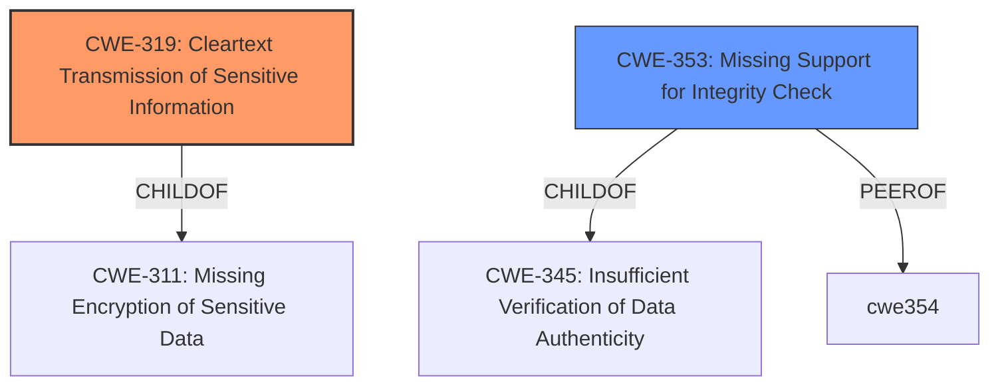

# Enhanced Analysis for CVE-2020-26140

# Summary
| CWE ID | CWE Name | Confidence | CWE Abstraction Level | CWE Vulnerability Mapping Label | CWE-Vulnerability Mapping Notes |
|---|---|---|---|---|---|
| CWE-319 | Cleartext Transmission of Sensitive Information | 0.9 | Base | Primary | Allowed |
| CWE-353 | Missing Support for Integrity Check | 0.7 | Base | Secondary | Allowed |

## Evidence and Confidence

*   **Confidence Score:** 0.8
*   **Evidence Strength:** HIGH

## Relationship Analysis
The primary relationship considered was the ChildOf relationship. CWE-319 "Cleartext Transmission of Sensitive Information" is a child of CWE-311 "Missing Encryption of Sensitive Data". However, the vulnerability description is specific about the transmission of plaintext frames, making CWE-319 a more fitting choice. Additionally, CWE-353 "Missing Support for Integrity Check" was considered due to the lack of validation, and is a peer of CWE-354 "Improper Validation of Integrity Check Value" but describes the missing check more appropriately. The base abstraction level was selected for both as these provided more specific root cause descriptions.



## Vulnerability Chain
The vulnerability chain starts with the **lack of proper encryption enforcement** and the **acceptance of unencrypted data**. This leads to the transmission of sensitive information in cleartext and allows an adversary to inject arbitrary data frames. Thus the chain would be:

1.  Missing or Improper Encryption Enforcement
2.  CWE-319 Cleartext Transmission of Sensitive Information
3.  Arbitrary Data Injection

## Summary of Analysis
The initial assessment focused on the **lack of proper encryption enforcement** and the **acceptance of unencrypted data** which leads to the possibility of arbitrary data injection, clearly indicating a **weakness** related to cleartext transmission. This is supported by the "CVE Reference Links Content Summary" section, which states, "The vulnerability exists because vulnerable Wi-Fi implementations accept data frames that are not encrypted, despite being associated with a protected network."

The retriever results also pointed to CWE-319 "Cleartext Transmission of Sensitive Information" with a high score, reinforcing this selection. Although CWE-20 "Improper Input Validation" was listed as the primary CWE Match for similar CVE Descriptions, the details of this vulnerability lean more towards the specific issue of cleartext transmission in a protected network, which is better captured by CWE-319 and the **missing support for integrity check** in CWE-353.

CWE-319 is at the Base level of abstraction, making it a preferred level for mapping. The relationship analysis showed its connection to CWE-311, but the specific nature of transmitting plaintext data makes CWE-319 a more accurate fit.

The selection of CWE-353 is based on the fact the the integrity check is missing for the data being transmitted.

The retriever results included several other CWEs, but they were not as relevant. For example, CWE-327 "Use of a Broken or Risky Cryptographic Algorithm" was considered, but the vulnerability isn't about a broken algorithm, but the **lack of encryption enforcement** and the **acceptance of unencrypted data** in the first place.

Therefore, the final decision is to map this vulnerability to CWE-319 and CWE-353, as it accurately reflects the root cause and impact of the vulnerability.


## CWE Relationship Analysis

Current CWEs represent these abstraction levels: .


### Vulnerability Chain Analysis

**Chain starting from CWE-311:**
- 311 (Missing Encryption of Sensitive Data) - ROOT


**Chain starting from CWE-354:**
- 354 (Improper Validation of Integrity Check Value) - ROOT


### CWE Relationship Diagram

```mermaid
graph TD
    classDef primary fill:#f96,stroke:#333,stroke-width:2px
    classDef secondary fill:#69f,stroke:#333
    classDef tertiary fill:#9e9,stroke:#333
```