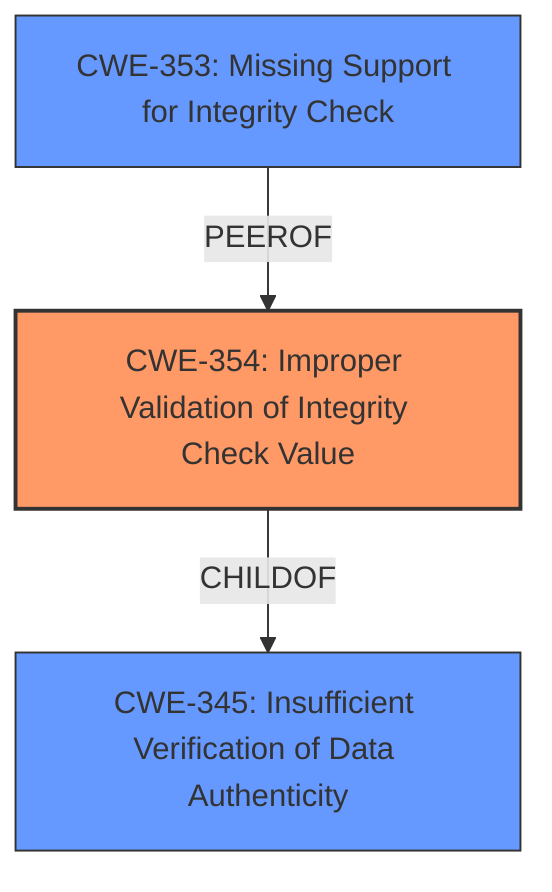

# Enhanced Analysis for CVE-2020-26141

# Summary
| CWE ID | CWE Name | Confidence | CWE Abstraction Level | CWE Vulnerability Mapping Label | CWE-Vulnerability Mapping Notes |
|---|---|---|---|---|---|
| CWE-354 | Improper Validation of Integrity Check Value | 1.0 | Base | Allowed | Primary CWE. The driver **does not verify the Message Integrity Check (authenticity) of fragmented TKIP frames**. |
| CWE-353 | Missing Support for Integrity Check | 0.7 | Base | Allowed | Secondary CWE. The Wi-Fi implementation is **missing** the expected integrity check for fragmented TKIP frames. |
| CWE-345 | Insufficient Verification of Data Authenticity | 0.5 | Class | Discouraged | Secondary CWE. There is **insufficient verification of data authenticity** since MIC is not verified for fragmented TKIP frames. |

## Evidence and Confidence

*   **Confidence Score:** 0.9
*   **Evidence Strength:** HIGH

## Relationship Analysis
The primary CWE is CWE-354 (Improper Validation of Integrity Check Value), which is a base-level CWE. CWE-354 is a child of CWE-345 (Insufficient Verification of Data Authenticity), which is a class-level CWE. CWE-353 (Missing Support for Integrity Check) is a peer of CWE-354. The choice of CWE-354 is preferred because it is a base-level CWE and accurately describes the vulnerability, where the integrity check value is not properly validated. CWE-353 is a valid secondary CWE because the support for integrity check is missing. CWE-345 is considered as a secondary CWE because it is a class-level CWE and less specific than CWE-354.



## Vulnerability Chain
The chain of root cause and weaknesses is as follows:
1.  **Root Cause:** **Missing or Improper Validation of Integrity Check Value** (CWE-354)
2.  **Weakness:** The Wi-Fi implementation **does not verify the Message Integrity Check (authenticity) of fragmented TKIP frames**.
3.  **Impact:** An adversary can inject and possibly decrypt packets in WPA or WPA2 networks that support the TKIP data-confidentiality protocol.

## Summary of Analysis
The initial assessment and conclusion are based on the provided evidence. The vulnerability description clearly states that the Wi-Fi implementation **does not verify the Message Integrity Check (authenticity) of fragmented TKIP frames**. The CVE Reference Links Content Summary also confirms this, stating that the vulnerability stems from a failure to verify the Message Integrity Check (MIC) of fragmented TKIP frames.

The graph relationships influenced the final selection by providing a hierarchical structure of the CWEs. CWE-354 is the most specific and accurate representation of the vulnerability, as it directly addresses the **improper validation of the integrity check value**.

The selected CWEs are at the optimal level of specificity because they are base-level CWEs that accurately describe the root cause of the vulnerability.

Relevant CWE Information:
*   CWE-354: Improper Validation of Integrity Check Value is selected as the primary CWE because it directly addresses the vulnerability described in the vulnerability description.
*   CWE-353: Missing Support for Integrity Check is considered as a secondary CWE because it highlights the missing integrity check mechanism.
*   CWE-345: Insufficient Verification of Data Authenticity is considered as a secondary CWE because it is a more general description of the vulnerability.

Other CWEs considered but not used:
*   CWE-327: Use of a Broken or Risky Cryptographic Algorithm - This CWE was not selected because the vulnerability is not related to the use of a broken or risky cryptographic algorithm, but rather the **failure to verify the integrity of the data**.
*   CWE-494: Download of Code Without Integrity Check - This CWE was not selected because the vulnerability is not related to the download of code without integrity check, but rather the **failure to verify the integrity of data transmitted over a Wi-Fi network**.
*   CWE-347: Improper Verification of Cryptographic Signature - This CWE was not selected because the vulnerability is not specifically related to the verification of cryptographic signatures, but rather the **more general integrity of data**.
*   CWE-924: Improper Enforcement of Message Integrity During Transmission in a Communication Channel - This CWE was not selected because the description is very close to CWE-354 and CWE-354 appears to be more specific.
*   CWE-123: Write-what-where Condition - This CWE was not selected because the vulnerability is not directly related to the ability to write an arbitrary value to an arbitrary location.
*   CWE-295: Improper Certificate Validation - This CWE was not selected because the vulnerability is not related to certificate validation.
*   CWE-1285: Improper Validation of Specified Index, Position, or Offset in Input - This CWE was not selected because the vulnerability is not related to the validation of index, position, or offset in input.
*   CWE-190: Integer Overflow or Wraparound - This CWE was not selected because the vulnerability is not related to integer overflow or wraparound.
*   CWE-1284: Improper Validation of Specified Quantity in Input - This CWE was not selected because the vulnerability is not related to validation of specified quantity in input.
*   CWE-787: Out-of-bounds Write - This CWE was not selected because the vulnerability is not related to out-of-bounds write.
*   CWE-789: Memory Allocation with Excessive Size Value - This CWE was not selected because the vulnerability is not related to memory allocation.
*   CWE-416: Use After Free - This CWE was not selected because the vulnerability is not related to use after free.
*   CWE-20: Improper Input Validation - This CWE was not selected because it is a very broad CWE and does not accurately describe the specific vulnerability.
*   CWE-345: Insufficient Verification of Data Authenticity - While relevant, CWE-354 is a more specific child of this CWE and better captures the root cause.
*   CWE-703: Improper Check or Handling of Exceptional Conditions - This CWE is too high level and does not describe the specific issue.
*   CWE-1289: Improper Validation of Unsafe Equivalence in Input - Not relevant to the vulnerability description.
*   CWE-754: Improper Check for Unusual or Exceptional Conditions - The vulnerability doesn't involve unusual or exceptional conditions.
*   CWE-755: Improper Handling of Exceptional Conditions - This CWE is too high level and does not describe the specific issue.
*   CWE-252: Unchecked Return Value - Not relevant to the vulnerability description.
*   CWE-41: Improper Resolution of Path Equivalence - Not relevant to the vulnerability description.
*   CWE-203: Observable Discrepancy - Not relevant to the vulnerability description.
*   CWE-807: Reliance on Untrusted Inputs in a Security Decision - While there is reliance on an input, the issue is more specifically about the failure to validate the integrity of the data.
*   CWE-131: Incorrect Calculation of Buffer Size - Not relevant to the vulnerability description.
*   CWE-322: Key Exchange without Entity Authentication - Not relevant to the vulnerability description.


## CWE Relationship Analysis

Current CWEs represent these abstraction levels: .


### Vulnerability Chain Analysis

**Chain starting from CWE-754:**
- 754 (Improper Check for Unusual or Exceptional Conditions) - ROOT


**Chain starting from CWE-787:**
- 787 (Out-of-bounds Write) - ROOT


### CWE Relationship Diagram

```mermaid
graph TD
    classDef primary fill:#f96,stroke:#333,stroke-width:2px
    classDef secondary fill:#69f,stroke:#333
    classDef tertiary fill:#9e9,stroke:#333
```