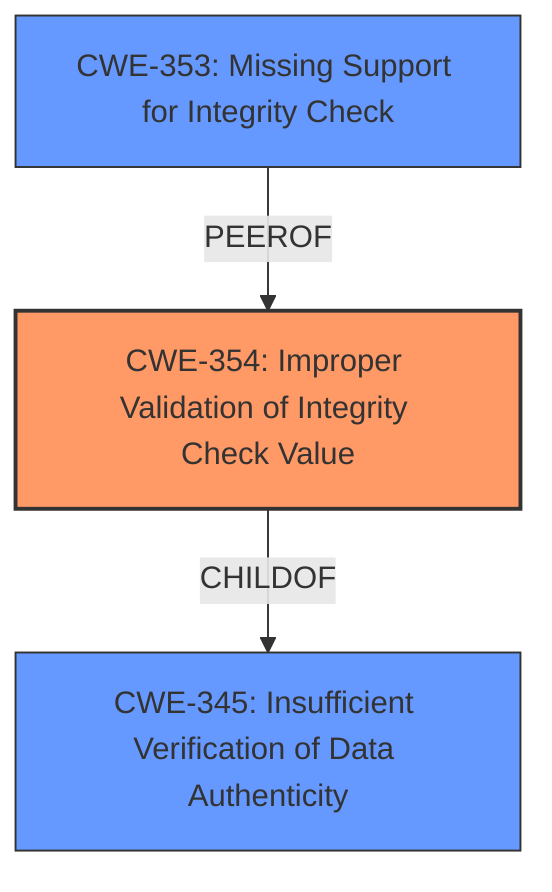

# Analysis for CVE-2020-26141

# Summary
| CWE ID | CWE Name | Confidence | CWE Abstraction Level | CWE Vulnerability Mapping Label | CWE-Vulnerability Mapping Notes |
|---|---|---|---|---|---|
| CWE-354 | Improper Validation of Integrity Check Value | 1.0 | Base | Allowed | Primary CWE. The driver **does not verify the Message Integrity Check (authenticity) of fragmented TKIP frames**. |
| CWE-353 | Missing Support for Integrity Check | 0.7 | Base | Allowed | Secondary CWE. The Wi-Fi implementation is **missing** the expected integrity check for fragmented TKIP frames. |
| CWE-345 | Insufficient Verification of Data Authenticity | 0.5 | Class | Discouraged | Secondary CWE. There is **insufficient verification of data authenticity** since MIC is not verified for fragmented TKIP frames. |

## Evidence and Confidence

*   **Confidence Score:** 0.9
*   **Evidence Strength:** HIGH

## Relationship Analysis
The primary CWE is CWE-354 (Improper Validation of Integrity Check Value), which is a base-level CWE. CWE-354 is a child of CWE-345 (Insufficient Verification of Data Authenticity), which is a class-level CWE. CWE-353 (Missing Support for Integrity Check) is a peer of CWE-354. The choice of CWE-354 is preferred because it is a base-level CWE and accurately describes the vulnerability, where the integrity check value is not properly validated. CWE-353 is a valid secondary CWE because the support for integrity check is missing. CWE-345 is considered as a secondary CWE because it is a class-level CWE and less specific than CWE-354.

## Vulnerability Chain
The chain of root cause and weaknesses is as follows:
1.  **Root Cause:** **Missing or Improper Validation of Integrity Check Value** (CWE-354)
2.  **Weakness:** The Wi-Fi implementation **does not verify the Message Integrity Check (authenticity) of fragmented TKIP frames**.
3.  **Impact:** An adversary can inject and possibly decrypt packets in WPA or WPA2 networks that support the TKIP data-confidentiality protocol.

## Summary of Analysis
The initial assessment and conclusion are based on the provided evidence. The vulnerability description clearly states that the Wi-Fi implementation **does not verify the Message Integrity Check (authenticity) of fragmented TKIP frames**. The CVE Reference Links Content Summary also confirms this, stating that the vulnerability stems from a failure to verify the Message Integrity Check (MIC) of fragmented TKIP frames.

The graph relationships influenced the final selection by providing a hierarchical structure of the CWEs. CWE-354 is the most specific and accurate representation of the vulnerability, as it directly addresses the **improper validation of the integrity check value**.

The selected CWEs are at the optimal level of specificity because they are base-level CWEs that accurately describe the root cause of the vulnerability.

Relevant CWE Information:
*   CWE-354: Improper Validation of Integrity Check Value is selected as the primary CWE because it directly addresses the vulnerability described in the vulnerability description.
*   CWE-353: Missing Support for Integrity Check is considered as a secondary CWE because it highlights the missing integrity check mechanism.
*   CWE-345: Insufficient Verification of Data Authenticity is considered as a secondary CWE because it is a more general description of the vulnerability.

Other CWEs considered but not used:
*   CWE-327: Use of a Broken or Risky Cryptographic Algorithm - This CWE was not selected because the vulnerability is not related to the use of a broken or risky cryptographic algorithm, but rather the **failure to verify the integrity of the data**.
*   CWE-494: Download of Code Without Integrity Check - This CWE was not selected because the vulnerability is not related to the download of code without integrity check, but rather the **failure to verify the integrity of data transmitted over a Wi-Fi network**.
*   CWE-347: Improper Verification of Cryptographic Signature - This CWE was not selected because the vulnerability is not specifically related to the verification of cryptographic signatures, but rather the **more general integrity of data**.
*   CWE-924: Improper Enforcement of Message Integrity During Transmission in a Communication Channel - This CWE was not selected because the description is very close to CWE-354 and CWE-354 appears to be more specific.
*   CWE-123: Write-what-where Condition - This CWE was not selected because the vulnerability is not directly related to the ability to write an arbitrary value to an arbitrary location.
*   CWE-295: Improper Certificate Validation - This CWE was not selected because the vulnerability is not related to certificate validation.
*   CWE-1285: Improper Validation of Specified Index, Position, or Offset in Input - This CWE was not selected because the vulnerability is not related to the validation of index, position, or offset in input.
*   CWE-190: Integer Overflow or Wraparound - This CWE was not selected because the vulnerability is not related to integer overflow or wraparound.
*   CWE-1284: Improper Validation of Specified Quantity in Input - This CWE was not selected because the vulnerability is not related to validation of specified quantity in input.
*   CWE-787: Out-of-bounds Write - This CWE was not selected because the vulnerability is not related to out-of-bounds write.
*   CWE-789: Memory Allocation with Excessive Size Value - This CWE was not selected because the vulnerability is not related to memory allocation.
*   CWE-416: Use After Free - This CWE was not selected because the vulnerability is not related to use after free.
*   CWE-20: Improper Input Validation - This CWE was not selected because it is a very broad CWE and does not accurately describe the specific vulnerability.
*   CWE-345: Insufficient Verification of Data Authenticity - While relevant, CWE-354 is a more specific child of this CWE and better captures the root cause.
*   CWE-703: Improper Check or Handling of Exceptional Conditions - This CWE is too high level and does not describe the specific issue.
*   CWE-1289: Improper Validation of Unsafe Equivalence in Input - Not relevant to the vulnerability description.
*   CWE-754: Improper Check for Unusual or Exceptional Conditions - The vulnerability doesn't involve unusual or exceptional conditions.
*   CWE-755: Improper Handling of Exceptional Conditions - This CWE is too high level and does not describe the specific issue.
*   CWE-252: Unchecked Return Value - Not relevant to the vulnerability description.
*   CWE-41: Improper Resolution of Path Equivalence - Not relevant to the vulnerability description.
*   CWE-203: Observable Discrepancy - Not relevant to the vulnerability description.
*   CWE-807: Reliance on Untrusted Inputs in a Security Decision - While there is reliance on an input, the issue is more specifically about the failure to validate the integrity of the data.
*   CWE-131: Incorrect Calculation of Buffer Size - Not relevant to the vulnerability description.
*   CWE-322: Key Exchange without Entity Authentication - Not relevant to the vulnerability description.

# Enhanced Query for CVE-2020-26141

## Vulnerability Description
An issue was discovered in the ALFA Windows 10 driver 6.1316.1209 for AWUS036H. The Wi-Fi implementation **does not verify the Message Integrity Check (authenticity) of fragmented TKIP frames**. An adversary can abuse this to inject and possibly decrypt packets in WPA or WPA2 networks that support the TKIP data-confidentiality protocol.

### Vulnerability Description Key Phrases
- **rootcause:** **does not verify the Message Integrity Check (authenticity) of fragmented TKIP frames**
- **impact:** inject and possibly decrypt packets
- **attacker:** adversary
- **product:** ALFA Windows 10 driver
- **version:** 6.1316.1209
- **component:** Wi-Fi implementation

## CVE Reference Links Content Summary
Based on the provided information, here's a breakdown of the vulnerability associated with CVE-2020-26141:

**Root Cause of Vulnerability:**

*   The vulnerability stems from a failure to verify the Message Integrity Check (MIC) of fragmented TKIP frames.  The Temporal Key Integrity Protocol (TKIP) is a data confidentiality protocol used in WPA and WPA2 networks.

**Weaknesses/Vulnerabilities Present:**

*   **Missing MIC Verification:** Vulnerable Wi-Fi implementations do not perform a MIC check on fragmented TKIP frames. This is a deviation from the expected security procedures where the MIC is used to verify the authenticity and integrity of data.

**Impact of Exploitation:**

*   **Packet Injection:** An attacker can inject arbitrary network packets into a WPA/WPA2 network using TKIP.
*    **Possible Decryption:** In addition to packet injection, it may also be possible to decrypt packets in the network.

**Attack Vectors:**

*   **Wireless:** The attack occurs over a wireless network connection.
*   **Fragment Manipulation:** The attack involves crafting and sending fragmented frames where the MIC verification is skipped or bypassed by the vulnerable device

**Required Attacker Capabilities/Position:**

*   **Proximity:** The attacker needs to be within the wireless range of the target network to intercept and transmit Wi-Fi signals.
*   **Knowledge of TKIP:** The attacker needs to target a WPA/WPA2 network using TKIP and manipulate fragmented data
*   **Packet Manipulation:** The attacker must be able to craft and inject malicious fragmented data frames.

**Additional Notes:**

*   The vulnerability is specific to TKIP, not CCMP or GCMP.
*   Some implementations incorrectly accept A-MSDUs encrypted with TKIP.
*   The vulnerability is categorized as an implementation flaw, and not a design flaw of the 802.11 standard itself.

The provided text also mentions other related CVEs related to frame aggregation and fragmentation vulnerabilities, but this analysis focuses specifically on **CVE-2020-26141**.

## Retriever Results

### Top Combined Results

| Rank | CWE ID | Name | Abstraction | Usage  | Retrievers | Individual Scores |
|------|--------|------|-------------|-------|------------|-------------------|
| 1 | 354 | Improper Validation of Integrity Check Value | Base | Allowed | sparse | 0.898 |
| 2 | 327 | Use of a Broken or Risky Cryptographic Algorithm | Class | Allowed-with-Review | sparse | 0.441 |
| 3 | 494 | Download of Code Without Integrity Check | Base | Allowed | sparse | 0.368 |
| 4 | 345 | Insufficient Verification of Data Authenticity | Class | Discouraged | sparse | 0.355 |
| 5 | 347 | Improper Verification of Cryptographic Signature | Base | Allowed | sparse | 0.345 |
| 6 | 924 | Improper Enforcement of Message Integrity During Transmission in a Communication Channel | Base | Allowed | dense | 0.494 |
| 7 | 123 | Write-what-where Condition | Base | Allowed | graph | 0.002 |
| 8 | 353 | Missing Support for Integrity Check | Base | Allowed | sparse | 0.341 |
| 9 | 295 | Improper Certificate Validation | Base | Allowed | sparse | 0.340 |
| 10 | 1285 | Improper Validation of Specified Index, Position, or Offset in Input | Base | Allowed | sparse | 0.335 |

# Complete CWE Specifications

## CWE-354: Improper Validation of Integrity Check Value
**Abstraction:** Base
**Status:** Draft

### Description
The product does not validate or incorrectly validates the integrity check values or "checksums" of a message. This may prevent it from detecting if the data has been modified or corrupted in transmission.

### Extended Description
Improper validation of checksums before use results in an unnecessary risk that can easily be mitigated. The protocol specification describes the algorithm used for calculating the checksum. It is then a simple matter of implementing the calculation and verifying that the calculated checksum and the received checksum match. Improper verification of the calculated checksum and the received checksum can lead to far greater consequences.

### Alternative Terms
None

### Relationships
ChildOf -> CWE-345
ChildOf -> CWE-345
ChildOf -> CWE-754
PeerOf -> CWE-353

### Mapping Guidance
**Usage:** Allowed
**Rationale:** This CWE entry is at the Base level of abstraction, which is a preferred level of abstraction for mapping to the root causes of vulnerabilities.
**Comments:** Carefully read both the name and description to ensure that this mapping is an appropriate fit. Do not try to 'force' a mapping to a lower-level Base/Variant simply to comply with this preferred level of abstraction.
**Reasons:**
- Acceptable-Use

## CWE-327: Use of a Broken or Risky Cryptographic Algorithm
**Abstraction:** Class
**Status:** Draft

### Description
The product uses a broken or risky cryptographic algorithm or protocol.

### Extended Description

Cryptographic algorithms are the methods by which data is scrambled to prevent observation or influence by unauthorized actors. Insecure cryptography can be exploited to expose sensitive information, modify data in unexpected ways, spoof identities of other users or devices, or other impacts.

It is very difficult to produce a secure algorithm, and even high-profile algorithms by accomplished cryptographic experts have been broken. Well-known techniques exist to break or weaken various kinds of cryptography. Accordingly, there are a small number of well-understood and heavily studied algorithms that should be used by most products. Using a non-standard or known-insecure algorithm is dangerous because a determined adversary may be able to break the algorithm and compromise whatever data has been protected.

Since the state of cryptography advances so rapidly, it is common for an algorithm to be considered "unsafe" even if it was once thought to be strong. This can happen when new attacks are discovered, or if computing power increases so much that the cryptographic algorithm no longer provides the amount of protection that was originally thought.

For a number of reasons, this weakness is even more challenging to manage with hardware deployment of cryptographic algorithms as opposed to software implementation. First, if a flaw is discovered with hardware-implemented cryptography, the flaw cannot be fixed in most cases without a recall of the product, because hardware is not easily replaceable like software. Second, because the hardware product is expected to work for years, the adversary's computing power will only increase over time.

### Alternative Terms
None

### Relationships
ChildOf -> CWE-693
PeerOf -> CWE-311

### Mapping Guidance
**Usage:** Allowed-with-Review
**Rationale:** This CWE entry is a Class and might have Base-level children that would be more appropriate
**Comments:** Examine children of this entry to see if there is a better fit
**Reasons:**
- Abstraction

### Additional Notes
**[Maintenance]** Since CWE 4.4, various cryptography-related entries, including CWE-327 and CWE-1240, have been slated for extensive research, analysis, and community consultation to define consistent terminology, improve relationships, and reduce overlap or duplication. As of CWE 4.6, this work is still ongoing.

**[Maintenance]** The Taxonomy_Mappings to ISA/IEC 62443 were added in CWE 4.10, but they are still under review and might change in future CWE versions. These draft mappings were performed by members of the "Mapping CWE to 62443" subgroup of the CWE-CAPEC ICS/OT Special Interest Group (SIG), and their work is incomplete as of CWE 4.10. The mappings are included to facilitate discussion and review by the broader ICS/OT community, and they are likely to change in future CWE versions.

### Observed Examples
- **CVE-2022-30273:** SCADA-based protocol supports a legacy encryption mode that uses Tiny Encryption Algorithm (TEA) in ECB mode, which leaks patterns in messages and cannot protect integrity
- **CVE-2022-30320:** Programmable Logic Controller (PLC) uses a protocol with a cryptographically insecure hashing algorithm for passwords.
- **CVE-2008-3775:** Product uses "ROT-25" to obfuscate the password in the registry.

## CWE-494: Download of Code Without Integrity Check
**Abstraction:** Base
**Status:** Draft

### Description
The product downloads source code or an executable from a remote location and executes the code without sufficiently verifying the origin and integrity of the code.

### Extended Description
An attacker can execute malicious code by compromising the host server, performing DNS spoofing, or modifying the code in transit.

### Alternative Terms
None

### Relationships
ChildOf -> CWE-345
ChildOf -> CWE-669
ChildOf -> CWE-669

### Mapping Guidance
**Usage:** Allowed
**Rationale:** This CWE entry is at the Base level of abstraction, which is a preferred level of abstraction for mapping to the root causes of vulnerabilities.
**Comments:** Carefully read both the name and description to ensure that this mapping is an appropriate fit. Do not try to 'force' a mapping to a lower-level Base/Variant simply to comply with this preferred level of abstraction.
**Reasons:**
- Acceptable-Use

### Additional Notes
**[Research Gap]** This is critical for mobile code, but it is likely to become more and more common as developers continue to adopt automated, network-based product distributions and upgrades. Software-as-a-Service (SaaS) might introduce additional subtleties. Common exploitation scenarios may include ad server compromises and bad upgrades.

### Observed Examples
- **CVE-2019-9534:** Satellite phone does not validate its firmware image.
- **CVE-2021-22909:** Chain: router's firmware update procedure uses curl with "-k" (insecure) option that disables certificate validation (CWE-295), allowing adversary-in-the-middle (AITM) compromise with a malicious firmware image (CWE-494).
- **CVE-2008-3438:** OS does not verify authenticity of its own updates.

## CWE-345: Insufficient Verification of Data Authenticity
**Abstraction:** Class
**Status:** Draft

### Description
The product does not sufficiently verify the origin or authenticity of data, in a way that causes it to accept invalid data.

### Extended Description
Not provided

### Alternative Terms
None

### Relationships
ChildOf -> CWE-693

### Mapping Guidance
**Usage:** Discouraged
**Rationale:** This CWE entry is a level-1 Class (i.e., a child of a Pillar). It might have lower-level children that would be more appropriate
**Comments:** Examine children of this entry to see if there is a better fit
**Reasons:**
- Abstraction

### Additional Notes
**[Relationship]** "origin validation" could fall under this.

**[Maintenance]** The specific ways in which the origin is not properly identified should be laid out as separate weaknesses. In some sense, this is more like a category.

### Observed Examples
- **CVE-2022-30260:** Distributed Control System (DCS) does not sign firmware images and only relies on insecure checksums for integrity checks
- **CVE-2022-30267:** Distributed Control System (DCS) does not sign firmware images and only relies on insecure checksums for integrity checks
- **CVE-2022-30272:** Remote Terminal Unit (RTU) does not use signatures for firmware images and relies on insecure checksums

## CWE-347: Improper Verification of Cryptographic Signature
**Abstraction:** Base
**Status:** Draft

### Description
The product does not verify, or incorrectly verifies, the cryptographic signature for data.

### Extended Description
Not provided

### Alternative Terms
None

### Relationships
ChildOf -> CWE-345
ChildOf -> CWE-345

### Mapping Guidance
**Usage:** Allowed
**Rationale:** This CWE entry is at the Base level of abstraction, which is a preferred level of abstraction for mapping to the root causes of vulnerabilities.
**Comments:** Carefully read both the name and description to ensure that this mapping is an appropriate fit. Do not try to 'force' a mapping to a lower-level Base/Variant simply to comply with this preferred level of abstraction.
**Reasons:**
- Acceptable-Use

### Observed Examples
- **CVE-2002-1796:** Does not properly verify signatures for "trusted" entities.
- **CVE-2005-2181:** Insufficient verification allows spoofing.
- **CVE-2005-2182:** Insufficient verification allows spoofing.

## CWE-924: Improper Enforcement of Message Integrity During Transmission in a Communication Channel
**Abstraction:** Base
**Status:** Incomplete

### Description
The product establishes a communication channel with an endpoint and receives a message from that endpoint, but it does not sufficiently ensure that the message was not modified during transmission.

### Extended Description
Attackers might be able to modify the message and spoof the endpoint by interfering with the data as it crosses the network or by redirecting the connection to a system under their control.

### Alternative Terms
None

### Relationships
ChildOf -> CWE-345
ChildOf -> CWE-345

### Mapping Guidance
**Usage:** Allowed
**Rationale:** This CWE entry is at the Base level of abstraction, which is a preferred level of abstraction for mapping to the root causes of vulnerabilities.
**Comments:** Carefully read both the name and description to ensure that this mapping is an appropriate fit. Do not try to 'force' a mapping to a lower-level Base/Variant simply to comply with this preferred level of abstraction.
**Reasons:**
- Acceptable-Use

### Additional Notes
**[Maintenance]** This entry should be made more comprehensive in later CWE versions, as it is likely an important design flaw that underlies (or chains to) other weaknesses.

## CWE-123: Write-what-where Condition
**Abstraction:** Base
**Status:** Draft

### Description
Any condition where the attacker has the ability to write an arbitrary value to an arbitrary location, often as the result of a buffer overflow.

### Extended Description
Not provided

### Alternative Terms
None

### Relationships
ChildOf -> CWE-787
ChildOf -> CWE-119
ChildOf -> CWE-119

### Mapping Guidance
**Usage:** Allowed
**Rationale:** This CWE entry is at the Base level of abstraction, which is a preferred level of abstraction for mapping to the root causes of vulnerabilities.
**Comments:** Carefully read both the name and description to ensure that this mapping is an appropriate fit. Do not try to 'force' a mapping to a lower-level Base/Variant simply to comply with this preferred level of abstraction.
**Reasons:**
- Acceptable-Use

### Observed Examples
- **CVE-2022-21668:** Chain: Python library does not limit the resources used to process images that specify a very large number of bands (CWE-1284), leading to excessive memory consumption (CWE-789) or an integer overflow (CWE-190).
- **CVE-2022-0545:** Chain: 3D renderer has an integer overflow (CWE-190) leading to write-what-where condition (CWE-123) using a crafted image.

## CWE-353: Missing Support for Integrity Check
**Abstraction:** Base
**Status:** Draft

### Description
The product uses a transmission protocol that does not include a mechanism for verifying the integrity of the data during transmission, such as a checksum.

### Extended Description
If integrity check values or "checksums" are omitted from a protocol, there is no way of determining if data has been corrupted in transmission. The lack of checksum functionality in a protocol removes the first application-level check of data that can be used. The end-to-end philosophy of checks states that integrity checks should be performed at the lowest level that they can be completely implemented. Excluding further sanity checks and input validation performed by applications, the protocol's checksum is the most important level of checksum, since it can be performed more completely than at any previous level and takes into account entire messages, as opposed to single packets.

### Alternative Terms
None

### Relationships
ChildOf -> CWE-345
PeerOf -> CWE-354

### Mapping Guidance
**Usage:** Allowed
**Rationale:** This CWE entry is at the Base level of abstraction, which is a preferred level of abstraction for mapping to the root causes of vulnerabilities.
**Comments:** Carefully read both the name and description to ensure that this mapping is an appropriate fit. Do not try to 'force' a mapping to a lower-level Base/Variant simply to comply with this preferred level of abstraction.
**Reasons:**
- Acceptable-Use

## CWE-295: Improper Certificate Validation
**Abstraction:** Base
**Status:** Draft

### Description
The product does not validate, or incorrectly validates, a certificate.

### Extended Description
When a certificate is invalid or malicious, it might allow an attacker to spoof a trusted entity by interfering in the communication path between the host and client. The product might connect to a malicious host while believing it is a trusted host, or the product might be deceived into accepting spoofed data that appears to originate from a trusted host.

### Alternative Terms
None

### Relationships
ChildOf -> CWE-287
ChildOf -> CWE-287
PeerOf -> CWE-322

### Mapping Guidance
**Usage:** Allowed
**Rationale:** This CWE entry is at the Base level of abstraction, which is a preferred level of abstraction for mapping to the root causes of vulnerabilities.
**Comments:** Carefully read both the name and description to ensure that this mapping is an appropriate fit. Do not try to 'force' a mapping to a lower-level Base/Variant simply to comply with this preferred level of abstraction.
**Reasons:**
- Acceptable-Use

### Observed Examples
- **CVE-2019-12496:** A Go framework for robotics, drones, and IoT devices skips verification of root CA certificates by default.
- **CVE-2014-1266:** chain: incorrect "goto" in Apple SSL product bypasses certificate validation, allowing Adversary-in-the-Middle (AITM) attack (Apple "goto fail" bug). CWE-705 (Incorrect Control Flow Scoping) -> CWE-561 (Dead Code) -> CWE-295 (Improper Certificate Validation) -> CWE-393 (Return of Wrong Status Code) -> CWE-300 (Channel Accessible by Non-Endpoint).
- **CVE-2021-22909:** Chain: router's firmware update procedure uses curl with "-k" (insecure) option that disables certificate validation (CWE-295), allowing adversary-in-the-middle (AITM) compromise with a malicious firmware image (CWE-494).

## CWE-1285: Improper Validation of Specified Index, Position, or Offset in Input
**Abstraction:** Base
**Status:** Incomplete

### Description
The product receives input that is expected to specify an index, position, or offset into an indexable resource such as a buffer or file, but it does not validate or incorrectly validates that the specified index/position/offset has the required properties.

### Extended Description

Often, indexable resources such as memory buffers or files can be accessed using a specific position, index, or offset, such as an index for an array or a position for a file. When untrusted input is not properly validated before it is used as an index, attackers could access (or attempt to access) unauthorized portions of these resources. This could be used to cause buffer overflows, excessive resource allocation, or trigger unexpected failures. 

### Alternative Terms
None

### Relationships
ChildOf -> CWE-20

### Mapping Guidance
**Usage:** Allowed
**Rationale:** This CWE entry is at the Base level of abstraction, which is a preferred level of abstraction for mapping to the root causes of vulnerabilities.
**Comments:** Carefully read both the name and description to ensure that this mapping is an appropriate fit. Do not try to 'force' a mapping to a lower-level Base/Variant simply to comply with this preferred level of abstraction.
**Reasons:**
- Acceptable-Use

### Additional Notes
**[Maintenance]** This entry is still under development and will continue to see updates and content improvements.

### Observed Examples
- **CVE-2005-0369:** large ID in packet used as array index
- **CVE-2001-1009:** negative array index as argument to POP LIST command

