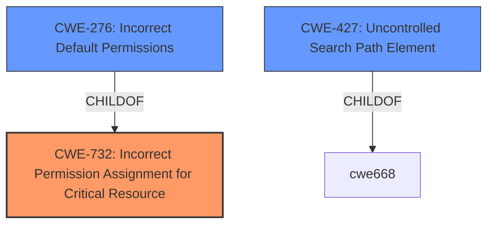

# Raw Analyzer Response for CVE-2020-26155

# Summary
| CWE ID | CWE Name | Confidence | CWE Abstraction Level | CWE Vulnerability Mapping Label | CWE-Vulnerability Mapping Notes |
|---|---|---|---|---|---|
| CWE-732 | Incorrect Permission Assignment for Critical Resource | 1.0 | Class | Allowed-with-Review | Primary CWE |
| CWE-427 | Uncontrolled Search Path Element | 0.9 | Base | Allowed | Secondary Candidate |

## Evidence and Confidence

*   **Confidence Score:** 0.95
*   **Evidence Strength:** HIGH

## Relationship Analysis
The primary relationship influencing the CWE selection is the parent-child relationship between CWE-732 and its potential children. While CWE-276 (Incorrect Default Permissions) is a child of CWE-732, it's more specific and focuses solely on installation-time permissions. The vulnerability involves weak permissions on critical resources allowing manipulation, which aligns better with CWE-732. CWE-427 (Uncontrolled Search Path Element) is related due to the DLL hijacking aspect, but it's a separate weakness resulting from the initial permission issue.

## Vulnerability Chain
The vulnerability chain starts with **incorrect permission assignment** (CWE-732), leading to the ability to **manipulate binaries**, which then enables a **DLL hijacking attack** (CWE-427).

## Summary of Analysis
The initial assessment focused on the **root cause** of the vulnerability: **"Multiple files and folders are installed with Read/Write permissions."** The description and the CVE reference summary both highlight **insecure file/folder permissions** as the core issue.

CWE-732 (Incorrect Permission Assignment for Critical Resource) is selected as the primary CWE because it accurately reflects the **root cause** of the vulnerability: a critical resource (files and folders) has been assigned permissions that allow unintended actors (non-administrator users) to modify them. The CVE Reference Links Content Summary explicitly states that the vulnerability is due to "weak folder permissions." This aligns perfectly with the description of CWE-732. Confidence in this mapping is high (1.0).

CWE-427 (Uncontrolled Search Path Element) is added as a secondary CWE because the weak permissions, in conjunction with modifications to the PATH environment variable, leads to a DLL hijacking vulnerability. This represents a separate but related weakness. The vulnerability description mentions "entries are made to the PATH environment variable which, in conjunction with these weak permissions, could enable an attacker to perform a DLL hijacking attack." This provides strong evidence for the presence of CWE-427. Confidence in this mapping is high (0.9).

CWE-276 (Incorrect Default Permissions) was considered but rejected because while it is related to permissions, it focuses on permissions set *during installation*. The provided vulnerability description and CVE details indicate that the problem isn't just about default install permissions but about the broader assignment of read/write permissions to authenticated users for critical resources, making CWE-732 a more appropriate fit.

Relevant CWE Information:

# Enhanced Context (25 CWEs)
The following CWEs were identified as potentially relevant to this vulnerability:

## CWE-59: Improper Link Resolution Before File Access ('Link Following')
**Abstraction Level**: Base
**Similarity Score**: 0.80
**Source**: dense

**Description**:
The product attempts to access a file based on the filename, but it does not properly prevent that filename from identifying a link or shortcut that resolves to an unintended resource.

**Mapping Guidance**:
- Usage: Allowed
- Rationale: This CWE entry is at the Base level of abstraction, which is a preferred level of abstraction for mapping to the root causes of vulnerabilities.

## CWE-266: Incorrect Privilege Assignment
**Abstraction Level**: Base
**Similarity Score**: 0.80
**Source**: dense

**Description**:
A product incorrectly assigns a privilege to a particular actor, creating an unintended sphere of control for that actor.

**Mapping Guidance**:
- Usage: Allowed
- Rationale: This CWE entry is at the Base level of abstraction, which is a preferred level of abstraction for mapping to the root causes of vulnerabilities.

## CWE-274: Improper Handling of Insufficient Privileges
**Abstraction Level**: Base
**Similarity Score**: 0.79
**Source**: dense

**Description**:
The product does not handle or incorrectly handles when it has insufficient privileges to perform an operation, leading to resultant weaknesses.

**Mapping Guidance**:
- Usage: Discouraged
- Rationale: This CWE entry could be deprecated in a future version of CWE.

## CWE-23: Relative Path Traversal
**Abstraction Level**: Base
**Similarity Score**: 0.79
**Source**: dense

**Description**:
The product uses external input to construct a pathname that should be within a restricted directory, but it does not properly neutralize sequences such as ".." that can resolve to a location that is outside of that directory.

**Mapping Guidance**:
- Usage: Allowed
- Rationale: This CWE entry is at the Base level of abstraction, which is a preferred level of abstraction for mapping to the root causes of vulnerabilities.

## CWE-267: Privilege Defined With Unsafe Actions
**Abstraction Level**: Base
**Similarity Score**: 0.78
**Source**: dense

**Description**:
A particular privilege, role, capability, or right can be used to perform unsafe actions that were not intended, even when it is assigned to the correct entity.

**Mapping Guidance**:
- Usage: Allowed
- Rationale: This CWE entry is at the Base level of abstraction, which is a preferred level of abstraction for mapping to the root causes of vulnerabilities.

## CWE-276: Incorrect Default Permissions
**Abstraction Level**: Base
**Similarity Score**: 0.78
**Source**: dense

**Description**:
During installation, installed file permissions are set to allow anyone to modify those files.

**Mapping Guidance**:
- Usage: Allowed
- Rationale: This CWE entry is at the Base level of abstraction, which is a preferred level of abstraction for mapping to the root causes of vulnerabilities.

## CWE-668: Exposure of Resource to Wrong Sphere
**Abstraction Level**: Class
**Similarity Score**: 0.78
**Source**: dense

**Description**:
The product exposes a resource to the wrong control sphere, providing unintended actors with inappropriate access to the resource.

**Mapping Guidance**:
- Usage: Discouraged
- Rationale: CWE-668 is high-level and is often misused as a catch-all when lower-level CWE IDs might be applicable. It is sometimes used for low-information vulnerability reports [REF-1287]. It is a level-1 Class (i.e., a child of a Pillar). It is not useful for trend analysis.

## CWE-280: Improper Handling of Insufficient Permissions or Privileges 
**Abstraction Level**: Base
**Similarity Score**: 0.78
**Source**: dense

**Description**:
The product does not handle or incorrectly handles when it has insufficient privileges to access resources or functionality as specified by their permissions. This may cause it to follow unexpected code paths that may leave the product in an invalid state.

**Mapping Guidance**:
- Usage: Allowed
- Rationale: This CWE entry is at the Base level of abstraction, which is a preferred level of abstraction for mapping to the root causes of vulnerabilities.

## CWE-73: External Control of File Name or Path
**Abstraction Level**: Base
**Similarity Score**: 0.78
**Source**: dense

**Description**:
The product allows user input to control or influence paths or file names that are used in filesystem operations.

**Mapping Guidance**:
- Usage: Allowed
- Rationale: This CWE entry is at the Base level of abstraction, which is a preferred level of abstraction for mapping to the root causes of vulnerabilities.

## CWE-41: Improper Resolution of Path Equivalence
**Abstraction Level**: Base
**Similarity Score**: 0.78
**Source**: dense

**Description**:
The product is vulnerable to file system contents disclosure through path equivalence. Path equivalence involves the use of special characters in file and directory names. The associated manipulations are intended to generate multiple names for the same object.

**Mapping Guidance**:
- Usage: Allowed
- Rationale: This CWE entry is at the Base level of abstraction, which is a preferred level of abstraction for mapping to the root causes of vulnerabilities.

## CWE-427: Uncontrolled Search Path Element
**Abstraction Level**: Base
**Similarity Score**: 6789.68
**Source**: sparse

**Description**:
The product uses a fixed or controlled search path to find resources, but one or more locations in that path