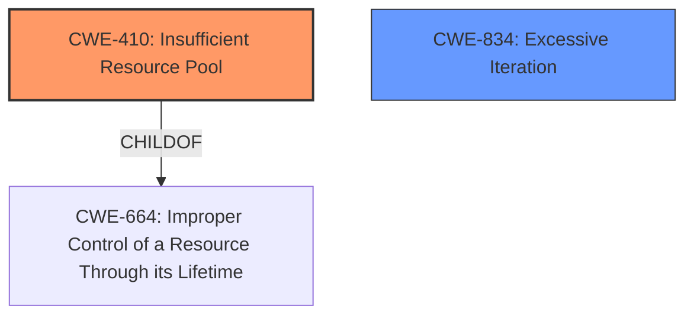

# Analysis for CVE-2020-26195

# Summary
| CWE ID | CWE Name | Confidence | CWE Abstraction Level | CWE Vulnerability Mapping Label | CWE-Vulnerability Mapping Notes |
|---|---|---|---|---|---|
| CWE-410 | Insufficient Resource Pool | 0.8 | Base | Primary | Allowed |
| CWE-834 | Excessive Iteration | 0.6 | Class | Secondary | Discouraged |

## Evidence and Confidence

*   **Confidence Score:** 0.7
*   **Evidence Strength:** MEDIUM

## Relationship Analysis
The primary relationship influencing the decision is the ChildOf relationship between CWE-410 (Insufficient Resource Pool) and CWE-664 (Improper Control of a Resource Through its Lifetime). While CWE-664 is too general (Pillar), CWE-410 provides a more specific Base-level classification. CWE-834 (Excessive Iteration) is also related, as it can lead to resource exhaustion, but it's a Class-level CWE and doesn't directly describe the resource pool issue.



## Vulnerability Chain
The vulnerability chain involves an **erroneous directory creation** due to an unspecified error in the SMB auto-create feature, which leads to **resource consumption** and ultimately a **slowdown of the system**. The **root cause** seems to be the potential **insufficient resource pool** to handle the **excessive directory creation**.
1.  **Incorrect SMB directory creation** (Root Cause - Underlying issue unspecified).
2.  **Excessive directory creation** (Contributes to Resource Exhaustion).
3.  **Insufficient Resource Pool** (CWE-410) leading to inability to handle the load.
4.  **Slowdown of the system** (Impact).

## Summary of Analysis
The initial analysis focused on the **impact** of slowing down the system. However, by examining the root cause from the "CVE Reference Links Content Summary", the **erroneous directory creation** points to a potential **insufficient resource pool**. The analysis is heavily based on the CVE Reference Links Content Summary which stated the root cause stems from OneFS SMB directory auto-create feature which may erroneously create a directory for a user. This leads to unnecessary directories being created causing resource consumption and slowing down the system.

The **weakness** is that the system does not sufficiently limit the directory creation which could be caused by an insufficient resource pool.

CWE-410 fits the description because "The product's resource pool is not large enough to handle peak demand, which allows an attacker to prevent others from accessing the resource by using a (relatively) large number of requests for resources." The vulnerability description mentions that an unauthenticated attacker can slow down the system by causing the system to create directories. This is a strong indicator of CWE-410.

CWE-834 was considered because excessive iteration can lead to resource exhaustion. However, it is a Class level and does not directly address the resource pool issue.

Relevant CWE Information:

# Enhanced Context (25 CWEs)

## CWE-41: Improper Resolution of Path Equivalence
**Abstraction Level**: Base
**Similarity Score**: 0.78
**Source**: dense

**Description**:
The product is vulnerable to file system contents disclosure through path equivalence. Path equivalence involves the use of special characters in file and directory names. The associated manipulations are intended to generate multiple names for the same object.

**Mapping Guidance**:
- Usage: Allowed
- Rationale: This CWE entry is at the Base level of abstraction, which is a preferred level of abstraction for mapping to the root causes of vulnerabilities.

## CWE-23: Relative Path Traversal
**Abstraction Level**: Base
**Similarity Score**: 0.77
**Source**: dense

**Description**:
The product uses external input to construct a pathname that should be within a restricted directory, but it does not properly neutralize sequences such as ".." that can resolve to a location that is outside of that directory.

**Mapping Guidance**:
- Usage: Allowed
- Rationale: This CWE entry is at the Base level of abstraction, which is a preferred level of abstraction for mapping to the root causes of vulnerabilities.

## CWE-664: Improper Control of a Resource Through its Lifetime
**Abstraction Level**: Pillar
**Similarity Score**: 0.76
**Source**: dense

**Description**:
The product does not maintain or incorrectly maintains control over a resource throughout its lifetime of creation, use, and release.

**Mapping Guidance**:
- Usage: Discouraged
- Rationale: This CWE entry is high-level when lower-level children are available.

## CWE-73: External Control of File Name or Path
**Abstraction Level**: Base
**Similarity Score**: 0.76
**Source**: dense

**Description**:
The product allows user input to control or influence paths or file names that are used in filesystem operations.

**Mapping Guidance**:
- Usage: Allowed
- Rationale: This CWE entry is at the Base level of abstraction, which is a preferred level of abstraction for mapping to the root causes of vulnerabilities.

## CWE-668: Exposure of Resource to Wrong Sphere
**Abstraction Level**: Class
**Similarity Score**: 0.76
**Source**: dense

**Description**:
The product exposes a resource to the wrong control sphere, providing unintended actors with inappropriate access to the resource.

**Mapping Guidance**:
- Usage: Discouraged
- Rationale: CWE-668 is high-level and is often misused as a catch-all when lower-level CWE IDs might be applicable. It is sometimes used for low-information vulnerability reports [REF-1287]. It is a level-1 Class (i.e., a child of a Pillar). It is not useful for trend analysis.

## CWE-59: Improper Link Resolution Before File Access ('Link Following')
**Abstraction Level**: Base
**Similarity Score**: 0.76
**Source**: dense

**Description**:
The product attempts to access a file based on the filename, but it does not properly prevent that filename from identifying a link or shortcut that resolves to an unintended resource.

**Mapping Guidance**:
- Usage: Allowed
- Rationale: This CWE entry is at the Base level of abstraction, which is a preferred level of abstraction for mapping to the root causes of vulnerabilities.

## CWE-691: Insufficient Control Flow Management
**Abstraction Level**: Pillar
**Similarity Score**: 0.75
**Source**: dense

**Description**:
The code does not sufficiently manage its control flow during execution, creating conditions in which the control flow can be modified in unexpected ways.

**Mapping Guidance**:
- Usage: Discouraged
- Rationale: This CWE entry is extremely high-level, a Pillar. However, classification research is limited for weaknesses of this type, so there can be gaps or organizational difficulties within CWE that force use of this weakness, even at such a high level of abstraction.

## CWE-667: Improper Locking
**Abstraction Level**: Class
**Similarity Score**: 0.75
**Source**: dense

**Description**:
The product does not properly acquire or release a lock on a resource, leading to unexpected resource state changes and behaviors.

**Mapping Guidance**:
- Usage: Allowed-with-Review
- Rationale: This CWE entry is a Class and might have Base-level children that would be more appropriate

## CWE-834: Excessive Iteration
**Abstraction Level**: Class
**Similarity Score**: 0.75
**Source**: dense

**Description**:
The product performs an iteration or loop without sufficiently limiting the number of times that the loop is executed.

**Mapping Guidance**:
- Usage: Discouraged
- Rationale: This CWE entry is a level-1 Class (i.e., a child of a Pillar). It might have lower-level children that would be more appropriate

## CWE-799: Improper Control of Interaction Frequency
**Abstraction Level**: Class
**Similarity Score**: 0.75
**Source**: dense

**Description**:
The product does not properly limit the number or frequency of interactions that it has with an actor, such as the number of incoming requests.

**Mapping Guidance**:
- Usage: Allowed-with-Review
- Rationale: This CWE entry is a Class and might have Base-level children that would be more appropriate

## CWE-22: Improper Limitation of a Pathname to a Restricted Directory ('Path Traversal')
**Abstraction Level**: Base
**Similarity Score**: 4887.15
**Source**: sparse

**Description**:
The product uses external input to construct a pathname that is intended to identify a file or directory that is located underneath a restricted parent directory, but the product does not properly neutralize special elements within the pathname that can cause

# Enhanced Query for CVE-2020-26195

## Vulnerability Description
Dell EMC PowerScale OneFS versions 8.1.2 9.1.0 contain an issue where the OneFS SMB directory auto-create may erroneously create a directory for a user. A remote unauthenticated attacker may take advantage of this issue to slow down the system.

### Vulnerability Description Key Phrases
- **impact:** slow down the system
- **attacker:** remote unauthenticated attacker
- **product:** Dell EMC PowerScale OneFS
- **version:** 8.1.2 to 9.1.0
- **component:** OneFS SMB directory auto-create

## CVE Reference Links Content Summary
Based on the provided content, here's a breakdown of the vulnerability information for CVE-2020-26195:

**Root Cause of Vulnerability:**
- The vulnerability stems from an issue in Dell EMC PowerScale OneFS where the SMB directory auto-create feature may erroneously create a directory for a user.

**Weaknesses/Vulnerabilities Present:**
- Incorrect SMB directory creation.
- The system might create unnecessary directories due to the issue, which leads to resource consumption.

**Impact of Exploitation:**
- A remote unauthenticated attacker can exploit this issue to slow down the system, by causing the system to create directories.

**Attack Vectors:**
- Remote exploitation over the network through SMB.

**Required Attacker Capabilities/Position:**
- The attacker needs to be on the network to trigger SMB directory creation.
- No authentication is required to exploit this vulnerability.

**Affected versions:**
- Dell EMC PowerScale OneFS versions 8.1.2 – 9.1.0

**Mitigation:**
- Upgrade to the January 2021 RUP for the respective OneFS version.

**CVSS Score:**
- 5.3
- CVSS:3.1/AV:N/AC:L/PR:N/UI:N/S:U/C:N/I:N/A:L

## Retriever Results

### Top Combined Results

| Rank | CWE ID | Name | Abstraction | Usage  | Retrievers | Individual Scores |
|------|--------|------|-------------|-------|------------|-------------------|
| 1 | 280 | Improper Handling of Insufficient Permissions or Privileges  | Base | Allowed | sparse | 0.127 |
| 2 | 261 | Weak Encoding for Password | Base | Allowed | sparse | 0.081 |
| 3 | 379 | Creation of Temporary File in Directory with Insecure Permissions | Base | Allowed | sparse | 0.080 |
| 4 | 378 | Creation of Temporary File With Insecure Permissions | Base | Allowed | sparse | 0.078 |
| 5 | 410 | Insufficient Resource Pool | Base | Allowed | sparse | 0.078 |
| 6 | 842 | Placement of User into Incorrect Group | Base | Allowed | dense | 0.477 |
| 7 | 73 | External Control of File Name or Path | Base | Allowed | graph | 0.002 |
| 8 | 23 | Relative Path Traversal | Base | Allowed | sparse | 0.078 |
| 9 | 286 | Incorrect User Management | Class | Allowed-with-Review | sparse | 0.077 |
| 10 | 834 | Excessive Iteration | Class | Discouraged | sparse | 0.077 |


# Complete CWE Specifications


## CWE-280: Improper Handling of Insufficient Permissions or Privileges 
**Abstraction:** Base
**Status:** Draft

### Description
The product does not handle or incorrectly handles when it has insufficient privileges to access resources or functionality as specified by their permissions. This may cause it to follow unexpected code paths that may leave the product in an invalid state.

### Extended Description
Not provided

### Alternative Terms
None

### Relationships
ChildOf -> CWE-755

### Mapping Guidance
**Usage:** Allowed
**Rationale:** This CWE entry is at the Base level of abstraction, which is a preferred level of abstraction for mapping to the root causes of vulnerabilities.
**Comments:** Carefully read both the name and description to ensure that this mapping is an appropriate fit. Do not try to 'force' a mapping to a lower-level Base/Variant simply to comply with this preferred level of abstraction.
**Reasons:**
- Acceptable-Use


### Additional Notes
**[Maintenance]** CWE-280 and CWE-274 are too similar. It is likely that CWE-274 will be deprecated in the future.

**[Relationship]** This can be both primary and resultant. When primary, it can expose a variety of weaknesses because a resource might not have the expected state, and subsequent operations might fail. It is often resultant from Unchecked Error Condition (CWE-391).

**[Theoretical]** Within the context of vulnerability theory, privileges and permissions are two sides of the same coin. Privileges are associated with actors, and permissions are associated with resources. To perform access control, at some point the software makes a decision about whether the actor (and the privileges that have been assigned to that actor) is allowed to access the resource (based on the permissions that have been specified for that resource).

**[Research Gap]** This type of issue is under-studied, since researchers often concentrate on whether an object has too many permissions, instead of not enough. These weaknesses are likely to appear in environments with fine-grained models for permissions and privileges, which can include operating systems and other large-scale software packages. However, even highly simplistic permission/privilege models are likely to contain these issues if the developer has not considered the possibility of access failure.


### Observed Examples
- **CVE-2003-0501:** Special file system allows attackers to prevent ownership/permission change of certain entries by opening the entries before calling a setuid program.
- **CVE-2004-0148:** FTP server places a user in the root directory when the user's permissions prevent access to the their own home directory.


## CWE-261: Weak Encoding for Password
**Abstraction:** Base
**Status:** Incomplete

### Description
Obscuring a password with a trivial encoding does not protect the password.

### Extended Description
Password management issues occur when a password is stored in plaintext in an application's properties or configuration file. A programmer can attempt to remedy the password management problem by obscuring the password with an encoding function, such as base 64 encoding, but this effort does not adequately protect the password.

### Alternative Terms
None

### Relationships
ChildOf -> CWE-522

### Mapping Guidance
**Usage:** Allowed
**Rationale:** This CWE entry is at the Base level of abstraction, which is a preferred level of abstraction for mapping to the root causes of vulnerabilities.
**Comments:** Carefully read both the name and description to ensure that this mapping is an appropriate fit. Do not try to 'force' a mapping to a lower-level Base/Variant simply to comply with this preferred level of abstraction.
**Reasons:**
- Acceptable-Use


### Additional Notes
**[Other]** 

The "crypt" family of functions uses weak cryptographic algorithms and should be avoided. It may be present in some projects for compatibility.


## CWE-379: Creation of Temporary File in Directory with Insecure Permissions
**Abstraction:** Base
**Status:** Incomplete

### Description
The product creates a temporary file in a directory whose permissions allow unintended actors to determine the file's existence or otherwise access that file.

### Extended Description
On some operating systems, the fact that the temporary file exists may be apparent to any user with sufficient privileges to access that directory. Since the file is visible, the application that is using the temporary file could be known. If one has access to list the processes on the system, the attacker has gained information about what the user is doing at that time. By correlating this with the applications the user is running, an attacker could potentially discover what a user's actions are. From this, higher levels of security could be breached.

### Alternative Terms
None

### Relationships
ChildOf -> CWE-377

### Mapping Guidance
**Usage:** Allowed
**Rationale:** This CWE entry is at the Base level of abstraction, which is a preferred level of abstraction for mapping to the root causes of vulnerabilities.
**Comments:** Carefully read both the name and description to ensure that this mapping is an appropriate fit. Do not try to 'force' a mapping to a lower-level Base/Variant simply to comply with this preferred level of abstraction.
**Reasons:**
- Acceptable-Use


### Observed Examples
- **CVE-2022-27818:** A hotkey daemon written in Rust creates a domain socket file underneath /tmp, which is accessible by any user.
- **CVE-2021-21290:** A Java-based application for a rapid-development framework uses File.createTempFile() to create a random temporary file with insecure default permissions.


## CWE-378: Creation of Temporary File With Insecure Permissions
**Abstraction:** Base
**Status:** Draft

### Description
Opening temporary files without appropriate measures or controls can leave the file, its contents and any function that it impacts vulnerable to attack.

### Extended Description
Not provided

### Alternative Terms
None

### Relationships
ChildOf -> CWE-377

### Mapping Guidance
**Usage:** Allowed
**Rationale:** This CWE entry is at the Base level of abstraction, which is a preferred level of abstraction for mapping to the root causes of vulnerabilities.
**Comments:** Carefully read both the name and description to ensure that this mapping is an appropriate fit. Do not try to 'force' a mapping to a lower-level Base/Variant simply to comply with this preferred level of abstraction.
**Reasons:**
- Acceptable-Use


### Observed Examples
- **CVE-2022-24823:** A network application framework uses the Java function createTempFile(), which will create a file that is readable by other local users of the system


## CWE-410: Insufficient Resource Pool
**Abstraction:** Base
**Status:** Incomplete

### Description
The product's resource pool is not large enough to handle peak demand, which allows an attacker to prevent others from accessing the resource by using a (relatively) large number of requests for resources.

### Extended Description
Frequently the consequence is a "flood" of connection or sessions.

### Alternative Terms
None

### Relationships
ChildOf -> CWE-664
CanPrecede -> CWE-400

### Mapping Guidance
**Usage:** Allowed
**Rationale:** This CWE entry is at the Base level of abstraction, which is a preferred level of abstraction for mapping to the root causes of vulnerabilities.
**Comments:** Carefully read both the name and description to ensure that this mapping is an appropriate fit. Do not try to 'force' a mapping to a lower-level Base/Variant simply to comply with this preferred level of abstraction.
**Reasons:**
- Acceptable-Use


### Observed Examples
- **CVE-1999-1363:** Large number of locks on file exhausts the pool and causes crash.
- **CVE-2001-1340:** Product supports only one connection and does not disconnect a user who does not provide credentials.
- **CVE-2002-0406:** Large number of connections without providing credentials allows connection exhaustion.


## CWE-842: Placement of User into Incorrect Group
**Abstraction:** Base
**Status:** Incomplete

### Description
The product or the administrator places a user into an incorrect group.

### Extended Description
If the incorrect group has more access or privileges than the intended group, the user might be able to bypass intended security policy to access unexpected resources or perform unexpected actions. The access-control system might not be able to detect malicious usage of this group membership.

### Alternative Terms
None

### Relationships
ChildOf -> CWE-286

### Mapping Guidance
**Usage:** Allowed
**Rationale:** This CWE entry is at the Base level of abstraction, which is a preferred level of abstraction for mapping to the root causes of vulnerabilities.
**Comments:** Carefully read both the name and description to ensure that this mapping is an appropriate fit. Do not try to 'force' a mapping to a lower-level Base/Variant simply to comply with this preferred level of abstraction.
**Reasons:**
- Acceptable-Use


### Observed Examples
- **CVE-1999-1193:** Operating system assigns user to privileged wheel group, allowing the user to gain root privileges.
- **CVE-2010-3716:** Chain: drafted web request allows the creation of users with arbitrary group membership.
- **CVE-2008-5397:** Chain: improper processing of configuration options causes users to contain unintended group memberships.


## CWE-73: External Control of File Name or Path
**Abstraction:** Base
**Status:** Draft

### Description
The product allows user input to control or influence paths or file names that are used in filesystem operations.

### Extended Description


This could allow an attacker to access or modify system files or other files that are critical to the application.


Path manipulation errors occur when the following two conditions are met:

```
		1. An attacker can specify a path used in an operation on the filesystem.
		2. By specifying the resource, the attacker gains a capability that would not otherwise be permitted.
```
For example, the program may give the attacker the ability to overwrite the specified file or run with a configuration controlled by the attacker.

### Alternative Terms
None

### Relationships
ChildOf -> CWE-642
ChildOf -> CWE-610
ChildOf -> CWE-20
CanPrecede -> CWE-22
CanPrecede -> CWE-41
CanPrecede -> CWE-98
CanPrecede -> CWE-434
CanPrecede -> CWE-59

### Mapping Guidance
**Usage:** Allowed
**Rationale:** This CWE entry is at the Base level of abstraction, which is a preferred level of abstraction for mapping to the root causes of vulnerabilities.
**Comments:** Carefully read both the name and description to ensure that this mapping is an appropriate fit. Do not try to 'force' a mapping to a lower-level Base/Variant simply to comply with this preferred level of abstraction.
**Reasons:**
- Acceptable-Use


### Additional Notes
**[Maintenance]** CWE-114 is a Class, but it is listed a child of CWE-73 in view 1000. This suggests some abstraction problems that should be resolved in future versions.

**[Relationship]** 

The external control of filenames can be the primary link in chains with other file-related weaknesses, as seen in the CanPrecede relationships. This is because software systems use files for many different purposes: to execute programs, load code libraries, to store application data, to store configuration settings, record temporary data, act as signals or semaphores to other processes, etc.


However, those weaknesses do not always require external control. For example, link-following weaknesses (CWE-59) often involve pathnames that are not controllable by the attacker at all.


The external control can be resultant from other issues. For example, in PHP applications, the register_globals setting can allow an attacker to modify variables that the programmer thought were immutable, enabling file inclusion (CWE-98) and path traversal (CWE-22). Operating with excessive privileges (CWE-250) might allow an attacker to specify an input filename that is not directly readable by the attacker, but is accessible to the privileged program. A buffer overflow (CWE-119) might give an attacker control over nearby memory locations that are related to pathnames, but were not directly modifiable by the attacker.


### Observed Examples
- **CVE-2022-45918:** Chain: a learning management tool debugger uses external input to locate previous session logs (CWE-73) and does not properly validate the given path (CWE-20), allowing for filesystem path traversal using "../" sequences (CWE-24)
- **CVE-2008-5748:** Chain: external control of values for user's desired language and theme enables path traversal.
- **CVE-2008-5764:** Chain: external control of user's target language enables remote file inclusion.


## CWE-23: Relative Path Traversal
**Abstraction:** Base
**Status:** Draft

### Description
The product uses external input to construct a pathname that should be within a restricted directory, but it does not properly neutralize sequences such as ".." that can resolve to a location that is outside of that directory.

### Extended Description
This allows attackers to traverse the file system to access files or directories that are outside of the restricted directory.

### Alternative Terms
Zip Slip: "Zip slip" is an attack that uses file archives (e.g., ZIP, tar, rar, etc.) that contain filenames with path traversal sequences that cause the files to be written outside of the directory under which the archive is expected to be extracted [REF-1282]. It is most commonly used for relative path traversal (CWE-23) and link following (CWE-59).

### Relationships
ChildOf -> CWE-22
ChildOf -> CWE-22
ChildOf -> CWE-22

### Mapping Guidance
**Usage:** Allowed
**Rationale:** This CWE entry is at the Base level of abstraction, which is a preferred level of abstraction for mapping to the root causes of vulnerabilities.
**Comments:** Carefully read both the name and description to ensure that this mapping is an appropriate fit. Do not try to 'force' a mapping to a lower-level Base/Variant simply to comply with this preferred level of abstraction.
**Reasons:**
- Acceptable-Use


### Observed Examples
- **CVE-2024-37032:** Large language model (LLM) management tool does not validate the format of a digest value (CWE-1287) from a private, untrusted model registry, enabling relative path traversal (CWE-23), a.k.a. Probllama
- **CVE-2022-45918:** Chain: a learning management tool debugger uses external input to locate previous session logs (CWE-73) and does not properly validate the given path (CWE-20), allowing for filesystem path traversal using "../" sequences (CWE-24)
- **CVE-2019-20916:** Python package manager does not correctly restrict the filename specified in a Content-Disposition header, allowing arbitrary file read using path traversal sequences such as "../"


## CWE-286: Incorrect User Management
**Abstraction:** Class
**Status:** Incomplete

### Description
The product does not properly manage a user within its environment.

### Extended Description
Users can be assigned to the wrong group (class) of permissions resulting in unintended access rights to sensitive objects.

### Alternative Terms
None

### Relationships
ChildOf -> CWE-284

### Mapping Guidance
**Usage:** Allowed-with-Review
**Rationale:** This CWE entry is a Class and might have Base-level children that would be more appropriate
**Comments:** Examine children of this entry to see if there is a better fit
**Reasons:**
- Abstraction


### Additional Notes
**[Maintenance]** The relationships between privileges, permissions, and actors (e.g. users and groups) need further refinement within the Research view. One complication is that these concepts apply to two different pillars, related to control of resources (CWE-664) and protection mechanism failures (CWE-693).

**[Maintenance]** This item needs more work. Possible sub-categories include: user in wrong group, and user with insecure profile or "configuration". It also might be better expressed as a category than a weakness.


### Observed Examples
- **CVE-2022-36109:** Containerization product does not record a user's supplementary group ID, allowing bypass of group restrictions.
- **CVE-1999-1193:** Operating system assigns user to privileged wheel group, allowing the user to gain root privileges.


## CWE-834: Excessive Iteration
**Abstraction:** Class
**Status:** Incomplete

### Description
The product performs an iteration or loop without sufficiently limiting the number of times that the loop is executed.

### Extended Description
If the iteration can be influenced by an attacker, this weakness could allow attackers to consume excessive resources such as CPU or memory. In many cases, a loop does not need to be infinite in order to cause enough resource consumption to adversely affect the product or its host system; it depends on the amount of resources consumed per iteration.

### Alternative Terms
None

### Relationships
ChildOf -> CWE-691

### Mapping Guidance
**Usage:** Discouraged
**Rationale:** This CWE entry is a level-1 Class (i.e., a child of a Pillar). It might have lower-level children that would be more appropriate
**Comments:** Examine children of this entry to see if there is a better fit
**Reasons:**
- Abstraction


### Observed Examples
- **CVE-2011-1027:** Chain: off-by-one error (CWE-193) leads to infinite loop (CWE-835) using invalid hex-encoded characters.
- **CVE-2006-6499:** Chain: web browser crashes due to infinite loop - "bad looping logic [that relies on] floating point math [CWE-1339] to exit the loop [CWE-835]"

