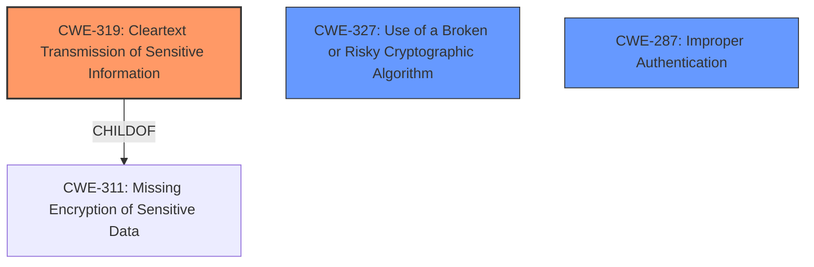

# Enhanced Analysis for CVE-2020-26197

# Summary
| CWE ID | CWE Name | Confidence | CWE Abstraction Level | CWE Vulnerability Mapping Label | CWE-Vulnerability Mapping Notes |
|---|---|---|---|---|---|
| CWE-319 | Cleartext Transmission of Sensitive Information | 0.9 | Base | Allowed | Primary CWE |
| CWE-327 | Use of a Broken or Risky Cryptographic Algorithm | 0.7 | Class | Allowed-with-Review | Secondary Candidate |
| CWE-287 | Improper Authentication | 0.6 | Class | Discouraged | Secondary Candidate |

## Evidence and Confidence

*   **Confidence Score:** 0.8
*   **Evidence Strength:** HIGH

## Relationship Analysis
The primary relationship influencing the CWE selection is the hierarchical structure. CWE-319 is a Base-level CWE, making it a more specific and preferred choice compared to its parent CWEs. CWE-327 and CWE-287 are Class-level CWEs that were considered due to their relevance to cryptographic issues and authentication failures, respectively, but ultimately deemed less directly applicable than CWE-319.



## Vulnerability Chain
The vulnerability chain involves an **inability to connect over TLSv1.2**, leading to the potential use of less secure protocols, ultimately resulting in the **impact** of eavesdropping and traffic decryption.

## Summary of Analysis
The primary CWE selected is CWE-319 (Cleartext Transmission of Sensitive Information). This selection is based on the vulnerability description stating the **inability to connect over TLSv1.2**, which could cause the system to fall back to less secure protocols, effectively transmitting sensitive data in cleartext.

The evidence from "CVE Reference Links Content Summary" states:
*   "The vulnerability stems from the LDAP provider in Dell PowerScale OneFS failing to establish connections using TLSv1.2. This **inability to use the more secure TLSv1.2 protocol** potentially leaves the communication vulnerable to eavesdropping."
*   "The primary weakness is the **inability to connect over TLSv1.2**, which means connections might fall back to less secure protocols, such as TLSv1.0 or TLSv1.1."
*   "The fallback to less secure protocols can allow a malicious actor to eavesdrop and potentially decrypt the traffic."

This directly supports the selection of CWE-319, as the **root cause** is the **inability to use TLSv1.2**, leading to the risk of transmitting sensitive information in cleartext over a sniffable communication channel.

CWE-327 (Use of a Broken or Risky Cryptographic Algorithm) and CWE-287 (Improper Authentication) were considered but deemed less appropriate. While the **inability to connect over TLSv1.2** *could* involve a broken cryptographic algorithm or lead to authentication issues, the primary issue is the potential for cleartext transmission due to the protocol downgrade. Therefore, CWE-319 is the most direct and accurate representation of the vulnerability.

The selection of CWE-319 is at the optimal level of specificity, as it is a Base-level CWE that directly addresses the **root cause** of the vulnerability.

Relevant CWE Information:

# Enhanced Context (25 CWEs)
The following CWEs were identified as potentially relevant to this vulnerability:

## CWE-319: Cleartext Transmission of Sensitive Information
**Abstraction Level**: Base
**Similarity Score**: 0.79
**Source**: dense

**Description**:
The product transmits sensitive or security-critical data in cleartext in a communication channel that can be sniffed by unauthorized actors.

**Mapping Guidance**:
- Usage: Allowed
- Rationale: This CWE entry is at the Base level of abstraction, which is a preferred level of abstraction for mapping to the root causes of vulnerabilities.

## CWE-303: Incorrect Implementation of Authentication Algorithm
**Abstraction Level**: Base
**Similarity Score**: 0.78
**Source**: dense

**Description**:
The requirements for the product dictate the use of an established authentication algorithm, but the implementation of the algorithm is incorrect.

**Mapping Guidance**:
- Usage: Allowed
- Rationale: This CWE entry is at the Base level of abstraction, which is a preferred level of abstraction for mapping to the root causes of vulnerabilities.

## CWE-1391: Use of Weak Credentials
**Abstraction Level**: Class
**Similarity Score**: 0.78
**Source**: dense

**Description**:
The product uses weak credentials (such as a default key or hard-coded password) that can be calculated, derived, reused, or guessed by an attacker.

**Mapping Guidance**:
- Usage: Allowed-with-Review
- Rationale: This CWE entry is a Class and might have Base-level children that would be more appropriate

## CWE-807: Reliance on Untrusted Inputs in a Security Decision
**Abstraction Level**: Base
**Similarity Score**: 0.78
**Source**: dense

**Description**:
The product uses a protection mechanism that relies on the existence or values of an input, but the input can be modified by an untrusted actor in a way that bypasses the protection mechanism.

**Mapping Guidance**:
- Usage: Allowed
- Rationale: This CWE entry is at the Base level of abstraction, which is a preferred level of abstraction for mapping to the root causes of vulnerabilities.

## CWE-203: Observable Discrepancy
**Abstraction Level**: Base
**Similarity Score**: 0.77
**Source**: dense

**Description**:
The product behaves differently or sends different responses under different circumstances in a way that is observable to an unauthorized actor, which exposes security-relevant information about the state of the product, such as whether a particular operation was successful or not.

**Mapping Guidance**:
- Usage: Allowed
- Rationale: This CWE entry is at the Base level of abstraction, which is a preferred level of abstraction for mapping to the root causes of vulnerabilities.

## CWE-345: Insufficient Verification of Data Authenticity
**Abstraction Level**: Class
**Similarity Score**: 0.77
**Source**: dense

**Description**:
The product does not sufficiently verify the origin or authenticity of data, in a way that causes it to accept invalid data.

**Mapping Guidance**:
- Usage: Discouraged
- Rationale: This CWE entry is a level-1 Class (i.e., a child of a Pillar). It might have lower-level children that would be more appropriate

## CWE-799: Improper Control of Interaction Frequency
**Abstraction Level**: Class
**Similarity Score**: 0.77
**Source**: dense

**Description**:
The product does not properly limit the number or frequency of interactions that it has with an actor, such as the number of incoming requests.

**Mapping Guidance**:
- Usage: Allowed-with-Review
- Rationale: This CWE entry is a Class and might have Base-level children that would be more appropriate

## CWE-1390: Weak Authentication
**Abstraction Level**: Class
**Similarity Score**: 0.77
**Source**: dense

**Description**:
The product uses an authentication mechanism to restrict access to specific users or identities, but the mechanism does not sufficiently prove that the claimed identity is correct.

**Mapping Guidance**:
- Usage: Allowed-with-Review
- Rationale: This CWE entry is a Class and might have Base-level children that would be more appropriate

## CWE-330: Use of Insufficiently Random Values
**Abstraction Level**: Class
**Similarity Score**: 0.77
**Source**: dense

**Description**:
The product uses insufficiently random numbers or values in a security context that depends on unpredictable numbers.

**Mapping Guidance**:
- Usage: Discouraged
- Rationale: This CWE entry is a level-1 Class (i.e., a child of a Pillar). It might have lower-level children that would be more appropriate

## CWE-923: Improper Restriction of Communication Channel to Intended Endpoints
**Abstraction Level**: Class
**Similarity Score**: 0.77
**Source**: dense

**Description**:
The product establishes a communication channel to (or from) an endpoint for privileged or protected operations, but it does not properly ensure that it is communicating with the correct endpoint.

**Mapping Guidance**:
- Usage: Allowed-with-Review
- Rationale: This CWE entry is a Class and might have Base-level children that would be more appropriate

## CWE-319: Cleartext Transmission of Sensitive Information
**Abstraction Level**: Base
**Similarity Score**: 5916.11
**Source**: sparse

**Description**:
The product transmits sensitive or security-critical data in clear


## CWE Relationship Analysis

Current CWEs represent these abstraction levels: .


### Vulnerability Chain Analysis

**Chain starting from CWE-303:**
- 303 (Incorrect Implementation of Authentication Algorithm) - ROOT


**Chain starting from CWE-311:**
- 311 (Missing Encryption of Sensitive Data) - ROOT


### CWE Relationship Diagram

```mermaid
graph TD
    classDef primary fill:#f96,stroke:#333,stroke-width:2px
    classDef secondary fill:#69f,stroke:#333
    classDef tertiary fill:#9e9,stroke:#333
```