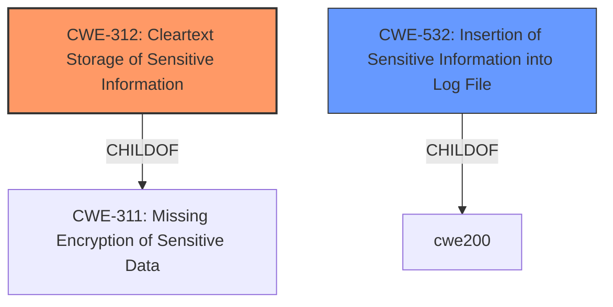

# Enhanced Analysis for CVE-2020-26199

# Summary 
| CWE ID    | CWE Name                                          | Confidence | CWE Abstraction Level | CWE Vulnerability Mapping Label | CWE-Vulnerability Mapping Notes |
| --------- | ------------------------------------------------- | ---------- | --------------------- | ------------------------------- | --------------------------------- |
| CWE-312   | Cleartext Storage of Sensitive Information      | 1.0        | Base                  | Primary                         | Allowed                           |
| CWE-532   | Insertion of Sensitive Information into Log File | 0.8        | Base                  | Secondary                       | Allowed                           |

## Evidence and Confidence

*   **Confidence Score:** 0.9
*   **Evidence Strength:** HIGH

## Relationship Analysis
The primary relationship influencing the assessment is the parent-child relationship where CWE-312 (Cleartext Storage of Sensitive Information) is a child of CWE-311 (Missing Encryption of Sensitive Data). The vulnerability description specifically mentions "plain-text password storage" which aligns directly with CWE-312. CWE-532 (Insertion of Sensitive Information into Log File) is related as the passwords are being stored in log files.mermaid



## Vulnerability Chain
The vulnerability chain starts with the **plain-text password storage** (**CWE-312**) in log files (**CWE-532**), leading to potential unauthorized access by a local authenticated attacker.

## Summary of Analysis
The primary CWE is CWE-312, as the root cause is storing passwords in cleartext. The vulnerability description clearly states "plain-text password storage vulnerability" and the CVE Reference Links Content Summary confirms "Plain-text password storage. User credentials, including the Unisphere admin privilege user password, are stored in plain text within multiple log files." The retriever results also list CWE-312 as a strong candidate. The evidence strongly supports this classification, and the confidence level is high. The mapping guidance for CWE-312 indicates it is at the Base level of abstraction and its usage is Allowed.

CWE-532 is included as a secondary CWE since the **plain-text password** is stored in the log files, and a local authenticated attacker with access to the log files may use the exposed password to gain access.

CWE-256 (Plaintext Storage of a Password) was considered, but CWE-312 is a better fit because it highlights the broader issue of storing sensitive information in cleartext, rather than specifically focusing on passwords. The description of CWE-312 explicitly mentions that sensitive information is stored in cleartext within a resource that might be accessible to another control sphere.

CWE-522 (Insufficiently Protected Credentials) was considered, but it is a Class-level CWE. Both CWE-312 and CWE-532 are more specific and provide better descriptions of the vulnerability.
```


## CWE Relationship Analysis

Current CWEs represent these abstraction levels: .


### Vulnerability Chain Analysis

**Chain starting from CWE-312:**
- 312 (Cleartext Storage of Sensitive Information) - ROOT


**Chain starting from CWE-311:**
- 311 (Missing Encryption of Sensitive Data) - ROOT


### CWE Relationship Diagram

```mermaid
graph TD
    classDef primary fill:#f96,stroke:#333,stroke-width:2px
    classDef secondary fill:#69f,stroke:#333
    classDef tertiary fill:#9e9,stroke:#333
```