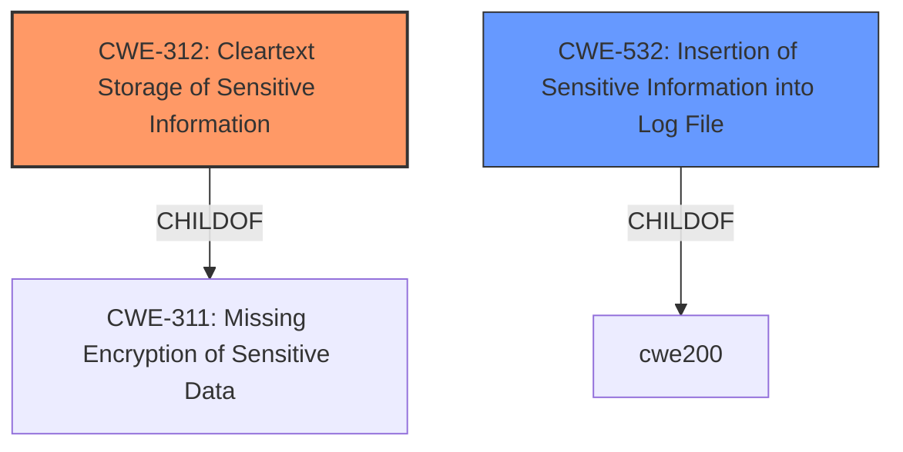

# Analysis for CVE-2020-26199

```markdown
# Summary 
| CWE ID    | CWE Name                                          | Confidence | CWE Abstraction Level | CWE Vulnerability Mapping Label | CWE-Vulnerability Mapping Notes |
| --------- | ------------------------------------------------- | ---------- | --------------------- | ------------------------------- | --------------------------------- |
| CWE-312   | Cleartext Storage of Sensitive Information      | 1.0        | Base                  | Primary                         | Allowed                           |
| CWE-532   | Insertion of Sensitive Information into Log File | 0.8        | Base                  | Secondary                       | Allowed                           |

## Evidence and Confidence

*   **Confidence Score:** 0.9
*   **Evidence Strength:** HIGH

## Relationship Analysis
The primary relationship influencing the assessment is the parent-child relationship where CWE-312 (Cleartext Storage of Sensitive Information) is a child of CWE-311 (Missing Encryption of Sensitive Data). The vulnerability description specifically mentions "plain-text password storage" which aligns directly with CWE-312. CWE-532 (Insertion of Sensitive Information into Log File) is related as the passwords are being stored in log files.



## Vulnerability Chain
The vulnerability chain starts with the **plain-text password storage** (**CWE-312**) in log files (**CWE-532**), leading to potential unauthorized access by a local authenticated attacker.

## Summary of Analysis
The primary CWE is CWE-312, as the root cause is storing passwords in cleartext. The vulnerability description clearly states "plain-text password storage vulnerability" and the CVE Reference Links Content Summary confirms "Plain-text password storage. User credentials, including the Unisphere admin privilege user password, are stored in plain text within multiple log files." The retriever results also list CWE-312 as a strong candidate. The evidence strongly supports this classification, and the confidence level is high. The mapping guidance for CWE-312 indicates it is at the Base level of abstraction and its usage is Allowed.

CWE-532 is included as a secondary CWE since the **plain-text password** is stored in the log files, and a local authenticated attacker with access to the log files may use the exposed password to gain access.

CWE-256 (Plaintext Storage of a Password) was considered, but CWE-312 is a better fit because it highlights the broader issue of storing sensitive information in cleartext, rather than specifically focusing on passwords. The description of CWE-312 explicitly mentions that sensitive information is stored in cleartext within a resource that might be accessible to another control sphere.

CWE-522 (Insufficiently Protected Credentials) was considered, but it is a Class-level CWE. Both CWE-312 and CWE-532 are more specific and provide better descriptions of the vulnerability.
```

# Enhanced Query for CVE-2020-26199

## Vulnerability Description
Dell EMC Unity, Unity XT, and UnityVSA versions prior to 5.0.4.0.5.012 contain a **plain-text password storage** vulnerability. A user credentials (including the Unisphere admin privilege user) password is stored in a plain text in multiple log files. A local authenticated attacker with access to the log files may use the exposed password to gain access with the privileges of the compromised user.

### Vulnerability Description Key Phrases
- **weakness:** **plain-text password storage**
- **attacker:** local authenticated attacker
- **product:** Dell EMC Unity and Unity XT and UnityVSA
- **version:** prior to 5.0.4.0.5.012

### CWE for similar CVE Descriptions
### Primary CWE Match
CWE-312

#### Top CWEs
- CWE-312 (Count: 6)
- CWE-693 (Count: 4)
- CWE-532 (Count: 1)

## CVE Reference Links Content Summary
- **Root cause of vulnerability**: Plain-text password storage. User credentials, including the Unisphere admin privilege user password, are stored in plain text within multiple log files.
- **Weaknesses/vulnerabilities**: Plain-text storage of sensitive user credentials, including passwords.
- **Impact of exploitation**: A local attacker with access to the log files can use the exposed passwords to gain unauthorized access with the privileges of the compromised user, potentially leading to complete system compromise.
- **Attack vectors**: Local access to the system and log files is required.
- **Required attacker capabilities/position**: The attacker needs to be authenticated and have local access to the system and its log files.

## Retriever Results

### Top Combined Results

| Rank | CWE ID | Name | Abstraction | Usage  | Retrievers | Individual Scores |
|------|--------|------|-------------|-------|------------|-------------------|
| 1 | 256 | Plaintext Storage of a Password | Base | Allowed | sparse | 0.641 |
| 2 | 532 | Insertion of Sensitive Information into Log File | Base | Allowed | sparse | 0.576 |
| 3 | 522 | Insufficiently Protected Credentials | Class | Allowed-with-Review | sparse | 0.488 |
| 4 | 312 | Cleartext Storage of Sensitive Information | Base | Allowed | sparse | 0.421 |
| 5 | 311 | Missing Encryption of Sensitive Data | Class | Discouraged | sparse | 0.397 |
| 6 | 260 | Password in Configuration File | Base | Allowed | dense | 0.551 |
| 7 | 261 | Weak Encoding for Password | Base | Allowed | graph | 0.002 |
| 8 | 916 | Use of Password Hash With Insufficient Computational Effort | Base | Allowed | sparse | 0.397 |
| 9 | 1188 | Initialization of a Resource with an Insecure Default | Base | Allowed | sparse | 0.391 |
| 10 | 321 | Use of Hard-coded Cryptographic Key | Variant | Allowed | sparse | 0.390 |


# Complete CWE Specifications


## CWE-256: Plaintext Storage of a Password
**Abstraction:** Base
**Status:** Incomplete

### Description
Storing a password in plaintext may result in a system compromise.

### Extended Description
Password management issues occur when a password is stored in plaintext in an application's properties, configuration file, or memory. Storing a plaintext password in a configuration file allows anyone who can read the file access to the password-protected resource. In some contexts, even storage of a plaintext password in memory is considered a security risk if the password is not cleared immediately after it is used.

### Alternative Terms
None

### Relationships
ChildOf -> CWE-522

### Mapping Guidance
**Usage:** Allowed
**Rationale:** This CWE entry is at the Base level of abstraction, which is a preferred level of abstraction for mapping to the root causes of vulnerabilities.
**Comments:** Carefully read both the name and description to ensure that this mapping is an appropriate fit. Do not try to 'force' a mapping to a lower-level Base/Variant simply to comply with this preferred level of abstraction.
**Reasons:**
- Acceptable-Use


### Observed Examples
- **CVE-2022-30275:** Remote Terminal Unit (RTU) uses a driver that relies on a password stored in plaintext.


## CWE-532: Insertion of Sensitive Information into Log File
**Abstraction:** Base
**Status:** Incomplete

### Description
The product writes sensitive information to a log file.

### Extended Description
Not provided

### Alternative Terms
None

### Relationships
ChildOf -> CWE-538
ChildOf -> CWE-200

### Mapping Guidance
**Usage:** Allowed
**Rationale:** This CWE entry is at the Base level of abstraction, which is a preferred level of abstraction for mapping to the root causes of vulnerabilities.
**Comments:** Carefully read both the name and description to ensure that this mapping is an appropriate fit. Do not try to 'force' a mapping to a lower-level Base/Variant simply to comply with this preferred level of abstraction.
**Reasons:**
- Acceptable-Use


### Observed Examples
- **CVE-2017-9615:** verbose logging stores admin credentials in a world-readable log file
- **CVE-2018-1999036:** SSH password for private key stored in build log


## CWE-522: Insufficiently Protected Credentials
**Abstraction:** Class
**Status:** Incomplete

### Description
The product transmits or stores authentication credentials, but it uses an insecure method that is susceptible to unauthorized interception and/or retrieval.

### Extended Description
Not provided

### Alternative Terms
None

### Relationships
ChildOf -> CWE-1390
ChildOf -> CWE-287
ChildOf -> CWE-668

### Mapping Guidance
**Usage:** Allowed-with-Review
**Rationale:** This CWE entry is a Class and might have Base-level children that would be more appropriate
**Comments:** Examine children of this entry to see if there is a better fit
**Reasons:**
- Abstraction


### Observed Examples
- **CVE-2022-30018:** A messaging platform serializes all elements of User/Group objects, making private information available to adversaries
- **CVE-2022-29959:** Initialization file contains credentials that can be decoded using a "simple string transformation"
- **CVE-2022-35411:** Python-based RPC framework enables pickle functionality by default, allowing clients to unpickle untrusted data.


## CWE-312: Cleartext Storage of Sensitive Information
**Abstraction:** Base
**Status:** Draft

### Description
The product stores sensitive information in cleartext within a resource that might be accessible to another control sphere.

### Extended Description


Because the information is stored in cleartext (i.e., unencrypted), attackers could potentially read it. Even if the information is encoded in a way that is not human-readable, certain techniques could determine which encoding is being used, then decode the information.


When organizations adopt cloud services, it can be easier for attackers to access the data from anywhere on the Internet.


In some systems/environments such as cloud, the use of "double encryption" (at both the software and hardware layer) might be required, and the developer might be solely responsible for both layers, instead of shared responsibility with the administrator of the broader system/environment.


### Alternative Terms
None

### Relationships
ChildOf -> CWE-311
ChildOf -> CWE-311
ChildOf -> CWE-922

### Mapping Guidance
**Usage:** Allowed
**Rationale:** This CWE entry is at the Base level of abstraction, which is a preferred level of abstraction for mapping to the root causes of vulnerabilities.
**Comments:** Carefully read both the name and description to ensure that this mapping is an appropriate fit. Do not try to 'force' a mapping to a lower-level Base/Variant simply to comply with this preferred level of abstraction.
**Reasons:**
- Acceptable-Use


### Additional Notes
**[Terminology]** Different people use "cleartext" and "plaintext" to mean the same thing: the lack of encryption. However, within cryptography, these have more precise meanings. Plaintext is the information just before it is fed into a cryptographic algorithm, including already-encrypted text. Cleartext is any information that is unencrypted, although it might be in an encoded form that is not easily human-readable (such as base64 encoding).


### Observed Examples
- **CVE-2022-30275:** Remote Terminal Unit (RTU) uses a driver that relies on a password stored in plaintext.
- **CVE-2009-2272:** password and username stored in cleartext in a cookie
- **CVE-2009-1466:** password stored in cleartext in a file with insecure permissions


## CWE-311: Missing Encryption of Sensitive Data
**Abstraction:** Class
**Status:** Draft

### Description
The product does not encrypt sensitive or critical information before storage or transmission.

### Extended Description
The lack of proper data encryption passes up the guarantees of confidentiality, integrity, and accountability that properly implemented encryption conveys.

### Alternative Terms
None

### Relationships
ChildOf -> CWE-693

### Mapping Guidance
**Usage:** Discouraged
**Rationale:** CWE-311 is high-level with more precise children available. It is a level-1 Class (i.e., a child of a Pillar).
**Comments:** Consider children CWE-312: Cleartext Storage of Sensitive Information or CWE-319: Cleartext Transmission of Sensitive Information.
**Reasons:**
- Abstraction


### Additional Notes
**[Relationship]** There is an overlapping relationship between insecure storage of sensitive information (CWE-922) and missing encryption of sensitive information (CWE-311). Encryption is often used to prevent an attacker from reading the sensitive data. However, encryption does not prevent the attacker from erasing or overwriting the data.


### Observed Examples
- **CVE-2009-2272:** password and username stored in cleartext in a cookie
- **CVE-2009-1466:** password stored in cleartext in a file with insecure permissions
- **CVE-2009-0152:** chat program disables SSL in some circumstances even when the user says to use SSL.


## CWE-260: Password in Configuration File
**Abstraction:** Base
**Status:** Incomplete

### Description
The product stores a password in a configuration file that might be accessible to actors who do not know the password.

### Extended Description
This can result in compromise of the system for which the password is used. An attacker could gain access to this file and learn the stored password or worse yet, change the password to one of their choosing.

### Alternative Terms
None

### Relationships
ChildOf -> CWE-522

### Mapping Guidance
**Usage:** Allowed
**Rationale:** This CWE entry is at the Base level of abstraction, which is a preferred level of abstraction for mapping to the root causes of vulnerabilities.
**Comments:** Carefully read both the name and description to ensure that this mapping is an appropriate fit. Do not try to 'force' a mapping to a lower-level Base/Variant simply to comply with this preferred level of abstraction.
**Reasons:**
- Acceptable-Use


### Observed Examples
- **CVE-2022-38665:** A continuous delivery pipeline management tool stores an unencypted password in a configuration file.


## CWE-261: Weak Encoding for Password
**Abstraction:** Base
**Status:** Incomplete

### Description
Obscuring a password with a trivial encoding does not protect the password.

### Extended Description
Password management issues occur when a password is stored in plaintext in an application's properties or configuration file. A programmer can attempt to remedy the password management problem by obscuring the password with an encoding function, such as base 64 encoding, but this effort does not adequately protect the password.

### Alternative Terms
None

### Relationships
ChildOf -> CWE-522

### Mapping Guidance
**Usage:** Allowed
**Rationale:** This CWE entry is at the Base level of abstraction, which is a preferred level of abstraction for mapping to the root causes of vulnerabilities.
**Comments:** Carefully read both the name and description to ensure that this mapping is an appropriate fit. Do not try to 'force' a mapping to a lower-level Base/Variant simply to comply with this preferred level of abstraction.
**Reasons:**
- Acceptable-Use


### Additional Notes
**[Other]** 

The "crypt" family of functions uses weak cryptographic algorithms and should be avoided. It may be present in some projects for compatibility.


## CWE-916: Use of Password Hash With Insufficient Computational Effort
**Abstraction:** Base
**Status:** Incomplete

### Description
The product generates a hash for a password, but it uses a scheme that does not provide a sufficient level of computational effort that would make password cracking attacks infeasible or expensive.

### Extended Description


Many password storage mechanisms compute a hash and store the hash, instead of storing the original password in plaintext. In this design, authentication involves accepting an incoming password, computing its hash, and comparing it to the stored hash.


Many hash algorithms are designed to execute quickly with minimal overhead, even cryptographic hashes. However, this efficiency is a problem for password storage, because it can reduce an attacker's workload for brute-force password cracking. If an attacker can obtain the hashes through some other method (such as SQL injection on a database that stores hashes), then the attacker can store the hashes offline and use various techniques to crack the passwords by computing hashes efficiently. Without a built-in workload, modern attacks can compute large numbers of hashes, or even exhaust the entire space of all possible passwords, within a very short amount of time, using massively-parallel computing (such as cloud computing) and GPU, ASIC, or FPGA hardware. In such a scenario, an efficient hash algorithm helps the attacker.


There are several properties of a hash scheme that are relevant to its strength against an offline, massively-parallel attack:


  - The amount of CPU time required to compute the hash ("stretching")

  - The amount of memory required to compute the hash ("memory-hard" operations)

  - Including a random value, along with the password, as input to the hash computation ("salting")

  - Given a hash, there is no known way of determining an input (e.g., a password) that produces this hash value, other than by guessing possible inputs ("one-way" hashing)

  - Relative to the number of all possible hashes that can be generated by the scheme, there is a low likelihood of producing the same hash for multiple different inputs ("collision resistance")

Note that the security requirements for the product may vary depending on the environment and the value of the passwords. Different schemes might not provide all of these properties, yet may still provide sufficient security for the environment. Conversely, a solution might be very strong in preserving one property, which still being very weak for an attack against another property, or it might not be able to significantly reduce the efficiency of a massively-parallel attack.

### Alternative Terms
None

### Relationships
ChildOf -> CWE-328
ChildOf -> CWE-327

### Mapping Guidance
**Usage:** Allowed
**Rationale:** This CWE entry is at the Base level of abstraction, which is a preferred level of abstraction for mapping to the root causes of vulnerabilities.
**Comments:** Carefully read both the name and description to ensure that this mapping is an appropriate fit. Do not try to 'force' a mapping to a lower-level Base/Variant simply to comply with this preferred level of abstraction.
**Reasons:**
- Acceptable-Use


### Observed Examples
- **CVE-2008-1526:** Router does not use a salt with a hash, making it easier to crack passwords.
- **CVE-2006-1058:** Router does not use a salt with a hash, making it easier to crack passwords.
- **CVE-2008-4905:** Blogging software uses a hard-coded salt when calculating a password hash.


## CWE-1188: Initialization of a Resource with an Insecure Default
**Abstraction:** Base
**Status:** Incomplete

### Description
The product initializes or sets a resource with a default that is intended to be changed by the administrator, but the default is not secure.

### Extended Description


Developers often choose default values that leave the product as open and easy to use as possible out-of-the-box, under the assumption that the administrator can (or should) change the default value. However, this ease-of-use comes at a cost when the default is insecure and the administrator does not change it.


### Alternative Terms
None

### Relationships
ChildOf -> CWE-1419
ChildOf -> CWE-665

### Mapping Guidance
**Usage:** Allowed
**Rationale:** This CWE entry is at the Base level of abstraction, which is a preferred level of abstraction for mapping to the root causes of vulnerabilities.
**Comments:** Carefully read both the name and description to ensure that this mapping is an appropriate fit. Do not try to 'force' a mapping to a lower-level Base/Variant simply to comply with this preferred level of abstraction.
**Reasons:**
- Acceptable-Use


### Additional Notes
**[Maintenance]** This entry improves organization of concepts under initialization. The typical CWE model is to cover "Missing" and "Incorrect" behaviors. Arguably, this entry could be named as "Incorrect" instead of "Insecure." This might be changed in the near future.


### Observed Examples
- **CVE-2022-36349:** insecure default variable initialization in BIOS firmware for a hardware board allows DoS
- **CVE-2022-42467:** A generic database browser interface has a default mode that exposes a web server to the network, allowing queries to the database.


## CWE-321: Use of Hard-coded Cryptographic Key
**Abstraction:** Variant
**Status:** Draft

### Description
The use of a hard-coded cryptographic key significantly increases the possibility that encrypted data may be recovered.

### Extended Description
Not provided

### Alternative Terms
None

### Relationships
ChildOf -> CWE-798
ChildOf -> CWE-798
ChildOf -> CWE-798

### Mapping Guidance
**Usage:** Allowed
**Rationale:** This CWE entry is at the Variant level of abstraction, which is a preferred level of abstraction for mapping to the root causes of vulnerabilities.
**Comments:** Carefully read both the name and description to ensure that this mapping is an appropriate fit. Do not try to 'force' a mapping to a lower-level Base/Variant simply to comply with this preferred level of abstraction.
**Reasons:**
- Acceptable-Use


### Additional Notes
**[Other]** The main difference between the use of hard-coded passwords and the use of hard-coded cryptographic keys is the false sense of security that the former conveys. Many people believe that simply hashing a hard-coded password before storage will protect the information from malicious users. However, many hashes are reversible (or at least vulnerable to brute force attacks) -- and further, many authentication protocols simply request the hash itself, making it no better than a password.

**[Maintenance]** The Taxonomy_Mappings to ISA/IEC 62443 were added in CWE 4.10, but they are still under review and might change in future CWE versions. These draft mappings were performed by members of the "Mapping CWE to 62443" subgroup of the CWE-CAPEC ICS/OT Special Interest Group (SIG), and their work is incomplete as of CWE 4.10. The mappings are included to facilitate discussion and review by the broader ICS/OT community, and they are likely to change in future CWE versions.


### Observed Examples
- **CVE-2022-29960:** Engineering Workstation uses hard-coded cryptographic keys that could allow for unathorized filesystem access and privilege escalation
- **CVE-2022-30271:** Remote Terminal Unit (RTU) uses a hard-coded SSH private key that is likely to be used by default.
- **CVE-2020-10884:** WiFi router service has a hard-coded encryption key, allowing root access

