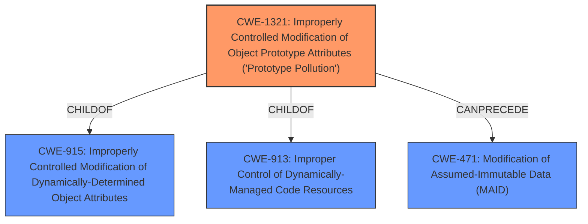

# Analysis for CVE-2020-26237

# Summary
| CWE ID | CWE Name | Confidence | CWE Abstraction Level | CWE Vulnerability Mapping Label | CWE-Vulnerability Mapping Notes |
|---|---|---|---|---|---|
| CWE-1321 | Improperly Controlled Modification of Object Prototype Attributes ('Prototype Pollution') | 1.0 | Variant | Allowed | Primary CWE |
| CWE-79 | Improper Neutralization of Input During Web Page Generation ('Cross-site Scripting') | 0.6 | Base | Allowed | Secondary Candidate |

## Evidence and Confidence

*   **Confidence Score:** 0.9
*   **Evidence Strength:** HIGH

## Relationship Analysis
The primary relationship that influenced my decision was the direct match of the vulnerability description to CWE-1321, "Improperly Controlled Modification of Object Prototype Attributes ('Prototype Pollution')." The description explicitly mentions prototype pollution as the root cause. CWE-79 was considered as a potential secondary weakness due to the input from HTML code blocks but was not chosen because it wasn't clear that the neutralization of the input during web page generation was the issue, but rather the **prototype pollution** itself.

## Vulnerability Chain
The vulnerability chain starts with unfiltered user input (HTML code blocks with language names), leading to the **improperly controlled modification of object prototype attributes**, ultimately resulting in potential application crashes or denial-of-service.

Unfiltered User Input -> **CWE-1321** -> Application Crash/DoS

## Summary of Analysis
The primary assessment is based on the provided evidence, specifically the vulnerability description and the CVE reference links content summary, which both explicitly identify **prototype pollution** as the root cause. The graph relationships and retriever results further support this classification, with CWE-1321 being the top match. The selection of CWE-1321 is at the optimal level of specificity, as it directly addresses the core weakness of **improperly controlled modification of object prototype attributes**.

Relevant CWE Information:

# Enhanced Context (25 CWEs)

## CWE-74: Improper Neutralization of Special Elements in Output Used by a Downstream Component ('Injection')
**Abstraction Level**: Class
**Similarity Score**: 0.78
**Source**: dense

**Description**:
The product constructs all or part of a command, data structure, or record using externally-influenced input from an upstream component, but it does not neutralize or incorrectly neutralizes special elements that could modify how it is parsed or interpreted when it is sent to a downstream component.

**Mapping Guidance**:
- Usage: Discouraged
- Rationale: CWE-74 is high-level and often misused when lower-level weaknesses are more appropriate.

## CWE-138: Improper Neutralization of Special Elements
**Abstraction Level**: Class
**Similarity Score**: 0.76
**Source**: dense

**Description**:
The product receives input from an upstream component, but it does not neutralize or incorrectly neutralizes special elements that could be interpreted as control elements or syntactic markers when they are sent to a downstream component.

**Mapping Guidance**:
- Usage: Discouraged
- Rationale: This CWE entry is a level-1 Class (i.e., a child of a Pillar). It might have lower-level children that would be more appropriate

## CWE-212: Improper Removal of Sensitive Information Before Storage or Transfer
**Abstraction Level**: Base
**Similarity Score**: 0.76
**Source**: dense

**Description**:
The product stores, transfers, or shares a resource that contains sensitive information, but it does not properly remove that information before the product makes the resource available to unauthorized actors.

**Mapping Guidance**:
- Usage: Allowed
- Rationale: This CWE entry is at the Base level of abstraction, which is a preferred level of abstraction for mapping to the root causes of vulnerabilities.

## CWE-538: Insertion of Sensitive Information into Externally-Accessible File or Directory
**Abstraction Level**: Base
**Similarity Score**: 0.75
**Source**: dense

**Description**:
The product places sensitive information into files or directories that are accessible to actors who are allowed to have access to the files, but not to the sensitive information.

**Mapping Guidance**:
- Usage: Allowed
- Rationale: This CWE entry is at the Base level of abstraction, which is a preferred level of abstraction for mapping to the root causes of vulnerabilities.

## CWE-80: Improper Neutralization of Script-Related HTML Tags in a Web Page (Basic XSS)
**Abstraction Level**: Variant
**Similarity Score**: 0.75
**Source**: dense

**Description**:
The product receives input from an upstream component, but it does not neutralize or incorrectly neutralizes special characters such as "<", ">", and "&" that could be interpreted as web-scripting elements when they are sent to a downstream component that processes web pages.

**Mapping Guidance**:
- Usage: Allowed
- Rationale: This CWE entry is at the Variant level of abstraction, which is a preferred level of abstraction for mapping to the root causes of vulnerabilities.

## CWE-184: Incomplete List of Disallowed Inputs
**Abstraction Level**: Base
**Similarity Score**: 0.75
**Source**: dense

**Description**:
The product implements a protection mechanism that relies on a list of inputs (or properties of inputs) that are not allowed by policy or otherwise require other action to neutralize before additional processing takes place, but the list is incomplete.

**Mapping Guidance**:
- Usage: Allowed
- Rationale: This CWE entry is at the Base level of abstraction, which is a preferred level of abstraction for mapping to the root causes of vulnerabilities.

## CWE-41: Improper Resolution of Path Equivalence
**Abstraction Level**: Base
**Similarity Score**: 0.75
**Source**: dense

**Description**:
The product is vulnerable to file system contents disclosure through path equivalence. Path equivalence involves the use of special characters in file and directory names. The associated manipulations are intended to generate multiple names for the same object.

**Mapping Guidance**:
- Usage: Allowed
- Rationale: This CWE entry is at the Base level of abstraction, which is a preferred level of abstraction for mapping to the root causes of vulnerabilities.

## CWE-668: Exposure of Resource to Wrong Sphere
**Abstraction Level**: Class
**Similarity Score**: 0.75
**Source**: dense

**Description**:
The product exposes a resource to the wrong control sphere, providing unintended actors with inappropriate access to the resource.

**Mapping Guidance**:
- Usage: Discouraged
- Rationale: CWE-668 is high-level and is often misused as a catch-all when lower-level CWE IDs might be applicable. It is sometimes used for low-information vulnerability reports [REF-1287]. It is a level-1 Class (i.e., a child of a Pillar). It is not useful for trend analysis.

## CWE-345: Insufficient Verification of Data Authenticity
**Abstraction Level**: Class
**Similarity Score**: 0.75
**Source**: dense

**Description**:
The product does not sufficiently verify the origin or authenticity of data, in a way that causes it to accept invalid data.

**Mapping Guidance**:
- Usage: Discouraged
- Rationale: This CWE entry is a level-1 Class (i.e., a child of a Pillar). It might have lower-level children that would be more appropriate

## CWE-807: Reliance on Untrusted Inputs in a Security Decision
**Abstraction Level**: Base
**Similarity Score**: 0.75
**Source**: dense

**Description**:
The product uses a protection mechanism that relies on the existence or values of an input, but the input can be modified by an untrusted actor in a way that bypasses the protection mechanism.

**Mapping Guidance**:
- Usage: Allowed
- Rationale: This CWE entry is at the Base level of abstraction, which is a preferred level of abstraction for mapping to the root causes of vulnerabilities.

## CWE-79: Improper Neutralization of Input During Web Page Generation ('Cross-site Scripting')
**Abstraction Level**: base
**Similarity Score**: 7273.42
**Source**: sparse

**Description**:
The product does not neutralize or incorrectly neutralizes user-controllable input before it is placed in output that is

# Enhanced Query for CVE-2020-26237

## Vulnerability Description
Highlight.js is a syntax highlighter written in JavaScript. Highlight.js versions before 9.18.2 and 10.1.2 are vulnerable to Prototype Pollution. A malicious HTML code block can be crafted that will result in **prototype pollution** of the base objects prototype during highlighting. If you allow users to insert custom HTML code blocks into your page/app via parsing Markdown code blocks (or similar) and do not filter the language names the user can provide you may be vulnerable. The pollution should just be harmless data but this can cause problems for applications not expecting these properties to exist and can result in strange behavior or application crashes, i.e. a potential DOS vector. If your website or application does not render user provided data it should be unaffected. Versions 9.18.2 and 10.1.2 and newer include fixes for this vulnerability. If you are using version 7 or 8 you are encouraged to upgrade to a newer release.

### Vulnerability Description Key Phrases
- **rootcause:** **prototype pollution**
- **attacker:** attacker
- **product:** Highlight.js
- **version:** before 9.18.2 and 10.1.2

## CVE Reference Links Content Summary
Based on the provided information, here's an analysis of CVE-2020-26237:

**Root Cause of Vulnerability:**
The vulnerability stems from the way `highlight.js` handles language definitions. Instead of using a null prototype object, it was using regular JavaScript objects. This allowed a malicious user to craft an HTML code block with a language name that could overwrite properties on the base object's prototype during highlighting, leading to prototype pollution.

**Weaknesses/Vulnerabilities Present:**
*   **Prototype Pollution:** The core issue is the ability to inject arbitrary properties into the prototype of the base object, due to the use of regular JavaScript objects for languages and aliases.
*   **Unfiltered User Input:** The vulnerability arises when user-supplied data, specifically language names within HTML code blocks, is not properly validated or sanitized.

**Impact of Exploitation:**
*   **Application Crashes and Strange Behavior:** Prototype pollution can lead to unexpected application behavior, including crashes and potential Denial of Service (DoS) scenarios. This is because applications may not anticipate the existence of these new properties. The injected properties can cause issues for applications that iterate over object properties, or when they perform type checks.
*   **Potential DoS:** Although the injected data itself may be harmless, the side effects of these unexpected properties can cause application instability, leading to potential denial-of-service conditions.

**Attack Vectors:**
*   **Malicious HTML Code Blocks:** An attacker crafts malicious HTML code blocks with crafted language names to trigger the prototype pollution.
*   **Markdown Parsing:** The primary vector is when user-provided input is used within a markdown parser to render code blocks, without properly filtering the language names. Any method allowing user controlled language names to reach highlight.js is a valid attack vector.

**Required Attacker Capabilities/Position:**
*   **Ability to inject HTML:** The attacker needs the capability to inject HTML code into a page or application that uses `highlight.js` for syntax highlighting.
*   **Control over language names**: The attacker must be able to manipulate the language names specified in the HTML code blocks.
*   **No authentication required**:  The attacker doesn't need any special privileges to cause the vulnerability.

**Additional Details:**

*   The vulnerability is present in `highlight.js` versions 7.2, 7.3, 7.4, 7.5, 8, 9, and 10.
*   The vulnerability was fixed in versions 9.18.2 and 10.1.2 by switching to using null prototype objects for both languages and aliases.
*   Workarounds include manually patching the library or filtering the language names that users are allowed to provide.
*   The vulnerability is considered to be of moderate severity.
*   The fix involves using `Object.create(null)` to create `languages` and `aliases`, effectively preventing access to the properties of the base `Object` prototype.
*   The issue was initially discovered and fixed by a contributor (`@night`) to address bugs in Discord's client.
*   Multiple third-party libraries and applications were also affected and later patched by upgrading their `highlight.js` dependencies.
*   The issue also made its way into Oracle products, as described in their advisory.

## Retriever Results

### Top Combined Results

| Rank | CWE ID | Name | Abstraction | Usage  | Retrievers | Individual Scores |
|------|--------|------|-------------|-------|------------|-------------------|
| 1 | 1321 | Improperly Controlled Modification of Object Prototype Attributes ('Prototype Pollution') | Variant | Allowed | sparse | 1.404 |
| 2 | 1333 | Inefficient Regular Expression Complexity | Base | Allowed | sparse | 0.890 |
| 3 | 1336 | Improper Neutralization of Special Elements Used in a Template Engine | Base | Allowed | sparse | 0.824 |
| 4 | 347 | Improper Verification of Cryptographic Signature | Base | Allowed | sparse | 0.810 |
| 5 | 79 | Improper Neutralization of Input During Web Page Generation ('Cross-site Scripting') | Base | Allowed | sparse | 0.798 |
| 6 | 83 | Improper Neutralization of Script in Attributes in a Web Page | Variant | Allowed | dense | 0.494 |
| 7 | 494 | Download of Code Without Integrity Check | Base | Allowed | graph | 0.002 |
| 8 | 94 | Improper Control of Generation of Code ('Code Injection') | Base | Allowed-with-Review | sparse | 0.786 |
| 9 | 863 | Incorrect Authorization | Class | Allowed-with-Review | sparse | 0.779 |
| 10 | 201 | Insertion of Sensitive Information Into Sent Data | Base | Allowed | sparse | 0.779 |

# Complete CWE Specifications

## CWE-1321: Improperly Controlled Modification of Object Prototype Attributes ('Prototype Pollution')
**Abstraction:** Variant
**Status:** Incomplete

### Description
The product receives input from an upstream component that specifies attributes that are to be initialized or updated in an object, but it does not properly control modifications of attributes of the object prototype.

### Extended Description

By adding or modifying attributes of an object prototype, it is possible to create attributes that exist on every object, or replace critical attributes with malicious ones. This can be problematic if the product depends on existence or non-existence of certain attributes, or uses pre-defined attributes of object prototype (such as hasOwnProperty, toString or valueOf).

This weakness is usually exploited by using a special attribute of objects called proto, constructor or prototype. Such attributes give access to the object prototype. This weakness is often found in code that assigns object attributes based on user input, or merges or clones objects recursively.

### Alternative Terms
None

### Relationships
ChildOf -> CWE-915
ChildOf -> CWE-913
CanPrecede -> CWE-471

### Mapping Guidance
**Usage:** Allowed
**Rationale:** This CWE entry is at the Variant level of abstraction, which is a preferred level of abstraction for mapping to the root causes of vulnerabilities.
**Comments:** Carefully read both the name and description to ensure that this mapping is an appropriate fit. Do not try to 'force' a mapping to a lower-level Base/Variant simply to comply with this preferred level of abstraction.
**Reasons:**
- Acceptable-Use

### Observed Examples
- **CVE-2018-3721:** Prototype pollution by merging objects.
- **CVE-2019-10744:** Prototype pollution by setting default values to object attributes recursively.
- **CVE-2019-11358:** Prototype pollution by merging objects recursively.

## CWE-1333: Inefficient Regular Expression Complexity
**Abstraction:** Base
**Status:** Draft

### Description
The product uses a regular expression with an inefficient, possibly exponential worst-case computational complexity that consumes excessive CPU cycles.

### Extended Description
Some regular expression engines have a feature called "backtracking". If the token cannot match, the engine "backtracks" to a position that may result in a different token that can match.
 Backtracking becomes a weakness if all of these conditions are met:

  - The number of possible backtracking attempts are exponential relative to the length of the input.

  - The input can fail to match the regular expression.

  - The input can be long enough.

 Attackers can create crafted inputs that intentionally cause the regular expression to use excessive backtracking in a way that causes the CPU consumption to spike. 

### Alternative Terms
ReDoS: ReDoS is an abbreviation of "Regular expression Denial of Service".
Regular Expression Denial of Service: While this term is attack-focused, this is commonly used to describe the weakness.
Catastrophic backtracking: This term is used to describe the behavior of the regular expression as a negative technical impact.

### Relationships
ChildOf -> CWE-407
ChildOf -> CWE-407

### Mapping Guidance
**Usage:** Allowed
**Rationale:** This CWE entry is at the Base level of abstraction, which is a preferred level of abstraction for mapping to the root causes of vulnerabilities.
**Comments:** Carefully read both the name and description to ensure that this mapping is an appropriate fit. Do not try to 'force' a mapping to a lower-level Base/Variant simply to comply with this preferred level of abstraction.
**Reasons:**
- Acceptable-Use

### Observed Examples
- **CVE-2020-5243:** server allows ReDOS with crafted User-Agent strings, due to overlapping capture groups that cause excessive backtracking.
- **CVE-2021-21317:** npm package for user-agent parser prone to ReDoS due to overlapping capture groups
- **CVE-2019-16215:** Markdown parser uses inefficient regex when processing a message, allowing users to cause CPU consumption and delay preventing processing of other messages.

## CWE-1336: Improper Neutralization of Special Elements Used in a Template Engine
**Abstraction:** Base
**Status:** Incomplete

### Description
The product uses a template engine to insert or process externally-influenced input, but it does not neutralize or incorrectly neutralizes special elements or syntax that can be interpreted as template expressions or other code directives when processed by the engine.

### Extended Description

Many web applications use template engines that allow developers to insert externally-influenced values into free text or messages in order to generate a full web page, document, message, etc. Such engines include Twig, Jinja2, Pug, Java Server Pages, FreeMarker, Velocity, ColdFusion, Smarty, and many others - including PHP itself. Some CMS (Content Management Systems) also use templates.

Template engines often have their own custom command or expression language. If an attacker can influence input into a template before it is processed, then the attacker can invoke arbitrary expressions, i.e. perform injection attacks. For example, in some template languages, an attacker could inject the expression "{{7*7}}" and determine if the output returns "49" instead. The syntax varies depending on the language.

In some cases, XSS-style attacks can work, which can obscure the root cause if the developer does not closely investigate the root cause of the error.

Template engines can be used on the server or client, so both "sides" could be affected by injection. The mechanisms of attack or the affected technologies might be different, but the mistake is fundamentally the same.

### Alternative Terms
Server-Side Template Injection / SSTI: This term is used for injection into template engines being used by a server.
Client-Side Template Injection / CSTI: This term is used for injection into template engines being used by a client.

### Relationships
ChildOf -> CWE-94

### Mapping Guidance
**Usage:** Allowed
**Rationale:** This CWE entry is at the Base level of abstraction, which is a preferred level of abstraction for mapping to the root causes of vulnerabilities.
**Comments:** Carefully read both the name and description to ensure that this mapping is an appropriate fit. Do not try to 'force' a mapping to a lower-level Base/Variant simply to comply with this preferred level of abstraction.
**Reasons:**
- Acceptable-Use

### Additional Notes
**[Relationship]** Since expression languages are often used in templating languages, there may be some overlap with CWE-917 (Expression Language Injection). XSS (CWE-79) is also co-located with template injection.

**[Maintenance]** The interrelationships and differences between CWE-917 and CWE-1336 need to be further clarified.

### Observed Examples
- **CVE-2024-34359:** Chain: Python bindings for LLM library do not use a sandboxed environment when parsing a template and constructing a prompt, allowing jinja2 Server Side Template Injection and code execution - one variant of a "prompt injection" attack.
- **CVE-2017-16783:** server-side template injection in content management server
- **CVE-2020-9437:** authentication / identity management product has client-side template injection

## CWE-347: Improper Verification of Cryptographic Signature
**Abstraction:** Base
**Status:** Draft

### Description
The product does not verify, or incorrectly verifies, the cryptographic signature for data.

### Extended Description
Not provided

### Alternative Terms
None

### Relationships
ChildOf -> CWE-345
ChildOf -> CWE-345

### Mapping Guidance
**Usage:** Allowed
**Rationale:** This CWE entry is at the Base level of abstraction, which is a preferred level of abstraction for mapping to the root causes of vulnerabilities.
**Comments:** Carefully read both the name and description to ensure that this mapping is an appropriate fit. Do not try to 'force' a mapping to a lower-level Base/Variant simply to comply with this preferred level of abstraction.
**Reasons:**
- Acceptable-Use

### Observed Examples
- **CVE-2002-1796:** Does not properly verify signatures for "trusted" entities.
- **CVE-2005-2181:** Insufficient verification allows spoofing.
- **CVE-2005-2182:** Insufficient verification allows spoofing.

## CWE-79: Improper Neutralization of Input During Web Page Generation ('Cross-site Scripting')
**Abstraction:** Base
**Status:** Stable

### Description
The product does not neutralize or incorrectly neutralizes user-controllable input before it is placed in output that is used as a web page that is served to other users.

### Extended Description

Cross-site scripting (XSS) vulnerabilities occur when:

  1. Untrusted data enters a web application, typically from a web request.

  1. The web application dynamically generates a web page that contains this untrusted data.

  1. During page generation, the application does not prevent the data from containing content that is executable by a web browser, such as JavaScript, HTML tags, HTML attributes, mouse events, Flash, ActiveX, etc.

  1. A victim visits the generated web page through a web browser, which contains malicious script that was injected using the untrusted data.

  1. Since the script comes from a web page that was sent by the web server, the victim's web browser executes the malicious script in the context of the web server's domain.

  1. This effectively violates the intention of the web browser's same-origin policy, which states that scripts in one domain should not be able to access resources or run code in a different domain.

There are three main kinds of XSS:

  -  **Type 1: Reflected XSS (or Non-Persistent)**  - The server reads data directly from the HTTP request and reflects it back in the HTTP response. Reflected XSS exploits occur when an attacker causes a victim to supply dangerous content to a vulnerable web application, which is then reflected back to the victim and executed by the web browser. The most common mechanism for delivering malicious content is to include it as a parameter in a URL that is posted publicly or e-mailed directly to the victim. URLs constructed in this manner constitute the core of many phishing schemes, whereby an attacker convinces a victim to visit a URL that refers to a vulnerable site. After the site reflects the attacker's content back to the victim, the content is executed by the victim's browser.

  -  **Type 2: Stored XSS (or Persistent)**  - The application stores dangerous data in a database, message forum, visitor log, or other trusted data store. At a later time, the dangerous data is subsequently read back into the application and included in dynamic content. From an attacker's perspective, the optimal place to inject malicious content is in an area that is displayed to either many users or particularly interesting users. Interesting users typically have elevated privileges in the application or interact with sensitive data that is valuable to the attacker. If one of these users executes malicious content, the attacker may be able to perform privileged operations on behalf of the user or gain access to sensitive data belonging to the user. For example, the attacker might inject XSS into a log message, which might not be handled properly when an administrator views the logs. 

  -  **Type 0: DOM-Based XSS**  - In DOM-based XSS, the client performs the injection of XSS into the page; in the other types, the server performs the injection. DOM-based XSS generally involves server-controlled, trusted script that is sent to the client, such as Javascript that performs sanity checks on a form before the user submits it. If the server-supplied script processes user-supplied data and then injects it back into the web page (such as with dynamic HTML), then DOM-based XSS is possible. 

Once the malicious script is injected, the attacker can perform a variety of malicious activities. The attacker could transfer private information, such as cookies that may include session information, from the victim's machine to the attacker. The attacker could send malicious requests to a web site on behalf of the victim, which could be especially dangerous to the site if the victim has administrator privileges to manage that site. Phishing attacks could be used to emulate trusted web sites and trick the victim into entering a password, allowing the attacker to compromise the victim's account on that web site. Finally, the script could exploit a vulnerability in the web browser itself possibly taking over the victim's machine, sometimes referred to as "drive-by hacking."

In many cases, the attack can be launched without the victim even being aware of it. Even with careful users, attackers frequently use a variety of methods to encode the malicious portion of the attack, such as URL encoding or Unicode, so the request looks less suspicious.

### Alternative Terms
XSS: A common abbreviation for Cross-Site Scripting.
HTML Injection: Used as a synonym of stored (Type 2) XSS.
CSS: In the early years after initial discovery of XSS, "CSS" was a commonly-used acronym. However, this would cause confusion with "Cascading Style Sheets," so usage of this acronym has declined significantly.

### Relationships
ChildOf -> CWE-74
ChildOf -> CWE-74
CanPrecede -> CWE-494
PeerOf -> CWE-352

### Mapping Guidance
**Usage:** Allowed
**Rationale:** This CWE entry is at the Base level of abstraction, which is a preferred level of abstraction for mapping to the root causes of vulnerabilities.
**Comments:** Carefully read both the name and description to ensure that this mapping is an appropriate fit. Do not try to 'force' a mapping to a lower-level Base/Variant simply to comply with this preferred level of abstraction.
**Reasons:**
- Acceptable-Use

### Additional Notes
**[Relationship]** 

There can be a close relationship between XSS and CSRF (CWE-352). An attacker might use CSRF in order to trick the victim into submitting requests to the server in which the requests contain an XSS payload. A well-known example of this was the Samy worm on MySpace [REF-956]. The worm used XSS to insert malicious HTML sequences into a user's profile and add the attacker as a MySpace friend. MySpace friends of that victim would then execute the payload to modify their own profiles, causing the worm to propagate exponentially. Since the victims did not intentionally insert the malicious script themselves, CSRF was a root cause.

**[Applicable Platform]** 

XSS flaws are very common in web applications, since they require a great deal of developer discipline to avoid them.

### Observed Examples
- **CVE-2021-25926:** Python Library Manager did not sufficiently neutralize a user-supplied search term, allowing reflected XSS.
- **CVE-2021-25963:** Python-based e-commerce platform did not escape returned content on error pages, allowing for reflected Cross-Site Scripting attacks.
- **CVE-2021-1879:** Universal XSS in mobile operating system, as exploited in the wild per CISA KEV.

## CWE-83: Improper Neutralization of Script in Attributes in a Web Page
**Abstraction:** Variant
**Status:** Draft

### Description
The product does not neutralize or incorrectly neutralizes "javascript:" or other URIs from dangerous attributes within tags, such as onmouseover, onload, onerror, or style.

### Extended Description
Not provided

### Alternative Terms
None

### Relationships
ChildOf -> CWE-79

### Mapping Guidance
**Usage:** Allowed
**Rationale:** This CWE entry is at the Variant level of abstraction, which is a preferred level of abstraction for mapping to the root causes of vulnerabilities.
**Comments:** Carefully read both the name and description to ensure that this mapping is an appropriate fit. Do not try to 'force' a mapping to a lower-level Base/Variant simply to comply with this preferred level of abstraction.
**Reasons:**
- Acceptable-Use

### Observed Examples
- **CVE-2001-0520:** Bypass filtering of SCRIPT tags using onload in BODY, href in A, BUTTON, INPUT, and others.
- **CVE-2002-1493:** guestbook XSS in STYLE or IMG SRC attributes.
- **CVE-2002-1965:** Javascript in onerror attribute of IMG tag.

## CWE-494: Download of Code Without Integrity Check
**Abstraction:** Base
**Status:** Draft

### Description
The product downloads source code or an executable from a remote location and executes the code without sufficiently verifying the origin and integrity of the code.

### Extended Description
An attacker can execute malicious code by compromising the host server, performing DNS spoofing, or modifying the code in transit.

### Alternative Terms
None

### Relationships
ChildOf -> CWE-345
ChildOf -> CWE-669
ChildOf -> CWE-669

### Mapping Guidance
**Usage:** Allowed
**Rationale:** This CWE entry is at the Base level of abstraction, which is a preferred level of abstraction for mapping to the root causes of vulnerabilities.
**Comments:** Carefully read both the name and description to ensure that this mapping is an appropriate fit. Do not try to 'force' a mapping to a lower-level Base/Variant simply to comply with this preferred level of abstraction.
**Reasons:**
- Acceptable-Use

### Additional Notes
**[Research Gap]** This is critical for mobile code, but it is likely to become more and more common as developers continue to adopt automated, network-based product distributions and upgrades. Software-as-a-Service (SaaS) might introduce additional subtleties. Common exploitation scenarios may include ad server compromises and bad upgrades.

### Observed Examples
- **CVE-2019-9534:** Satellite phone does not validate its firmware image.
- **CVE-2021-22909:** Chain: router's firmware update procedure uses curl with "-k" (insecure) option that disables certificate validation (CWE-295), allowing adversary-in-the-middle (AITM) compromise with a malicious firmware image (CWE-494).
- **CVE-2008-3438:** OS does not verify authenticity of its own updates.

## CWE-94: Improper Control of Generation of Code ('Code Injection')
**Abstraction:** Base
**Status:** Draft

### Description
The product constructs all or part of a code segment using externally-influenced input from an upstream component, but it does not neutralize or incorrectly neutralizes special elements that could modify the syntax or behavior of the intended code segment.

### Extended Description

When a product allows a user's input to contain code syntax, it might be possible for an attacker to craft the code in such a way that it will alter the intended control flow of the product. Such an alteration could lead to arbitrary code execution.

Injection problems encompass a wide variety of issues -- all mitigated in very different ways. For this reason, the most effective way to discuss these weaknesses is to note the distinct features which classify them as injection weaknesses. The most important issue to note is that all injection problems share one thing in common -- i.e., they allow for the injection of control plane data into the user-controlled data plane. This means that the execution of the process may be altered by sending code in through legitimate data channels, using no other mechanism. While buffer overflows, and many other flaws, involve the use of some further issue to gain execution, injection problems need only for the data to be parsed. The most classic instantiations of this category of weakness are SQL injection and format string vulnerabilities.

### Alternative Terms
None

### Relationships
ChildOf -> CWE-74
ChildOf -> CWE-74
ChildOf -> CWE-913

### Mapping Guidance
**Usage:** Allowed-with-Review
**Rationale:** This entry is frequently misused for vulnerabilities with a technical impact of "code execution," which does not by itself indicate a root cause weakness, since dozens of weaknesses can enable code execution.
**Comments:** This weakness only applies when the product's functionality intentionally constructs all or part of a code segment. It could be that executing code could be the result of other weaknesses that do not involve the construction of code segments.
**Reasons:**
- Frequent Misuse
- Frequent Misinterpretation

### Observed Examples
- **CVE-2023-29374:** Math component in an LLM framework translates user input into a Python expression that is input into the Python exec() method, allowing code execution - one variant of a "prompt injection" attack.
- **CVE-2024-5565:** Python-based library uses an LLM prompt containing user input to dynamically generate code that is then fed as input into the Python exec() method, allowing code execution - one variant of a "prompt injection" attack.
- **CVE-2024-4181:** Framework for LLM applications allows eval injection via a crafted response from a hosting provider.

## CWE-863: Incorrect Authorization
**Abstraction:** Class
**Status:** Incomplete

### Description
The product performs an authorization check when an actor attempts to access a resource or perform an action, but it does not correctly perform the check.

### Extended Description
Not provided

### Alternative Terms
AuthZ: "AuthZ" is typically used as an abbreviation of "authorization" within the web application security community. It is distinct from "AuthN" (or, sometimes, "AuthC") which is an abbreviation of "authentication." The use of "Auth" as an abbreviation is discouraged, since it could be used for either authentication or authorization.

### Relationships
ChildOf -> CWE-285
ChildOf -> CWE-284

### Mapping Guidance
**Usage:** Allowed-with-Review
**Rationale:** This CWE entry is a Class and might have Base-level children that would be more appropriate
**Comments:** Examine children of this entry to see if there is a better fit
**Reasons:**
- Abstraction

### Additional Notes
**[Terminology]** 

Assuming a user with a given identity, authorization is the process of determining whether that user can access a given resource, based on the user's privileges and any permissions or other access-control specifications that apply to the resource.

### Observed Examples
- **CVE-2021-39155:** Chain: A microservice integration and management platform compares the hostname in the HTTP Host header in a case-sensitive way (CWE-178, CWE-1289), allowing bypass of the authorization policy (CWE-863) using a hostname with mixed case or other variations.
- **CVE-2019-15900:** Chain: sscanf() call is used to check if a username and group exists, but the return value of sscanf() call is not checked (CWE-252), causing an uninitialized variable to be checked (CWE-457), returning success to allow authorization bypass for executing a privileged (CWE-863).
- **CVE-2009-2213:** Gateway uses default "Allow" configuration for its authorization settings.

## CWE-201: Insertion of Sensitive Information Into Sent Data
**Abstraction:** Base
**Status:** Draft

### Description
The code transmits data to another actor, but a portion of the data includes sensitive information that should not be accessible to that actor.

### Extended Description
Not provided

### Alternative Terms
None

### Relationships
ChildOf -> CWE-200
CanAlsoBe -> CWE-209
CanAlsoBe -> CWE-202

### Mapping Guidance
**Usage:** Allowed
**Rationale:** This CWE entry is at the Base level of abstraction, which is a preferred level of abstraction for mapping to the root causes of vulnerabilities.
**Comments:** Carefully read both the name and description to ensure that this mapping is an appropriate fit. Do not try to 'force' a mapping to a lower-level Base/Variant simply to comply with this preferred level of abstraction.
**Reasons:**
- Acceptable-Use

### Additional Notes
**[Other]** Sensitive information could include data that is sensitive in and of itself (such as credentials or private messages), or otherwise useful in the further exploitation of the system (such as internal file system structure).

### Observed Examples
- **CVE-2022-0708:** Collaboration platform does not clear team emails in a response, allowing leak of email addresses

