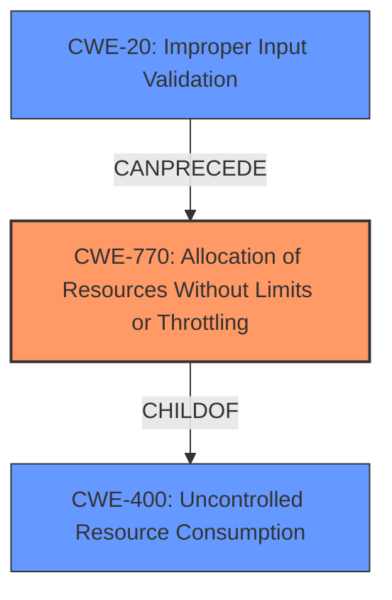

# Enhanced Analysis for CVE-2020-26257

# Summary
| CWE ID  | CWE Name  | Confidence | CWE Abstraction Level | CWE Vulnerability Mapping Label | CWE-Vulnerability Mapping Notes |
|---|---|---|---|---|---|
| CWE-770 | Allocation of Resources Without Limits or Throttling | 0.8 | Base | Allowed | Primary CWE |
| CWE-807 | Reliance on Untrusted Inputs in a Security Decision | 0.6 | Base | Allowed | Secondary Candidate |
| CWE-20 | Improper Input Validation | 0.4 | Class | Discouraged | Secondary Candidate |

## Evidence and Confidence

*   **Confidence Score:** 0.7
*   **Evidence Strength:** MEDIUM

## Relationship Analysis
The primary relationship that influenced my decision was the parent-child relationship between CWE-400 (Uncontrolled Resource Consumption) and CWE-770 (Allocation of Resources Without Limits or Throttling). While CWE-400 is a broader class, CWE-770 more precisely captures the **root cause**: the **allocation of resources without proper limits**. The other relationship was the CANFOLLOW relationship between CWE-770 and CWE-20 (Improper Input Validation) because **improper input validation** could lead to resource allocation without limits.



## Vulnerability Chain
The vulnerability chain starts with a malicious or poorly implemented homeserver injecting a **malformed event** due to **inconsistent parameter handling** (using the `room_id` from the path instead of the body). This leads to **allocation of resources without limits or throttling** (CWE-770) which results in a denial of service. A contributing factor could be **improper input validation** (CWE-20) which allowed the malformed event to be processed.

## Summary of Analysis
The analysis indicates a denial-of-service vulnerability in Matrix Synapse. A malicious homeserver can inject malformed events, leading to resource exhaustion and service disruption.

My assessment is primarily based on the **Vulnerability Description Key Phrases** and the **CVE Reference Links Content Summary**. The key phrase "malformed event injection" highlights the nature of the attack. The CVE summary explicitly mentions "lack of consistency in how `room_id` parameters are handled," and "The server didn't properly validate or prioritize the `room_id` from the request body," which supports the selection of CWE-770.

The graph relationships and retriever results guided the selection of CWE-770 as the primary weakness due to its direct relevance to the **root cause** of **unlimited resource allocation**. While other CWEs like CWE-20 (Improper Input Validation) and CWE-863 (Incorrect Authorization) were considered, they represent contributing factors or potential impacts rather than the core weakness.

CWE-770 is at the optimal level of specificity because it directly describes the **allocation of resources without limits**, which is the mechanism by which the denial-of-service is achieved. This is more specific than the general "uncontrolled resource consumption" (CWE-400) and more accurately reflects the **root cause** than simply stating there was **improper input validation** (CWE-20).

Relevant CWE Information:

# Enhanced Context (25 CWEs)
The following CWEs were identified as potentially relevant to this vulnerability:

## CWE-1289: Improper Validation of Unsafe Equivalence in Input
**Abstraction Level**: Base
**Similarity Score**: 0.77
**Source**: dense

**Description**:
The product receives an input value that is used as a resource identifier or other type of reference, but it does not validate or incorrectly validates that the input is equivalent to a potentially-unsafe value.

**Mapping Guidance**:
- Usage: Allowed
- Rationale: This CWE entry is at the Base level of abstraction, which is a preferred level of abstraction for mapping to the root causes of vulnerabilities.

## CWE-807: Reliance on Untrusted Inputs in a Security Decision
**Abstraction Level**: Base
**Similarity Score**: 0.74
**Source**: dense

**Description**:
The product uses a protection mechanism that relies on the existence or values of an input, but the input can be modified by an untrusted actor in a way that bypasses the protection mechanism.

**Mapping Guidance**:
- Usage: Allowed
- Rationale: This CWE entry is at the Base level of abstraction, which is a preferred level of abstraction for mapping to the root causes of vulnerabilities.

**Analysis:** CWE-807 is considered a secondary candidate because the server relies on the `room_id` from the request path, which can be modified by an untrusted server, to make a security decision. This reliance on an untrusted input allows the attacker to inject malformed events and cause a denial of service.

## CWE-799: Improper Control of Interaction Frequency
**Abstraction Level**: Class
**Similarity Score**: 0.74
**Source**: dense

**Description**:
The product does not properly limit the number or frequency of interactions that it has with an actor, such as the number of incoming requests.

**Mapping Guidance**:
- Usage: Allowed-with-Review
- Rationale: This CWE entry is a Class and might have Base-level children that would be more appropriate

**Analysis:** While interaction frequency could contribute to the DoS, it's not the primary **root cause** as much as allocation of resources.

## CWE-404: Improper Resource Shutdown or Release
**Abstraction Level**: Class
**Similarity Score**: 0.74
**Source**: dense

**Description**:
The product does not release or incorrectly releases a resource before it is made available for re-use.

**Mapping Guidance**:
- Usage: Allowed-with-Review
- Rationale: This CWE entry is a Class and might have Base-level children that would be more appropriate

**Analysis:** Not applicable as the problem is with initial allocation, not the release of resources.

## CWE-74: Improper Neutralization of Special Elements in Output Used by a Downstream Component ('Injection')
**Abstraction Level**: Class
**Similarity Score**: 0.74
**Source**: dense

**Description**:
The product constructs all or part of a command, data structure, or record using externally-influenced input from an upstream component, but it does not neutralize or incorrectly neutralizes special elements that could modify how it is parsed or interpreted when it is sent to a downstream component.

**Mapping Guidance**:
- Usage: Discouraged
- Rationale: CWE-74 is high-level and often misused when lower-level weaknesses are more appropriate.

**Analysis:** While the event injection could be viewed as a form of injection, it does not fit into the scope of CWE-74 which is focused on neutralization.

## CWE-138: Improper Neutralization of Special Elements
**Abstraction Level**: Class
**Similarity Score**: 0.73
**Source**: dense

**Description**:
The product receives input from an upstream component, but it does not neutralize or incorrectly neutralizes special elements that could be interpreted as control elements or syntactic markers when they are sent to a downstream component.

**Mapping Guidance**:
- Usage: Discouraged
- Rationale: This CWE entry is a level-1 Class (i.e., a child of a Pillar). It might have lower-level children that would be more appropriate

**Analysis:** Similar to CWE-74, the focus is on neutralization, which is not the primary issue.

## CWE-668: Exposure of Resource to Wrong Sphere
**Abstraction Level**: Class
**Similarity Score**: 0.73
**Source**: dense

**Description**:
The product exposes a resource to the wrong control sphere, providing unintended actors with inappropriate access to the resource.

**Mapping Guidance**:
- Usage: Discouraged
- Rationale: CWE-668 is high-level and is often misused as a catch-all when lower-level CWE IDs might be applicable. It is sometimes used for low-information vulnerability reports [REF-1287]. It is a level-1 Class (i.e., a child of a Pillar). It is not useful for trend analysis.

**Analysis:** Does not fit the description. The vulnerability is due to the unlimited allocation of resources, not the exposure of resources to the wrong sphere.

## CWE-184: Incomplete List of Disallowed Inputs
**Abstraction Level**: Base
**Similarity Score**: 0.73
**Source**: dense

**Description**:
The product implements a protection mechanism that relies on a list of inputs (or properties of inputs) that are not allowed by policy or otherwise require other action to neutralize before additional processing takes place, but the list is incomplete.

**


## CWE Relationship Analysis

Current CWEs represent these abstraction levels: .


### Vulnerability Chain Analysis

**Chain starting from CWE-404:**
- 404 (Improper Resource Shutdown or Release) - ROOT


**Chain starting from CWE-807:**
- 807 (Reliance on Untrusted Inputs in a Security Decision) - ROOT


### CWE Relationship Diagram

```mermaid
graph TD
    classDef primary fill:#f96,stroke:#333,stroke-width:2px
    classDef secondary fill:#69f,stroke:#333
    classDef tertiary fill:#9e9,stroke:#333
```