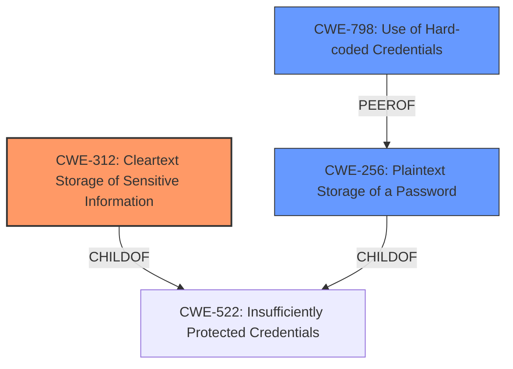

# Analysis for CVE-2020-26515

# Summary
| CWE ID | CWE Name | Confidence | CWE Abstraction Level | CWE Vulnerability Mapping Label | CWE-Vulnerability Mapping Notes |
|---|---|---|---|---|---|
| CWE-312 | Cleartext Storage of Sensitive Information | 1.0 | Base | Allowed | Primary CWE |
| CWE-798 | Use of Hard-coded Credentials | 0.9 | Base | Allowed | Secondary Candidate |
| CWE-256 | Plaintext Storage of a Password | 0.7 | Base | Allowed | Secondary Candidate |

## Evidence and Confidence

*   **Confidence Score:** 0.9
*   **Evidence Strength:** HIGH

## Relationship Analysis
The primary relationship that influenced the decision was the parent-child relationship between CWE-522 (Insufficiently Protected Credentials) and CWE-312 (Cleartext Storage of Sensitive Information). While CWE-522 is a broader class, CWE-312 directly addresses the specific issue of storing credentials in cleartext due to the **NULL encryption key**. CWE-798 (Use of Hard-coded Credentials) is related, as the **NULL key** effectively acts as a hard-coded key, but CWE-312 more accurately describes the core problem. CWE-256 is also considered because the root cause leads to the password being stored in plaintext in the cookie.

## Vulnerability Chain
The vulnerability chain starts with a coding error in the key generation logic, leading to a **NULL encryption key** and an empty salt. This results in credentials being stored in cleartext in the "remember-me" cookie. The attacker can then intercept the cookie, decrypt the credentials (trivially due to the **NULL key**), and gain unauthorized access to the user's account.

## Summary of Analysis
The initial analysis focused on the **insecure credentials storage**. The key piece of evidence is that the credentials are encrypted using a **NULL encryption key** due to a bug. This maps directly to CWE-312 (Cleartext Storage of Sensitive Information) because the **NULL key** effectively means no encryption is taking place, and the credentials are being stored in cleartext.

The retriever results suggested other possible CWEs, like CWE-798 (Use of Hard-coded Credentials) and CWE-522 (Insufficiently Protected Credentials). While the **NULL key** could be seen as a hard-coded key (CWE-798), the more direct issue is the cleartext storage itself (CWE-312). CWE-522 is too broad, as it encompasses various ways credentials can be insufficiently protected, but this vulnerability is specifically about cleartext storage.

The decision to select CWE-312 is based on its specificity and the direct evidence from the vulnerability description and the CVE Reference Links Content Summary, which clearly states that the credentials are encrypted with a **NULL key**. This effectively results in cleartext storage. The MITRE mapping guidance for CWE-312 allows its usage at the Base level, which is the preferred level of abstraction.

Relevant CWE Information:

# Enhanced Context (25 CWEs)
The following CWEs were identified as potentially relevant to this vulnerability:

## CWE-312: Cleartext Storage of Sensitive Information
**Abstraction Level**: Base
**Similarity Score**: 0.78
**Source**: dense

**Description**:
The product stores sensitive information in cleartext within a resource that might be accessible to another control sphere.

**Mapping Guidance**:
- Usage: Allowed
- Rationale: This CWE entry is at the Base level of abstraction, which is a preferred level of abstraction for mapping to the root causes of vulnerabilities.

## CWE-798: Use of Hard-coded Credentials
**Abstraction Level**: Base
**Similarity Score**: 6954.75
**Source**: sparse

**Description**:
The product contains hard-coded credentials, such as a password or cryptographic key.

**Mapping Guidance**:
- Usage: Allowed
- Rationale: This CWE entry is at the Base level of abstraction, which is a preferred level of abstraction for mapping to the root causes of vulnerabilities.

## CWE-256: Plaintext Storage of a Password
**Abstraction Level**: Base
**Similarity Score**: 0.569
**Source**: dense

**Description**:
Storing a password in plaintext may result in a system compromise.

**Mapping Guidance**:
- Usage: Allowed
- Rationale: This CWE entry is at the Base level of abstraction, which is a preferred level of abstraction for mapping to the root causes of vulnerabilities.