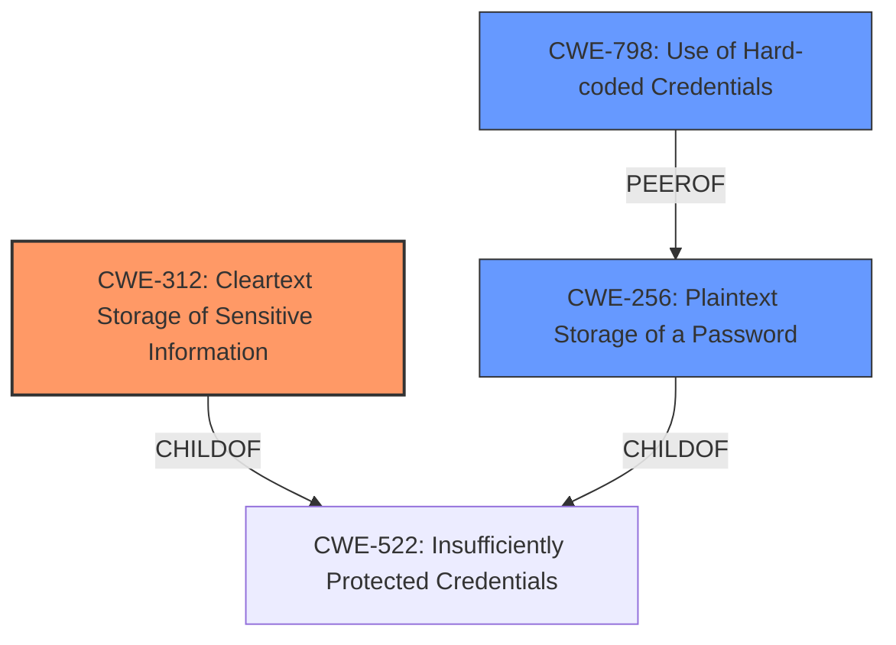

# Analysis for CVE-2020-26515

# Summary
| CWE ID | CWE Name | Confidence | CWE Abstraction Level | CWE Vulnerability Mapping Label | CWE-Vulnerability Mapping Notes |
|---|---|---|---|---|---|
| CWE-312 | Cleartext Storage of Sensitive Information | 1.0 | Base | Allowed | Primary CWE |
| CWE-798 | Use of Hard-coded Credentials | 0.9 | Base | Allowed | Secondary Candidate |
| CWE-256 | Plaintext Storage of a Password | 0.7 | Base | Allowed | Secondary Candidate |

## Evidence and Confidence

*   **Confidence Score:** 0.9
*   **Evidence Strength:** HIGH

## Relationship Analysis
The primary relationship that influenced the decision was the parent-child relationship between CWE-522 (Insufficiently Protected Credentials) and CWE-312 (Cleartext Storage of Sensitive Information). While CWE-522 is a broader class, CWE-312 directly addresses the specific issue of storing credentials in cleartext due to the **NULL encryption key**. CWE-798 (Use of Hard-coded Credentials) is related, as the **NULL key** effectively acts as a hard-coded key, but CWE-312 more accurately describes the core problem. CWE-256 is also considered because the root cause leads to the password being stored in plaintext in the cookie.



## Vulnerability Chain
The vulnerability chain starts with a coding error in the key generation logic, leading to a **NULL encryption key** and an empty salt. This results in credentials being stored in cleartext in the "remember-me" cookie. The attacker can then intercept the cookie, decrypt the credentials (trivially due to the **NULL key**), and gain unauthorized access to the user's account.

## Summary of Analysis
The initial analysis focused on the **insecure credentials storage**. The key piece of evidence is that the credentials are encrypted using a **NULL encryption key** due to a bug. This maps directly to CWE-312 (Cleartext Storage of Sensitive Information) because the **NULL key** effectively means no encryption is taking place, and the credentials are being stored in cleartext.

The retriever results suggested other possible CWEs, like CWE-798 (Use of Hard-coded Credentials) and CWE-522 (Insufficiently Protected Credentials). While the **NULL key** could be seen as a hard-coded key (CWE-798), the more direct issue is the cleartext storage itself (CWE-312). CWE-522 is too broad, as it encompasses various ways credentials can be insufficiently protected, but this vulnerability is specifically about cleartext storage.

The decision to select CWE-312 is based on its specificity and the direct evidence from the vulnerability description and the CVE Reference Links Content Summary, which clearly states that the credentials are encrypted with a **NULL key**. This effectively results in cleartext storage. The MITRE mapping guidance for CWE-312 allows its usage at the Base level, which is the preferred level of abstraction.

Relevant CWE Information:

# Enhanced Context (25 CWEs)
The following CWEs were identified as potentially relevant to this vulnerability:

## CWE-312: Cleartext Storage of Sensitive Information
**Abstraction Level**: Base
**Similarity Score**: 0.78
**Source**: dense

**Description**:
The product stores sensitive information in cleartext within a resource that might be accessible to another control sphere.

**Mapping Guidance**:
- Usage: Allowed
- Rationale: This CWE entry is at the Base level of abstraction, which is a preferred level of abstraction for mapping to the root causes of vulnerabilities.

## CWE-798: Use of Hard-coded Credentials
**Abstraction Level**: Base
**Similarity Score**: 6954.75
**Source**: sparse

**Description**:
The product contains hard-coded credentials, such as a password or cryptographic key.

**Mapping Guidance**:
- Usage: Allowed
- Rationale: This CWE entry is at the Base level of abstraction, which is a preferred level of abstraction for mapping to the root causes of vulnerabilities.

## CWE-256: Plaintext Storage of a Password
**Abstraction Level**: Base
**Similarity Score**: 0.569
**Source**: dense

**Description**:
Storing a password in plaintext may result in a system compromise.

**Mapping Guidance**:
- Usage: Allowed
- Rationale: This CWE entry is at the Base level of abstraction, which is a preferred level of abstraction for mapping to the root causes of vulnerabilities.

# Enhanced Query for CVE-2020-26515

## Vulnerability Description
An insufficiently protected credentials issue was discovered in Intland codeBeamer ALM 10.x through 10.1.SP4. The remember-me cookie (CB_LOGIN) issued by the application contains the encrypted users credentials. However, due to a bug in the application code, those credentials are encrypted using a NULL encryption key.

### Vulnerability Description Key Phrases
- **weakness:** **insecure credentials storage**
- **impact:** access encrypted users credentials
- **vector:** intercepting the remember-me cookie
- **product:** Intland codeBeamer ALM
- **version:** 10.x through 10.1.SP4

## CVE Reference Links Content Summary
Based on the provided content, here's the breakdown of the vulnerability associated with CVE-2020-26515:

**Root Cause of Vulnerability:**
- The root cause lies in the flawed implementation of the "Remember Me" feature in codeBeamer ALM. The application attempts to encrypt user credentials (username and password) before storing them in a cookie (`CB_LOGIN`). However, due to a bug in the code, the encryption key is not properly generated.

**Weaknesses/Vulnerabilities Present:**

1.  **NULL Encryption Key:** The encryption key, which should be derived from the server's MAC address, is always NULL due to an error in the key generation logic. Specifically, the MAC address is split using the wrong delimiter (`-` instead of `:`), resulting in a `NumberFormatException` and an empty byte array used for the key.
2.  **Empty Salt:** The salt used for encryption is also empty, which further weakens the security.
3.  **Predictable Encryption:** Because of the NULL key and empty salt, the encryption is essentially static and predictable across all installations of the software. This allows attackers to decrypt the `CB_LOGIN` cookie values if they have the decryption code.

**Impact of Exploitation:**
- **Credentials Exposure:** Successful exploitation of this vulnerability allows an attacker to decrypt the `CB_LOGIN` cookie and obtain the user's plaintext username and password.
- **Account Takeover:** With the plaintext credentials, attackers can gain unauthorized access to user accounts, potentially leading to data breaches, manipulation of project data, and other malicious activities.

**Attack Vectors:**

1.  **Cookie Theft:** An attacker can intercept or steal a valid `CB_LOGIN` cookie from a user's browser.
2.  **Cookie Decryption:** The attacker uses the provided decryption code to decrypt the stolen cookie and obtain the user's credentials.
3.  **Account Access:** The attacker uses the decrypted credentials to log in to the user's account.

**Required Attacker Capabilities/Position:**

1.  **Access to a Valid `CB_LOGIN` Cookie:** The attacker needs to obtain a `CB_LOGIN` cookie, which could be done by:
    *   Intercepting network traffic during login or subsequent requests.
    *   Stealing a cookie stored on the victim's machine via malware or other attacks
2.  **Knowledge of the Decryption Algorithm:** The attacker requires the decryption code or algorithm (provided in the advisory) to decrypt the cookie value. This code is publicly available.

**Additional Details:**

*   The vulnerability is present in the `com.intland.codebeamer.utils.CookieUtils` class when generating the `CB_LOGIN` cookie.
*   The core flawed logic is within the `com.intland.codebeamer.security.SavedUserCredentials.getToken()`, `getCryptingKey()`, and `com.intland.codebeamer.manager.support.Crypter` classes and their related methods.
*   The vulnerability affects versions 10.0.0-final and 21.04-final, and potentially older versions, according to the advisory.
*   The advisory includes a Proof of Concept (PoC) Java code that can be used to decrypt `CB_LOGIN` cookie values.

**Mitigation:**

The advisory recommends that the "Remember Me" feature should be redesigned to use a randomly generated session ID instead of encrypted user information and the ID should be bound to the user agent and/or IP address of the user, and only be valid for a limited amount of time.

This detailed analysis provides a comprehensive understanding of the vulnerability described by CVE-2020-26515, which is much more descriptive than the placeholder CVE description.

## Retriever Results

### Top Combined Results

| Rank | CWE ID | Name | Abstraction | Usage  | Retrievers | Individual Scores |
|------|--------|------|-------------|-------|------------|-------------------|
| 1 | 522 | Insufficiently Protected Credentials | Class | Allowed-with-Review | sparse | 0.339 |
| 2 | 321 | Use of Hard-coded Cryptographic Key | Variant | Allowed | sparse | 0.275 |
| 3 | 327 | Use of a Broken or Risky Cryptographic Algorithm | Class | Allowed-with-Review | sparse | 0.266 |
| 4 | 532 | Insertion of Sensitive Information into Log File | Base | Allowed | sparse | 0.266 |
| 5 | 798 | Use of Hard-coded Credentials | Base | Allowed | sparse | 0.262 |
| 6 | 256 | Plaintext Storage of a Password | Base | Allowed | dense | 0.569 |
| 7 | 259 | Use of Hard-coded Password | Variant | Allowed | graph | 0.003 |
| 8 | 312 | Cleartext Storage of Sensitive Information | Base | Allowed | sparse | 0.257 |
| 9 | 257 | Storing Passwords in a Recoverable Format | Base | Allowed | sparse | 0.253 |
| 10 | 1391 | Use of Weak Credentials | Class | Allowed-with-Review | sparse | 0.253 |


# Complete CWE Specifications


## CWE-522: Insufficiently Protected Credentials
**Abstraction:** Class
**Status:** Incomplete

### Description
The product transmits or stores authentication credentials, but it uses an insecure method that is susceptible to unauthorized interception and/or retrieval.

### Extended Description
Not provided

### Alternative Terms
None

### Relationships
ChildOf -> CWE-1390
ChildOf -> CWE-287
ChildOf -> CWE-668

### Mapping Guidance
**Usage:** Allowed-with-Review
**Rationale:** This CWE entry is a Class and might have Base-level children that would be more appropriate
**Comments:** Examine children of this entry to see if there is a better fit
**Reasons:**
- Abstraction


### Observed Examples
- **CVE-2022-30018:** A messaging platform serializes all elements of User/Group objects, making private information available to adversaries
- **CVE-2022-29959:** Initialization file contains credentials that can be decoded using a "simple string transformation"
- **CVE-2022-35411:** Python-based RPC framework enables pickle functionality by default, allowing clients to unpickle untrusted data.


## CWE-321: Use of Hard-coded Cryptographic Key
**Abstraction:** Variant
**Status:** Draft

### Description
The use of a hard-coded cryptographic key significantly increases the possibility that encrypted data may be recovered.

### Extended Description
Not provided

### Alternative Terms
None

### Relationships
ChildOf -> CWE-798
ChildOf -> CWE-798
ChildOf -> CWE-798

### Mapping Guidance
**Usage:** Allowed
**Rationale:** This CWE entry is at the Variant level of abstraction, which is a preferred level of abstraction for mapping to the root causes of vulnerabilities.
**Comments:** Carefully read both the name and description to ensure that this mapping is an appropriate fit. Do not try to 'force' a mapping to a lower-level Base/Variant simply to comply with this preferred level of abstraction.
**Reasons:**
- Acceptable-Use


### Additional Notes
**[Other]** The main difference between the use of hard-coded passwords and the use of hard-coded cryptographic keys is the false sense of security that the former conveys. Many people believe that simply hashing a hard-coded password before storage will protect the information from malicious users. However, many hashes are reversible (or at least vulnerable to brute force attacks) -- and further, many authentication protocols simply request the hash itself, making it no better than a password.

**[Maintenance]** The Taxonomy_Mappings to ISA/IEC 62443 were added in CWE 4.10, but they are still under review and might change in future CWE versions. These draft mappings were performed by members of the "Mapping CWE to 62443" subgroup of the CWE-CAPEC ICS/OT Special Interest Group (SIG), and their work is incomplete as of CWE 4.10. The mappings are included to facilitate discussion and review by the broader ICS/OT community, and they are likely to change in future CWE versions.


### Observed Examples
- **CVE-2022-29960:** Engineering Workstation uses hard-coded cryptographic keys that could allow for unathorized filesystem access and privilege escalation
- **CVE-2022-30271:** Remote Terminal Unit (RTU) uses a hard-coded SSH private key that is likely to be used by default.
- **CVE-2020-10884:** WiFi router service has a hard-coded encryption key, allowing root access


## CWE-327: Use of a Broken or Risky Cryptographic Algorithm
**Abstraction:** Class
**Status:** Draft

### Description
The product uses a broken or risky cryptographic algorithm or protocol.

### Extended Description


Cryptographic algorithms are the methods by which data is scrambled to prevent observation or influence by unauthorized actors. Insecure cryptography can be exploited to expose sensitive information, modify data in unexpected ways, spoof identities of other users or devices, or other impacts.


It is very difficult to produce a secure algorithm, and even high-profile algorithms by accomplished cryptographic experts have been broken. Well-known techniques exist to break or weaken various kinds of cryptography. Accordingly, there are a small number of well-understood and heavily studied algorithms that should be used by most products. Using a non-standard or known-insecure algorithm is dangerous because a determined adversary may be able to break the algorithm and compromise whatever data has been protected.


Since the state of cryptography advances so rapidly, it is common for an algorithm to be considered "unsafe" even if it was once thought to be strong. This can happen when new attacks are discovered, or if computing power increases so much that the cryptographic algorithm no longer provides the amount of protection that was originally thought.


For a number of reasons, this weakness is even more challenging to manage with hardware deployment of cryptographic algorithms as opposed to software implementation. First, if a flaw is discovered with hardware-implemented cryptography, the flaw cannot be fixed in most cases without a recall of the product, because hardware is not easily replaceable like software. Second, because the hardware product is expected to work for years, the adversary's computing power will only increase over time.


### Alternative Terms
None

### Relationships
ChildOf -> CWE-693
PeerOf -> CWE-311

### Mapping Guidance
**Usage:** Allowed-with-Review
**Rationale:** This CWE entry is a Class and might have Base-level children that would be more appropriate
**Comments:** Examine children of this entry to see if there is a better fit
**Reasons:**
- Abstraction


### Additional Notes
**[Maintenance]** Since CWE 4.4, various cryptography-related entries, including CWE-327 and CWE-1240, have been slated for extensive research, analysis, and community consultation to define consistent terminology, improve relationships, and reduce overlap or duplication. As of CWE 4.6, this work is still ongoing.

**[Maintenance]** The Taxonomy_Mappings to ISA/IEC 62443 were added in CWE 4.10, but they are still under review and might change in future CWE versions. These draft mappings were performed by members of the "Mapping CWE to 62443" subgroup of the CWE-CAPEC ICS/OT Special Interest Group (SIG), and their work is incomplete as of CWE 4.10. The mappings are included to facilitate discussion and review by the broader ICS/OT community, and they are likely to change in future CWE versions.


### Observed Examples
- **CVE-2022-30273:** SCADA-based protocol supports a legacy encryption mode that uses Tiny Encryption Algorithm (TEA) in ECB mode, which leaks patterns in messages and cannot protect integrity
- **CVE-2022-30320:** Programmable Logic Controller (PLC) uses a protocol with a cryptographically insecure hashing algorithm for passwords.
- **CVE-2008-3775:** Product uses "ROT-25" to obfuscate the password in the registry.


## CWE-532: Insertion of Sensitive Information into Log File
**Abstraction:** Base
**Status:** Incomplete

### Description
The product writes sensitive information to a log file.

### Extended Description
Not provided

### Alternative Terms
None

### Relationships
ChildOf -> CWE-538
ChildOf -> CWE-200

### Mapping Guidance
**Usage:** Allowed
**Rationale:** This CWE entry is at the Base level of abstraction, which is a preferred level of abstraction for mapping to the root causes of vulnerabilities.
**Comments:** Carefully read both the name and description to ensure that this mapping is an appropriate fit. Do not try to 'force' a mapping to a lower-level Base/Variant simply to comply with this preferred level of abstraction.
**Reasons:**
- Acceptable-Use


### Observed Examples
- **CVE-2017-9615:** verbose logging stores admin credentials in a world-readable log file
- **CVE-2018-1999036:** SSH password for private key stored in build log


## CWE-798: Use of Hard-coded Credentials
**Abstraction:** Base
**Status:** Draft

### Description
The product contains hard-coded credentials, such as a password or cryptographic key.

### Extended Description


There are two main variations:


  - Inbound: the product contains an authentication mechanism that checks the input credentials against a hard-coded set of credentials. In this variant, a default administration account is created, and a simple password is hard-coded into the product and associated with that account. This hard-coded password is the same for each installation of the product, and it usually cannot be changed or disabled by system administrators without manually modifying the program, or otherwise patching the product. It can also be difficult for the administrator to detect.

  - Outbound: the product connects to another system or component, and it contains hard-coded credentials for connecting to that component. This variant applies to front-end systems that authenticate with a back-end service. The back-end service may require a fixed password that can be easily discovered. The programmer may simply hard-code those back-end credentials into the front-end product.


### Alternative Terms
None

### Relationships
ChildOf -> CWE-1391
ChildOf -> CWE-287
ChildOf -> CWE-344
ChildOf -> CWE-671
PeerOf -> CWE-257

### Mapping Guidance
**Usage:** Allowed
**Rationale:** This CWE entry is at the Base level of abstraction, which is a preferred level of abstraction for mapping to the root causes of vulnerabilities.
**Comments:** Carefully read both the name and description to ensure that this mapping is an appropriate fit. Do not try to 'force' a mapping to a lower-level Base/Variant simply to comply with this preferred level of abstraction.
**Reasons:**
- Acceptable-Use


### Additional Notes
**[Maintenance]** The Taxonomy_Mappings to ISA/IEC 62443 were added in CWE 4.10, but they are still under review and might change in future CWE versions. These draft mappings were performed by members of the "Mapping CWE to 62443" subgroup of the CWE-CAPEC ICS/OT Special Interest Group (SIG), and their work is incomplete as of CWE 4.10. The mappings are included to facilitate discussion and review by the broader ICS/OT community, and they are likely to change in future CWE versions.


### Observed Examples
- **CVE-2022-29953:** Condition Monitor firmware has a maintenance interface with hard-coded credentials
- **CVE-2022-29960:** Engineering Workstation uses hard-coded cryptographic keys that could allow for unathorized filesystem access and privilege escalation
- **CVE-2022-29964:** Distributed Control System (DCS) has hard-coded passwords for local shell access


## CWE-256: Plaintext Storage of a Password
**Abstraction:** Base
**Status:** Incomplete

### Description
Storing a password in plaintext may result in a system compromise.

### Extended Description
Password management issues occur when a password is stored in plaintext in an application's properties, configuration file, or memory. Storing a plaintext password in a configuration file allows anyone who can read the file access to the password-protected resource. In some contexts, even storage of a plaintext password in memory is considered a security risk if the password is not cleared immediately after it is used.

### Alternative Terms
None

### Relationships
ChildOf -> CWE-522

### Mapping Guidance
**Usage:** Allowed
**Rationale:** This CWE entry is at the Base level of abstraction, which is a preferred level of abstraction for mapping to the root causes of vulnerabilities.
**Comments:** Carefully read both the name and description to ensure that this mapping is an appropriate fit. Do not try to 'force' a mapping to a lower-level Base/Variant simply to comply with this preferred level of abstraction.
**Reasons:**
- Acceptable-Use


### Observed Examples
- **CVE-2022-30275:** Remote Terminal Unit (RTU) uses a driver that relies on a password stored in plaintext.


## CWE-259: Use of Hard-coded Password
**Abstraction:** Variant
**Status:** Draft

### Description
The product contains a hard-coded password, which it uses for its own inbound authentication or for outbound communication to external components.

### Extended Description


A hard-coded password typically leads to a significant authentication failure that can be difficult for the system administrator to detect. Once detected, it can be difficult to fix, so the administrator may be forced into disabling the product entirely. There are two main variations:

```
		Inbound: the product contains an authentication mechanism that checks for a hard-coded password.
		Outbound: the product connects to another system or component, and it contains hard-coded password for connecting to that component.
```
In the Inbound variant, a default administration account is created, and a simple password is hard-coded into the product and associated with that account. This hard-coded password is the same for each installation of the product, and it usually cannot be changed or disabled by system administrators without manually modifying the program, or otherwise patching the product. If the password is ever discovered or published (a common occurrence on the Internet), then anybody with knowledge of this password can access the product. Finally, since all installations of the product will have the same password, even across different organizations, this enables massive attacks such as worms to take place.

The Outbound variant applies to front-end systems that authenticate with a back-end service. The back-end service may require a fixed password which can be easily discovered. The programmer may simply hard-code those back-end credentials into the front-end product. Any user of that program may be able to extract the password. Client-side systems with hard-coded passwords pose even more of a threat, since the extraction of a password from a binary is usually very simple.


### Alternative Terms
None

### Relationships
ChildOf -> CWE-798
ChildOf -> CWE-798
ChildOf -> CWE-798
PeerOf -> CWE-321
PeerOf -> CWE-257

### Mapping Guidance
**Usage:** Allowed
**Rationale:** This CWE entry is at the Variant level of abstraction, which is a preferred level of abstraction for mapping to the root causes of vulnerabilities.
**Comments:** Carefully read both the name and description to ensure that this mapping is an appropriate fit. Do not try to 'force' a mapping to a lower-level Base/Variant simply to comply with this preferred level of abstraction.
**Reasons:**
- Acceptable-Use


### Additional Notes
**[Maintenance]** This entry could be split into multiple variants: an inbound variant (as seen in the second demonstrative example) and an outbound variant (as seen in the first demonstrative example). These variants are likely to have different consequences, detectability, etc. More importantly, from a vulnerability theory perspective, they could be characterized as different behaviors.


### Observed Examples
- **CVE-2022-29964:** Distributed Control System (DCS) has hard-coded passwords for local shell access
- **CVE-2021-37555:** Telnet service for IoT feeder for dogs and cats has hard-coded password [REF-1288]
- **CVE-2021-35033:** Firmware for a WiFi router uses a hard-coded password for a BusyBox shell, allowing bypass of authentication through the UART port


## CWE-312: Cleartext Storage of Sensitive Information
**Abstraction:** Base
**Status:** Draft

### Description
The product stores sensitive information in cleartext within a resource that might be accessible to another control sphere.

### Extended Description


Because the information is stored in cleartext (i.e., unencrypted), attackers could potentially read it. Even if the information is encoded in a way that is not human-readable, certain techniques could determine which encoding is being used, then decode the information.


When organizations adopt cloud services, it can be easier for attackers to access the data from anywhere on the Internet.


In some systems/environments such as cloud, the use of "double encryption" (at both the software and hardware layer) might be required, and the developer might be solely responsible for both layers, instead of shared responsibility with the administrator of the broader system/environment.


### Alternative Terms
None

### Relationships
ChildOf -> CWE-311
ChildOf -> CWE-311
ChildOf -> CWE-922

### Mapping Guidance
**Usage:** Allowed
**Rationale:** This CWE entry is at the Base level of abstraction, which is a preferred level of abstraction for mapping to the root causes of vulnerabilities.
**Comments:** Carefully read both the name and description to ensure that this mapping is an appropriate fit. Do not try to 'force' a mapping to a lower-level Base/Variant simply to comply with this preferred level of abstraction.
**Reasons:**
- Acceptable-Use


### Additional Notes
**[Terminology]** Different people use "cleartext" and "plaintext" to mean the same thing: the lack of encryption. However, within cryptography, these have more precise meanings. Plaintext is the information just before it is fed into a cryptographic algorithm, including already-encrypted text. Cleartext is any information that is unencrypted, although it might be in an encoded form that is not easily human-readable (such as base64 encoding).


### Observed Examples
- **CVE-2022-30275:** Remote Terminal Unit (RTU) uses a driver that relies on a password stored in plaintext.
- **CVE-2009-2272:** password and username stored in cleartext in a cookie
- **CVE-2009-1466:** password stored in cleartext in a file with insecure permissions


## CWE-257: Storing Passwords in a Recoverable Format
**Abstraction:** Base
**Status:** Incomplete

### Description
The storage of passwords in a recoverable format makes them subject to password reuse attacks by malicious users. In fact, it should be noted that recoverable encrypted passwords provide no significant benefit over plaintext passwords since they are subject not only to reuse by malicious attackers but also by malicious insiders. If a system administrator can recover a password directly, or use a brute force search on the available information, the administrator can use the password on other accounts.

### Extended Description
Not provided

### Alternative Terms
None

### Relationships
ChildOf -> CWE-522
PeerOf -> CWE-259

### Mapping Guidance
**Usage:** Allowed
**Rationale:** This CWE entry is at the Base level of abstraction, which is a preferred level of abstraction for mapping to the root causes of vulnerabilities.
**Comments:** Carefully read both the name and description to ensure that this mapping is an appropriate fit. Do not try to 'force' a mapping to a lower-level Base/Variant simply to comply with this preferred level of abstraction.
**Reasons:**
- Acceptable-Use


### Additional Notes
**[Maintenance]** The meaning of this entry needs to be investigated more closely, especially with respect to what is meant by "recoverable."


### Observed Examples
- **CVE-2022-30018:** A messaging platform serializes all elements of User/Group objects, making private information available to adversaries


## CWE-1391: Use of Weak Credentials
**Abstraction:** Class
**Status:** Incomplete

### Description
The product uses weak credentials (such as a default key or hard-coded password) that can be calculated, derived, reused, or guessed by an attacker.

### Extended Description


By design, authentication protocols try to ensure that attackers must perform brute force attacks if they do not know the credentials such as a key or password. However, when these credentials are easily predictable or even fixed (as with default or hard-coded passwords and keys), then the attacker can defeat the mechanism without relying on brute force.


Credentials may be weak for different reasons, such as:


  - Hard-coded (i.e., static and unchangeable by the administrator)

  - Default (i.e., the same static value across different deployments/installations, but able to be changed by the administrator)

  - Predictable (i.e., generated in a way that produces unique credentials across deployments/installations, but can still be guessed with reasonable efficiency)

Even if a new, unique credential is intended to be generated for each product installation, if the generation is predictable, then that may also simplify guessing attacks.

### Alternative Terms
None

### Relationships
ChildOf -> CWE-1390

### Mapping Guidance
**Usage:** Allowed-with-Review
**Rationale:** This CWE entry is a Class and might have Base-level children that would be more appropriate
**Comments:** Examine children of this entry to see if there is a better fit
**Reasons:**
- Abstraction


### Observed Examples
- **[REF-1374]:** Chain: JavaScript-based cryptocurrency library can fall back to the insecure Math.random() function instead of reporting a failure (CWE-392), thus reducing the entropy (CWE-332) and leading to generation of non-unique cryptographic keys for Bitcoin wallets (CWE-1391)
- **CVE-2022-30270:** Remote Terminal Unit (RTU) uses default credentials for some SSH accounts
- **CVE-2022-29965:** Distributed Control System (DCS) uses a deterministic algorithm to generate utility passwords

