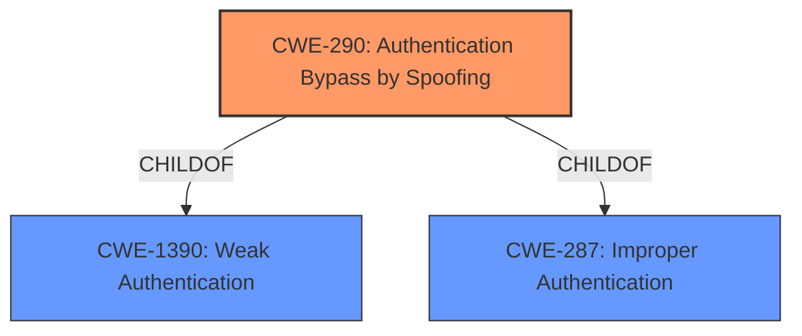

# Enhanced Analysis for CVE-2020-26555

# Summary
| CWE ID  | CWE Name                                       | Confidence | CWE Abstraction Level | CWE Vulnerability Mapping Label | CWE-Vulnerability Mapping Notes |
| :-------- | :--------------------------------------------- | :---------- | :-------------------- | :------------------------------ | :------------------------------ |
| CWE-290 | Authentication Bypass by Spoofing            | 0.9         | Base                  | Primary                         | Allowed                       |
| CWE-1390 | Weak Authentication                          | 0.7         | Class                  | Secondary                       | Allowed-with-Review         |

## Evidence and Confidence

*   **Confidence Score:** 0.8
*   **Evidence Strength:** HIGH

## Relationship Analysis
The primary CWE is CWE-290, which is a base-level weakness describing authentication bypass through spoofing. This is supported by the vulnerability description that the BD_ADDR can be spoofed. CWE-290 is a child of CWE-1390 (Weak Authentication) and CWE-287 (Improper Authentication). The relationship indicates that the spoofing is a specific type of weak or improper authentication. Selecting the base class CWE-290 gives the most specific description of the vulnerability.



## Vulnerability Chain
The vulnerability chain starts with the **improper BD_ADDR validation**, which allows an unauthenticated device to spoof the BD_ADDR, leading to authentication bypass and completing pairing without knowledge of the PIN.

## Summary of Analysis
The initial analysis focused on the **rootcause** of the vulnerability, which is the **improper BD_ADDR validation**, leading to the ability to spoof the BD_ADDR. The CVE description and supporting evidence clearly indicate that an attacker can bypass authentication by spoofing the BD_ADDR.

The Bluetooth SIG statement confirms this: "Researchers identified that it was possible for an attacker spoofing the Bluetooth Device Address (BD_ADDR) of a device to complete BR/EDR pin-code pairing with that device without requiring knowledge of the pin code."

CWE-290 (Authentication Bypass by Spoofing) accurately captures this weakness. It is a base-level CWE, providing a specific description of the vulnerability.

CWE-1390 (Weak Authentication) was considered as a broader classification, but CWE-290 is more precise as it directly addresses the spoofing aspect of the authentication bypass.

The final decision is based on the evidence of spoofing and the specificity of CWE-290, which aligns with the vulnerability's root cause and impact.

Relevant CWE Information:

# Enhanced Context (25 CWEs)
The following CWEs were identified as potentially relevant to this vulnerability:

## CWE-319: Cleartext Transmission of Sensitive Information
**Abstraction Level**: Base
**Similarity Score**: 0.78
**Source**: dense

**Description**:
The product transmits sensitive or security-critical data in cleartext in a communication channel that can be sniffed by unauthorized actors.

**Mapping Guidance**:
- Usage: Allowed
- Rationale: This CWE entry is at the Base level of abstraction, which is a preferred level of abstraction for mapping to the root causes of vulnerabilities.

## CWE-345: Insufficient Verification of Data Authenticity
**Abstraction Level**: Class
**Similarity Score**: 0.77
**Source**: dense

**Description**:
The product does not sufficiently verify the origin or authenticity of data, in a way that causes it to accept invalid data.

**Mapping Guidance**:
- Usage: Discouraged
- Rationale: This CWE entry is a level-1 Class (i.e., a child of a Pillar). It might have lower-level children that would be more appropriate

## CWE-303: Incorrect Implementation of Authentication Algorithm
**Abstraction Level**: Base
**Similarity Score**: 0.77
**Source**: dense

**Description**:
The requirements for the product dictate the use of an established authentication algorithm, but the implementation of the algorithm is incorrect.

**Mapping Guidance**:
- Usage: Allowed
- Rationale: This CWE entry is at the Base level of abstraction, which is a preferred level of abstraction for mapping to the root causes of vulnerabilities.

## CWE-1391: Use of Weak Credentials
**Abstraction Level**: Class
**Similarity Score**: 0.77
**Source**: dense

**Description**:
The product uses weak credentials (such as a default key or hard-coded password) that can be calculated, derived, reused, or guessed by an attacker.

**Mapping Guidance**:
- Usage: Allowed-with-Review
- Rationale: This CWE entry is a Class and might have Base-level children that would be more appropriate

## CWE-807: Reliance on Untrusted Inputs in a Security Decision
**Abstraction Level**: Base
**Similarity Score**: 0.77
**Source**: dense

**Description**:
The product uses a protection mechanism that relies on the existence or values of an input, but the input can be modified by an untrusted actor in a way that bypasses the protection mechanism.

**Mapping Guidance**:
- Usage: Allowed
- Rationale: This CWE entry is at the Base level of abstraction, which is a preferred level of abstraction for mapping to the root causes of vulnerabilities.

## CWE-290: Authentication Bypass by Spoofing
**Abstraction Level**: Base
**Similarity Score**: 0.76
**Source**: dense

**Description**:
This attack-focused weakness is caused by incorrectly implemented authentication schemes that are subject to spoofing attacks.

**Mapping Guidance**:
- Usage: Allowed
- Rationale: This CWE entry is at the Base level of abstraction, which is a preferred level of abstraction for mapping to the root causes of vulnerabilities.

## CWE-312: Cleartext Storage of Sensitive Information
**Abstraction Level**: Base
**Similarity Score**: 0.76
**Source**: dense

**Description**:
The product stores sensitive information in cleartext within a resource that might be accessible to another control sphere.

**Mapping Guidance**:
- Usage: Allowed
- Rationale: This CWE entry is at the Base level of abstraction, which is a preferred level of abstraction for mapping to the root causes of vulnerabilities.

## CWE-1390: Weak Authentication
**Abstraction Level**: Class
**Similarity Score**: 0.76
**Source**: dense

**Description**:
The product uses an authentication mechanism to restrict access to specific users or identities, but the mechanism does not sufficiently prove that the claimed identity is correct.

**Mapping Guidance**:
- Usage: Allowed-with-Review
- Rationale: This CWE entry is a Class and might have Base-level children that would be more appropriate

## CWE-294: Authentication Bypass by Capture-replay
**Abstraction Level**: Base
**Similarity Score**: 0.76
**Source**: dense

**Description**:
A capture-replay flaw exists when the design of the product makes it possible for a malicious user to sniff network traffic and bypass authentication by replaying it to the server in question to the same effect as the original message (or with minor changes).

**Mapping Guidance**:
- Usage: Allowed
- Rationale: This CWE entry is at the Base level of abstraction, which is a preferred level of abstraction for mapping to the root causes of vulnerabilities.

## CWE-203: Observable Discrepancy
**Abstraction Level**: Base
**Similarity Score**: 0.76
**Source**: dense

**Description**:
The product behaves differently or sends different responses under different circumstances in a way that is observable to an unauthorized actor, which exposes security-relevant information about the state of the product, such as whether a particular operation was successful or not.

**Mapping Guidance**:
- Usage: Allowed
- Rationale: This CWE entry is at the Base level of abstraction, which is a preferred level of abstraction for mapping to the root causes of vulnerabilities.

## CWE-290: Authentication Bypass by Spoofing
**Abstraction Level**: Base
**Similarity Score**: 7569.16
**Source**: sparse

**Description**:
This attack-focused weakness is caused by incorrectly implemented authentication schemes that are subject to spoofing attacks.

**Mapping Guidance**:
- Usage: Allowed
- Rationale: This CWE entry is at the Base level of abstraction, which is a preferred level of abstraction for mapping to the root causes of vulnerabilities.

## CWE-301: Reflection Attack in an Authentication Protocol
**Abstraction Level**: Base
**Similarity Score**: 7334.20
**Source**: sparse

**Description**:
Simple authentication protocols are subject to reflection attacks if a malicious user can use the target machine to impersonate a trusted user.

**Mapping Guidance**:
-


## CWE Relationship Analysis

Current CWEs represent these abstraction levels: .


### Vulnerability Chain Analysis

**Chain starting from CWE-303:**
- 303 (Incorrect Implementation of Authentication Algorithm) - ROOT


**Chain starting from CWE-294:**
- 294 (Authentication Bypass by Capture-replay) - ROOT


### CWE Relationship Diagram

```mermaid
graph TD
    classDef primary fill:#f96,stroke:#333,stroke-width:2px
    classDef secondary fill:#69f,stroke:#333
    classDef tertiary fill:#9e9,stroke:#333
```