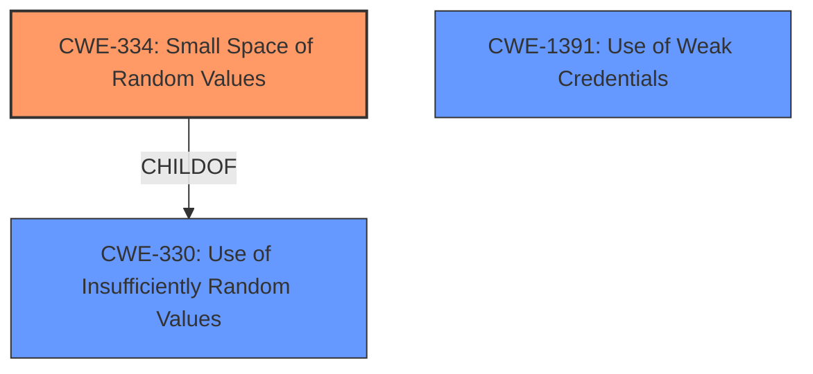

# Enhanced Analysis for CVE-2020-26557

# Summary
| CWE ID | CWE Name | Confidence | CWE Abstraction Level | CWE Vulnerability Mapping Label | CWE-Vulnerability Mapping Notes |
|---|---|---|---|---|---|
| CWE-334 | Small Space of Random Values | 0.9 | Base | Primary | Allowed |
| CWE-330 | Use of Insufficiently Random Values | 0.7 | Class | Secondary | Discouraged |
| CWE-1391 | Use of Weak Credentials | 0.6 | Class | Secondary | Allowed-with-Review |

## Evidence and Confidence

*   **Confidence Score:** 0.9
*   **Evidence Strength:** HIGH

## Relationship Analysis
The primary CWE selected is CWE-334, which is a Base level CWE and a child of CWE-330. CWE-330 is a Class level CWE for Use of Insufficiently Random Values. CWE-1391 is a Class level CWE for Use of Weak Credentials. The vulnerability description clearly points to the use of a small space of random values that can be brute-forced, thus leading to selection of CWE-334 as the primary CWE.



## Vulnerability Chain
The chain of root cause and weaknesses for the Vulnerability Description are:
1.  **ROOT CAUSE:** The AuthValue used in the provisioning protocol has low entropy, leading to CWE-334 (Small Space of Random Values).
2.  The small space of random values makes the AuthValue predictable and allows for a **brute-force attack**.
3.  **IMPACT:** A nearby device can determine the AuthValue, potentially leading to a Man-in-the-Middle (MITM) attack.

## Summary of Analysis
The initial analysis considered several CWEs, especially those related to weak cryptography and authentication bypass. The vulnerability description clearly states that the **weakness** is a **brute-force attack** due to a predictable AuthValue. The "CVE Reference Links Content Summary" confirms that the **root_cause** is "The Mesh Provisioning procedure in Bluetooth Mesh Profile Specification versions 1.0 and 1.0.1 is vulnerable when the AuthValue is predictable or has low entropy, allowing brute-force attacks." This aligns well with CWE-334 (Small Space of Random Values), which describes a situation where the number of possible random values is smaller than needed, making it susceptible to brute-force attacks.

CWE-330 (Use of Insufficiently Random Values) was considered as a parent class of CWE-334. While it's a relevant consideration, CWE-334 provides a more specific description of the weakness.

CWE-1391 (Use of Weak Credentials) was also considered because the predictable AuthValue can be seen as a form of weak credential. However, CWE-334 better captures the root cause related to the small space of random values.

The relationship analysis helped refine the selection to the most specific CWE. Given the available information, CWE-334 is the most appropriate and specific classification. Therefore, my assessment is primarily based on the provided evidence with high confidence.

Relevant CWE Information:

# Enhanced Context (25 CWEs)

## CWE-916: Use of Password Hash With Insufficient Computational Effort
**Abstraction Level**: Base
**Similarity Score**: 0.80
**Source**: dense

**Description**:
The product generates a hash for a password, but it uses a scheme that does not provide a sufficient level of computational effort that would make password cracking attacks infeasible or expensive.

**Mapping Guidance**:
- Usage: Allowed
- Rationale: This CWE entry is at the Base level of abstraction, which is a preferred level of abstraction for mapping to the root causes of vulnerabilities.
*Not selected:* This CWE focuses on password hashing, which isn't the primary issue. The problem here is with the insufficient randomness of the AuthValue, not the hashing algorithm itself.

## CWE-328: Use of Weak Hash
**Abstraction Level**: Base
**Similarity Score**: 0.78
**Source**: dense

**Description**:
The product uses an algorithm that produces a digest (output value) that does not meet security expectations for a hash function that allows an adversary to reasonably determine the original input (preimage attack), find another input that can produce the same hash (2nd preimage attack), or find multiple inputs that evaluate to the same hash (birthday attack).

**Mapping Guidance**:
- Usage: Allowed
- Rationale: This CWE entry is at the Base level of abstraction, which is a preferred level of abstraction for mapping to the root causes of vulnerabilities.
*Not selected:* Similar to CWE-916, this CWE addresses weak hashing algorithms. The core issue isn't a weak hash, but rather a small space of possible AuthValues.

## CWE-330: Use of Insufficiently Random Values
**Abstraction Level**: Class
**Similarity Score**: 0.77
**Source**: dense

**Description**:
The product uses insufficiently random numbers or values in a security context that depends on unpredictable numbers.

**Mapping Guidance**:
- Usage: Discouraged
- Rationale: This CWE entry is a level-1 Class (i.e., a child of a Pillar). It might have lower-level children that would be more appropriate
*Selected as secondary:* This CWE is a broader categorization of the problem, and CWE-334 (Small Space of Random Values) is a more specific child that is more relevant.

## CWE-1391: Use of Weak Credentials
**Abstraction Level**: Class
**Similarity Score**: 0.77
**Source**: dense

**Description**:
The product uses weak credentials (such as a default key or hard-coded password) that can be calculated, derived, reused, or guessed by an attacker.

**Mapping Guidance**:
- Usage: Allowed-with-Review
- Rationale: This CWE entry is a Class and might have Base-level children that would be more appropriate
*Selected as secondary:* The predictable AuthValue can be considered a form of weak credential, as it's easily guessed.

## CWE-331: Insufficient Entropy
**Abstraction Level**: Base
**Similarity Score**: 0.76
**Source**: dense

**Description**:
The product uses an algorithm or scheme that produces insufficient entropy, leaving patterns or clusters of values that are more likely to occur than others.

**Mapping Guidance**:
- Usage: Allowed
- Rationale: This CWE entry is at the Base level of abstraction, which is a preferred level of abstraction for mapping to the root causes of vulnerabilities.
*Not selected:* Although related, CWE-334 is more precise as it directly refers to the small space of random values, leading to a brute-force attack. CWE-331 is more about the patterns.

## CWE-1240: Use of a Cryptographic Primitive with a Risky Implementation
**Abstraction Level**: Base
**Similarity Score**: 0.75
**Source**: dense

**Description**:
To fulfill the need for a cryptographic primitive, the product implements a cryptographic algorithm using a non-standard, unproven, or disallowed/non-compliant cryptographic implementation.

**Mapping Guidance**:
- Usage: Allowed
- Rationale: This CWE entry is at the Base level of abstraction, which is a preferred level of abstraction for mapping to the root causes of vulnerabilities.
*Not selected:* This CWE is focused on the implementation of cryptographic algorithms, not the lack of sufficient randomness in the AuthValue.

## CWE-759: Use of a One-Way Hash without a Salt
**Abstraction Level**: Variant
**Similarity Score**: 0.75
**Source**: dense

**Description**:
The product uses a one-way cryptographic hash against an input that should not be reversible, such as a password, but the product does not also use a salt as part of the input.

**Mapping Guidance**:
- Usage: Allowed
- Rationale: This CWE entry is at the Variant level of abstraction, which is a preferred level of abstraction for mapping to the root causes of vulnerabilities.
*Not selected:* This CWE describes a specific issue related to password hashing (missing salt), and it doesn't directly address the vulnerability.

## CWE-836: Use of Password Hash Instead of Password for Authentication
**Abstraction Level**: Base
**Similarity Score**: 0.74
**Source**: dense

**Description**:
The product records password hashes in a data store, receives a hash of a password from a client, and compares the supplied hash to the hash obtained from the data store.

**Mapping Guidance**:
- Usage: Allowed
- Rationale: This CWE entry is at the Base level of abstraction, which is a preferred level of abstraction for mapping to the root causes of vulnerabilities.
*Not selected:* This


## CWE Relationship Analysis

Current CWEs represent these abstraction levels: .


### Vulnerability Chain Analysis

**Chain starting from CWE-916:**
- 916 (Use of Password Hash With Insufficient Computational Effort) - ROOT


**Chain starting from CWE-331:**
- 331 (Insufficient Entropy) - ROOT


### CWE Relationship Diagram

```mermaid
graph TD
    classDef primary fill:#f96,stroke:#333,stroke-width:2px
    classDef secondary fill:#69f,stroke:#333
    classDef tertiary fill:#9e9,stroke:#333
```