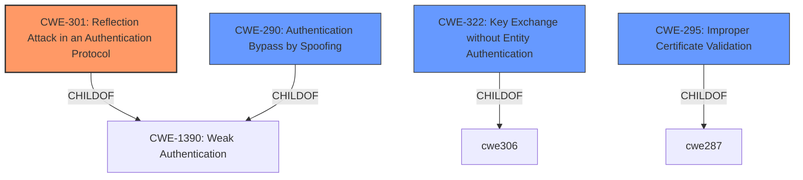

# Enhanced Analysis for CVE-2020-26558

# Summary
| CWE ID | CWE Name | Confidence | CWE Abstraction Level | CWE Vulnerability Mapping Label | CWE-Vulnerability Mapping Notes |
|---|---|---|---|---|---|
| CWE-301 | Reflection Attack in an Authentication Protocol | 0.8 | Base | Primary | Allowed |
| CWE-290 | Authentication Bypass by Spoofing | 0.6 | Base | Secondary | Allowed |
| CWE-322 | Key Exchange without Entity Authentication | 0.5 | Base | Secondary | Allowed |
| CWE-295 | Improper Certificate Validation | 0.4 | Base | Secondary | Allowed |

## Evidence and Confidence

*   **Confidence Score:** 0.8
*   **Evidence Strength:** HIGH

## Relationship Analysis
The primary CWE is CWE-301, which is a base-level weakness describing reflection attacks in authentication protocols. This weakness is a child of CWE-1390, which represents weak authentication in general. CWE-290, Authentication Bypass by Spoofing is also a child of CWE-1390, and represents a similar type of authentication bypass. The vulnerability description details a man-in-the-middle attack that exploits the reflection of public keys and authentication evidence, which aligns directly with CWE-301.



## Vulnerability Chain
The vulnerability chain starts with the **improper handling of public keys and authentication** during the Bluetooth Passkey pairing. The vulnerability lies in the **reflection of the public key and the authentication evidence** of the initiating device during Passkey authentication, which permits a MITM attacker to obtain the Passkey. This leads to the attacker being able to impersonate one of the paired devices.
  - **Root Cause:** **Improper handling of public keys and authentication** during Bluetooth Passkey pairing, leading to reflection of authentication evidence.
  - **Weakness:** CWE-301: Reflection Attack in an Authentication Protocol
  - **Impact:** An attacker can impersonate one of the paired devices to the other

## Summary of Analysis
The initial assessment strongly points towards CWE-301, given the description of the reflection attack. The CVE details further confirm this with the statement: "The vulnerability lies in the reflection of the public key and the authentication evidence of the initiating device during Passkey authentication which permits a MITM attacker to obtain the Passkey."

CWE-290, Authentication Bypass by Spoofing, is a secondary candidate because the attack involves the attacker impersonating a legitimate device. However, the core of the vulnerability is the reflection attack itself, making CWE-301 the more precise classification.

CWE-322, Key Exchange without Entity Authentication, is considered because the attack involves a key exchange where the identity of the communicating parties is not properly verified due to the reflection.

CWE-295, Improper Certificate Validation, is another secondary candidate as the **inadequate validation of public keys** is listed as a weakness.

The final selection prioritizes CWE-301 because it directly addresses the reflection attack mechanism, which is the root cause of the vulnerability. This selection is made with high confidence due to the clear alignment between the vulnerability description, the CVE details, and the CWE definition. The other CWEs were considered due to related authentication issues but are not as precise as CWE-301 in describing the core weakness.

Relevant CWE Information:

# Enhanced Context (25 CWEs)
The following CWEs were identified as potentially relevant to this vulnerability:

## CWE-303: Incorrect Implementation of Authentication Algorithm
**Abstraction Level**: Base
**Similarity Score**: 0.79
**Source**: dense

**Description**:
The requirements for the product dictate the use of an established authentication algorithm, but the implementation of the algorithm is incorrect.

**Mapping Guidance**:
- Usage: Allowed
- Rationale: This CWE entry is at the Base level of abstraction, which is a preferred level of abstraction for mapping to the root causes of vulnerabilities.

## CWE-345: Insufficient Verification of Data Authenticity
**Abstraction Level**: Class
**Similarity Score**: 0.79
**Source**: dense

**Description**:
The product does not sufficiently verify the origin or authenticity of data, in a way that causes it to accept invalid data.

**Mapping Guidance**:
- Usage: Discouraged
- Rationale: This CWE entry is a level-1 Class (i.e., a child of a Pillar). It might have lower-level children that would be more appropriate

## CWE-1390: Weak Authentication
**Abstraction Level**: Class
**Similarity Score**: 0.78
**Source**: dense

**Description**:
The product uses an authentication mechanism to restrict access to specific users or identities, but the mechanism does not sufficiently prove that the claimed identity is correct.

**Mapping Guidance**:
- Usage: Allowed-with-Review
- Rationale: This CWE entry is a Class and might have Base-level children that would be more appropriate

## CWE-807: Reliance on Untrusted Inputs in a Security Decision
**Abstraction Level**: Base
**Similarity Score**: 0.78
**Source**: dense

**Description**:
The product uses a protection mechanism that relies on the existence or values of an input, but the input can be modified by an untrusted actor in a way that bypasses the protection mechanism.

**Mapping Guidance**:
- Usage: Allowed
- Rationale: This CWE entry is at the Base level of abstraction, which is a preferred level of abstraction for mapping to the root causes of vulnerabilities.

## CWE-1391: Use of Weak Credentials
**Abstraction Level**: Class
**Similarity Score**: 0.78
**Source**: dense

**Description**:
The product uses weak credentials (such as a default key or hard-coded password) that can be calculated, derived, reused, or guessed by an attacker.

**Mapping Guidance**:
- Usage: Allowed-with-Review
- Rationale: This CWE entry is a Class and might have Base-level children that would be more appropriate

## CWE-319: Cleartext Transmission of Sensitive Information
**Abstraction Level**: Base
**Similarity Score**: 0.78
**Source**: dense

**Description**:
The product transmits sensitive or security-critical data in cleartext in a communication channel that can be sniffed by unauthorized actors.

**Mapping Guidance**:
- Usage: Allowed
- Rationale: This CWE entry is at the Base level of abstraction, which is a preferred level of abstraction for mapping to the root causes of vulnerabilities.

## CWE-294: Authentication Bypass by Capture-replay
**Abstraction Level**: Base
**Similarity Score**: 0.77
**Source**: dense

**Description**:
A capture-replay flaw exists when the design of the product makes it possible for a malicious user to sniff network traffic and bypass authentication by replaying it to the server in question to the same effect as the original message (or with minor changes).

**Mapping Guidance**:
- Usage: Allowed
- Rationale: This CWE entry is at the Base level of abstraction, which is a preferred level of abstraction for mapping to the root causes of vulnerabilities.

## CWE-290: Authentication Bypass by Spoofing
**Abstraction Level**: Base
**Similarity Score**: 0.77
**Source**: dense

**Description**:
This attack-focused weakness is caused by incorrectly implemented authentication schemes that are subject to spoofing attacks.

**Mapping Guidance**:
- Usage: Allowed
- Rationale: This CWE entry is at the Base level of abstraction, which is a preferred level of abstraction for mapping to the root causes of vulnerabilities.

## CWE-203: Observable Discrepancy
**Abstraction Level**: Base
**Similarity Score**: 0.77
**Source**: dense

**Description**:
The product behaves differently or sends different responses under different circumstances in a way that is observable to an unauthorized actor, which exposes security-relevant information about the state of the product, such as whether a particular operation was successful or not.

**Mapping Guidance**:
- Usage: Allowed
- Rationale: This CWE entry is at the Base level of abstraction, which is a preferred level of abstraction for mapping to the root causes of vulnerabilities.

## CWE-295: Improper Certificate Validation
**Abstraction Level**: Base


## CWE Relationship Analysis

Current CWEs represent these abstraction levels: .


### Vulnerability Chain Analysis

**Chain starting from CWE-303:**
- 303 (Incorrect Implementation of Authentication Algorithm) - ROOT


**Chain starting from CWE-294:**
- 294 (Authentication Bypass by Capture-replay) - ROOT


### CWE Relationship Diagram

```mermaid
graph TD
    classDef primary fill:#f96,stroke:#333,stroke-width:2px
    classDef secondary fill:#69f,stroke:#333
    classDef tertiary fill:#9e9,stroke:#333
```