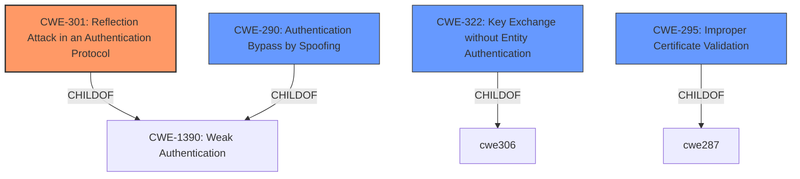

# Analysis for CVE-2020-26558

# Summary
| CWE ID | CWE Name | Confidence | CWE Abstraction Level | CWE Vulnerability Mapping Label | CWE-Vulnerability Mapping Notes |
|---|---|---|---|---|---|
| CWE-301 | Reflection Attack in an Authentication Protocol | 0.8 | Base | Primary | Allowed |
| CWE-290 | Authentication Bypass by Spoofing | 0.6 | Base | Secondary | Allowed |
| CWE-322 | Key Exchange without Entity Authentication | 0.5 | Base | Secondary | Allowed |
| CWE-295 | Improper Certificate Validation | 0.4 | Base | Secondary | Allowed |

## Evidence and Confidence

*   **Confidence Score:** 0.8
*   **Evidence Strength:** HIGH

## Relationship Analysis
The primary CWE is CWE-301, which is a base-level weakness describing reflection attacks in authentication protocols. This weakness is a child of CWE-1390, which represents weak authentication in general. CWE-290, Authentication Bypass by Spoofing is also a child of CWE-1390, and represents a similar type of authentication bypass. The vulnerability description details a man-in-the-middle attack that exploits the reflection of public keys and authentication evidence, which aligns directly with CWE-301.



## Vulnerability Chain
The vulnerability chain starts with the **improper handling of public keys and authentication** during the Bluetooth Passkey pairing. The vulnerability lies in the **reflection of the public key and the authentication evidence** of the initiating device during Passkey authentication, which permits a MITM attacker to obtain the Passkey. This leads to the attacker being able to impersonate one of the paired devices.
  - **Root Cause:** **Improper handling of public keys and authentication** during Bluetooth Passkey pairing, leading to reflection of authentication evidence.
  - **Weakness:** CWE-301: Reflection Attack in an Authentication Protocol
  - **Impact:** An attacker can impersonate one of the paired devices to the other

## Summary of Analysis
The initial assessment strongly points towards CWE-301, given the description of the reflection attack. The CVE details further confirm this with the statement: "The vulnerability lies in the reflection of the public key and the authentication evidence of the initiating device during Passkey authentication which permits a MITM attacker to obtain the Passkey."

CWE-290, Authentication Bypass by Spoofing, is a secondary candidate because the attack involves the attacker impersonating a legitimate device. However, the core of the vulnerability is the reflection attack itself, making CWE-301 the more precise classification.

CWE-322, Key Exchange without Entity Authentication, is considered because the attack involves a key exchange where the identity of the communicating parties is not properly verified due to the reflection.

CWE-295, Improper Certificate Validation, is another secondary candidate as the **inadequate validation of public keys** is listed as a weakness.

The final selection prioritizes CWE-301 because it directly addresses the reflection attack mechanism, which is the root cause of the vulnerability. This selection is made with high confidence due to the clear alignment between the vulnerability description, the CVE details, and the CWE definition. The other CWEs were considered due to related authentication issues but are not as precise as CWE-301 in describing the core weakness.

Relevant CWE Information:

# Enhanced Context (25 CWEs)
The following CWEs were identified as potentially relevant to this vulnerability:

## CWE-303: Incorrect Implementation of Authentication Algorithm
**Abstraction Level**: Base
**Similarity Score**: 0.79
**Source**: dense

**Description**:
The requirements for the product dictate the use of an established authentication algorithm, but the implementation of the algorithm is incorrect.

**Mapping Guidance**:
- Usage: Allowed
- Rationale: This CWE entry is at the Base level of abstraction, which is a preferred level of abstraction for mapping to the root causes of vulnerabilities.

## CWE-345: Insufficient Verification of Data Authenticity
**Abstraction Level**: Class
**Similarity Score**: 0.79
**Source**: dense

**Description**:
The product does not sufficiently verify the origin or authenticity of data, in a way that causes it to accept invalid data.

**Mapping Guidance**:
- Usage: Discouraged
- Rationale: This CWE entry is a level-1 Class (i.e., a child of a Pillar). It might have lower-level children that would be more appropriate

## CWE-1390: Weak Authentication
**Abstraction Level**: Class
**Similarity Score**: 0.78
**Source**: dense

**Description**:
The product uses an authentication mechanism to restrict access to specific users or identities, but the mechanism does not sufficiently prove that the claimed identity is correct.

**Mapping Guidance**:
- Usage: Allowed-with-Review
- Rationale: This CWE entry is a Class and might have Base-level children that would be more appropriate

## CWE-807: Reliance on Untrusted Inputs in a Security Decision
**Abstraction Level**: Base
**Similarity Score**: 0.78
**Source**: dense

**Description**:
The product uses a protection mechanism that relies on the existence or values of an input, but the input can be modified by an untrusted actor in a way that bypasses the protection mechanism.

**Mapping Guidance**:
- Usage: Allowed
- Rationale: This CWE entry is at the Base level of abstraction, which is a preferred level of abstraction for mapping to the root causes of vulnerabilities.

## CWE-1391: Use of Weak Credentials
**Abstraction Level**: Class
**Similarity Score**: 0.78
**Source**: dense

**Description**:
The product uses weak credentials (such as a default key or hard-coded password) that can be calculated, derived, reused, or guessed by an attacker.

**Mapping Guidance**:
- Usage: Allowed-with-Review
- Rationale: This CWE entry is a Class and might have Base-level children that would be more appropriate

## CWE-319: Cleartext Transmission of Sensitive Information
**Abstraction Level**: Base
**Similarity Score**: 0.78
**Source**: dense

**Description**:
The product transmits sensitive or security-critical data in cleartext in a communication channel that can be sniffed by unauthorized actors.

**Mapping Guidance**:
- Usage: Allowed
- Rationale: This CWE entry is at the Base level of abstraction, which is a preferred level of abstraction for mapping to the root causes of vulnerabilities.

## CWE-294: Authentication Bypass by Capture-replay
**Abstraction Level**: Base
**Similarity Score**: 0.77
**Source**: dense

**Description**:
A capture-replay flaw exists when the design of the product makes it possible for a malicious user to sniff network traffic and bypass authentication by replaying it to the server in question to the same effect as the original message (or with minor changes).

**Mapping Guidance**:
- Usage: Allowed
- Rationale: This CWE entry is at the Base level of abstraction, which is a preferred level of abstraction for mapping to the root causes of vulnerabilities.

## CWE-290: Authentication Bypass by Spoofing
**Abstraction Level**: Base
**Similarity Score**: 0.77
**Source**: dense

**Description**:
This attack-focused weakness is caused by incorrectly implemented authentication schemes that are subject to spoofing attacks.

**Mapping Guidance**:
- Usage: Allowed
- Rationale: This CWE entry is at the Base level of abstraction, which is a preferred level of abstraction for mapping to the root causes of vulnerabilities.

## CWE-203: Observable Discrepancy
**Abstraction Level**: Base
**Similarity Score**: 0.77
**Source**: dense

**Description**:
The product behaves differently or sends different responses under different circumstances in a way that is observable to an unauthorized actor, which exposes security-relevant information about the state of the product, such as whether a particular operation was successful or not.

**Mapping Guidance**:
- Usage: Allowed
- Rationale: This CWE entry is at the Base level of abstraction, which is a preferred level of abstraction for mapping to the root causes of vulnerabilities.

## CWE-295: Improper Certificate Validation
**Abstraction Level**: Base

# Enhanced Query for CVE-2020-26558

## Vulnerability Description
Bluetooth LE and BR/EDR secure pairing in Bluetooth Core Specification 2.1 through 5.2 may permit a nearby man-in-the-middle attacker to identify the Passkey used during pairing (in the Passkey authentication procedure) by reflection of the public key and the authentication evidence of the initiating device, potentially permitting this attacker to complete authenticated pairing with the responding device using the correct Passkey for the pairing session. The attack methodology determines the Passkey value one bit at a time.

### Vulnerability Description Key Phrases
- **impact:** identify the Passkey
- **vector:** reflection of the public key and the authentication evidence
- **attacker:** nearby man-in-the-middle attacker
- **product:** Bluetooth Core Specification
- **version:** 2.1 through 5.2
- **component:** Bluetooth LE and BR/EDR secure pairing

## CVE Reference Links Content Summary
```
{
  "CVE-2020-26558": {
    "description": "A vulnerability exists in the Bluetooth Passkey authentication method and in Linux's implementation. An attacker within range of two Bluetooth devices during pairing using Passkey authentication can obtain the shared secret (Passkey), allowing impersonation of either device to each other.",
    "root_cause": "Improper handling of public keys and authentication during Bluetooth Passkey pairing.",
    "weaknesses": [
      "Inadequate validation of public keys during the pairing process, which allows an attacker to insert themselves into the pairing process and obtain the passkey.",
      "Lack of proper checks for public keys received from the remote peer, allowing the remote peer to present the same public key as the local device.",
       "The vulnerability lies in the reflection of the public key and the authentication evidence of the initiating device during Passkey authentication which permits a MITM attacker to obtain the Passkey."
     ],
    "impact": "An attacker can impersonate one of the paired devices to the other, potentially gaining access to authenticated services, but not a fully transparent MITM attack between initiator and responder.",
    "attack_vectors": [
       "Proximity attacks via Bluetooth wireless communication between vulnerable devices.",
        "Man-in-the-middle (MITM) attack during the pairing or bonding process."
    ],
    "required_capabilities": [
      "Attacker must be within wireless range of two vulnerable Bluetooth devices.",
       "Attacker must be able to act as a MITM during the Passkey authentication."
    ],
     "additional_details": [
         "The vulnerability is in the Passkey Entry protocol used in Secure Simple Pairing (SSP), Secure Connections (SC), and LE Secure Connections (LESC).",
          "The attacker can use a crafted series of responses to determine each bit of the randomly generated Passkey selected by the pairing initiator.",
          "The vulnerability exists in Bluetooth Core Specifications 2.1 through 5.2.",
          "The attacker does not succeed in pairing with the initiator by this method, preventing a fully transparent MITM attack on the pairing procedure between the initiator and responder."

     ]
  }
}
```

## Retriever Results

### Top Combined Results

| Rank | CWE ID | Name | Abstraction | Usage  | Retrievers | Individual Scores |
|------|--------|------|-------------|-------|------------|-------------------|
| 1 | 301 | Reflection Attack in an Authentication Protocol | Base | Allowed | sparse | 0.355 |
| 2 | 290 | Authentication Bypass by Spoofing | Base | Allowed | sparse | 0.186 |
| 3 | 319 | Cleartext Transmission of Sensitive Information | Base | Allowed | sparse | 0.152 |
| 4 | 287 | Improper Authentication | Class | Discouraged | sparse | 0.148 |
| 5 | 522 | Insufficiently Protected Credentials | Class | Allowed-with-Review | sparse | 0.145 |
| 6 | 322 | Key Exchange without Entity Authentication | Base | Allowed | dense | 0.473 |
| 7 | 613 | Insufficient Session Expiration | Base | Allowed | graph | 0.002 |
| 8 | 295 | Improper Certificate Validation | Base | Allowed | sparse | 0.144 |
| 9 | 1021 | Improper Restriction of Rendered UI Layers or Frames | Base | Allowed | sparse | 0.141 |
| 10 | 306 | Missing Authentication for Critical Function | Base | Allowed | sparse | 0.141 |


# Complete CWE Specifications


## CWE-301: Reflection Attack in an Authentication Protocol
**Abstraction:** Base
**Status:** Draft

### Description
Simple authentication protocols are subject to reflection attacks if a malicious user can use the target machine to impersonate a trusted user.

### Extended Description


A mutual authentication protocol requires each party to respond to a random challenge by the other party by encrypting it with a pre-shared key. Often, however, such protocols employ the same pre-shared key for communication with a number of different entities. A malicious user or an attacker can easily compromise this protocol without possessing the correct key by employing a reflection attack on the protocol.


Reflection attacks capitalize on mutual authentication schemes in order to trick the target into revealing the secret shared between it and another valid user. In a basic mutual-authentication scheme, a secret is known to both the valid user and the server; this allows them to authenticate. In order that they may verify this shared secret without sending it plainly over the wire, they utilize a Diffie-Hellman-style scheme in which they each pick a value, then request the hash of that value as keyed by the shared secret. In a reflection attack, the attacker claims to be a valid user and requests the hash of a random value from the server. When the server returns this value and requests its own value to be hashed, the attacker opens another connection to the server. This time, the hash requested by the attacker is the value which the server requested in the first connection. When the server returns this hashed value, it is used in the first connection, authenticating the attacker successfully as the impersonated valid user.


### Alternative Terms
None

### Relationships
ChildOf -> CWE-1390
PeerOf -> CWE-327

### Mapping Guidance
**Usage:** Allowed
**Rationale:** This CWE entry is at the Base level of abstraction, which is a preferred level of abstraction for mapping to the root causes of vulnerabilities.
**Comments:** Carefully read both the name and description to ensure that this mapping is an appropriate fit. Do not try to 'force' a mapping to a lower-level Base/Variant simply to comply with this preferred level of abstraction.
**Reasons:**
- Acceptable-Use


### Additional Notes
**[Maintenance]** The term "reflection" is used in multiple ways within CWE and the community, so its usage should be reviewed.


### Observed Examples
- **CVE-2005-3435:** product authentication succeeds if user-provided MD5 hash matches the hash in its database; this can be subjected to replay attacks.


## CWE-290: Authentication Bypass by Spoofing
**Abstraction:** Base
**Status:** Incomplete

### Description
This attack-focused weakness is caused by incorrectly implemented authentication schemes that are subject to spoofing attacks.

### Extended Description
Not provided

### Alternative Terms
None

### Relationships
ChildOf -> CWE-1390
ChildOf -> CWE-287

### Mapping Guidance
**Usage:** Allowed
**Rationale:** This CWE entry is at the Base level of abstraction, which is a preferred level of abstraction for mapping to the root causes of vulnerabilities.
**Comments:** Carefully read both the name and description to ensure that this mapping is an appropriate fit. Do not try to 'force' a mapping to a lower-level Base/Variant simply to comply with this preferred level of abstraction.
**Reasons:**
- Acceptable-Use


### Additional Notes
**[Relationship]** This can be resultant from insufficient verification.


### Observed Examples
- **CVE-2022-30319:** S-bus functionality in a home automation product performs access control using an IP allowlist, which can be bypassed by a forged IP address.
- **CVE-2009-1048:** VOIP product allows authentication bypass using 127.0.0.1 in the Host header.


## CWE-319: Cleartext Transmission of Sensitive Information
**Abstraction:** Base
**Status:** Draft

### Description
The product transmits sensitive or security-critical data in cleartext in a communication channel that can be sniffed by unauthorized actors.

### Extended Description


Many communication channels can be "sniffed" (monitored) by adversaries during data transmission. For example, in networking, packets can traverse many intermediary nodes from the source to the destination, whether across the internet, an internal network, the cloud, etc. Some actors might have privileged access to a network interface or any link along the channel, such as a router, but they might not be authorized to collect the underlying data. As a result, network traffic could be sniffed by adversaries, spilling security-critical data.


Applicable communication channels are not limited to software products. Applicable channels include hardware-specific technologies such as internal hardware networks and external debug channels, supporting remote JTAG debugging. When mitigations are not applied to combat adversaries within the product's threat model, this weakness significantly lowers the difficulty of exploitation by such adversaries.


When full communications are recorded or logged, such as with a packet dump, an adversary could attempt to obtain the dump long after the transmission has occurred and try to "sniff" the cleartext from the recorded communications in the dump itself. Even if the information is encoded in a way that is not human-readable, certain techniques could determine which encoding is being used, then decode the information. 


### Alternative Terms
None

### Relationships
ChildOf -> CWE-311
ChildOf -> CWE-311

### Mapping Guidance
**Usage:** Allowed
**Rationale:** This CWE entry is at the Base level of abstraction, which is a preferred level of abstraction for mapping to the root causes of vulnerabilities.
**Comments:** Carefully read both the name and description to ensure that this mapping is an appropriate fit. Do not try to 'force' a mapping to a lower-level Base/Variant simply to comply with this preferred level of abstraction.
**Reasons:**
- Acceptable-Use


### Additional Notes
**[Maintenance]** The Taxonomy_Mappings to ISA/IEC 62443 were added in CWE 4.10, but they are still under review and might change in future CWE versions. These draft mappings were performed by members of the "Mapping CWE to 62443" subgroup of the CWE-CAPEC ICS/OT Special Interest Group (SIG), and their work is incomplete as of CWE 4.10. The mappings are included to facilitate discussion and review by the broader ICS/OT community, and they are likely to change in future CWE versions.


### Observed Examples
- **CVE-2022-29519:** Programmable Logic Controller (PLC) sends sensitive information in plaintext, including passwords and session tokens.
- **CVE-2022-30312:** Building Controller uses a protocol that transmits authentication credentials in plaintext.
- **CVE-2022-31204:** Programmable Logic Controller (PLC) sends password in plaintext.


## CWE-287: Improper Authentication
**Abstraction:** Class
**Status:** Draft

### Description
When an actor claims to have a given identity, the product does not prove or insufficiently proves that the claim is correct.

### Extended Description
Not provided

### Alternative Terms
authentification: An alternate term is "authentification", which appears to be most commonly used by people from non-English-speaking countries.
AuthN: "AuthN" is typically used as an abbreviation of "authentication" within the web application security community. It is also distinct from "AuthZ," which is an abbreviation of "authorization." The use of "Auth" as an abbreviation is discouraged, since it could be used for either authentication or authorization.
AuthC: "AuthC" is used as an abbreviation of "authentication," but it appears to used less frequently than "AuthN."

### Relationships
ChildOf -> CWE-284
ChildOf -> CWE-284

### Mapping Guidance
**Usage:** Discouraged
**Rationale:** This CWE entry might be misused when lower-level CWE entries are likely to be applicable. It is a level-1 Class (i.e., a child of a Pillar).
**Comments:** Consider children or descendants, beginning with CWE-1390: Weak Authentication or CWE-306: Missing Authentication for Critical Function.
**Reasons:**
- Frequent Misuse
**Suggested Alternatives:**
- CWE-1390: Weak Authentication
- CWE-306: Missing Authentication for Critical Function


### Additional Notes
**[Relationship]** This can be resultant from SQL injection vulnerabilities and other issues.

**[Maintenance]** The Taxonomy_Mappings to ISA/IEC 62443 were added in CWE 4.10, but they are still under review and might change in future CWE versions. These draft mappings were performed by members of the "Mapping CWE to 62443" subgroup of the CWE-CAPEC ICS/OT Special Interest Group (SIG), and their work is incomplete as of CWE 4.10. The mappings are included to facilitate discussion and review by the broader ICS/OT community, and they are likely to change in future CWE versions.


### Observed Examples
- **CVE-2022-35248:** Chat application skips validation when Central Authentication Service (CAS) is enabled, effectively removing the second factor from two-factor authentication
- **CVE-2022-36436:** Python-based authentication proxy does not enforce password authentication during the initial handshake, allowing the client to bypass authentication by specifying a 'None' authentication type.
- **CVE-2022-30034:** Chain: Web UI for a Python RPC framework does not use regex anchors to validate user login emails (CWE-777), potentially allowing bypass of OAuth (CWE-1390).


## CWE-522: Insufficiently Protected Credentials
**Abstraction:** Class
**Status:** Incomplete

### Description
The product transmits or stores authentication credentials, but it uses an insecure method that is susceptible to unauthorized interception and/or retrieval.

### Extended Description
Not provided

### Alternative Terms
None

### Relationships
ChildOf -> CWE-1390
ChildOf -> CWE-287
ChildOf -> CWE-668

### Mapping Guidance
**Usage:** Allowed-with-Review
**Rationale:** This CWE entry is a Class and might have Base-level children that would be more appropriate
**Comments:** Examine children of this entry to see if there is a better fit
**Reasons:**
- Abstraction


### Observed Examples
- **CVE-2022-30018:** A messaging platform serializes all elements of User/Group objects, making private information available to adversaries
- **CVE-2022-29959:** Initialization file contains credentials that can be decoded using a "simple string transformation"
- **CVE-2022-35411:** Python-based RPC framework enables pickle functionality by default, allowing clients to unpickle untrusted data.


## CWE-322: Key Exchange without Entity Authentication
**Abstraction:** Base
**Status:** Draft

### Description
The product performs a key exchange with an actor without verifying the identity of that actor.

### Extended Description
Performing a key exchange will preserve the integrity of the information sent between two entities, but this will not guarantee that the entities are who they claim they are. This may enable an attacker to impersonate an actor by modifying traffic between the two entities. Typically, this involves a victim client that contacts a malicious server that is impersonating a trusted server. If the client skips authentication or ignores an authentication failure, the malicious server may request authentication information from the user. The malicious server can then use this authentication information to log in to the trusted server using the victim's credentials, sniff traffic between the victim and trusted server, etc.

### Alternative Terms
None

### Relationships
ChildOf -> CWE-306
CanPrecede -> CWE-923
PeerOf -> CWE-295

### Mapping Guidance
**Usage:** Allowed
**Rationale:** This CWE entry is at the Base level of abstraction, which is a preferred level of abstraction for mapping to the root causes of vulnerabilities.
**Comments:** Carefully read both the name and description to ensure that this mapping is an appropriate fit. Do not try to 'force' a mapping to a lower-level Base/Variant simply to comply with this preferred level of abstraction.
**Reasons:**
- Acceptable-Use


## CWE-613: Insufficient Session Expiration
**Abstraction:** Base
**Status:** Incomplete

### Description
According to WASC, "Insufficient Session Expiration is when a web site permits an attacker to reuse old session credentials or session IDs for authorization."

### Extended Description
Not provided

### Alternative Terms
None

### Relationships
ChildOf -> CWE-672
ChildOf -> CWE-672
CanPrecede -> CWE-287

### Mapping Guidance
**Usage:** Allowed
**Rationale:** This CWE entry is at the Base level of abstraction, which is a preferred level of abstraction for mapping to the root causes of vulnerabilities.
**Comments:** Carefully read both the name and description to ensure that this mapping is an appropriate fit. Do not try to 'force' a mapping to a lower-level Base/Variant simply to comply with this preferred level of abstraction.
**Reasons:**
- Acceptable-Use


### Additional Notes
**[Other]** The lack of proper session expiration may improve the likely success of certain attacks. For example, an attacker may intercept a session ID, possibly via a network sniffer or Cross-site Scripting attack. Although short session expiration times do not help if a stolen token is immediately used, they will protect against ongoing replaying of the session ID. In another scenario, a user might access a web site from a shared computer (such as at a library, Internet cafe, or open work environment). Insufficient Session Expiration could allow an attacker to use the browser's back button to access web pages previously accessed by the victim.


## CWE-295: Improper Certificate Validation
**Abstraction:** Base
**Status:** Draft

### Description
The product does not validate, or incorrectly validates, a certificate.

### Extended Description
When a certificate is invalid or malicious, it might allow an attacker to spoof a trusted entity by interfering in the communication path between the host and client. The product might connect to a malicious host while believing it is a trusted host, or the product might be deceived into accepting spoofed data that appears to originate from a trusted host.

### Alternative Terms
None

### Relationships
ChildOf -> CWE-287
ChildOf -> CWE-287
PeerOf -> CWE-322

### Mapping Guidance
**Usage:** Allowed
**Rationale:** This CWE entry is at the Base level of abstraction, which is a preferred level of abstraction for mapping to the root causes of vulnerabilities.
**Comments:** Carefully read both the name and description to ensure that this mapping is an appropriate fit. Do not try to 'force' a mapping to a lower-level Base/Variant simply to comply with this preferred level of abstraction.
**Reasons:**
- Acceptable-Use


### Observed Examples
- **CVE-2019-12496:** A Go framework for robotics, drones, and IoT devices skips verification of root CA certificates by default.
- **CVE-2014-1266:** chain: incorrect "goto" in Apple SSL product bypasses certificate validation, allowing Adversary-in-the-Middle (AITM) attack (Apple "goto fail" bug). CWE-705 (Incorrect Control Flow Scoping) -> CWE-561 (Dead Code) -> CWE-295 (Improper Certificate Validation) -> CWE-393 (Return of Wrong Status Code) -> CWE-300 (Channel Accessible by Non-Endpoint).
- **CVE-2021-22909:** Chain: router's firmware update procedure uses curl with "-k" (insecure) option that disables certificate validation (CWE-295), allowing adversary-in-the-middle (AITM) compromise with a malicious firmware image (CWE-494).


## CWE-1021: Improper Restriction of Rendered UI Layers or Frames
**Abstraction:** Base
**Status:** Incomplete

### Description
The web application does not restrict or incorrectly restricts frame objects or UI layers that belong to another application or domain, which can lead to user confusion about which interface the user is interacting with.

### Extended Description
A web application is expected to place restrictions on whether it is allowed to be rendered within frames, iframes, objects, embed or applet elements. Without the restrictions, users can be tricked into interacting with the application when they were not intending to.

### Alternative Terms
Clickjacking
UI Redress Attack
Tapjacking: "Tapjacking" is similar to clickjacking, except it is used for mobile applications in which the user "taps" the application instead of performing a mouse click.

### Relationships
ChildOf -> CWE-441
ChildOf -> CWE-610
ChildOf -> CWE-451

### Mapping Guidance
**Usage:** Allowed
**Rationale:** This CWE entry is at the Base level of abstraction, which is a preferred level of abstraction for mapping to the root causes of vulnerabilities.
**Comments:** Carefully read both the name and description to ensure that this mapping is an appropriate fit. Do not try to 'force' a mapping to a lower-level Base/Variant simply to comply with this preferred level of abstraction.
**Reasons:**
- Acceptable-Use


### Observed Examples
- **CVE-2017-7440:** E-mail preview feature in a desktop application allows clickjacking attacks via a crafted e-mail message
- **CVE-2017-5697:** Hardware/firmware product has insufficient clickjacking protection in its web user interface
- **CVE-2017-4015:** Clickjacking in data-loss prevention product via HTTP response header.


## CWE-306: Missing Authentication for Critical Function
**Abstraction:** Base
**Status:** Draft

### Description
The product does not perform any authentication for functionality that requires a provable user identity or consumes a significant amount of resources.

### Extended Description
Not provided

### Alternative Terms
None

### Relationships
ChildOf -> CWE-287
ChildOf -> CWE-287

### Mapping Guidance
**Usage:** Allowed
**Rationale:** This CWE entry is at the Base level of abstraction, which is a preferred level of abstraction for mapping to the root causes of vulnerabilities.
**Comments:** Carefully read both the name and description to ensure that this mapping is an appropriate fit. Do not try to 'force' a mapping to a lower-level Base/Variant simply to comply with this preferred level of abstraction.
**Reasons:**
- Acceptable-Use


### Observed Examples
- **CVE-2022-31260:** Chain: a digital asset management program has an undisclosed backdoor in the legacy version of a PHP script (CWE-912) that could allow an unauthenticated user to export metadata (CWE-306)
- **CVE-2022-29951:** TCP-based protocol in Programmable Logic Controller (PLC) has no authentication.
- **CVE-2022-29952:** Condition Monitor firmware uses a protocol that does not require authentication.

