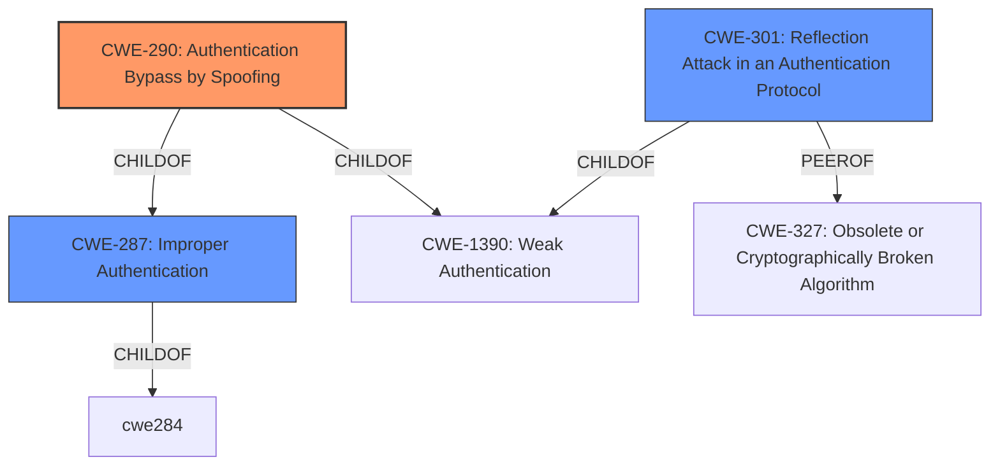

# Analysis for CVE-2020-26560

# Summary
| CWE ID | CWE Name | Confidence | CWE Abstraction Level | CWE Vulnerability Mapping Label | CWE-Vulnerability Mapping Notes |
|---|---|---|---|---|---|
| CWE-290 | Authentication Bypass by Spoofing | 0.9 | Base | Allowed | Primary CWE |
| CWE-301 | Reflection Attack in an Authentication Protocol | 0.7 | Base | Allowed | Secondary Candidate |
| CWE-287 | Improper Authentication | 0.6 | Class | Discouraged | Secondary Candidate |

## Evidence and Confidence

*   **Confidence Score:** 0.8
*   **Evidence Strength:** HIGH

## Relationship Analysis
The primary CWE, CWE-290 (Authentication Bypass by Spoofing), is a base-level CWE that accurately reflects the vulnerability's root cause. CWE-290 is a child of CWE-1390 (Weak Authentication) and CWE-287 (Improper Authentication), representing a more specific type of authentication failure. CWE-301 (Reflection Attack in an Authentication Protocol) is a peer of CWE-327 and a child of CWE-1390, indicating a related but distinct authentication weakness. CWE-287 (Improper Authentication) is a class-level CWE and a parent of CWE-290, making it a less specific but related classification.

## Vulnerability Chain
The vulnerability chain starts with **improper authentication** in the Bluetooth Mesh Provisioning procedure. The **attacker spoofs** a device being provisioned by using crafted responses. This allows the **attacker to bypass authentication** and **acquire a NetKey and AppKey**, enabling them to perform operations permitted to a provisioned node.
Root Cause: Improper Authentication
Weakness: Authentication Bypass by Spoofing
Impact: Unauthorized access to NetKey and AppKey

## Summary of Analysis
The initial analysis identified CWE-290 (Authentication Bypass by Spoofing) as the most appropriate CWE due to the attacker's ability to impersonate a device being provisioned using crafted responses. The **root_cause** from the CVE Reference Links Content Summary states: "The Bluetooth Mesh Provisioning procedure could allow an attacker without knowledge of the AuthValue to impersonate a device being provisioned by using crafted responses." This aligns directly with the description of CWE-290, which focuses on incorrectly implemented authentication schemes susceptible to spoofing attacks.

The retriever results also support this selection, with CWE-290 being the top combined result. The evidence clearly points to a **failure in the authentication** process, where an attacker can successfully **bypass authentication** by **spoofing** a legitimate device. This is further supported by the listed **weaknesses**: "Improper authentication" and "Insufficient protection of credentials".

CWE-301 (Reflection Attack in an Authentication Protocol) was considered due to the potential for the attacker to reflect authentication evidence. However, the description of the vulnerability indicates that the **attacker crafts responses**, which is more indicative of spoofing rather than a reflection attack.

CWE-287 (Improper Authentication) was also considered, but it is a more general class. CWE-290 provides a more specific and accurate representation of the vulnerability.

The final decision to select CWE-290 is based on the evidence of **spoofing** and the resulting **authentication bypass**. This is the most specific and accurate representation of the vulnerability based on the available information. The chosen CWE is at the optimal level of specificity, as it describes the exact mechanism used to bypass authentication.

Relevant CWE Information:

# Enhanced Context (25 CWEs)
The following CWEs were identified as potentially relevant to this vulnerability:

## CWE-345: Insufficient Verification of Data Authenticity
**Abstraction Level**: Class
**Similarity Score**: 0.78
**Source**: dense

**Description**:
The product does not sufficiently verify the origin or authenticity of data, in a way that causes it to accept invalid data.

**Mapping Guidance**:
- Usage: Discouraged
- Rationale: This CWE entry is a level-1 Class (i.e., a child of a Pillar). It might have lower-level children that would be more appropriate

## CWE-303: Incorrect Implementation of Authentication Algorithm
**Abstraction Level**: Base
**Similarity Score**: 0.76
**Source**: dense

**Description**:
The requirements for the product dictate the use of an established authentication algorithm, but the implementation of the algorithm is incorrect.

**Mapping Guidance**:
- Usage: Allowed
- Rationale: This CWE entry is at the Base level of abstraction, which is a preferred level of abstraction for mapping to the root causes of vulnerabilities.

## CWE-807: Reliance on Untrusted Inputs in a Security Decision
**Abstraction Level**: Base
**Similarity Score**: 0.76
**Source**: dense

**Description**:
The product uses a protection mechanism that relies on the existence or values of an input, but the input can be modified by an untrusted actor in a way that bypasses the protection mechanism.

**Mapping Guidance**:
- Usage: Allowed
- Rationale: This CWE entry is at the Base level of abstraction, which is a preferred level of abstraction for mapping to the root causes of vulnerabilities.

## CWE-1391: Use of Weak Credentials
**Abstraction Level**: Class
**Similarity Score**: 0.76
**Source**: dense

**Description**:
The product uses weak credentials (such as a default key or hard-coded password) that can be calculated, derived, reused, or guessed by an attacker.

**Mapping Guidance**:
- Usage: Allowed-with-Review
- Rationale: This CWE entry is a Class and might have Base-level children that would be more appropriate

## CWE-798: Use of Hard-coded Credentials
**Abstraction Level**: Base
**Similarity Score**: 0.76
**Source**: dense

**Description**:
The product contains hard-coded credentials, such as a password or cryptographic key.

**Mapping Guidance**:
- Usage: Allowed
- Rationale: This CWE entry is at the Base level of abstraction, which is a preferred level of abstraction for mapping to the root causes of vulnerabilities.

## CWE-302: Authentication Bypass by Assumed-Immutable Data
**Abstraction Level**: Base
**Similarity Score**: 0.75
**Source**: dense

**Description**:
The authentication scheme or implementation uses key data elements that are assumed to be immutable, but can be controlled or modified by the attacker.

**Mapping Guidance**:
- Usage: Allowed
- Rationale: This CWE entry is at the Base level of abstraction, which is a preferred level of abstraction for mapping to the root causes of vulnerabilities.

## CWE-319: Cleartext Transmission of Sensitive Information
**Abstraction Level**: Base
**Similarity Score**: 0.75
**Source**: dense

**Description**:
The product transmits sensitive or security-critical data in cleartext in a communication channel that can be sniffed by unauthorized actors.

**Mapping Guidance**:
- Usage: Allowed
- Rationale: This CWE entry is at the Base level of abstraction, which is a preferred level of abstraction for mapping to the root causes of vulnerabilities.

## CWE-657: Violation of Secure Design Principles
**Abstraction Level**: Class
**Similarity Score**: 0.75
**Source**: dense

**Description**:
The product violates well-established principles for secure design.

**Mapping Guidance**:
- Usage: Discouraged
- Rationale: This CWE entry is a level-1 Class (i.e., a child of a Pillar). It might have lower-level children that would be more appropriate

## CWE-1390: Weak Authentication
**Abstraction Level**: Class
**Similarity Score**: 0.75
**Source**: dense

**Description**:
The product uses an authentication mechanism to restrict access to specific users or identities, but the mechanism does not sufficiently prove that the claimed identity is correct.

**Mapping Guidance**:
- Usage: Allowed-with-Review
- Rationale: This CWE entry is a Class and might have Base-level children that would be more appropriate

## CWE-312: Cleartext Storage of Sensitive Information