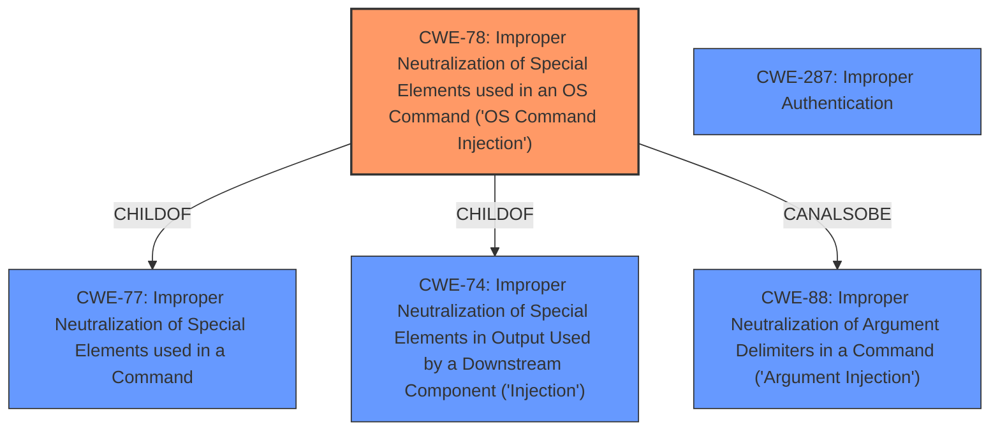

# Raw Analyzer Response for CVE-2020-26670

# Summary
| CWE ID | CWE Name | Confidence | CWE Abstraction Level | CWE Vulnerability Mapping Label | CWE-Vulnerability Mapping Notes |
|---|---|---|---|---|---|
| CWE-78 | Improper Neutralization of Special Elements used in an OS Command ('OS Command Injection') | 1.0 | Base | Allowed | Primary CWE |
| CWE-287 | Improper Authentication | 0.7 | Class | Allowed | Secondary Candidate |

## Evidence and Confidence

*   **Confidence Score:** 0.9
*   **Evidence Strength:** HIGH

## Relationship Analysis
The primary CWE is CWE-78, which is a Base level CWE. It is a child of CWE-77 (Improper Neutralization of Special Elements used in a Command) and CWE-74 (Improper Neutralization of Special Elements in Output Used by a Downstream Component ('Injection')). CWE-78 can also be related to CWE-88 (Improper Neutralization of Argument Delimiters in a Command ('Argument Injection')). These relationships show that CWE-78 is a specific type of injection vulnerability, where the attacker can inject commands into the operating system.

The secondary CWE considered was CWE-287, Improper Authentication.

## Vulnerability Chain
The vulnerability chain starts with the attacker being authenticated and then sending a crafted request to the server, which leads to the execution of arbitrary commands.

Authenticated Attacker -> Crafted Request with Malicious Input -> **CWE-78: Improper Neutralization of Special Elements used in an OS Command ('OS Command Injection')** -> Arbitrary Command Execution

## Summary of Analysis
The vulnerability description states that an authenticated attacker can execute arbitrary commands through a crafted request. The "CVE Reference Links Content Summary" confirms that the **root cause** is the "Improper handling of user-provided input within the settings creation functionality. Specifically, the `parser` setting in the `list` type field is not sanitized, allowing for command injection." This aligns perfectly with CWE-78, which describes a scenario where a product constructs an OS command using externally-influenced input but does not neutralize special elements.

The retriever results also list CWE-78 as the top candidate, further supporting this classification.

While the attacker needs to be authenticated, the primary weakness is the command injection vulnerability itself. The authentication aspect is a prerequisite for exploiting the vulnerability, but it is not the root cause of the vulnerability. Therefore, I'm choosing CWE-78 as the primary weakness.

I considered CWE-306, Missing Authentication for Critical Function, as a secondary weakness. However, the vulnerability description clearly states that the attacker is authenticated, meaning authentication is present. The problem is that the authenticated user then exploits a command injection vulnerability.

The final decision is to classify this vulnerability as CWE-78, Improper Neutralization of Special Elements used in an OS Command ('OS Command Injection'), as the primary weakness. This is because the root cause of the vulnerability is the lack of proper sanitization of user-provided input, which allows for command injection.

Relevant CWE Information:

# Enhanced Context (25 CWEs)

## CWE-80: Improper Neutralization of Script-Related HTML Tags in a Web Page (Basic XSS)
**Abstraction Level**: Variant
**Similarity Score**: 0.80
**Source**: dense

**Description**:
The product receives input from an upstream component, but it does not neutralize or incorrectly neutralizes special characters such as "<", ">", and "&" that could be interpreted as web-scripting elements when they are sent to a downstream component that processes web pages.

**Mapping Guidance**:
- Usage: Allowed
- Rationale: This CWE entry is at the Variant level of abstraction, which is a preferred level of abstraction for mapping to the root causes of vulnerabilities.

*Rationale for not selecting*: This vulnerability is not related to XSS.

## CWE-74: Improper Neutralization of Special Elements in Output Used by a Downstream Component ('Injection')
**Abstraction Level**: Class
**Similarity Score**: 0.79
**Source**: dense

**Description**:
The product constructs all or part of a command, data structure, or record using externally-influenced input from an upstream component, but it does not neutralize or incorrectly neutralizes special elements that could modify how it is parsed or interpreted when it is sent to a downstream component.

**Mapping Guidance**:
- Usage: Discouraged
- Rationale: CWE-74 is high-level and often misused when lower-level weaknesses are more appropriate.

*Rationale for not selecting*: This is a more general CWE and CWE-78 is more specific.

## CWE-184: Incomplete List of Disallowed Inputs
**Abstraction Level**: Base
**Similarity Score**: 0.78
**Source**: dense

**Description**:
The product implements a protection mechanism that relies on a list of inputs (or properties of inputs) that are not allowed by policy or otherwise require other action to neutralize before additional processing takes place, but the list is incomplete.

**Mapping Guidance**:
- Usage: Allowed
- Rationale: This CWE entry is at the Base level of abstraction, which is a preferred level of abstraction for mapping to the root causes of vulnerabilities.

*Rationale for not selecting*: While an incomplete list of disallowed inputs could be a contributing factor, the core issue is the lack of neutralization, which is better captured by CWE-78.

## CWE-116: Improper Encoding or Escaping of Output
**Abstraction Level**: Class
**Similarity Score**: 0.78
**Source**: dense

**Description**:
The product prepares a structured message for communication with another component, but encoding or escaping of the data is either missing or done incorrectly. As a result, the intended structure of the message is not preserved.

**Mapping Guidance**:
- Usage: Allowed-with-Review
- Rationale: This CWE entry is a Class and might have Base-level children that would be more appropriate

*Rationale for not selecting*: The issue is not encoding or escaping, but neutralization of special elements in OS commands.

## CWE-41: Improper Resolution of Path Equivalence
**Abstraction Level**: Base
**Similarity Score**: 0.78
**Source**: dense

**Description**:
The product is vulnerable to file system contents disclosure through path equivalence. Path equivalence involves the use of special characters in file and directory names. The associated manipulations are intended to generate multiple names for the same object.

**Mapping Guidance**:
- Usage: Allowed
- Rationale: This CWE entry is at the Base level of abstraction, which is a preferred level of abstraction for mapping to the root causes of vulnerabilities.

*Rationale for not selecting*: Not related to path equivalence.

## CWE-23: Relative Path Traversal
**Abstraction Level**: Base
**Similarity Score**: 0.78
**Source**: dense

**Description**:
The product uses external input to construct a pathname that should be within a restricted directory, but it does not properly neutralize sequences such as ".." that can resolve to a location that is outside of that directory.

**Mapping Guidance**:
- Usage: Allowed
- Rationale: This CWE entry is at the Base level of abstraction, which is a preferred level of abstraction for mapping to the root causes of vulnerabilities.

*Rationale for not selecting*: Not related to path traversal.

## CWE-138: Improper Neutralization of Special Elements
**Abstraction Level**: Class
**Similarity Score**: 0.77
**Source**: dense

**Description**:
The product receives input from an upstream component, but it does not neutralize or incorrectly neutralizes special elements that could be interpreted as control elements or syntactic markers when they are sent to a downstream component.

**Mapping Guidance**:
- Usage: Discouraged
- Rationale: This CWE entry is a level-1 Class (i.e., a child of a Pillar). It might have lower-level children that would be more appropriate

*Rationale for not selecting*: CWE-78 is a more specific child of this CWE.

## CWE-73: External Control of File Name or Path
**Abstraction Level**: Base
**Similarity Score**: 0.77
**Source**: dense

**Description**:
The product allows user input to control or influence paths or file names that are used in filesystem operations.

**Mapping Guidance**:
- Usage: Allowed
- R