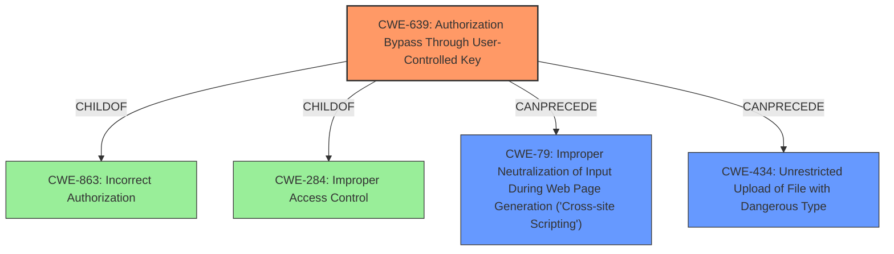

# Analysis Report for CVE-2020-26679

# Vulnerability Analysis Report: CVE-2020-26679

## Description


## Analysis (with Relationship Data)

# Summary
| CWE ID | CWE Name | Confidence | CWE Abstraction Level | CWE Vulnerability Mapping Label | CWE-Vulnerability Mapping Notes |
|---|---|---|---|---|---|
| CWE-639 | Authorization Bypass Through User-Controlled Key | 0.9 | Base | Allowed | Primary CWE |
| CWE-79 | Improper Neutralization of Input During Web Page Generation ('Cross-site Scripting') | 0.7 | Base | Allowed | Secondary CWE |
| CWE-434 | Unrestricted Upload of File with Dangerous Type | 0.7 | Base | Allowed | Secondary CWE |

## Evidence and Confidence

*   **Confidence Score:** 0.8
*   **Evidence Strength:** HIGH

## Relationship Analysis
The primary CWE, CWE-639, is a **Base** level weakness that accurately captures the vulnerability. CWE-639 is a child of CWE-863 (Incorrect Authorization) and CWE-284 (Improper Access Control), indicating that it is a specific type of authorization issue. The secondary CWEs, CWE-79 and CWE-434, represent potential consequences of the **insecure permissions**. CWE-79 can follow CWE-639 if the attacker modifies user profiles to inject malicious scripts. CWE-434 can also follow CWE-639 if the attacker uploads malicious PHP webshells as profile pictures.



## Vulnerability Chain
The vulnerability chain starts with **insecure permissions (CWE-639)**. This allows an attacker to modify another user's profile information. This can then lead to:
1.  Cross-site scripting attacks (**CWE-79**) if the attacker injects malicious scripts into the profile.
2.  Upload of malicious PHP webshells (**CWE-434**) if the attacker uploads a PHP file as a profile picture.

## Summary of Analysis
The primary weakness is the **insecure permissions**, which allows a user to modify another user's profile by manipulating their unique identification number in an HTTP POST request. This aligns with CWE-639 (Authorization Bypass Through User-Controlled Key), where the system's authorization functionality does not prevent one user from gaining access to another user's data by modifying the key value identifying the data. The vulnerability description states: "Any user logged in to a vFairs virtual conference or event can modify any other users profile information or profile picture. After receiving any users unique identification number and their own, an HTTP POST request can be made update their profile description or supply a new profile image."

The secondary weaknesses, CWE-79 and CWE-434, are potential consequences of the **insecure permissions**. The vulnerability description states that the attacker can "lead to potential cross-site scripting attacks on any user, or upload malicious PHP webshells as profile pictures."

I considered CWE-863 (Incorrect Authorization) and CWE-862 (Missing Authorization). However, CWE-639 is a more specific **Base** level weakness that accurately captures the vulnerability compared to the more general **Class** level weaknesses of CWE-863 and CWE-862.

The final assessment is based on the provided evidence and the CWE specifications. The CWEs selected are at the optimal level of specificity and accurately represent the vulnerability and its potential consequences.

Relevant CWE Information:

# Enhanced Context (25 CWEs)

## CWE-80: Improper Neutralization of Script-Related HTML Tags in a Web Page (Basic XSS)
**Abstraction Level**: Variant
**Similarity Score**: 0.80
**Source**: dense

**Description**:
The product receives input from an upstream component, but it does not neutralize or incorrectly neutralizes special characters such as "<", ">", and "&" that could be interpreted as web-scripting elements when they are sent to a downstream component that processes web pages.

**Mapping Guidance**:
- Usage: Allowed
- Rationale: This CWE entry is at the Variant level of abstraction, which is a preferred level of abstraction for mapping to the root causes of vulnerabilities.

## CWE-472: External Control of Assumed-Immutable Web Parameter
**Abstraction Level**: Base
**Similarity Score**: 0.79
**Source**: dense

**Description**:
The web application does not sufficiently verify inputs that are assumed to be immutable but are actually externally controllable, such as hidden form fields.

**Mapping Guidance**:
- Usage: Allowed
- Rationale: This CWE entry is at the Base level of abstraction, which is a preferred level of abstraction for mapping to the root causes of vulnerabilities.

## CWE-639: Authorization Bypass Through User-Controlled Key
**Abstraction Level**: Base
**Similarity Score**: 0.79
**Source**: dense

**Description**:
The system's authorization functionality does not prevent one user from gaining access to another user's data or record by modifying the key value identifying the data.

**Mapping Guidance**:
- Usage: Allowed
- Rationale: This CWE entry is at the Base level of abstraction, which is a preferred level of abstraction for mapping to the root causes of vulnerabilities.

## CWE-74: Improper Neutralization of Special Elements in Output Used by a Downstream Component ('Injection')
**Abstraction Level**: Class
**Similarity Score**: 0.78
**Source**: dense

**Description**:
The product constructs all or part of a command, data structure, or record using externally-influenced input from an upstream component, but it does not neutralize or incorrectly neutralizes special elements that could modify how it is parsed or interpreted when it is sent to a downstream component.

**Mapping Guidance**:
- Usage: Discouraged
- Rationale: CWE-74 is high-level and often misused when lower-level weaknesses are more appropriate.

## CWE-434: Unrestricted Upload of File with Dangerous Type
**Abstraction Level**: Base
**Similarity Score**: 0.78
**Source**: dense

**Description**:
The product allows the upload or transfer of dangerous file types that are automatically processed within its environment.

**Mapping Guidance**:
- Usage: Allowed
- Rationale: This CWE entry is at the Base level of abstraction, which is a preferred level of abstraction for mapping to the root causes of vulnerabilities.

## CWE-116: Improper Encoding or Escaping of Output
**Abstraction Level**: Class
**Similarity Score**: 0.77
**Source**: dense

**Description**:
The product prepares a structured message for communication with another component, but encoding or escaping of the data is either missing or done incorrectly. As a result, the intended structure of the message is not preserved.

**Mapping Guidance**:
- Usage: Allowed-with-Review
- Rationale: This CWE entry is a Class and might have Base-level children that would be more appropriate

## CWE-425: Direct Request ('Forced Browsing')
**Abstraction Level**: Base
**Similarity Score**: 0.77
**Source**: dense

**Description**:
The web application does not adequately enforce appropriate authorization on all restricted URLs, scripts, or files.

**Mapping Guidance**:
- Usage: Allowed
- Rationale: This CWE entry is at the Base level of abstraction, which is a preferred level of abstraction for mapping to the root causes of vulnerabilities.

## CWE-184: Incomplete List of Disallowed Inputs
**Abstraction Level**: Base
**Similarity Score**: 0.77
**Source**: dense

**Description**:
The product implements a protection mechanism that relies on a list of inputs (or properties of inputs) that are not allowed by policy or otherwise require other action to neutralize before additional processing takes place, but the list is incomplete.

**Mapping Guidance**:
- Usage: Allowed
- Rationale: This CWE entry is at the Base level of abstraction, which is a preferred level of abstraction for mapping to the root causes of vulnerabilities.

## CWE-807: Reliance on Untrusted Inputs in a Security Decision
**Abstraction Level**: Base
**Similarity Score**: 0.77
**Source**: dense

**Description**:
The product uses a protection mechanism that relies on the existence or values of an input, but the input can be modified by an untrusted actor in a way that bypasses


## CWE Relationship Analysis

Current CWEs represent these abstraction levels: .


### Vulnerability Chain Analysis

**Chain starting from CWE-79:**
- 79 (Improper Neutralization of Input During Web Page Generation ('Cross-site Scripting')) - ROOT


**Chain starting from CWE-862:**
- 862 (Missing Authorization) - ROOT


### CWE Relationship Diagram

```mermaid
graph TD
    classDef primary fill:#f96,stroke:#333,stroke-width:2px
    classDef secondary fill:#69f,stroke:#333
    classDef tertiary fill:#9e9,stroke:#333
```


*Report generated on 2025-04-02 05:09:35*
