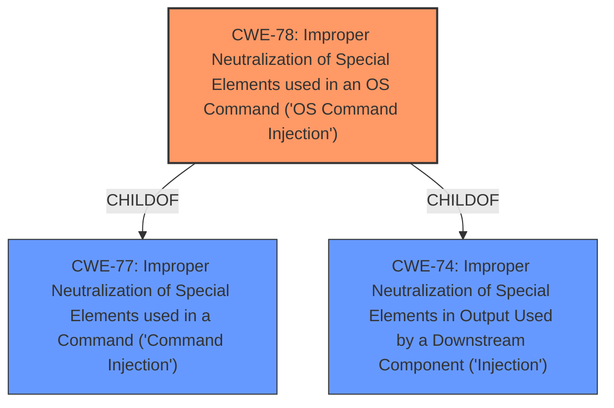

# Raw Analyzer Response for CVE-2020-26707

# Summary
| CWE ID | CWE Name | Confidence | CWE Abstraction Level | CWE Vulnerability Mapping Label | CWE-Vulnerability Mapping Notes |
|---|---|---|---|---|---|
| **CWE-78** | **Improper Neutralization of Special Elements used in an OS Command ('OS Command Injection')** | 1.0 | Base | Primary | Allowed |

## Evidence and Confidence

*   **Confidence Score:** 1.0
*   **Evidence Strength:** HIGH

## Relationship Analysis
The primary relationship that influences the decision is the ChildOf relationship between CWE-78 and CWE-77. CWE-78 is a more specific Base level CWE for OS Command Injection, making it a better fit than the more general Class level CWE-77 Command Injection.

## Vulnerability Chain
The vulnerability chain involves a lack of input sanitization leading directly to OS command injection and then to arbitrary code execution.
  - Root Cause: **Improper Neutralization** of the `filePath` parameter.
  - Weakness: OS Command Injection
  - Impact: Arbitrary Code Execution

## Summary of Analysis
The analysis indicates that the vulnerability is due to **improper neutralization** of the `filePath` parameter in the `add` function of Shenzhim AAPTJS 1.3.1, leading to OS command injection. The "CVE Reference Links Content Summary" clearly states that the **root cause** is insecure command formatting, where user-controlled input is directly embedded into a command string without proper sanitization. This aligns perfectly with CWE-78: Improper Neutralization of Special Elements used in an OS Command ('OS Command Injection').

The primary CWE match suggested is CWE-78, and the top CWEs list also highlights CWE-78 as the most frequent match for similar vulnerabilities. The retriever results further reinforce this choice, listing CWE-78 as the top combined result.

The decision to select CWE-78 is further supported by its Base level of abstraction, which is preferred for mapping to the root causes of vulnerabilities, as stated in the CWE specifications. The Mapping Guidance for CWE-78 explicitly allows its usage and emphasizes the importance of ensuring an appropriate fit.

CWE-77 was considered but not selected because CWE-78 is a more specific and appropriate Base level CWE that more closely describes the vulnerability. The vulnerability specifically involves an OS command, not a general command.
CWE-96 was considered but not selected because there is no evidence of static code injection.
CWE-79 was considered but not selected because there is no evidence of web page generation.
CWE-22 was considered but not selected because there is no evidence of path traversal.