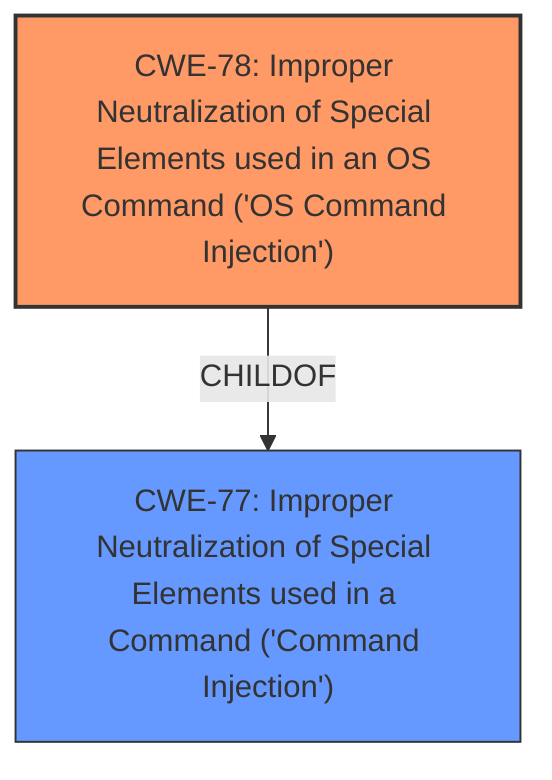

# Raw Analyzer Response for CVE-2020-26728

# Summary
| CWE ID | CWE Name | Confidence | CWE Abstraction Level | CWE Vulnerability Mapping Label | CWE-Vulnerability Mapping Notes |
|---|---|---|---|---|---|
| CWE-78 | Improper Neutralization of Special Elements used in an OS Command ('OS Command Injection') | 1 | Base | Allowed | Primary CWE |
| CWE-77 | Improper Neutralization of Special Elements used in a Command ('Command Injection') | 0.7 | Class | Allowed-with-Review | Secondary Candidate |

## Evidence and Confidence

*   **Confidence Score:** 1
*   **Evidence Strength:** HIGH

## Relationship Analysis
The primary relationship influencing the decision is the child-of relationship between CWE-78 and CWE-77, where CWE-78 (OS Command Injection) is a specific type of CWE-77 (Command Injection). The evidence strongly suggests the vulnerability involves OS commands, making CWE-78 the more precise and appropriate choice. The other candidate CWEs are too general or do not directly address the root cause.

## Vulnerability Chain
The vulnerability chain begins with the **lack of input sanitization** of the `guestuser` parameter, which leads to the ability to inject shell metacharacters, ultimately resulting in remote code execution.

**Chain:** Lack of Input Sanitization -> OS Command Injection (CWE-78) -> Remote Code Execution

## Summary of Analysis
The initial assessment clearly points to command injection due to the **lack of sanitization** of the `guestuser` parameter and its direct usage in the `doSystem` function, allowing for the injection of shell metacharacters. The "CVE Reference Links Content Summary" section explicitly mentions this, stating, "The direct passing of user-supplied input to `doSystem` allows an attacker to inject and execute arbitrary system commands on the router" and "The web server **fails to sanitize** or validate the `guestuser` parameter, which is a critical security flaw."

Given that the commands are OS commands, CWE-78 (Improper Neutralization of Special Elements used in an OS Command) is the most accurate classification. While CWE-77 (Improper Neutralization of Special Elements used in a Command) is a parent class, the specificity of OS commands being injected makes CWE-78 the better choice.

The retriever results also support this, listing CWE-78 as a top candidate.

The other CWEs considered were either too broad (e.g., CWE-119, CWE-697, CWE-790) or did not directly address the root cause of the vulnerability (e.g., CWE-294, CWE-36). CWE-121 (Stack-based Buffer Overflow) was considered but discarded because the vulnerability description focuses on command injection rather than a memory corruption issue.

Therefore, the final decision is to classify this vulnerability as CWE-78, as it accurately represents the **root cause** and the specific type of command injection involved.

Relevant CWE Information:

# Enhanced Context (25 CWEs)
The following CWEs were identified as potentially relevant to this vulnerability:

## CWE-74: Improper Neutralization of Special Elements in Output Used by a Downstream Component ('Injection')
**Abstraction Level**: Class
**Similarity Score**: 0.78
**Source**: dense

**Description**:
The product constructs all or part of a command, data structure, or record using externally-influenced input from an upstream component, but it does not neutralize or incorrectly neutralizes special elements that could modify how it is parsed or interpreted when it is sent to a downstream component.

**Mapping Guidance**:
- Usage: Discouraged
- Rationale: CWE-74 is high-level and often misused when lower-level weaknesses are more appropriate.

**Reason for not using:** This is a higher level class, and CWE-78 is more specific to OS commands.

## CWE-41: Improper Resolution of Path Equivalence
**Abstraction Level**: Base
**Similarity Score**: 0.77
**Source**: dense

**Description**:
The product is vulnerable to file system contents disclosure through path equivalence. Path equivalence involves the use of special characters in file and directory names. The associated manipulations are intended to generate multiple names for the same object.

**Mapping Guidance**:
- Usage: Allowed
- Rationale: This CWE entry is at the Base level of abstraction, which is a preferred level of abstraction for mapping to the root causes of vulnerabilities.

**Reason for not using:** This doesn't match the vulnerability description.

## CWE-184: Incomplete List of Disallowed Inputs
**Abstraction Level**: Base
**Similarity Score**: 0.76
**Source**: dense

**Description**:
The product implements a protection mechanism that relies on a list of inputs (or properties of inputs) that are not allowed by policy or otherwise require other action to neutralize before additional processing takes place, but the list is incomplete.

**Mapping Guidance**:
- Usage: Allowed
- Rationale: This CWE entry is at the Base level of abstraction, which is a preferred level of abstraction for mapping to the root causes of vulnerabilities.

**Reason for not using:** While there is a **lack of input sanitization**, this vulnerability does not appear to have an incomplete list of disallowed inputs.

## CWE-807: Reliance on Untrusted Inputs in a Security Decision
**Abstraction Level**: Base
**Similarity Score**: 0.76
**Source**: dense

**Description**:
The product uses a protection mechanism that relies on the existence or values of an input, but the input can be modified by an untrusted actor in a way that bypasses the protection mechanism.

**Mapping Guidance**:
- Usage: Allowed
- Rationale: This CWE entry is at the Base level of abstraction, which is a preferred level of abstraction for mapping to the root causes of vulnerabilities.

**Reason for not using:** This doesn't match the vulnerability description.

## CWE-23: Relative Path Traversal
**Abstraction Level**: Base
**Similarity Score**: 0.76
**Source**: dense

**Description**:
The product uses external input to construct a pathname that should be within a restricted directory, but it does not properly neutralize sequences such as ".." that can resolve to a location that is outside of that directory.

**Mapping Guidance**:
- Usage: Allowed
- Rationale: This CWE entry is at the Base level of abstraction, which is a preferred level of abstraction for mapping to the root causes of vulnerabilities.

**Reason for not using:** This doesn't match the vulnerability description.

## CWE-668: Exposure of Resource to Wrong Sphere
**Abstraction Level**: Class
**Similarity Score**: 0.75
**Source**: dense

**Description**:
The product exposes a resource to the wrong control sphere, providing unintended actors with inappropriate access to the resource.

**Mapping Guidance**:
- Usage: Discouraged
- Rationale: CWE-668 is high-level and is often misused as a catch-all when lower-level CWE IDs might be applicable. It is sometimes used for low-information vulnerability reports [REF-1287]. It is a level-1 Class (i.e., a child of a Pillar). It is not useful for trend analysis.

**Reason for not using:** This is a high-level class and is not specific enough to the vulnerability.

## CWE-1289: Improper Validation of Unsafe Equivalence in Input
**Abstraction Level**: Base
**Similarity Score**: 0.75
**Source**: dense

**Description**:
The product receives an input value that is used as a resource identifier or other type of reference, but it does not validate or incorrectly validates that the input is equivalent to a potentially-unsafe value.

**Mapping Guidance**:
- Usage: Allowed
- Rationale: This CWE entry is at the Base level of abstraction, which is a preferred level of abstraction for mapping to the root causes of vulnerabilities.

**Reason for not using:** This doesn't match the vulnerability description.

## CWE-138: Improper Neutralization of Special Elements
**Abstraction Level**: Class
**Similarity Score**: 0.75
**Source**: dense

**Description**:
The product receives input from an upstream component, but it does not neutralize or incorrectly neutralizes special elements that could be interpreted as control elements or syntactic markers when they are sent to a downstream component.

**Mapping Guidance**:
- Usage: Discouraged
- Rationale: This CWE entry is a level-1 Class (i.e., a child of a Pillar). It might have lower-level children that would be more appropriate

**Reason for not using:** This is a higher level class, and CWE-78 is more specific to OS commands.

## CWE-73: External Control of File Name or Path
**Abstraction Level**: Base
**Similarity Score**: 0.75
**Source**: dense

**Description**:
The product allows user input to