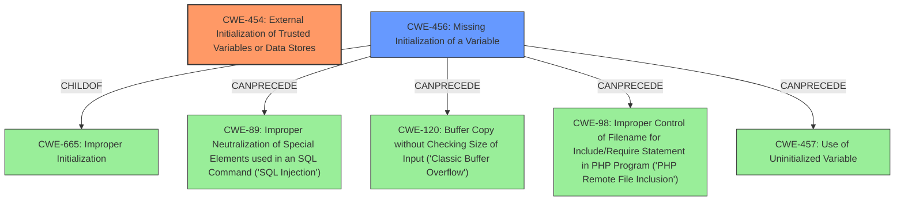

# Analysis for CVE-2020-26886

# Summary
| CWE ID  | CWE Name                                                      | Confidence | CWE Abstraction Level | CWE Vulnerability Mapping Label | CWE-Vulnerability Mapping Notes |
| :------- | :------------------------------------------------------------ | :--------- | :---------------------- | :------------------------------ | :------------------------------ |
| CWE-454 | External Initialization of Trusted Variables or Data Stores | 1.0        | Base                    | Primary                         | Allowed                       |
| CWE-456 | Missing Initialization of a Variable                          | 0.7        | Variant                 | Secondary                       | Allowed                       |

## Evidence and Confidence

*   **Confidence Score:** 0.85
*   **Evidence Strength:** HIGH

## Relationship Analysis
The primary CWE, CWE-454 (External Initialization of Trusted Variables or Data Stores), is a base-level CWE. CWE-456 (Missing Initialization of a Variable) is a variant of CWE-665 (Improper Initialization) and can precede CWE-89 (Improper Neutralization of Special Elements used in an SQL Command ('SQL Injection')), CWE-120 (Buffer Copy without Checking Size of Input ('Classic Buffer Overflow')), CWE-98 (Improper Control of Filename for Include/Require Statement in PHP Program ('PHP Remote File Inclusion')), and CWE-457 (Use of Uninitialized Variable). The relationships here indicate that external initialization, when mishandled, can lead to various injection vulnerabilities or use of uninitialized variables.

## Vulnerability Chain
The vulnerability chain starts with **External Initialization of Trusted Variables or Data Stores** (CWE-454). This **root cause** leads to potential **privilege escalation**, which is the impact. There may be a **Missing Initialization of a Variable** (CWE-456), due to the external initialization, and this could lead to code execution or other vulnerabilities. The chain, in this case, can be summarized as CWE-454 leading to CWE-456, which results in Privilege Escalation.

## Summary of Analysis
The initial analysis pointed to CWE-454 (External Initialization of Trusted Variables or Data Stores) as the primary weakness, given the "**rootcause:** **External Initialization of Trusted Variables or Data Stores**" phrase in the vulnerability description. The retriever results also listed CWE-454 as the top candidate with a similarity score of 0.339. This assessment is based primarily on the provided evidence. The relationship analysis further strengthens this conclusion, as CWE-454 describes initializing variables with untrusted sources, and failing to properly handle this could lead to further vulnerabilities.

CWE-456 (Missing Initialization of a Variable) was considered as a secondary CWE, as mishandling external initialization can lead to missing initialization of variables. The vulnerability description and retriever results support this.

The selected CWEs are at the optimal level of specificity because CWE-454 is a base-level CWE that accurately represents the **root cause** of the vulnerability.

Relevant CWE Information:

# Enhanced Context (25 CWEs)

## CWE-226: Sensitive Information in Resource Not Removed Before Reuse
**Abstraction Level**: Base
**Similarity Score**: 0.81
**Source**: dense

**Description**:
The product releases a resource such as memory or a file so that it can be made available for reuse, but it does not clear or "zeroize" the information contained in the resource before the product performs a critical state transition or makes the resource available for reuse by other entities.

**Mapping Guidance**:
- Usage: Allowed
- Rationale: This CWE entry is at the Base level of abstraction, which is a preferred level of abstraction for mapping to the root causes of vulnerabilities.

*This CWE was not selected as it deals with not removing sensitive information before reuse, which is not the primary issue in the vulnerability description.*

## CWE-212: Improper Removal of Sensitive Information Before Storage or Transfer
**Abstraction Level**: Base
**Similarity Score**: 0.80
**Source**: dense

**Description**:
The product stores, transfers, or shares a resource that contains sensitive information, but it does not properly remove that information before the product makes the resource available to unauthorized actors.

**Mapping Guidance**:
- Usage: Allowed
- Rationale: This CWE entry is at the Base level of abstraction, which is a preferred level of abstraction for mapping to the root causes of vulnerabilities.

*This CWE was not selected as it deals with not removing sensitive information before storage or transfer, which is not the primary issue in the vulnerability description.*

## CWE-665: Improper Initialization
**Abstraction Level**: Class
**Similarity Score**: 0.77
**Source**: dense

**Description**:
The product does not initialize or incorrectly initializes a resource, which might leave the resource in an unexpected state when it is accessed or used.

**Mapping Guidance**:
- Usage: Discouraged
- Rationale: This CWE entry is a level-1 Class (i.e., a child of a Pillar). It might have lower-level children that would be more appropriate

*CWE-665 was considered but not selected as the primary CWE because it's a class-level CWE, and the vulnerability description points to a more specific issue: external initialization of trusted variables. However, it is related to CWE-456.*

## CWE-404: Improper Resource Shutdown or Release
**Abstraction Level**: Class
**Similarity Score**: 0.77
**Source**: dense

**Description**:
The product does not release or incorrectly releases a resource before it is made available for re-use.

**Mapping Guidance**:
- Usage: Allowed-with-Review
- Rationale: This CWE entry is a Class and might have Base-level children that would be more appropriate

*This CWE was not selected as it deals with resource shutdown or release, which is not the primary issue in the vulnerability description.*

## CWE-538: Insertion of Sensitive Information into Externally-Accessible File or Directory
**Abstraction Level**: Base
**Similarity Score**: 0.77
**Source**: dense

**Description**:
The product places sensitive information into files or directories that are accessible to actors who are allowed to have access to the files, but not to the sensitive information.

**Mapping Guidance**:
- Usage: Allowed
- Rationale: This CWE entry is at the Base level of abstraction, which is a preferred level of abstraction for mapping to the root causes of vulnerabilities.

*This CWE was not selected as it deals with insertion of sensitive information into files or directories, which is not the primary issue in the vulnerability description.*

## CWE-459: Incomplete Cleanup
**Abstraction Level**: Base
**Similarity Score**: 0.77
**Source**: dense

**Description**:
The product does not properly "clean up" and remove temporary or supporting resources after they have been used.

**Mapping Guidance**:
- Usage: Allowed
- Rationale: This CWE entry is at the Base level of abstraction, which is a preferred level of abstraction for mapping to the root causes of vulnerabilities.

*This CWE was not selected as it deals with incomplete cleanup of resources, which is not the primary issue in the vulnerability description.*

## CWE-345: Insufficient Verification of Data Authenticity
**Abstraction Level**: Class
**Similarity Score**: 0.77
**Source**: dense

**Description**:
The product does not sufficiently verify the origin or authenticity of data, in a way that causes it to accept invalid data.

**Mapping Guidance**:
- Usage: Discouraged
- Rationale: This CWE entry is a level-1 Class (i.e., a child of a Pillar). It might have lower-level children that would be more appropriate

*This CWE was not selected as it deals with insufficient verification of data authenticity, which is not the primary issue