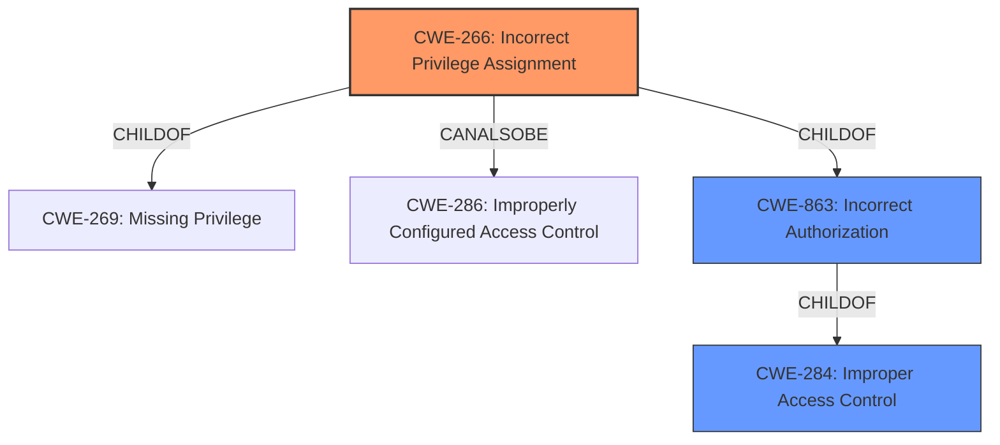

# Analysis for CVE-2020-26919

# Summary
| CWE ID | CWE Name | Confidence | CWE Abstraction Level | CWE Vulnerability Mapping Label | CWE-Vulnerability Mapping Notes |
|---|---|---|---|---|---|
| CWE-266 | Incorrect Privilege Assignment | 0.9 | Base | Primary | Allowed |
| CWE-284 | Improper Access Control | 0.6 | Pillar | Secondary | Discouraged |
| CWE-863 | Incorrect Authorization | 0.6 | Class | Secondary | Allowed-with-Review |

## Evidence and Confidence

*   **Confidence Score:** 0.9
*   **Evidence Strength:** HIGH

## Relationship Analysis
The primary CWE selected is CWE-266 (Incorrect Privilege Assignment), which is a Base level CWE. The vulnerability description indicates a **lack of access control at the function level**. This suggests that certain functions or features are not properly restricted, leading to unauthorized access.

CWE-266 is a child of CWE-269 (Missing Privilege) and has a peer relationship with CWE-286 (Improperly Configured Access Control). CWE-284 (Improper Access Control) is a higher-level Pillar that encompasses various access control issues, including incorrect privilege assignments. CWE-863 (Incorrect Authorization) is a class that describes authorization checks but doesn't correctly perform the check.

## Vulnerability Chain
The chain of root cause and weakness for the vulnerability description follows:
1.  **Root Cause:** **Lack of access control at the function level**. (CWE-266 Incorrect Privilege Assignment)
2.  **Impact:** Unauthorized users can perform actions they should not have permission to. (CWE-284 Improper Access Control)

## Summary of Analysis
The initial analysis identified CWE-266 (Incorrect Privilege Assignment) as the most suitable CWE due to the **lack of access control at the function level**, which directly implies an incorrect assignment of privileges. The vulnerability description states the **rootcause** is "**lack of access control at the function level**". This is the primary reason for selecting CWE-266.

CWE-284 (Improper Access Control) is a high-level Pillar that is often misused in low-information vulnerability reports, as noted in its mapping guidance. While it broadly applies, it is less specific than CWE-266. The mapping guidance for CWE-284 discourages its use and suggests alternatives like CWE-862 (Missing Authorization), CWE-863 (Incorrect Authorization), and CWE-266 which is the most applicable here. The advisory from Netgear regarding a missing function-level access control vulnerability supports this decision.

CWE-863 (Incorrect Authorization) describes a scenario where an authorization check is performed but is done incorrectly. The vulnerability description focuses more on the absence of proper privilege assignments rather than an incorrect authorization check, making CWE-266 a better fit.

Based on the retriever results and the complete CWE specifications, CWE-266 is the most accurate and specific representation of the vulnerability. It aligns with the base level of abstraction and directly addresses the root cause of the issue.

The selection is based on the provided evidence and analysis of the CWE relationships. The CWEs selected are at the optimal level of specificity to describe the vulnerability.