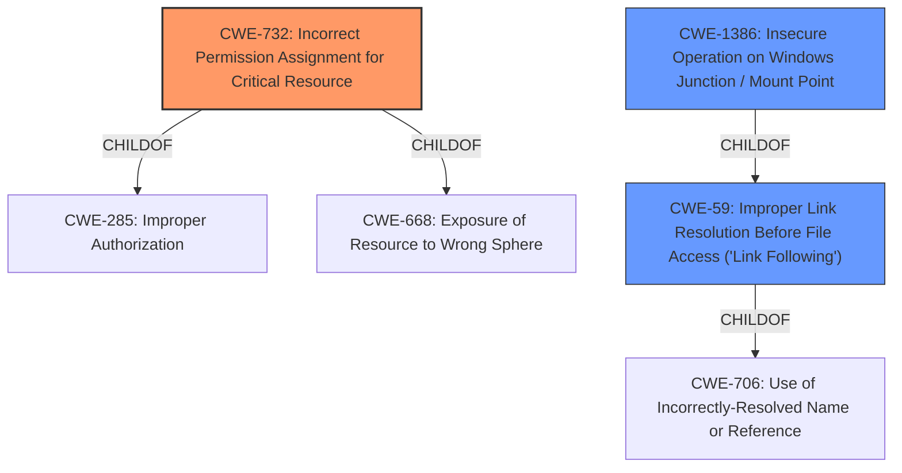

# Raw Analyzer Response for CVE-2020-26941

# Summary
| CWE ID | CWE Name | Confidence | CWE Abstraction Level | CWE Vulnerability Mapping Label | CWE-Vulnerability Mapping Notes |
|---|---|---|---|---|---|
| CWE-732 | Incorrect Permission Assignment for Critical Resource | 0.9 | Class | Allowed-with-Review | Primary CWE |
| CWE-59 | Improper Link Resolution Before File Access ('Link Following') | 0.7 | Base | Allowed | Secondary Candidate |
| CWE-1386 | Insecure Operation on Windows Junction / Mount Point | 0.6 | Base | Allowed | Secondary Candidate |

## Evidence and Confidence

*   **Confidence Score:** 0.8
*   **Evidence Strength:** HIGH

## Relationship Analysis
The primary CWE, CWE-732, is a Class-level CWE that falls under CWE-285 (Improper Authorization) and CWE-668 (Exposure of Resource to Wrong Sphere). The vulnerability involves **insecure permissions**, which aligns with CWE-732's description of specifying permissions for security-critical resources in a way that allows unintended actors to read or modify them. CWE-59 and CWE-1386 are related to file access and link following, indicating the attack vector involving symlinks. CWE-1386 is a child of CWE-59, making it a more specific case for Windows systems where junctions and mount points are used.

## Vulnerability Chain
The vulnerability chain starts with **insecure permissions** (CWE-732) during the installation phase, leading to a situation where a low-privileged user can exploit this weakness using a symlink (CWE-59) to achieve arbitrary file overwrite/deletion. On Windows systems, this exploitation might involve junctions or mount points (CWE-1386). The initial **insecure permissions** allow the symlink to be effective, resulting in the file overwrite.

## Summary of Analysis
The initial assessment identifies that the vulnerability lies in **insecure permissions** during the installation phase of ESET products, where a low-privileged user can exploit this to overwrite arbitrary files via a symlink.

The key evidence is:
- "**insecure permissions**" from the "Vulnerability Description Key Phrases"
- "The vulnerability stems from the fact that during the installation or upgrade process of ESET products, the self-defense mechanism is not fully active." from the "CVE Reference Links Content Summary"
- "Insecure file writing permissions: The vulnerability allows users to write or rewrite files within the ESET directory that they would normally not have permissions to access." from the "CVE Reference Links Content Summary"

CWE-732 (Incorrect Permission Assignment for Critical Resource) is selected as the primary CWE due to the **insecure permissions** on critical resources, which allows unintended actors to modify them.

CWE-59 (Improper Link Resolution Before File Access ('Link Following')) is a secondary CWE because the attack involves using a symlink to exploit the **insecure permissions**.

CWE-1386 (Insecure Operation on Windows Junction / Mount Point) is considered because the affected systems are Windows-based, and the symlink attack might involve junctions or mount points.

CWE-732 is chosen as the most specific and relevant CWE because the root cause is the **insecure permissions**, which allows the subsequent exploitation via symlinks. While the attack involves symlinks, the underlying cause is the **incorrect permission assignment**.
CWE-732 is a Class, and while normally one would want a Base or Variant, it is more important to select the CWE that best reflects the root cause.
CWE-732 is tagged as "Allowed-with-Review" because it can be misused for vulnerabilities where "permissions" are not checked, which is an "authorization" weakness. However, in this case, the description explicitly mentions **insecure permissions**, making it an appropriate fit.