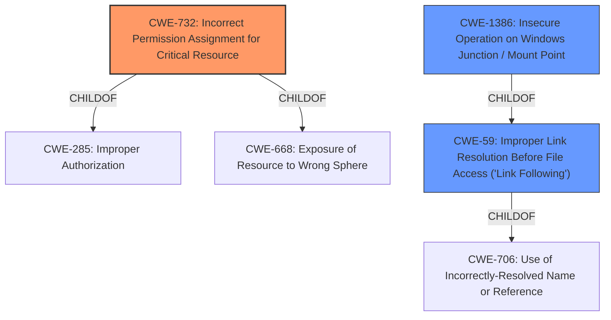

# Analysis for CVE-2020-26941

# Summary
| CWE ID | CWE Name | Confidence | CWE Abstraction Level | CWE Vulnerability Mapping Label | CWE-Vulnerability Mapping Notes |
|---|---|---|---|---|---|
| CWE-732 | Incorrect Permission Assignment for Critical Resource | 0.9 | Class | Allowed-with-Review | Primary CWE |
| CWE-59 | Improper Link Resolution Before File Access ('Link Following') | 0.7 | Base | Allowed | Secondary Candidate |
| CWE-1386 | Insecure Operation on Windows Junction / Mount Point | 0.6 | Base | Allowed | Secondary Candidate |

## Evidence and Confidence

*   **Confidence Score:** 0.8
*   **Evidence Strength:** HIGH

## Relationship Analysis
The primary CWE, CWE-732, is a Class-level CWE that falls under CWE-285 (Improper Authorization) and CWE-668 (Exposure of Resource to Wrong Sphere). The vulnerability involves **insecure permissions**, which aligns with CWE-732's description of specifying permissions for security-critical resources in a way that allows unintended actors to read or modify them. CWE-59 and CWE-1386 are related to file access and link following, indicating the attack vector involving symlinks. CWE-1386 is a child of CWE-59, making it a more specific case for Windows systems where junctions and mount points are used.

## Vulnerability Chain
The vulnerability chain starts with **insecure permissions** (CWE-732) during the installation phase, leading to a situation where a low-privileged user can exploit this weakness using a symlink (CWE-59) to achieve arbitrary file overwrite/deletion. On Windows systems, this exploitation might involve junctions or mount points (CWE-1386). The initial **insecure permissions** allow the symlink to be effective, resulting in the file overwrite.

## Summary of Analysis
The initial assessment identifies that the vulnerability lies in **insecure permissions** during the installation phase of ESET products, where a low-privileged user can exploit this to overwrite arbitrary files via a symlink.

The key evidence is:
- "**insecure permissions**" from the "Vulnerability Description Key Phrases"
- "The vulnerability stems from the fact that during the installation or upgrade process of ESET products, the self-defense mechanism is not fully active." from the "CVE Reference Links Content Summary"
- "Insecure file writing permissions: The vulnerability allows users to write or rewrite files within the ESET directory that they would normally not have permissions to access." from the "CVE Reference Links Content Summary"

CWE-732 (Incorrect Permission Assignment for Critical Resource) is selected as the primary CWE due to the **insecure permissions** on critical resources, which allows unintended actors to modify them.

CWE-59 (Improper Link Resolution Before File Access ('Link Following')) is a secondary CWE because the attack involves using a symlink to exploit the **insecure permissions**.

CWE-1386 (Insecure Operation on Windows Junction / Mount Point) is considered because the affected systems are Windows-based, and the symlink attack might involve junctions or mount points.

CWE-732 is chosen as the most specific and relevant CWE because the root cause is the **insecure permissions**, which allows the subsequent exploitation via symlinks. While the attack involves symlinks, the underlying cause is the **incorrect permission assignment**.
CWE-732 is a Class, and while normally one would want a Base or Variant, it is more important to select the CWE that best reflects the root cause.
CWE-732 is tagged as "Allowed-with-Review" because it can be misused for vulnerabilities where "permissions" are not checked, which is an "authorization" weakness. However, in this case, the description explicitly mentions **insecure permissions**, making it an appropriate fit.

# Enhanced Query for CVE-2020-26941

## Vulnerability Description
A local (authenticated) low-privileged user can exploit a behavior in an ESET installer to achieve arbitrary file overwrite (deletion) of any file via a symlink, due to **insecure permissions**. The possibility of exploiting this vulnerability is limited and can only take place during the installation phase of ESET products. Furthermore, exploitation can only succeed when Self-Defense is disabled. Affected products are ESET NOD32 Antivirus, ESET Internet Security, ESET Smart Security, ESET Smart Security Premium versions 13.2 and lower ESET Endpoint Antivirus, ESET Endpoint Security, ESET NOD32 Antivirus Business Edition, ESET Smart Security Business Edition versions 7.3 and lower ESET File Security for Microsoft Windows Server, ESET Mail Security for Microsoft Exchange Server, ESET Mail Security for IBM Domino, ESET Security for Kerio, ESET Security for Microsoft SharePoint Server versions 7.2 and lower.

### Vulnerability Description Key Phrases
- **rootcause:** **insecure permissions**
- **impact:** arbitrary file overwrite (deletion)
- **vector:** symlink
- **attacker:** local (authenticated) low-privileged user
- **product:** ESET products
- **component:** ESET installer

## CVE Reference Links Content Summary
Based on the provided document, here's a breakdown of the vulnerability:

**Root Cause:**
The vulnerability stems from the fact that during the installation or upgrade process of ESET products, the self-defense mechanism is not fully active. This creates a window of opportunity where a user with limited rights can manipulate files within the ESET directory.

**Weaknesses/Vulnerabilities:**
- Insufficient protection during installation/upgrade: ESET's self-defense mechanism is not fully active during these processes.
- Insecure file writing permissions: The vulnerability allows users to write or rewrite files within the ESET directory that they would normally not have permissions to access.
- Lack of active self-defense mechanism when it is turned off.

**Impact of Exploitation:**
- Privilege Escalation: A user with limited rights can exploit this vulnerability to gain higher privileges by forcing the ESET product to write into files that are normally not writable. This allows the attacker to potentially compromise the system.

**Attack Vectors:**
- File manipulation during installation or upgrade.
- File manipulation while self-defense is turned off.

**Required Attacker Capabilities/Position:**
- Local access to the target Windows system.
- Ability to make changes in an ESET directory.
- Timing to exploit the vulnerable period during installation/upgrade, or by turning off the self-defense.

**Additional Details:**

- The vulnerability is present in specific versions of ESET products for Windows (listed in the document).
- The vulnerability is considered to have a "Medium" severity.
- The window of opportunity during installation/upgrade is described as "narrow" and difficult to control.
- Micro Program Component Update (uPCU) is not affected, while standard PCU is affected.
- The self-defense mechanism protects already installed products when enabled.
- ESET has released fixed installation packages to address this issue.

## Retriever Results

### Top Combined Results

| Rank | CWE ID | Name | Abstraction | Usage  | Retrievers | Individual Scores |
|------|--------|------|-------------|-------|------------|-------------------|
| 1 | 732 | Incorrect Permission Assignment for Critical Resource | Class | Allowed-with-Review | sparse | 1.165 |
| 2 | 250 | Execution with Unnecessary Privileges | Base | Allowed | sparse | 0.693 |
| 3 | 59 | Improper Link Resolution Before File Access ('Link Following') | Base | Allowed | sparse | 0.617 |
| 4 | 472 | External Control of Assumed-Immutable Web Parameter | Base | Allowed | sparse | 0.601 |
| 5 | 269 | Improper Privilege Management | Class | Discouraged | sparse | 0.598 |
| 6 | 1386 | Insecure Operation on Windows Junction / Mount Point | Base | Allowed | dense | 0.601 |
| 7 | 363 | Race Condition Enabling Link Following | Base | Allowed | graph | 0.002 |
| 8 | 379 | Creation of Temporary File in Directory with Insecure Permissions | Base | Allowed | sparse | 0.584 |
| 9 | 287 | Improper Authentication | Class | Discouraged | sparse | 0.557 |
| 10 | 863 | Incorrect Authorization | Class | Allowed-with-Review | sparse | 0.556 |

# Complete CWE Specifications

## CWE-732: Incorrect Permission Assignment for Critical Resource
**Abstraction:** Class
**Status:** Draft

### Description
The product specifies permissions for a security-critical resource in a way that allows that resource to be read or modified by unintended actors.

### Extended Description
When a resource is given a permission setting that provides access to a wider range of actors than required, it could lead to the exposure of sensitive information, or the modification of that resource by unintended parties. This is especially dangerous when the resource is related to program configuration, execution, or sensitive user data. For example, consider a misconfigured storage account for the cloud that can be read or written by a public or anonymous user.

### Alternative Terms
None

### Relationships
ChildOf -> CWE-285
ChildOf -> CWE-668

### Mapping Guidance
**Usage:** Allowed-with-Review
**Rationale:** While the name itself indicates an assignment of permissions for resources, this is often misused for vulnerabilities in which "permissions" are not checked, which is an "authorization" weakness (CWE-285 or descendants) within CWE's model [REF-1287].
**Comments:** Closely analyze the specific mistake that is allowing the resource to be exposed, and perform a CWE mapping for that mistake.
**Reasons:**
- Frequent Misuse

### Additional Notes
**[Maintenance]** The relationships between privileges, permissions, and actors (e.g. users and groups) need further refinement within the Research view. One complication is that these concepts apply to two different pillars, related to control of resources (CWE-664) and protection mechanism failures (CWE-693).

### Observed Examples
- **CVE-2022-29527:** Go application for cloud management creates a world-writable sudoers file that allows local attackers to inject sudo rules and escalate privileges to root by winning a race condition.
- **CVE-2009-3482:** Anti-virus product sets insecure "Everyone: Full Control" permissions for files under the "Program Files" folder, allowing attackers to replace executables with Trojan horses.
- **CVE-2009-3897:** Product creates directories with 0777 permissions at installation, allowing users to gain privileges and access a socket used for authentication.

## CWE-250: Execution with Unnecessary Privileges
**Abstraction:** Base
**Status:** Draft

### Description
The product performs an operation at a privilege level that is higher than the minimum level required, which creates new weaknesses or amplifies the consequences of other weaknesses.

### Extended Description

New weaknesses can be exposed because running with extra privileges, such as root or Administrator, can disable the normal security checks being performed by the operating system or surrounding environment. Other pre-existing weaknesses can turn into security vulnerabilities if they occur while operating at raised privileges.

Privilege management functions can behave in some less-than-obvious ways, and they have different quirks on different platforms. These inconsistencies are particularly pronounced if you are transitioning from one non-root user to another. Signal handlers and spawned processes run at the privilege of the owning process, so if a process is running as root when a signal fires or a sub-process is executed, the signal handler or sub-process will operate with root privileges.

### Alternative Terms
None

### Relationships
ChildOf -> CWE-269
ChildOf -> CWE-657

### Mapping Guidance
**Usage:** Allowed
**Rationale:** This CWE entry is at the Base level of abstraction, which is a preferred level of abstraction for mapping to the root causes of vulnerabilities.
**Comments:** Carefully read both the name and description to ensure that this mapping is an appropriate fit. Do not try to 'force' a mapping to a lower-level Base/Variant simply to comply with this preferred level of abstraction.
**Reasons:**
- Acceptable-Use

### Additional Notes
**[Relationship]** There is a close association with CWE-653 (Insufficient Separation of Privileges). CWE-653 is about providing separate components for each privilege; CWE-250 is about ensuring that each component has the least amount of privileges possible.

**[Maintenance]** CWE-271, CWE-272, and CWE-250 are all closely related and possibly overlapping. CWE-271 is probably better suited as a category. Both CWE-272 and CWE-250 are in active use by the community. The "least privilege" phrase has multiple interpretations.

**[Maintenance]** The Taxonomy_Mappings to ISA/IEC 62443 were added in CWE 4.10, but they are still under review and might change in future CWE versions. These draft mappings were performed by members of the "Mapping CWE to 62443" subgroup of the CWE-CAPEC ICS/OT Special Interest Group (SIG), and their work is incomplete as of CWE 4.10. The mappings are included to facilitate discussion and review by the broader ICS/OT community, and they are likely to change in future CWE versions.

### Observed Examples
- **CVE-2007-4217:** FTP client program on a certain OS runs with setuid privileges and has a buffer overflow. Most clients do not need extra privileges, so an overflow is not a vulnerability for those clients.
- **CVE-2008-1877:** Program runs with privileges and calls another program with the same privileges, which allows read of arbitrary files.
- **CVE-2007-5159:** OS incorrectly installs a program with setuid privileges, allowing users to gain privileges.

## CWE-59: Improper Link Resolution Before File Access ('Link Following')
**Abstraction:** Base
**Status:** Draft

### Description
The product attempts to access a file based on the filename, but it does not properly prevent that filename from identifying a link or shortcut that resolves to an unintended resource.

### Extended Description
Not provided

### Alternative Terms
insecure temporary file: Some people use the phrase "insecure temporary file" when referring to a link following weakness, but other weaknesses can produce insecure temporary files without any symlink involvement at all.
Zip Slip: "Zip slip" is an attack that uses file archives (e.g., ZIP, tar, rar, etc.) that contain filenames with path traversal sequences that cause the files to be written outside of the directory under which the archive is expected to be extracted [REF-1282]. It is most commonly used for relative path traversal (CWE-23) and link following (CWE-59).

### Relationships
ChildOf -> CWE-706
ChildOf -> CWE-706

### Mapping Guidance
**Usage:** Allowed
**Rationale:** This CWE entry is at the Base level of abstraction, which is a preferred level of abstraction for mapping to the root causes of vulnerabilities.
**Comments:** Carefully read both the name and description to ensure that this mapping is an appropriate fit. Do not try to 'force' a mapping to a lower-level Base/Variant simply to comply with this preferred level of abstraction.
**Reasons:**
- Acceptable-Use

### Additional Notes
**[Theoretical]** 

Link following vulnerabilities are Multi-factor Vulnerabilities (MFV). They are the combination of multiple elements: file or directory permissions, filename predictability, race conditions, and in some cases, a design limitation in which there is no mechanism for performing atomic file creation operations.

Some potential factors are race conditions, permissions, and predictability.

### Observed Examples
- **CVE-1999-1386:** Some versions of Perl follow symbolic links when running with the -e option, which allows local users to overwrite arbitrary files via a symlink attack.
- **CVE-2000-1178:** Text editor follows symbolic links when creating a rescue copy during an abnormal exit, which allows local users to overwrite the files of other users.
- **CVE-2004-0217:** Antivirus update allows local users to create or append to arbitrary files via a symlink attack on a logfile.

## CWE-472: External Control of Assumed-Immutable Web Parameter
**Abstraction:** Base
**Status:** Draft

### Description
The web application does not sufficiently verify inputs that are assumed to be immutable but are actually externally controllable, such as hidden form fields.

### Extended Description

If a web product does not properly protect assumed-immutable values from modification in hidden form fields, parameters, cookies, or URLs, this can lead to modification of critical data. Web applications often mistakenly make the assumption that data passed to the client in hidden fields or cookies is not susceptible to tampering. Improper validation of data that are user-controllable can lead to the application processing incorrect, and often malicious, input.

For example, custom cookies commonly store session data or persistent data across sessions. This kind of session data is normally involved in security related decisions on the server side, such as user authentication and access control. Thus, the cookies might contain sensitive data such as user credentials and privileges. This is a dangerous practice, as it can often lead to improper reliance on the value of the client-provided cookie by the server side application.

### Alternative Terms
Assumed-Immutable Parameter Tampering

### Relationships
ChildOf -> CWE-642
ChildOf -> CWE-471

### Mapping Guidance
**Usage:** Allowed
**Rationale:** This CWE entry is at the Base level of abstraction, which is a preferred level of abstraction for mapping to the root causes of vulnerabilities.
**Comments:** Carefully read both the name and description to ensure that this mapping is an appropriate fit. Do not try to 'force' a mapping to a lower-level Base/Variant simply to comply with this preferred level of abstraction.
**Reasons:**
- Acceptable-Use

### Additional Notes
**[Relationship]** This is a primary weakness for many other weaknesses and functional consequences, including XSS, SQL injection, path disclosure, and file inclusion.

**[Theoretical]** This is a technology-specific MAID problem.

### Observed Examples
- **CVE-2002-0108:** Forum product allows spoofed messages of other users via hidden form fields for name and e-mail address.
- **CVE-2000-0253:** Shopping cart allows price modification via hidden form field.
- **CVE-2000-0254:** Shopping cart allows price modification via hidden form field.

## CWE-269: Improper Privilege Management
**Abstraction:** Class
**Status:** Draft

### Description
The product does not properly assign, modify, track, or check privileges for an actor, creating an unintended sphere of control for that actor.

### Extended Description
Not provided

### Alternative Terms
None

### Relationships
ChildOf -> CWE-284

### Mapping Guidance
**Usage:** Discouraged
**Rationale:** CWE-269 is commonly misused. It can be conflated with "privilege escalation," which is a technical impact that is listed in many low-information vulnerability reports [REF-1287]. It is not useful for trend analysis.
**Comments:** If an error or mistake allows privilege escalation, then use the CWE ID for that mistake. Avoid using CWE-269 when only phrases such as "privilege escalation" or "gain privileges" are available, as these indicate technical impact of the vulnerability - not the root cause weakness. If the root cause seems to be directly related to privileges, then examine the children of CWE-269 for additional hints, such as Execution with Unnecessary Privileges (CWE-250) or Incorrect Privilege Assignment (CWE-266).
**Reasons:**
- Frequent Misuse

### Additional Notes
**[Maintenance]** The relationships between privileges, permissions, and actors (e.g. users and groups) need further refinement within the Research view. One complication is that these concepts apply to two different pillars, related to control of resources (CWE-664) and protection mechanism failures (CWE-693).

### Observed Examples
- **CVE-2001-1555:** Terminal privileges are not reset when a user logs out.
- **CVE-2001-1514:** Does not properly pass security context to child processes in certain cases, allows privilege escalation.
- **CVE-2001-0128:** Does not properly compute roles.

## CWE-1386: Insecure Operation on Windows Junction / Mount Point
**Abstraction:** Base
**Status:** Incomplete

### Description
The product opens a file or directory, but it does not properly prevent the name from being associated with a junction or mount point to a destination that is outside of the intended control sphere.

### Extended Description

Depending on the intended action being performed, this could allow an attacker to cause the product to read, write, delete, or otherwise operate on unauthorized files.

In Windows, NTFS5 allows for file system objects called reparse points. Applications can create a hard link from one directory to another directory, called a junction point. They can also create a mapping from a directory to a drive letter, called a mount point. If a file is used by a privileged program, but it can be replaced with a hard link to a sensitive file (e.g., AUTOEXEC.BAT), an attacker could excalate privileges. When the process opens the file, the attacker can assume the privileges of that process, tricking the privileged process to read, modify, or delete the sensitive file, preventing the program from accurately processing data. Note that one can also point to registries and semaphores.

### Alternative Terms
None

### Relationships
ChildOf -> CWE-59

### Mapping Guidance
**Usage:** Allowed
**Rationale:** This CWE entry is at the Base level of abstraction, which is a preferred level of abstraction for mapping to the root causes of vulnerabilities.
**Comments:** Carefully read both the name and description to ensure that this mapping is an appropriate fit. Do not try to 'force' a mapping to a lower-level Base/Variant simply to comply with this preferred level of abstraction.
**Reasons:**
- Acceptable-Use

### Additional Notes
**[Terminology]** Symbolic links, hard links, junctions, and mount points can be confusing terminology, as there are differences in how they operate between UNIX-based systems and Windows, and there are interactions between them.

**[Maintenance]** This entry is still under development and will continue to see updates and content improvements.

### Observed Examples
- **CVE-2021-26426:** Privileged service allows attackers to delete unauthorized files using a directory junction, leading to arbitrary code execution as SYSTEM.
- **CVE-2020-0863:** By creating a mount point and hard links, an attacker can abuse a service to allow users arbitrary file read permissions.
- **CVE-2019-1161:** Chain: race condition (CWE-362) in anti-malware product allows deletion of files by creating a junction (CWE-1386) and using hard links during the time window in which a temporary file is created and deleted.

## CWE-363: Race Condition Enabling Link Following
**Abstraction:** Base
**Status:** Draft

### Description
The product checks the status of a file or directory before accessing it, which produces a race condition in which the file can be replaced with a link before the access is performed, causing the product to access the wrong file.

### Extended Description
While developers might expect that there is a very narrow time window between the time of check and time of use, there is still a race condition. An attacker could cause the product to slow down (e.g. with memory consumption), causing the time window to become larger. Alternately, in some situations, the attacker could win the race by performing a large number of attacks.

### Alternative Terms
None

### Relationships
ChildOf -> CWE-367
CanPrecede -> CWE-59

### Mapping Guidance
**Usage:** Allowed
**Rationale:** This CWE entry is at the Base level of abstraction, which is a preferred level of abstraction for mapping to the root causes of vulnerabilities.
**Comments:** Carefully read both the name and description to ensure that this mapping is an appropriate fit. Do not try to 'force' a mapping to a lower-level Base/Variant simply to comply with this preferred level of abstraction.
**Reasons:**
- Acceptable-Use

### Additional Notes
**[Relationship]** This is already covered by the "Link Following" weakness (CWE-59). It is included here because so many people associate race conditions with link problems; however, not all link following issues involve race conditions.

## CWE-379: Creation of Temporary File in Directory with Insecure Permissions
**Abstraction:** Base
**Status:** Incomplete

### Description
The product creates a temporary file in a directory whose permissions allow unintended actors to determine the file's existence or otherwise access that file.

### Extended Description
On some operating systems, the fact that the temporary file exists may be apparent to any user with sufficient privileges to access that directory. Since the file is visible, the application that is using the temporary file could be known. If one has access to list the processes on the system, the attacker has gained information about what the user is doing at that time. By correlating this with the applications the user is running, an attacker could potentially discover what a user's actions are. From this, higher levels of security could be breached.

### Alternative Terms
None

### Relationships
ChildOf -> CWE-377

### Mapping Guidance
**Usage:** Allowed
**Rationale:** This CWE entry is at the Base level of abstraction, which is a preferred level of abstraction for mapping to the root causes of vulnerabilities.
**Comments:** Carefully read both the name and description to ensure that this mapping is an appropriate fit. Do not try to 'force' a mapping to a lower-level Base/Variant simply to comply with this preferred level of abstraction.
**Reasons:**
- Acceptable-Use

### Observed Examples
- **CVE-2022-27818:** A hotkey daemon written in Rust creates a domain socket file underneath /tmp, which is accessible by any user.
- **CVE-2021-21290:** A Java-based application for a rapid-development framework uses File.createTempFile() to create a random temporary file with insecure default permissions.

## CWE-287: Improper Authentication
**Abstraction:** Class
**Status:** Draft

### Description
When an actor claims to have a given identity, the product does not prove or insufficiently proves that the claim is correct.

### Extended Description
Not provided

### Alternative Terms
authentification: An alternate term is "authentification", which appears to be most commonly used by people from non-English-speaking countries.
AuthN: "AuthN" is typically used as an abbreviation of "authentication" within the web application security community. It is also distinct from "AuthZ," which is an abbreviation of "authorization." The use of "Auth" as an abbreviation is discouraged, since it could be used for either authentication or authorization.
AuthC: "AuthC" is used as an abbreviation of "authentication," but it appears to used less frequently than "AuthN."

### Relationships
ChildOf -> CWE-284
ChildOf -> CWE-284

### Mapping Guidance
**Usage:** Discouraged
**Rationale:** This CWE entry might be misused when lower-level CWE entries are likely to be applicable. It is a level-1 Class (i.e., a child of a Pillar).
**Comments:** Consider children or descendants, beginning with CWE-1390: Weak Authentication or CWE-306: Missing Authentication for Critical Function.
**Reasons:**
- Frequent Misuse
**Suggested Alternatives:**
- CWE-1390: Weak Authentication
- CWE-306: Missing Authentication for Critical Function

### Additional Notes
**[Relationship]** This can be resultant from SQL injection vulnerabilities and other issues.

**[Maintenance]** The Taxonomy_Mappings to ISA/IEC 62443 were added in CWE 4.10, but they are still under review and might change in future CWE versions. These draft mappings were performed by members of the "Mapping CWE to 62443" subgroup of the CWE-CAPEC ICS/OT Special Interest Group (SIG), and their work is incomplete as of CWE 4.10. The mappings are included to facilitate discussion and review by the broader ICS/OT community, and they are likely to change in future CWE versions.

### Observed Examples
- **CVE-2022-35248:** Chat application skips validation when Central Authentication Service (CAS) is enabled, effectively removing the second factor from two-factor authentication
- **CVE-2022-36436:** Python-based authentication proxy does not enforce password authentication during the initial handshake, allowing the client to bypass authentication by specifying a 'None' authentication type.
- **CVE-2022-30034:** Chain: Web UI for a Python RPC framework does not use regex anchors to validate user login emails (CWE-777), potentially allowing bypass of OAuth (CWE-1390).

## CWE-863: Incorrect Authorization
**Abstraction:** Class
**Status:** Incomplete

### Description
The product performs an authorization check when an actor attempts to access a resource or perform an action, but it does not correctly perform the check.

### Extended Description
Not provided

### Alternative Terms
AuthZ: "AuthZ" is typically used as an abbreviation of "authorization" within the web application security community. It is distinct from "AuthN" (or, sometimes, "AuthC") which is an abbreviation of "authentication." The use of "Auth" as an abbreviation is discouraged, since it could be used for either authentication or authorization.

### Relationships
ChildOf -> CWE-285
ChildOf -> CWE-284

### Mapping Guidance
**Usage:** Allowed-with-Review
**Rationale:** This CWE entry is a Class and might have Base-level children that would be more appropriate
**Comments:** Examine children of this entry to see if there is a better fit
**Reasons:**
- Abstraction

### Additional Notes
**[Terminology]** 

Assuming a user with a given identity, authorization is the process of determining whether that user can access a given resource, based on the user's privileges and any permissions or other access-control specifications that apply to the resource.

### Observed Examples
- **CVE-2021-39155:** Chain: A microservice integration and management platform compares the hostname in the HTTP Host header in a case-sensitive way (CWE-178, CWE-1289), allowing bypass of the authorization policy (CWE-863) using a hostname with mixed case or other variations.
- **CVE-2019-15900:** Chain: sscanf() call is used to check if a username and group exists, but the return value of sscanf() call is not checked (CWE-252), causing an uninitialized variable to be checked (CWE-457), returning success to allow authorization bypass for executing a privileged (CWE-863).
- **CVE-2009-2213:** Gateway uses default "Allow" configuration for its authorization settings.

