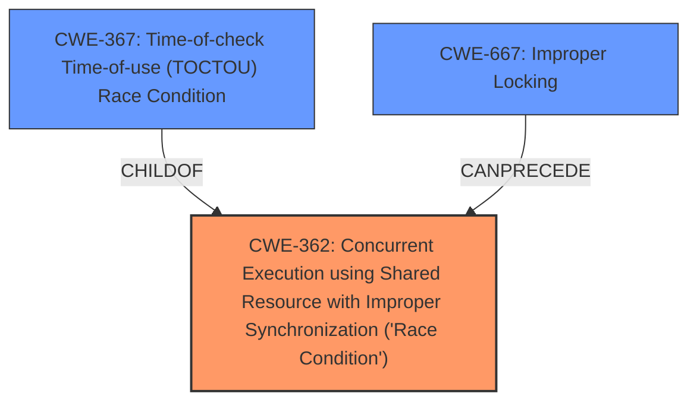

# Analysis for CVE-2020-27014

# Summary
| CWE ID  | CWE Name                                                                                         | Confidence | CWE Abstraction Level | CWE Vulnerability Mapping Label | CWE-Vulnerability Mapping Notes |
| :-------- | :------------------------------------------------------------------------------------------------- | :---------- | :----------------------- | :------------------------------ | :------------------------------ |
| CWE-362 | Concurrent Execution using Shared Resource with Improper Synchronization ('**Race Condition**') | 0.95       | Class                   | Primary                         | Allowed-with-Review             |
| CWE-667 | Improper Locking                                                                                 | 0.85       | Class                   | Secondary                       | Allowed-with-Review             |
| CWE-367 | Time-of-check Time-of-use (TOCTOU) **Race Condition**                                             | 0.75       | Base                    | Secondary                       | Allowed                         |

## Evidence and Confidence

*   **Confidence Score:** 0.90
*   **Evidence Strength:** HIGH

## Relationship Analysis
The primary CWE selected is CWE-362, "Concurrent Execution using Shared Resource with Improper Synchronization ('Race Condition')", which is a Class-level CWE. This accurately reflects the vulnerability description that explicitly mentions a **race condition**. The secondary CWEs, CWE-667 "Improper Locking", and CWE-367 "Time-of-check Time-of-use (TOCTOU) Race Condition" are related. CWE-667 represents a potential cause of the **race condition**, indicating that improper locking mechanisms may have led to the concurrency issue. CWE-367 is a specific type of **race condition**. CWE-362 is a parent of CWE-367.

## Vulnerability Chain
The vulnerability chain starts with **improper synchronization** (potentially due to **improper locking**), leading to a **race condition**, and ultimately resulting in a kernel panic or crash.
  - Root Cause: **Improper Locking** (CWE-667)
  - Weakness: **Race Condition** (CWE-362)
  - Impact: Kernel Panic or Crash

## Summary of Analysis
The initial assessment focused on identifying the root cause and primary weakness described in the vulnerability report. The report explicitly mentions a **race condition** in the Web Threat Protection Blocklist component of Trend Micro Antivirus for Mac. This aligned with CWE-362.

The "CVE Reference Links Content Summary" section provided further evidence, stating that the vulnerability stems from a lack of proper locking when performing operations on an object, reinforcing the potential involvement of CWE-667. The summary also highlights the possibility of a TOCTOU vulnerability, leading to the inclusion of CWE-367.

The final decision to classify CWE-362 as the primary CWE is based on the explicit mention of "**race condition**" in both the vulnerability description and the "CVE Reference Links Content Summary" section.

The selection of CWE-362, CWE-667, and CWE-367 is at the optimal level of specificity because they directly address the root cause (**race condition**, **improper locking**) and a specific type of race condition (TOCTOU) described in the vulnerability.

Relevant CWE Information:

# Enhanced Context (25 CWEs)
The following CWEs were identified as potentially relevant to this vulnerability:

## CWE-1289: Improper Validation of Unsafe Equivalence in Input
**Abstraction Level**: Base
**Similarity Score**: 0.77
**Source**: dense

**Description**:
The product receives an input value that is used as a resource identifier or other type of reference, but it does not validate or incorrectly validates that the input is equivalent to a potentially-unsafe value.

**Mapping Guidance**:
- Usage: Allowed
- Rationale: This CWE entry is at the Base level of abstraction, which is a preferred level of abstraction for mapping to the root causes of vulnerabilities.

## CWE-345: Insufficient Verification of Data Authenticity
**Abstraction Level**: Class
**Similarity Score**: 0.74
**Source**: dense

**Description**:
The product does not sufficiently verify the origin or authenticity of data, in a way that causes it to accept invalid data.

**Mapping Guidance**:
- Usage: Discouraged
- Rationale: This CWE entry is a level-1 Class (i.e., a child of a Pillar). It might have lower-level children that would be more appropriate

## CWE-807: Reliance on Untrusted Inputs in a Security Decision
**Abstraction Level**: Base
**Similarity Score**: 0.74
**Source**: dense

**Description**:
The product uses a protection mechanism that relies on the existence or values of an input, but the input can be modified by an untrusted actor in a way that bypasses the protection mechanism.

**Mapping Guidance**:
- Usage: Allowed
- Rationale: This CWE entry is at the Base level of abstraction, which is a preferred level of abstraction for mapping to the root causes of vulnerabilities.

## CWE-657: Violation of Secure Design Principles
**Abstraction Level**: Class
**Similarity Score**: 0.74
**Source**: dense

**Description**:
The product violates well-established principles for secure design.

**Mapping Guidance**:
- Usage: Discouraged
- Rationale: This CWE entry is a level-1 Class (i.e., a child of a Pillar). It might have lower-level children that would be more appropriate

## CWE-667: Improper Locking
**Abstraction Level**: Class
**Similarity Score**: 0.74
**Source**: dense

**Description**:
The product does not properly acquire or release a lock on a resource, leading to unexpected resource state changes and behaviors.

**Mapping Guidance**:
- Usage: Allowed-with-Review
- Rationale: This CWE entry is a Class and might have Base-level children that would be more appropriate

## CWE-404: Improper Resource Shutdown or Release
**Abstraction Level**: Class
**Similarity Score**: 0.73
**Source**: dense

**Description**:
The product does not release or incorrectly releases a resource before it is made available for re-use.

**Mapping Guidance**:
- Usage: Allowed-with-Review
- Rationale: This CWE entry is a Class and might have Base-level children that would be more appropriate

## CWE-703: Improper Check or Handling of Exceptional Conditions
**Abstraction Level**: Pillar
**Similarity Score**: 0.73
**Source**: dense

**Description**:
The product does not properly anticipate or handle exceptional conditions that rarely occur during normal operation of the product.

**Mapping Guidance**:
- Usage: Discouraged
- Rationale: This CWE entry is extremely high-level, a Pillar.

## CWE-347: Improper Verification of Cryptographic Signature
**Abstraction Level**: Base
**Similarity Score**: 0.73
**Source**: dense

**Description**:
The product does not verify, or incorrectly verifies, the cryptographic signature for data.

**Mapping Guidance**:
- Usage: Allowed
- Rationale: This CWE entry is at the Base level of abstraction, which is a preferred level of abstraction for mapping to the root causes of vulnerabilities.

## CWE-754: Improper Check for Unusual or Exceptional Conditions
**Abstraction Level**: Class
**Similarity Score**: 0.72
**Source**: dense

**Description**:
The product does not check or incorrectly checks for unusual or exceptional conditions that are not expected to occur frequently during day to day operation of the product.

**Mapping Guidance**:
- Usage: Allowed-with-Review
- Rationale: This CWE entry is a Class and might have Base-level children that would be more appropriate

## CWE-59: Improper Link Resolution Before File Access ('Link Following')
**Abstraction Level**: Base
**Similarity Score**: 0.72
**Source**: dense

**Description**:
The product attempts to access a file based on the filename, but it does not properly prevent that filename from identifying a link or shortcut that resolves to an unintended resource.

**Mapping Guidance**:
- Usage: Allowed
- Rationale: This CWE entry is at the Base level of abstraction, which is a preferred level of abstraction for mapping to the root causes of vulnerabilities.

## CWE-367: Time-of-check Time-of-use (TOCTOU) Race Condition
**Abstraction Level**: Base
**Similarity Score**: 7757.08
**Source**: sparse

**Description**:
The product checks the state of a resource before using that resource