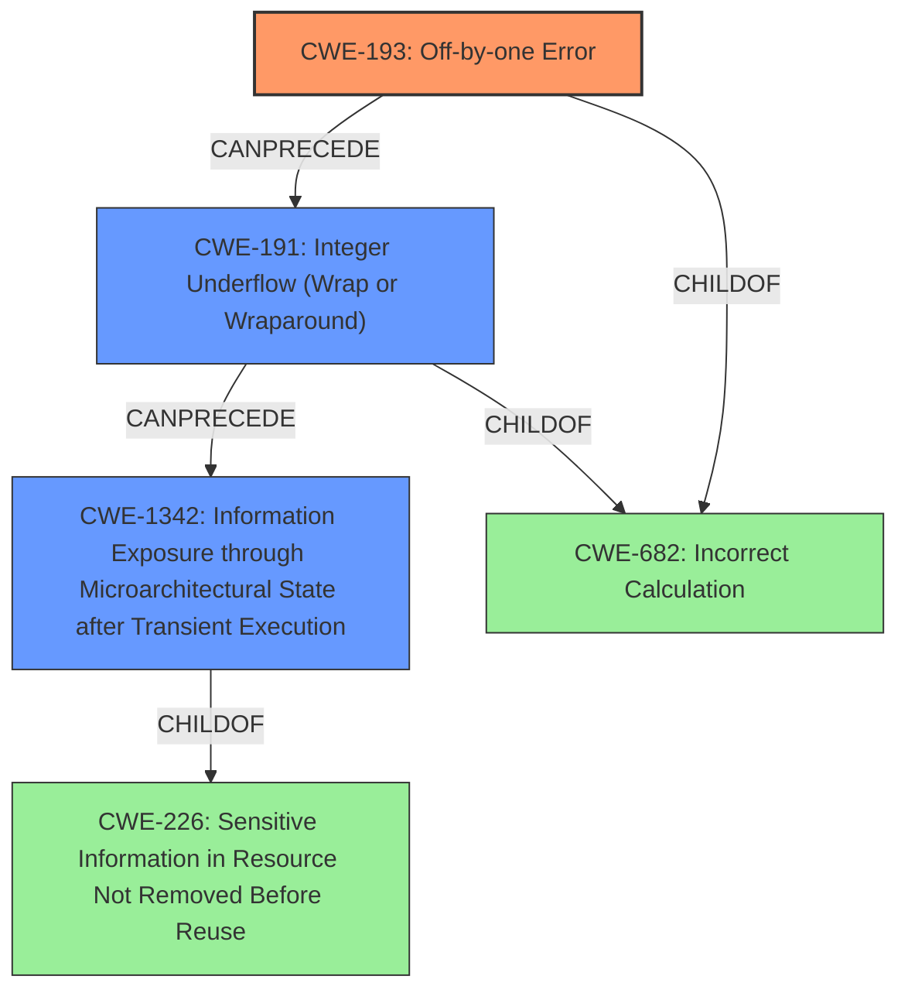

# Analysis for CVE-2020-27171

# Summary
| CWE ID  | CWE Name                                                                        | Confidence | CWE Abstraction Level | CWE Vulnerability Mapping Label | CWE-Vulnerability Mapping Notes |
| :-------- | :------------------------------------------------------------------------------ | :----------- | :---------------------- | :------------------------------ | :------------------------------ |
| CWE-193   | Off-by-one Error                                                              | 1          | Base                    | Primary                         | Allowed                       |
| CWE-191   | Integer Underflow (Wrap or Wraparound)                                        | 0.9          | Base                    | Secondary                       | Allowed                       |
| CWE-1342  | Information Exposure through Microarchitectural State after Transient Execution | 0.8          | Base                    | Secondary                       | Allowed                       |

## Evidence and Confidence

*   **Confidence Score:** 0.9
*   **Evidence Strength:** HIGH

## Relationship Analysis
The primary weakness is an **off-by-one error** (CWE-193) leading to an integer underflow (CWE-191). This underflow subsequently causes an incorrect mask to be generated, which leads to speculative out-of-bounds memory access, ultimately resulting in information exposure through microarchitectural state after transient execution (CWE-1342).

## Vulnerability Chain
The vulnerability chain starts with an **off-by-one error** in the BPF verifier (`retrieve_ptr_limit()` function) (CWE-193). This leads to an integer underflow when calculating `ptr_limit` (CWE-191), causing an incorrect mask to be generated in `fixup_bpf_calls()`. This incorrect mask then allows speculative out-of-bounds loads, resulting in information exposure from kernel memory (CWE-1342) via side-channel attacks.

## Summary of Analysis
The initial analysis correctly identified the **off-by-one error** as a key component. The subsequent integer underflow and its consequences were also well-documented in the CVE Reference Links Content Summary. The final selection is based on the provided evidence, focusing on the root cause and the resulting information exposure.

The choice of CWE-193 as the primary CWE is justified by the description indicating an **off-by-one error** in `kernel/bpf/verifier.c`. "The vulnerability lies in the Linux kernel's BPF (Berkeley Packet Filter) verifier, specifically within the `retrieve_ptr_limit()` function. This function calculates the valid memory area (`ptr_limit`) for registers holding stack or map values, used for bounds checking in speculative execution scenarios. The root cause is an off-by-one error when calculating the memory area size when the pointer moves to the left (subtraction)."

CWE-191 (Integer Underflow) is selected because the **off-by-one error** leads to an integer underflow, which is explicitly mentioned in the CVE reference: "When the calculated `ptr_limit` becomes zero (e.g., subtracting zero from a pointer at the beginning of a map element), an integer underflow occurs in `fixup_bpf_calls()`."

CWE-1342 (Information Exposure through Microarchitectural State after Transient Execution) is included because the vulnerability allows for speculative out-of-bounds loads leading to side-channel attacks and information disclosure. The CVE reference states, "The incorrect mask allows a BPF program to perform speculative out-of-bounds loads on a 4GB window within the kernel's memory space," and "An attacker can exploit this flaw to speculatively read kernel memory contents via side-channel attacks."

The selected CWEs are at the optimal level of specificity, representing the root cause (**off-by-one error**) and the direct consequences (integer underflow, information exposure).

Relevant CWE Information:

# Enhanced Context (25 CWEs)

## CWE-843: Access of Resource Using Incompatible Type ('Type Confusion')
**Abstraction Level**: Base
**Similarity Score**: 0.80
**Source**: dense

**Description**:
The product allocates or initializes a resource such as a pointer, object, or variable using one type, but it later accesses that resource using a type that is incompatible with the original type.

**Mapping Guidance**:
- Usage: Allowed
- Rationale: This CWE entry is at the Base level of abstraction, which is a preferred level of abstraction for mapping to the root causes of vulnerabilities.

**Why it was not selected:**
This CWE does not accurately describe the vulnerability because there is no type confusion. The vulnerability stems from an incorrect calculation of a memory area size, not from accessing a resource using an incompatible type.

## CWE-197: Numeric Truncation Error
**Abstraction Level**: Base
**Similarity Score**: 0.78
**Source**: dense

**Description**:
Truncation errors occur when a primitive is cast to a primitive of a smaller size and data is lost in the conversion.

**Mapping Guidance**:
- Usage: Allowed
- Rationale: This CWE entry is at the Base level of abstraction, which is a preferred level of abstraction for mapping to the root causes of vulnerabilities.

**Why it was not selected:**
Although the vulnerability involves an integer underflow, which can be related to truncation, the core issue is the **off-by-one error** that directly causes the underflow, not a deliberate or accidental truncation of a value during a cast.

## CWE-191: Integer Underflow (Wrap or Wraparound)
**Abstraction Level**: Base
**Similarity Score**: 0.78
**Source**: dense

**Description**:
The product subtracts one value from another, such that the result is less than the minimum allowable integer value, which produces a value that is not equal to the correct result.

**Mapping Guidance**:
- Usage: Allowed
- Rationale: This CWE entry is at the Base level of abstraction, which is a preferred level of abstraction for mapping to the root causes of vulnerabilities.

**Why it was selected:**
CWE-191 is selected because the off-by-one error leads to an integer underflow, which is explicitly mentioned in the CVE reference: "When the calculated `ptr_limit` becomes zero (e.g., subtracting zero from a pointer at the beginning of a map element), an integer underflow occurs in `fixup_bpf_calls()`."

## CWE-822: Untrusted Pointer Dereference
**Abstraction Level**: Base
**Similarity Score**: 0.78
**Source**: dense

**Description**:
The product obtains a value from an untrusted source, converts this value to a pointer, and dereferences the resulting pointer.

**Mapping Guidance**:
- Usage: Allowed
- Rationale: This CWE entry is at the Base level of abstraction, which is a preferred level of abstraction for mapping to the root causes of vulnerabilities.

**Why it was not selected:**
The vulnerability involves out-of-bounds speculation on pointer arithmetic, but the pointer itself isn't obtained from an untrusted source.

## CWE-681: Incorrect Conversion between Numeric Types
**Abstraction Level**: Base
**Similarity Score**: 0.77
**Source**: dense

**Description**:
When converting from one data type to another, such as long to integer, data can be omitted or translated in a way that produces unexpected values. If the resulting values are used in a sensitive context, then dangerous behaviors may occur.

**Mapping Guidance**:
- Usage: Allowed
- Rationale: This CWE entry is at the Base level of abstraction, which is a preferred level of abstraction for mapping to the root causes of vulnerabilities.

**Why it was not selected:**
The vulnerability does not involve an explicit conversion between numeric types. The issue is related to an **off-by-one error** in a calculation.

## CWE-667: Improper Locking
**Abstraction Level**: Class
**Similarity Score**: 0.77
**Source**: dense

**Description**:
The product does not properly acquire or release a lock on a resource, leading to unexpected resource state changes and behaviors.

**Mapping Guidance**:
- Usage