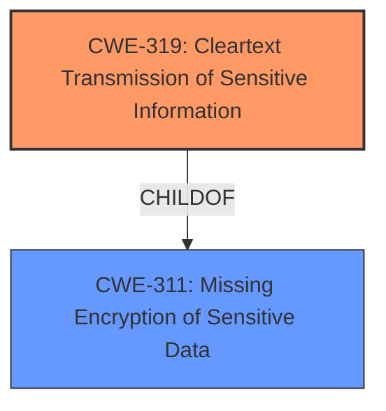

# Analysis for CVE-2020-27184

# Summary
| CWE ID | CWE Name | Confidence | CWE Abstraction Level | CWE Vulnerability Mapping Label | CWE-Vulnerability Mapping Notes |
|---|---|---|---|---|---|
| CWE-319 | Cleartext Transmission of Sensitive Information | 1.0 | Base | Allowed | Primary CWE |

## Evidence and Confidence

*   **Confidence Score:** 1.0
*   **Evidence Strength:** HIGH

## Relationship Analysis
The primary relationship to consider is the ChildOf relationship where CWE-319 is a child of CWE-311 (Missing Encryption of Sensitive Data). While CWE-311 is more general, CWE-319 directly addresses the specific issue of transmitting sensitive data in cleartext, making it the more appropriate choice.



## Vulnerability Chain
The vulnerability chain is straightforward: the Telnet protocol is used, which transmits data in cleartext, leading to a Man-in-the-Middle attack vulnerability.

## Summary of Analysis
The analysis is primarily based on the provided evidence, which clearly states that the Telnet protocol transmits data in cleartext.

The "CVE Reference Links Content Summary" section states:
"The Moxa NPort IA5000A series devices use the Telnet protocol for network device management. Telnet transmits data in cleartext, without encryption."

And, "Weaknesses/Vulnerabilities Present:
- Cleartext Transmission of Sensitive Information (CWE-319): Telnet communication is unencrypted, exposing all transmitted data.
- Man-in-the-Middle Vulnerability: Due to the lack of encryption, the Telnet communication is susceptible to Man-in-the-Middle (MitM) attacks."

The evidence directly supports the selection of CWE-319. The CWE is at the Base level, which is the preferred level of abstraction. Other CWEs were considered but deemed less appropriate. For example, CWE-295 (Improper Certificate Validation) is not relevant because the vulnerability is not related to certificate validation. Similarly, CWE-798 (Use of Hard-coded Credentials) is not relevant as the vulnerability is not about hard-coded credentials.

Relevant CWE Information:

# Enhanced Context (25 CWEs)
The following CWEs were identified as potentially relevant to this vulnerability:

## CWE-300: Channel Accessible by Non-Endpoint
**Abstraction Level**: Class
**Similarity Score**: 0.78
**Source**: dense

**Description**:
The product does not adequately verify the identity of actors at both ends of a communication channel, or does not adequately ensure the integrity of the channel, in a way that allows the channel to be accessed or influenced by an actor that is not an endpoint.

**Mapping Guidance**:
- Usage: Discouraged
- Rationale: CWE-300 is commonly misused for vulnerabilities in which the prerequisites for exploitation require the adversary to be in a privileged "in-the-middle" position.

*Not selected* because while a MitM attack is the impact, the root cause is the cleartext transmission, not the channel access control.

## CWE-1391: Use of Weak Credentials
**Abstraction Level**: Class
**Similarity Score**: 0.77
**Source**: dense

**Description**:
The product uses weak credentials (such as a default key or hard-coded password) that can be calculated, derived, reused, or guessed by an attacker.

**Mapping Guidance**:
- Usage: Allowed-with-Review
- Rationale: This CWE entry is a Class and might have Base-level children that would be more appropriate

*Not selected* because the vulnerability is not directly related to weak credentials.

## CWE-319: Cleartext Transmission of Sensitive Information
**Abstraction Level**: Base
**Similarity Score**: 0.77
**Source**: dense

**Description**:
The product transmits sensitive or security-critical data in cleartext in a communication channel that can be sniffed by unauthorized actors.

**Mapping Guidance**:
- Usage: Allowed
- Rationale: This CWE entry is at the Base level of abstraction, which is a preferred level of abstraction for mapping to the root causes of vulnerabilities.

*Selected as Primary CWE* because it directly addresses the root cause of the vulnerability.

## CWE-798: Use of Hard-coded Credentials
**Abstraction Level**: Base
**Similarity Score**: 0.77
**Source**: dense

**Description**:
The product contains hard-coded credentials, such as a password or cryptographic key.

**Mapping Guidance**:
- Usage: Allowed
- Rationale: This CWE entry is at the Base level of abstraction, which is a preferred level of abstraction for mapping to the root causes of vulnerabilities.

*Not selected* because the vulnerability is not related to hard-coded credentials.

## CWE-807: Reliance on Untrusted Inputs in a Security Decision
**Abstraction Level**: Base
**Similarity Score**: 0.76
**Source**: dense

**Description**:
The product uses a protection mechanism that relies on the existence or values of an input, but the input can be modified by an untrusted actor in a way that bypasses the protection mechanism.

**Mapping Guidance**:
- Usage: Allowed
- Rationale: This CWE entry is at the Base level of abstraction, which is a preferred level of abstraction for mapping to the root causes of vulnerabilities.

*Not selected* because the vulnerability doesn't involve reliance on untrusted inputs for security decisions.

## CWE-345: Insufficient Verification of Data Authenticity
**Abstraction Level**: Class
**Similarity Score**: 0.76
**Source**: dense

**Description**:
The product does not sufficiently verify the origin or authenticity of data, in a way that causes it to accept invalid data.

**Mapping Guidance**:
- Usage: Discouraged
- Rationale: This CWE entry is a level-1 Class (i.e., a child of a Pillar). It might have lower-level children that would be more appropriate

*Not selected* because the issue is not related to data authenticity verification.

## CWE-1299: Missing Protection Mechanism for Alternate Hardware Interface
**Abstraction Level**: Base
**Similarity Score**: 0.76
**Source**: dense

**Description**:
The lack of protections on alternate paths to access
                control-protected assets (such as unprotected shadow registers
                and other external facing unguarded interfaces) allows an
                attacker to bypass existing protections to the asset that are
		only performed against the primary path.

**Mapping Guidance**:
- Usage: Allowed
- Rationale: This CWE entry is at the Base level of abstraction, which is a preferred level of abstraction for mapping to the root causes of vulnerabilities.

*Not selected* because this is not related to a missing protection mechanism for an alternate hardware interface.

## CWE-799: Improper Control of Interaction Frequency
**Abstraction Level**: Class
**Similarity Score**: 0.76
**Source**: dense

**Description**:
The product does not properly limit the number or frequency of interactions that it has with an actor, such as the number of incoming requests.

**Mapping Guidance**:
- Usage: Allowed-with-Review
- Rationale: This CWE entry is a Class and might have Base-level children that would be more appropriate

*Not selected* because it doesn't involve improper control of interaction frequency.

## CWE-1188: Initialization of a Resource with an Insecure Default
**Abstraction Level**: Base
**Similarity Score**: 0.76
**Source**: dense

**Description**:
The product initializes or sets a resource with a default that is intended to be changed by the administrator, but the default is not secure.

**Mapping Guidance**:
- Usage: Allowed
- Rationale: This CWE entry is at the Base level of abstraction, which is a preferred level of abstraction for mapping to the root causes of vulnerabilities.

*Not selected* because the vulnerability is not related to insecure defaults.

## CWE-297: Improper Validation of Certificate with Host Mismatch
**Abstraction Level**: Variant
**Similarity Score**: 0.76
**Source**: dense

**Description**:
The product communicates with a host that provides a certificate, but the product does not properly ensure that the certificate is actually associated with that host.

**Mapping Guidance**:
- Usage: Allowed
- Rationale: This CWE entry is at the Variant level of abstraction, which is a preferred level of abstraction for mapping to the root causes of vulnerabilities.

*Not selected* because the vulnerability is not related to certificate validation issues.

## CWE-295: Improper Certificate Validation
**Abstraction Level**: Base
**Similarity Score**: 6058.49
**Source**: sparse

**Description**:
The product does not validate, or incorrectly validates, a certificate.

**Mapping Guidance**:
- Usage: Allowed
- Rationale: This CWE entry is at the Base level of abstraction, which is a preferred level of abstraction for mapping to the root

# Enhanced Query for CVE-2020-27184

## Vulnerability Description
The NPort IA5000A Series devices use Telnet as one of the network device management services. Telnet does not support the encryption of client-server communications, making it vulnerable to Man-in-the-Middle attacks.

### Vulnerability Description Key Phrases
- **impact:** Man-in-the-Middle attacks
- **product:** NPort IA5000A Series devices
- **component:** Telnet

## CVE Reference Links Content Summary
Based on the provided content, here's an analysis of CVE-2020-27184:

**Root Cause of Vulnerability:**
The Moxa NPort IA5000A series devices use the Telnet protocol for network device management. Telnet transmits data in cleartext, without encryption.

**Weaknesses/Vulnerabilities Present:**
- Cleartext Transmission of Sensitive Information (CWE-319): Telnet communication is unencrypted, exposing all transmitted data.
- Man-in-the-Middle Vulnerability: Due to the lack of encryption, the Telnet communication is susceptible to Man-in-the-Middle (MitM) attacks.

**Impact of Exploitation:**
An attacker performing a MitM attack can intercept and read all data transmitted between the client and the device via Telnet. This includes:
    - Authentication credentials (usernames and passwords).
    - Device configuration data.
    - Sensitive data.
    - The device version.

**Attack Vectors:**
- Network Access: The attacker needs network access to port 23/TCP (the default Telnet port).
- Man-in-the-Middle: The attack requires the ability to intercept network traffic between the client and the vulnerable Moxa device.

**Required Attacker Capabilities/Position:**
- Network proximity: The attacker must be positioned within the network to intercept Telnet traffic.
- MitM capability: The attacker must possess the ability to conduct a man-in-the-middle attack on the network segment where the Telnet communication is occurring.
- No privilege required.
- User interaction required: it requires the user to communicate over Telnet.

**Additional Information:**
- The vulnerability is remotely exploitable
- The complexity of the attack is high, requiring an attacker to perform a man-in-the-middle attack.
- Moxa has provided mitigation by disabling Telnet service. Firmware version 1.5 or higher disables Telnet by default on NPort IA5150A/IA5250A series. Version 2.0 or higher disables it on NPort IA5450A series.
- Affected products include: NPort IA5150A, NPort IA5250A, and NPort IA5450A series.
- Kaspersky ICS CERT also recommends network segmentation, using a firewall and VPN to protect industrial networks and implementing network intrusion detection solutions.

## Retriever Results

### Top Combined Results

| Rank | CWE ID | Name | Abstraction | Usage  | Retrievers | Individual Scores |
|------|--------|------|-------------|-------|------------|-------------------|
| 1 | 319 | Cleartext Transmission of Sensitive Information | Base | Allowed | sparse | 0.093 |
| 2 | 295 | Improper Certificate Validation | Base | Allowed | sparse | 0.079 |
| 3 | 297 | Improper Validation of Certificate with Host Mismatch | Variant | Allowed | sparse | 0.074 |
| 4 | 321 | Use of Hard-coded Cryptographic Key | Variant | Allowed | sparse | 0.072 |
| 5 | 757 | Selection of Less-Secure Algorithm During Negotiation ('Algorithm Downgrade') | Base | Allowed | sparse | 0.071 |
| 6 | 326 | Inadequate Encryption Strength | Class | Allowed-with-Review | dense | 0.430 |
| 7 | 370 | Missing Check for Certificate Revocation after Initial Check | Variant | Allowed | graph | 0.002 |
| 8 | 1188 | Initialization of a Resource with an Insecure Default | Base | Allowed | sparse | 0.066 |
| 9 | 259 | Use of Hard-coded Password | Variant | Allowed | sparse | 0.065 |
| 10 | 923 | Improper Restriction of Communication Channel to Intended Endpoints | Class | Allowed-with-Review | sparse | 0.065 |


# Complete CWE Specifications


## CWE-319: Cleartext Transmission of Sensitive Information
**Abstraction:** Base
**Status:** Draft

### Description
The product transmits sensitive or security-critical data in cleartext in a communication channel that can be sniffed by unauthorized actors.

### Extended Description


Many communication channels can be "sniffed" (monitored) by adversaries during data transmission. For example, in networking, packets can traverse many intermediary nodes from the source to the destination, whether across the internet, an internal network, the cloud, etc. Some actors might have privileged access to a network interface or any link along the channel, such as a router, but they might not be authorized to collect the underlying data. As a result, network traffic could be sniffed by adversaries, spilling security-critical data.


Applicable communication channels are not limited to software products. Applicable channels include hardware-specific technologies such as internal hardware networks and external debug channels, supporting remote JTAG debugging. When mitigations are not applied to combat adversaries within the product's threat model, this weakness significantly lowers the difficulty of exploitation by such adversaries.


When full communications are recorded or logged, such as with a packet dump, an adversary could attempt to obtain the dump long after the transmission has occurred and try to "sniff" the cleartext from the recorded communications in the dump itself. Even if the information is encoded in a way that is not human-readable, certain techniques could determine which encoding is being used, then decode the information. 


### Alternative Terms
None

### Relationships
ChildOf -> CWE-311
ChildOf -> CWE-311

### Mapping Guidance
**Usage:** Allowed
**Rationale:** This CWE entry is at the Base level of abstraction, which is a preferred level of abstraction for mapping to the root causes of vulnerabilities.
**Comments:** Carefully read both the name and description to ensure that this mapping is an appropriate fit. Do not try to 'force' a mapping to a lower-level Base/Variant simply to comply with this preferred level of abstraction.
**Reasons:**
- Acceptable-Use


### Additional Notes
**[Maintenance]** The Taxonomy_Mappings to ISA/IEC 62443 were added in CWE 4.10, but they are still under review and might change in future CWE versions. These draft mappings were performed by members of the "Mapping CWE to 62443" subgroup of the CWE-CAPEC ICS/OT Special Interest Group (SIG), and their work is incomplete as of CWE 4.10. The mappings are included to facilitate discussion and review by the broader ICS/OT community, and they are likely to change in future CWE versions.


### Observed Examples
- **CVE-2022-29519:** Programmable Logic Controller (PLC) sends sensitive information in plaintext, including passwords and session tokens.
- **CVE-2022-30312:** Building Controller uses a protocol that transmits authentication credentials in plaintext.
- **CVE-2022-31204:** Programmable Logic Controller (PLC) sends password in plaintext.


## CWE-295: Improper Certificate Validation
**Abstraction:** Base
**Status:** Draft

### Description
The product does not validate, or incorrectly validates, a certificate.

### Extended Description
When a certificate is invalid or malicious, it might allow an attacker to spoof a trusted entity by interfering in the communication path between the host and client. The product might connect to a malicious host while believing it is a trusted host, or the product might be deceived into accepting spoofed data that appears to originate from a trusted host.

### Alternative Terms
None

### Relationships
ChildOf -> CWE-287
ChildOf -> CWE-287
PeerOf -> CWE-322

### Mapping Guidance
**Usage:** Allowed
**Rationale:** This CWE entry is at the Base level of abstraction, which is a preferred level of abstraction for mapping to the root causes of vulnerabilities.
**Comments:** Carefully read both the name and description to ensure that this mapping is an appropriate fit. Do not try to 'force' a mapping to a lower-level Base/Variant simply to comply with this preferred level of abstraction.
**Reasons:**
- Acceptable-Use


### Observed Examples
- **CVE-2019-12496:** A Go framework for robotics, drones, and IoT devices skips verification of root CA certificates by default.
- **CVE-2014-1266:** chain: incorrect "goto" in Apple SSL product bypasses certificate validation, allowing Adversary-in-the-Middle (AITM) attack (Apple "goto fail" bug). CWE-705 (Incorrect Control Flow Scoping) -> CWE-561 (Dead Code) -> CWE-295 (Improper Certificate Validation) -> CWE-393 (Return of Wrong Status Code) -> CWE-300 (Channel Accessible by Non-Endpoint).
- **CVE-2021-22909:** Chain: router's firmware update procedure uses curl with "-k" (insecure) option that disables certificate validation (CWE-295), allowing adversary-in-the-middle (AITM) compromise with a malicious firmware image (CWE-494).


## CWE-297: Improper Validation of Certificate with Host Mismatch
**Abstraction:** Variant
**Status:** Incomplete

### Description
The product communicates with a host that provides a certificate, but the product does not properly ensure that the certificate is actually associated with that host.

### Extended Description


Even if a certificate is well-formed, signed, and follows the chain of trust, it may simply be a valid certificate for a different site than the site that the product is interacting with. If the certificate's host-specific data is not properly checked - such as the Common Name (CN) in the Subject or the Subject Alternative Name (SAN) extension of an X.509 certificate - it may be possible for a redirection or spoofing attack to allow a malicious host with a valid certificate to provide data, impersonating a trusted host. In order to ensure data integrity, the certificate must be valid and it must pertain to the site that is being accessed.


Even if the product attempts to check the hostname, it is still possible to incorrectly check the hostname. For example, attackers could create a certificate with a name that begins with a trusted name followed by a NUL byte, which could cause some string-based comparisons to only examine the portion that contains the trusted name.


This weakness can occur even when the product uses Certificate Pinning, if the product does not verify the hostname at the time a certificate is pinned.


### Alternative Terms
None

### Relationships
ChildOf -> CWE-923
ChildOf -> CWE-295

### Mapping Guidance
**Usage:** Allowed
**Rationale:** This CWE entry is at the Variant level of abstraction, which is a preferred level of abstraction for mapping to the root causes of vulnerabilities.
**Comments:** Carefully read both the name and description to ensure that this mapping is an appropriate fit. Do not try to 'force' a mapping to a lower-level Base/Variant simply to comply with this preferred level of abstraction.
**Reasons:**
- Acceptable-Use


### Observed Examples
- **CVE-2012-5810:** Mobile banking application does not verify hostname, leading to financial loss.
- **CVE-2012-5811:** Mobile application for printing documents does not verify hostname, allowing attackers to read sensitive documents.
- **CVE-2012-5807:** Software for electronic checking does not verify hostname, leading to financial loss.


## CWE-321: Use of Hard-coded Cryptographic Key
**Abstraction:** Variant
**Status:** Draft

### Description
The use of a hard-coded cryptographic key significantly increases the possibility that encrypted data may be recovered.

### Extended Description
Not provided

### Alternative Terms
None

### Relationships
ChildOf -> CWE-798
ChildOf -> CWE-798
ChildOf -> CWE-798

### Mapping Guidance
**Usage:** Allowed
**Rationale:** This CWE entry is at the Variant level of abstraction, which is a preferred level of abstraction for mapping to the root causes of vulnerabilities.
**Comments:** Carefully read both the name and description to ensure that this mapping is an appropriate fit. Do not try to 'force' a mapping to a lower-level Base/Variant simply to comply with this preferred level of abstraction.
**Reasons:**
- Acceptable-Use


### Additional Notes
**[Other]** The main difference between the use of hard-coded passwords and the use of hard-coded cryptographic keys is the false sense of security that the former conveys. Many people believe that simply hashing a hard-coded password before storage will protect the information from malicious users. However, many hashes are reversible (or at least vulnerable to brute force attacks) -- and further, many authentication protocols simply request the hash itself, making it no better than a password.

**[Maintenance]** The Taxonomy_Mappings to ISA/IEC 62443 were added in CWE 4.10, but they are still under review and might change in future CWE versions. These draft mappings were performed by members of the "Mapping CWE to 62443" subgroup of the CWE-CAPEC ICS/OT Special Interest Group (SIG), and their work is incomplete as of CWE 4.10. The mappings are included to facilitate discussion and review by the broader ICS/OT community, and they are likely to change in future CWE versions.


### Observed Examples
- **CVE-2022-29960:** Engineering Workstation uses hard-coded cryptographic keys that could allow for unathorized filesystem access and privilege escalation
- **CVE-2022-30271:** Remote Terminal Unit (RTU) uses a hard-coded SSH private key that is likely to be used by default.
- **CVE-2020-10884:** WiFi router service has a hard-coded encryption key, allowing root access


## CWE-757: Selection of Less-Secure Algorithm During Negotiation ('Algorithm Downgrade')
**Abstraction:** Base
**Status:** Incomplete

### Description
A protocol or its implementation supports interaction between multiple actors and allows those actors to negotiate which algorithm should be used as a protection mechanism such as encryption or authentication, but it does not select the strongest algorithm that is available to both parties.

### Extended Description
When a security mechanism can be forced to downgrade to use a less secure algorithm, this can make it easier for attackers to compromise the product by exploiting weaker algorithm. The victim might not be aware that the less secure algorithm is being used. For example, if an attacker can force a communications channel to use cleartext instead of strongly-encrypted data, then the attacker could read the channel by sniffing, instead of going through extra effort of trying to decrypt the data using brute force techniques.

### Alternative Terms
None

### Relationships
ChildOf -> CWE-693

### Mapping Guidance
**Usage:** Allowed
**Rationale:** This CWE entry is at the Base level of abstraction, which is a preferred level of abstraction for mapping to the root causes of vulnerabilities.
**Comments:** Carefully read both the name and description to ensure that this mapping is an appropriate fit. Do not try to 'force' a mapping to a lower-level Base/Variant simply to comply with this preferred level of abstraction.
**Reasons:**
- Acceptable-Use


### Additional Notes
**[Relationship]** This is related to CWE-300, although not all downgrade attacks necessarily require an entity that redirects or interferes with the network. See examples.


### Observed Examples
- **CVE-2006-4302:** Attacker can select an older version of the software to exploit its vulnerabilities.
- **CVE-2006-4407:** Improper prioritization of encryption ciphers during negotiation leads to use of a weaker cipher.
- **CVE-2005-2969:** chain: SSL/TLS implementation disables a verification step (CWE-325) that enables a downgrade attack to a weaker protocol.


## CWE-326: Inadequate Encryption Strength
**Abstraction:** Class
**Status:** Draft

### Description
The product stores or transmits sensitive data using an encryption scheme that is theoretically sound, but is not strong enough for the level of protection required.

### Extended Description
A weak encryption scheme can be subjected to brute force attacks that have a reasonable chance of succeeding using current attack methods and resources.

### Alternative Terms
None

### Relationships
ChildOf -> CWE-693

### Mapping Guidance
**Usage:** Allowed-with-Review
**Rationale:** This CWE entry is a Class and might have Base-level children that would be more appropriate
**Comments:** Examine children of this entry to see if there is a better fit
**Reasons:**
- Abstraction


### Observed Examples
- **CVE-2001-1546:** Weak encryption
- **CVE-2004-2172:** Weak encryption (chosen plaintext attack)
- **CVE-2002-1682:** Weak encryption


## CWE-370: Missing Check for Certificate Revocation after Initial Check
**Abstraction:** Variant
**Status:** Draft

### Description
The product does not check the revocation status of a certificate after its initial revocation check, which can cause the product to perform privileged actions even after the certificate is revoked at a later time.

### Extended Description
If the revocation status of a certificate is not checked before each action that requires privileges, the system may be subject to a race condition. If a certificate is revoked after the initial check, all subsequent actions taken with the owner of the revoked certificate will lose all benefits guaranteed by the certificate. In fact, it is almost certain that the use of a revoked certificate indicates malicious activity.

### Alternative Terms
None

### Relationships
ChildOf -> CWE-299
PeerOf -> CWE-296
PeerOf -> CWE-297
PeerOf -> CWE-298

### Mapping Guidance
**Usage:** Allowed
**Rationale:** This CWE entry is at the Variant level of abstraction, which is a preferred level of abstraction for mapping to the root causes of vulnerabilities.
**Comments:** Carefully read both the name and description to ensure that this mapping is an appropriate fit. Do not try to 'force' a mapping to a lower-level Base/Variant simply to comply with this preferred level of abstraction.
**Reasons:**
- Acceptable-Use


## CWE-1188: Initialization of a Resource with an Insecure Default
**Abstraction:** Base
**Status:** Incomplete

### Description
The product initializes or sets a resource with a default that is intended to be changed by the administrator, but the default is not secure.

### Extended Description


Developers often choose default values that leave the product as open and easy to use as possible out-of-the-box, under the assumption that the administrator can (or should) change the default value. However, this ease-of-use comes at a cost when the default is insecure and the administrator does not change it.


### Alternative Terms
None

### Relationships
ChildOf -> CWE-1419
ChildOf -> CWE-665

### Mapping Guidance
**Usage:** Allowed
**Rationale:** This CWE entry is at the Base level of abstraction, which is a preferred level of abstraction for mapping to the root causes of vulnerabilities.
**Comments:** Carefully read both the name and description to ensure that this mapping is an appropriate fit. Do not try to 'force' a mapping to a lower-level Base/Variant simply to comply with this preferred level of abstraction.
**Reasons:**
- Acceptable-Use


### Additional Notes
**[Maintenance]** This entry improves organization of concepts under initialization. The typical CWE model is to cover "Missing" and "Incorrect" behaviors. Arguably, this entry could be named as "Incorrect" instead of "Insecure." This might be changed in the near future.


### Observed Examples
- **CVE-2022-36349:** insecure default variable initialization in BIOS firmware for a hardware board allows DoS
- **CVE-2022-42467:** A generic database browser interface has a default mode that exposes a web server to the network, allowing queries to the database.


## CWE-259: Use of Hard-coded Password
**Abstraction:** Variant
**Status:** Draft

### Description
The product contains a hard-coded password, which it uses for its own inbound authentication or for outbound communication to external components.

### Extended Description


A hard-coded password typically leads to a significant authentication failure that can be difficult for the system administrator to detect. Once detected, it can be difficult to fix, so the administrator may be forced into disabling the product entirely. There are two main variations:

```
		Inbound: the product contains an authentication mechanism that checks for a hard-coded password.
		Outbound: the product connects to another system or component, and it contains hard-coded password for connecting to that component.
```
In the Inbound variant, a default administration account is created, and a simple password is hard-coded into the product and associated with that account. This hard-coded password is the same for each installation of the product, and it usually cannot be changed or disabled by system administrators without manually modifying the program, or otherwise patching the product. If the password is ever discovered or published (a common occurrence on the Internet), then anybody with knowledge of this password can access the product. Finally, since all installations of the product will have the same password, even across different organizations, this enables massive attacks such as worms to take place.

The Outbound variant applies to front-end systems that authenticate with a back-end service. The back-end service may require a fixed password which can be easily discovered. The programmer may simply hard-code those back-end credentials into the front-end product. Any user of that program may be able to extract the password. Client-side systems with hard-coded passwords pose even more of a threat, since the extraction of a password from a binary is usually very simple.


### Alternative Terms
None

### Relationships
ChildOf -> CWE-798
ChildOf -> CWE-798
ChildOf -> CWE-798
PeerOf -> CWE-321
PeerOf -> CWE-257

### Mapping Guidance
**Usage:** Allowed
**Rationale:** This CWE entry is at the Variant level of abstraction, which is a preferred level of abstraction for mapping to the root causes of vulnerabilities.
**Comments:** Carefully read both the name and description to ensure that this mapping is an appropriate fit. Do not try to 'force' a mapping to a lower-level Base/Variant simply to comply with this preferred level of abstraction.
**Reasons:**
- Acceptable-Use


### Additional Notes
**[Maintenance]** This entry could be split into multiple variants: an inbound variant (as seen in the second demonstrative example) and an outbound variant (as seen in the first demonstrative example). These variants are likely to have different consequences, detectability, etc. More importantly, from a vulnerability theory perspective, they could be characterized as different behaviors.


### Observed Examples
- **CVE-2022-29964:** Distributed Control System (DCS) has hard-coded passwords for local shell access
- **CVE-2021-37555:** Telnet service for IoT feeder for dogs and cats has hard-coded password [REF-1288]
- **CVE-2021-35033:** Firmware for a WiFi router uses a hard-coded password for a BusyBox shell, allowing bypass of authentication through the UART port


## CWE-923: Improper Restriction of Communication Channel to Intended Endpoints
**Abstraction:** Class
**Status:** Incomplete

### Description
The product establishes a communication channel to (or from) an endpoint for privileged or protected operations, but it does not properly ensure that it is communicating with the correct endpoint.

### Extended Description


Attackers might be able to spoof the intended endpoint from a different system or process, thus gaining the same level of access as the intended endpoint.


While this issue frequently involves authentication between network-based clients and servers, other types of communication channels and endpoints can have this weakness.


### Alternative Terms
None

### Relationships
ChildOf -> CWE-284

### Mapping Guidance
**Usage:** Allowed-with-Review
**Rationale:** This CWE entry is a Class and might have Base-level children that would be more appropriate
**Comments:** Examine children of this entry to see if there is a better fit
**Reasons:**
- Abstraction


### Observed Examples
- **CVE-2022-30319:** S-bus functionality in a home automation product performs access control using an IP allowlist, which can be bypassed by a forged IP address.
- **CVE-2022-22547:** A troubleshooting tool exposes a web server on a random port between 9000-65535 that could be used for information gathering
- **CVE-2022-4390:** A WAN interface on a router has firewall restrictions enabled for IPv4, but it does not for IPv6, which is enabled by default

