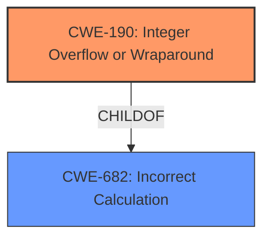

# Analysis for CVE-2020-27194

# Summary
| CWE ID | CWE Name | Confidence | CWE Abstraction Level | CWE Vulnerability Mapping Label | CWE-Vulnerability Mapping Notes |
|---|---|---|---|---|---|
| CWE-190 | Integer Overflow or Wraparound | 0.7 | Base | Primary CWE | Allowed |
| CWE-682 | Incorrect Calculation | 0.5 | Pillar | Secondary Candidate | Discouraged |

## Evidence and Confidence

*   **Confidence Score:** 0.7
*   **Evidence Strength:** MEDIUM

## Relationship Analysis
The primary CWE is CWE-190, which is a child of CWE-682. CWE-682 is a high-level Pillar, while CWE-190 is a more specific Base. The relationship suggests that if a more specific calculation error can be identified, it would be preferable to CWE-682.



## Vulnerability Chain
The vulnerability chain starts with **mishandling bounds tracking during use of 64-bit values**, which can lead to an integer overflow, and potentially other memory corruption issues (not explicitly described).

## Summary of Analysis
The initial analysis focused on identifying the root cause of the vulnerability. The description indicates that the vulnerability **mishandles bounds tracking during use of 64-bit values**. This could be an integer overflow.

The **Retriever Results** suggested CWE-197 (Numeric Truncation Error), CWE-682 (Incorrect Calculation), CWE-193 (Off-by-one Error), and CWE-190 (Integer Overflow or Wraparound).

CWE-197 doesn't seem directly applicable, since **bounds tracking** isn't necessarily a truncation issue. CWE-682 is too general. CWE-193 doesn't fit because it's not explicitly an off-by-one error. CWE-190 seems like a good fit, since **mishandling bounds tracking during use of 64-bit values** might lead to an integer overflow.

The evidence in the "Vulnerability Description Key Phrases" section indicates that the root cause is **mishandles bounds tracking during use of 64-bit values**. This statement implies that the bounds checking logic is **incorrect**, which aligns with CWE-682 (Incorrect Calculation). However, this is a Pillar level CWE and not very specific. The fact that the issue deals with 64-bit values suggests that it may lead to an overflow, so CWE-190 is the better choice.

Therefore, CWE-190 is at the optimal level of specificity.

Relevant CWE Information:

# Enhanced Context (25 CWEs)
The following CWEs were identified as potentially relevant to this vulnerability:

## CWE-197: Numeric Truncation Error
**Abstraction Level**: Base
**Similarity Score**: 0.78
**Source**: dense

**Description**:
Truncation errors occur when a primitive is cast to a primitive of a smaller size and data is lost in the conversion.

**Mapping Guidance**:
- Usage: Allowed
- Rationale: This CWE entry is at the Base level of abstraction, which is a preferred level of abstraction for mapping to the root causes of vulnerabilities.

## CWE-191: Integer Underflow (Wrap or Wraparound)
**Abstraction Level**: Base
**Similarity Score**: 0.77
**Source**: dense

**Description**:
The product subtracts one value from another, such that the result is less than the minimum allowable integer value, which produces a value that is not equal to the correct result.

**Mapping Guidance**:
- Usage: Allowed
- Rationale: This CWE entry is at the Base level of abstraction, which is a preferred level of abstraction for mapping to the root causes of vulnerabilities.

## CWE-680: Integer Overflow to Buffer Overflow
**Abstraction Level**: Compound
**Similarity Score**: 0.74
**Source**: dense

**Description**:
The product performs a calculation to determine how much memory to allocate, but an integer overflow can occur that causes less memory to be allocated than expected, leading to a buffer overflow.

**Mapping Guidance**:
- Usage: Discouraged
- Rationale: This CWE entry is a named chain, which combines multiple weaknesses.

## CWE-681: Incorrect Conversion between Numeric Types
**Abstraction Level**: Base
**Similarity Score**: 0.74
**Source**: dense

**Description**:
When converting from one data type to another, such as long to integer, data can be omitted or translated in a way that produces unexpected values. If the resulting values are used in a sensitive context, then dangerous behaviors may occur.

**Mapping Guidance**:
- Usage: Allowed
- Rationale: This CWE entry is at the Base level of abstraction, which is a preferred level of abstraction for mapping to the root causes of vulnerabilities.

## CWE-131: Incorrect Calculation of Buffer Size
**Abstraction Level**: Base
**Similarity Score**: 0.73
**Source**: dense

**Description**:
The product does not correctly calculate the size to be used when allocating a buffer, which could lead to a buffer overflow.

**Mapping Guidance**:
- Usage: Allowed
- Rationale: This CWE entry is at the Base level of abstraction, which is a preferred level of abstraction for mapping to the root causes of vulnerabilities.

## CWE-124: Buffer Underwrite ('Buffer Underflow')
**Abstraction Level**: Base
**Similarity Score**: 0.72
**Source**: dense

**Description**:
The product writes to a buffer using an index or pointer that references a memory location prior to the beginning of the buffer.

**Mapping Guidance**:
- Usage: Allowed
- Rationale: This CWE entry is at the Base level of abstraction, which is a preferred level of abstraction for mapping to the root causes of vulnerabilities.

## CWE-682: Incorrect Calculation
**Abstraction Level**: Pillar
**Similarity Score**: 0.72
**Source**: dense

**Description**:
The product performs a calculation that generates incorrect or unintended results that are later used in security-critical decisions or resource management.

**Mapping Guidance**:
- Usage: Discouraged
- Rationale: This CWE entry is extremely high-level, a Pillar. In many cases, lower-level children or descendants are more appropriate. However, sometimes this weakness is forced to be used due to the lack of in-depth weakness research. See Research Gaps.

## CWE-805: Buffer Access with Incorrect Length Value
**Abstraction Level**: Base
**Similarity Score**: 0.71
**Source**: dense

**Description**:
The product uses a sequential operation to read or write a buffer, but it uses an incorrect length value that causes it to access memory that is outside of the bounds of the buffer.

**Mapping Guidance**:
- Usage: Allowed
- Rationale: This CWE entry is at the Base level of abstraction, which is a preferred level of abstraction for mapping to the root causes of vulnerabilities.

## CWE-190: Integer Overflow or Wraparound
**Abstraction Level**: Base
**Similarity Score**: 0.71
**Source**: dense

**Description**:
The product performs a calculation that can
         produce an integer overflow or wraparound when the logic
         assumes that the resulting value will always be larger than
         the original value. This occurs when an integer value is
         incremented to a value that is too large to store in the
         associated representation. When this occurs, the value may
         become a very small or negative number.

**Mapping Guidance**:
- Usage: Allowed
- Rationale: This CWE entry is at the Base level of abstraction, which is a preferred level of abstraction for mapping to the root causes of vulnerabilities.

## CWE-1339: Insufficient Precision or Accuracy of a Real Number
**Abstraction Level**: Base
**Similarity Score**: 0.70
**Source**: dense

**Description**:
The product processes a real number with an implementation in which the number's representation does not preserve required accuracy and precision in its fractional part, causing an incorrect result.

**Mapping Guidance**:
- Usage: Allowed
- Rationale: This CWE entry is at the Base level of abstraction, which is a preferred level of abstraction for mapping to the root causes of vulnerabilities.

## CWE-681: Incorrect Conversion between Numeric Types
**Abstraction Level**: Base
**Similarity Score**: 7264.15
**Source**: sparse

**Description**:
When converting from one data type to another, such as long to integer, data can be omitted or translated in a way that produces unexpected values. If the resulting values are used in a sensitive context, then dangerous behaviors may occur.

**Mapping Guidance**:
- Usage: Allowed
- Rationale: This CWE entry is at the Base level of abstraction, which is a preferred level of abstraction for mapping to the root causes of vulnerabilities.

## CWE-190: Integer

# Enhanced Query for CVE-2020-27194

## Vulnerability Description
An issue was discovered in the Linux kernel before 5.8.15. scalar32_min_max_or in kernel/bpf/verifier.c **mishandles bounds tracking during use of 64-bit values**, aka CID-5b9fbeb75b6a.

### Vulnerability Description Key Phrases
- **rootcause:** **mishandles bounds tracking during use of 64-bit values**
- **product:** Linux kernel
- **version:** before 5.8.15
- **component:** scalar32_min_max_or in kernel/bpf/verifier.c

## CVE Reference Links Content Summary
```
{
  "CVE-2020-27194": {
    "Description": "The provided content contains numerous patches for different vulnerabilities in the Linux kernel. Only one of the commits matches the description for a use-after-free.",
    "Relevant_Content": [
      {
        "Commit": "03b7311c2d351647c43ab9c4451e1e2b782c4252",
        "Author": "Cong Wang",
        "Date": "Tue Sep 22 20:56:24 2020 -0700",
        "Vulnerability": "Use-after-free",
        "Root_Cause": "A race condition exists in tcf_action_init() where actions already inserted into the global IDR could be freed by parallel processes before tcf_action_destroy() is called, leading to a use-after-free.",
        "Weaknesses": [
          "Race condition",
          "Use-after-free"
        ],
       "Impact": "A use-after-free vulnerability leading to a crash or other undefined behavior.",
        "Attack_Vectors": "Triggered by multiple parallel processes interacting with the traffic control (TC) subsystem and manipulating network actions.",
       "Required_Capabilities": "Attacker requires the ability to create or modify network actions, which usually requires root privileges or CAP_NET_ADMIN capabilities."
      }
     ],
    "UNRELATED": [
    {
        "Commit": "665c6ff082e214537beef2e39ec366cddf446d52",
        "Description": "Linux 5.8.15 release."
      },
      {
        "Commit": "1e02bbf908d35c98aa673ea7fdd7d1de8bcc0adc",
        "Description": "net_sched: defer tcf_idr_insert() in tcf_action_init_1()."
      },
      {
        "Commit": "b6a788af71ed94281fa21e32a72eb003cb4f1edf",
        "Description": "net: qrtr: ns: Protect radix_tree_deref_slot() using rcu read locks"
      },
    {
        "Commit": "691847cc626c9c4e8465fe02d3a0659ca4e1203f",
        "Description": "net: usb: rtl8150: set random MAC address when set_ethernet_addr() fails"
      },
      {
        "Commit": "624143319921b3561c8c79c135eb3d6f76c91b2b",
        "Description": "Input: ati_remote2 - add missing newlines when printing module parameters"
      },
      {
        "Commit":"2cdb64863860d7e47bedbf92edafb194c513880b",
       "Description": "tty/vt: Do not warn when huge selection requested"
      },
    {
      "Commit": "af2c68e241ba6b816f1622f7a071e96e425349fa",
      "Description":"net/mlx5e: Fix driver's declaration to support GRE offload"
     },
    {
        "Commit": "13e623dc27722668975bc315e55903bccadb3969",
        "Description": "net/tls: race causes kernel panic"
      },
    {
        "Commit": "d1a1891a586561b3085bf92d6dfbc0698000cb01",
         "Description": "net: bridge: fdb: don't flush ext_learn entries"
      },
      {
        "Commit": "54d2034e1d130d90b729ddd75d58bd1ebf8bff81",
        "Description": "net/core: check length before updating Ethertype in skb_mpls_{push,pop}"
     },
     {
       "Commit": "912721b3ad7206d109162e679b0e07b496c7463e",
       "Description": "netlink: fix policy dump leak"
      },
      {
        "Commit":"85355299d6fa4207093d3cb7c9afe6f926a40e0c",
         "Description": "tcp: fix receive window update in tcp_add_backlog()"
      },
      {
       "Commit": "a4c5f912c926148fd424db44a844df8f6aceb717",
        "Description": "mm: khugepaged: recalculate min_free_kbytes after memory hotplug as expected by khugepaged"
      },
    {
        "Commit": "0d600018dde7ab4ae6d9625daa45826acef6bd61",
         "Description": "mm: validate inode in mapping_set_error()"
      },
    {
        "Commit": "270974601ea5ad2e23cdd95b3a6e71e6a762eede",
        "Description": "mmc: core: don't set limits.discard_granularity as 0"
      },
      {
        "Commit": "23030fd9134878832601473564d02fafd0328346",
         "Description": "perf: Fix task_function_call() error handling"
      },
      {
        "Commit": "02b573f11b1c141cf9f211a0a00807e17c39ffe7",
        "Description": "afs: Fix deadlock between writeback and truncate"
      },
       {
        "Commit": "29c60e82c6a5461a789f6696bf4a66ad347f7fd3",
        "Description":"net: mscc: ocelot: divide watermark value by 60 when writing to SYS_ATOP"
      },
       {
        "Commit":"9fd541ad02bd2bb34a1f931068afd5313336d4e4",
        "Description": "net: mscc: ocelot: extend watermark encoding function"
      },
      {
       "Commit":"13c1167842508e38b97de2bd9c720c6e04fe0994",
        "Description": "net: mscc: ocelot: split writes to pause frame enable bit and to thresholds"
      },
     {
       "Commit":"43e89f7e3c98ad1bd42e1e234a60b880e97de99c",
        "Description": "net: mscc: ocelot: rename ocelot_board.c to ocelot_vsc7514.c"
      },
      {
        "Commit":"78272109f44d9bf3925da12ce1fa62c644a1af6a",
        "Description": "rxrpc: Fix server keyring leak"
     },
      {
        "Commit":"bf123536563755173a8879ebc9a0319189c1f1ad",
       "Description": "rxrpc: The server keyring isn't network-namespaced"
     },
      {
        "Commit":"0fb27a1f99c1b16fef099258b7887ea74e4a7727",
         "Description": "rxrpc: Fix some missing _bh annotations on locking conn->state_lock"
      },
     {
        "Commit":"6343a701ca68d532d858cc3ca164aed8da624de4",
        "Description": "rxrpc: Downgrade the BUG() for unsupported token type in rxrpc_read()"
     },
     {
        "Commit": "3a15888ff3dfb62a6839d1dcb08bf90aa33ab1d3",
        "Description": "rxrpc: Fix rxkad token xdr encoding"
      },
     {
        "Commit": "41d0598c0f437a39c10cbfc1ff12724f15568d28",
        "Description": "net: mvneta: fix double free of txq->buf"
      },
      {
       "Commit":"d5c6f130b6f0f63e256ed64b37f735173b9999d9",
        "Description": "vhost-vdpa: fix page pinning leakage in error path"
      },
    {
      "Commit":"ec7257845d40ee81ed18f67d97df87e7107d4cc4",
     "Description": "vhost-vdpa: fix vhost_vdpa_map() on error condition"
      },
     {
       "Commit":"72d41c97e736bfa7acf91b91d6f3c27a9499f2aa",
        "Description": "net: hinic: fix DEVLINK build errors"
      },
    {
       "Commit":"a974b4bddae366ae31cbf6d3d92d2d7e4d7769fb",
        "Description":"net: stmmac: Modify configuration method of EEE timers"
      },
    {
        "Commit":"d0eb9588f724be8f192fff0760eb335434474f09",
        "Description":"net/mlx5e: Fix race condition on nhe->n pointer in neigh update"
      },
    {
        "Commit":"eef0da1560402615a513ee9cc6d46bb1d3afffab",
         "Description": "net/mlx5e: Fix VLAN create flow"
      },
     {
       "Commit":"b6dc435f360340d574a8c7b2f3e42142bc99bbbc",
        "Description": "net/mlx5e: Fix VLAN cleanup flow"
      },
    {
        "Commit":"f2140d0c6b93ae21ba90ca6977b97987eabebd30",
        "Description":"net/mlx5e: Fix return status when setting unsupported FEC mode"
      },
      {
       "Commit": "96e80a3466347105d8e04515219347b0d6525397",
       "Description": "net/mlx5e: Add resiliency in Striding RQ mode for packets larger than MTU"
      },
    {
        "Commit":"4dc4c132f27fb1ba430f55039068d4f7d5becfc4",
       "Description": "net/mlx5: Fix request_irqs error flow"
     },
      {
      "Commit":  "91ddbc505218f20fd858dec7f7152beca64e928c",
       "Description": "net/mlx5: Add retry mechanism to the command entry index allocation"
     },
    {
        "Commit": "963f9da027303820d43cbf469b20dfdde48b1207",
        "Description": "net/mlx5: poll cmd EQ in case of command timeout"
      },
    {
      "Commit": "da87ea137373689dec9d3fafa34a57787320a4b3",
      "Description": "net/mlx5: Avoid possible free of command entry while timeout comp handler"
      },
    {
        "Commit": "eb50f5c289e60638a897de0c8fc6417630b064b0",
        "Description": "net/mlx5: Fix a race when moving command interface to polling mode"
     },
    {
       "Commit": "04f31610f34fb9a8493347e9b5fe5b77e8fd90ac",
      "Description": "pipe: Fix memory leaks in create_pipe_files()"
      },
    {
       "Commit": "ce1dde1980792a4e383ed9be12363a2e8bbe55a5",
       "Description":"octeontx2-pf: Fix synchnorization issue in mbox"
     },
   {
        "Commit":"5cfc870ede16e7c3d5ee0b82b9eb7badcbdf12e7",
        "Description": "octeontx2-pf: Fix the device state on error"
      },
   {
       "Commit":"7778b88602289d26c8ec61f01abea34f2504c283",
        "Description": "octeontx2-pf: Fix TCP/UDP checksum offload for IPv6 frames"
      },
     {
        "Commit":"921dfb5fec6bf8687aadf069f9481af130f2f1b2",
        "Description": "octeontx2-af: Fix enable/disable of default NPC entries"
      },
     {
        "Commit":"b9f0dcfbfc07719be7cc732cda4e609280704605",
        "Description":"net: phy: realtek: fix rtl8211e rx/tx delay config"
      },
    {
       "Commit":"9d41929ceea93bfd20a143a343d4382133a9f455",
       "Description": "virtio-net: don't disable guest csum when disable LRO"
     },
      {
        "Commit":"f5f8861d01d35f1401a00fd26800c1121b27a9cc",
         "Description": "net: usb: ax88179_178a: fix missing stop entry in driver_info"
     },
    {
        "Commit":"fb4fb78d23fc4c99aa337e0a9b0780aea0b9fb53",
        "Description": "r8169: fix RTL8168f/RTL8411 EPHY config"
     },
    {
        "Commit":"0ea7fe7c26efc467c8e73e30ab9187c6920bf163",
        "Description": "mlxsw: spectrum_acl: Fix mlxsw_sp_acl_tcam_group_add()'s error path"
     },
      {
        "Commit":"698075baae0b9790623360657918245a6f2e77a4",
        "Description": "mdio: fix mdio-thunder.c dependency & build error"
      },
    {
       "Commit":"c83ed7bb74698493f7d873af08d9a2d4bcf2f410",
       "Description": "bonding: set dev->needed_headroom in bond_setup_by_slave()"
     },
     {
        "Commit":"665298cbd6bdd950d4b8a4aab3ccc6e2e3fd96a4",
        "Description": "net: ethernet: cavium: octeon_mgmt: use phy_start and phy_stop"
      },
    {
        "Commit":"2cb43007e0601498245f96fcfda4a983dddea6fb",
        "Description":"net: stmmac: Fix clock handling on remove path"
     },
     {
        "Commit":"39d93de64749f1ab3573cb1ceee54bfb80e79001",
         "Description": "vmxnet3: fix cksum offload issues for non-udp tunnels"
      },
    {
        "Commit":"6ececc888c0c8ba01755b8147baf7083fb23940b",
       "Description": "ice: fix memory leak in ice_vsi_setup"
     },
      {
        "Commit":"c4b9b9d7eb107794c341f89d1ae2ee3382a53f79",
       "Description": "ice: fix memory leak if register_netdev_fails"
      },
     {
      "Commit":"33e948635e65fab8dbdc3e987dc858b48a481226",
        "Description": "iavf: Fix incorrect adapter get in iavf_resume"
      },
     {
        "Commit": "1e0cdecfb8967a67342fb463f9d599a295af8b7d",
        "Description": "iavf: use generic power management"
     },
   {
       "Commit":"13685508abf3fc84eaaa1b3a6456ac455e5c76d8",
        "Description":"xfrm: Use correct address family in xfrm_state_find"
      },
    {
       "Commit": "3e835221d6709df98a02bbc05c89c835a16e17ee",
       "Description": "net: dsa: felix: convert TAS link speed based on phylink speed"
      },
      {
        "Commit":"24bc1ec457c8dc9c2da6eeb7dda2742762c4ca59",
         "Description":"hinic: fix wrong return value of mac-set cmd"
      },
     {
        "Commit":"43b7d340cb3a87aba552f9e9b6710b33addf2752",
        "Description":"hinic: add log in exception handling processes"
      },
    {
        "Commit":"5f8c48c299bc227d0e9e92a16d56219103e9ed0e",
        "Description": "platform/x86: fix kconfig dependency warning for FUJITSU_LAPTOP"
      },
    {
        "Commit": "6d9886e6081ba95941b8ddc976bc1668305b1632",
         "Description":"platform/x86: fix kconfig dependency warning for LG_LAPTOP"
      },
    {
        "Commit":"046add2ce07c7bbc107cb82065dabf2a64873eb2",
        "Description":"net: stmmac: removed enabling eee in EEE set callback"
      },
    {
       "Commit":"ac25c357463b1dc5b88caa55139d996ae39b15e2",
       "Description":"xsk: Do not discard packet when NETDEV_TX_BUSY"
      },
    {
      "Commit":"38dd384ce429ff0bbd4c7e7750e159397b79f0de",
      "Description": "xfrm: clone whole liftime_cur structure in xfrm_do_migrate"
    },
    {
        "Commit":"8baab80240288ad0ccefcca9f638f7cc412089f2",
        "Description": "xfrm: clone XFRMA_SEC_CTX in xfrm_do_migrate"
     },
   {
       "Commit":"3ab37554e6ce52f2ed330872d4949775efbebaf2",
        "Description": "xfrm: clone XFRMA_REPLAY_ESN_VAL in xfrm_do_migrate"
      },
    {
        "Commit": "958c224a99d39347700fcbea83959e3453d44f6c",
        "Description": "xfrm: clone XFRMA_SET_MARK in xfrm_do_migrate"
      },
    {
       "Commit":"954adf70118902179e284934f234067a2a965426",
        "Description":"iommu/vt-d: Fix lockdep splat in iommu_flush_dev_iotlb()"
      },
    {
        "Commit":"31bc10ac6d01902586fb3c6535e46bb899bc7b5f",
       "Description": "btrfs: move btrfs_rm_dev_replace_free_srcdev outside of all locks"
      },
    {
       "Commit":"b50aa502610f0b7246beaa743d353eb3a9773d4d",
        "Description":"drm/amd/display: fix return value check for hdcp_work"
      },
    {
        "Commit":"b02b690b4bb3a6771396f8d3647f30ca38b54301",
         "Description": "drm/amd/pm: Removed fixed clock in auto mode DPM"
      },
      {
        "Commit": "9e184961ddb71783a8ffe363a20bf49deb56d075",
         "Description": "io_uring: fix potential ABBA deadlock in ->show_fdinfo()"
      },
    {
        "Commit":"287d8f00338d6b7dac3e13984e1b7940112c50bf",
        "Description": "btrfs: move btrfs_scratch_superblocks into btrfs_dev_replace_finishing"
     },
      {
        "Commit":"cefd370cb723f8a36a335b9406688c2eb554359f",
         "Description":"drm/amdgpu: prevent double kfree ttm->sg"
      },
    {
       "Commit":"9c6944b53f1db4fafbdf13fe0ab222e0ca563887",
        "Description": "openvswitch: handle DNAT tuple collision"
     },
    {
        "Commit":"0388ffce1059898aa5fdd3803c496f7a9da7592f",
         "Description": "net: team: fix memory leak in __team_options_register"
      },
    {
        "Commit":"70af9c28d42350a91e56c738f0f7594c5b2bc365",
        "Description": "team: set dev->needed_headroom in team_setup_by_port()"
     },
      {
       "Commit": "9360901e714d702d3a89ec29d7159d1578764565",
       "Description": "sctp: fix sctp_auth_init_hmacs() error path"
      },
    {
        "Commit":"d63492ab001bfaf7f2bdf2b3be23c40835affc5a",
        "Description": "i2c: owl: Clear NACK and BUS error bits"
      },
     {
        "Commit": "08a1313bfca0751bc2a03448d9abb9a5e69228bb",
        "Description":"i2c: meson: fixup rate calculation with filter delay"
      },
     {
       "Commit": "3531df70c312a0d9996f6800d2e55de1ed48e9f7",
      "Description": "i2c: meson: keep peripheral clock enabled"
      },
    {
        "Commit":"fe6124585cfe77a38c785cd5acbf9abc6a543a6a",
        "Description":"i2c: meson: fix clock setting overwrite"
      },
     {
       "Commit":"d681bce5bc031135a184ec0b3fb6aefcaffef4bd",
       "Description": "cifs: Fix incomplete memory allocation on setxattr path"
     },
    {
       "Commit": "80683929112b453970b9d6234fcf1c26aa079c53",
       "Description": "espintcp: restore IP CB before handing the packet to xfrm"
     },
      {
       "Commit": "1427c13cc16fd402fb42753c5e39d64a9c085dd4",
      "Description": "xfrmi: drop ignore_df check before updating pmtu"
      },
   {
        "Commit":"c2a55388badaa6dee08121b3091ca006e1b9711f",
       "Description": "nvme-tcp: check page by sendpage_ok() before calling kernel_sendpage()"
      },
    {
      "Commit":"f4abc5911a9ecdbe4c03d3204a3d71c6355bd7c0",
       "Description": "tcp: use sendpage_ok() to detect misused .sendpage"
    },
     {
        "Commit":"854828e10e2d90061f38c2f3cd2bdb7a56d12130",
        "Description":"net: introduce helper sendpage_ok() in include/linux/net.h"
      },
     {
        "Commit": "89bec0adbf5054ed056efcb8f49e96d112aee9e0",
        "Description":"mm/khugepaged: fix filemap page_to_pgoff(page) != offset"
      },
      {
        "Commit":"f994c81fe4c58166be5ec508400b1a695852da0a",
        "Description": "gpiolib: Disable compat ->read() code in UML case"
     },
     {
        "Commit":"987c12d5640285219f66689a3552d6248fba5350",
       "Description":"RISC-V: Make sure memblock reserves the memory containing DT"
      },
    {
       "Commit":"659a68b11df3cb48c5837834770a59ca2053c7cd",
       "Description": "macsec: avoid use-after-free in macsec_handle_frame()"
     },
    {
       "Commit":"8c995b27d066dd30552f022de303b91c202f113d",
        "Description": "nvme-core: put ctrl ref when module ref get fail"
      },
      {
        "Commit":"3113391293be4df46d771542f4677134547a5fab",
        "Description":"platform/x86: thinkpad_acpi: re-initialize ACPI buffer size when reuse"
      },
    {
        "Commit":"46a00e3e9275564a9f0eb4b185ab904f76880780",
        "Description": "platform/x86: intel-vbtn: Switch to an allow-list for SW_TABLET_MODE reporting"
     },
     {
        "Commit":"402ee2f96fb910bc996e8d6dae9f69f0beeee43f",
        "Description": "r8169: consider that PHY reset may still be in progress after applying firmware"
      },
     {
        "Commit": "a73bb4ddee832cc0160dbcffba65d984a53d0a86",
        "Description": "bpf: Prevent .BTF section elimination"
      },
      {
        "Commit":"bc33b9bb075744edcf29ef9ce63c3b7d911a282e",
         "Description": "bpf: Fix sysfs export of empty BTF section"
      },
     {
       "Commit":"944e354acfc3f4cd8d5a1e701ca490a47122b299",
        "Description": "platform/x86: asus-wmi: Fix SW_TABLET_MODE always reporting 1 on many different models"
      },
    {
        "Commit":"88ddba3ebc3cbcc8fa998c5833c18663745a19c1",
       "Description": "platform/x86: thinkpad_acpi: initialize tp_nvram_state variable"
      },
     {
       "Commit":"b9c0333ac6c82b1269790c3039f80ead9bedd782",
      "Description": "platform/x86: intel-vbtn: Fix SW_TABLET_MODE always reporting 1 on the HP Pavilion 11 x360"
       },
     {
        "Commit": "6b010ed04d505121d4608ea21a64868eb75fbe9a",
        "Description": "Platform: OLPC: Fix memleak in olpc_ec_probe"
      },
      {
        "Commit":"6ad52d3ee27885d1e9273ed0bf7cd01b85063198",
        "Description":"splice: teach splice pipe reading about empty pipe buffers"
      },
    {
      "Commit":"c679280057ee6f7d3779ab1e782d7e990b75ea67",
        "Description": "usermodehelper: reset umask to default before executing user process"
      },
   {
        "Commit":"3d36be053e584ce364a4dc374700ffe61944d1d1",
      "Description": "vhost: Use vhost_get_used_size() in vhost_vring_set_addr()"
       },
      {
        "Commit":"3480587d9b9d7643b618c97a2d9ba81e57ff8c53",
        "Description":"vhost: Don't call access_ok() when using IOTLB"
      },
    {
        "Commit":"145a5510ef6af8e4cf818375eb3b8144d0b25f3f",
       "Description":"block/scsi-ioctl: Fix

## Retriever Results

### Top Combined Results

| Rank | CWE ID | Name | Abstraction | Usage  | Retrievers | Individual Scores |
|------|--------|------|-------------|-------|------------|-------------------|
| 1 | 197 | Numeric Truncation Error | Base | Allowed | sparse | 0.378 |
| 2 | 682 | Incorrect Calculation | Pillar | Discouraged | sparse | 0.214 |
| 3 | 193 | Off-by-one Error | Base | Allowed | sparse | 0.213 |
| 4 | 190 | Integer Overflow or Wraparound | Base | Allowed | sparse | 0.202 |
| 5 | 126 | Buffer Over-read | Variant | Allowed | sparse | 0.200 |
| 6 | 1285 | Improper Validation of Specified Index, Position, or Offset in Input | Base | Allowed | dense | 0.588 |
| 7 | 1339 | Insufficient Precision or Accuracy of a Real Number | Base | Allowed | graph | 0.003 |
| 8 | 667 | Improper Locking | Class | Allowed-with-Review | sparse | 0.199 |
| 9 | 681 | Incorrect Conversion between Numeric Types | Base | Allowed | sparse | 0.190 |
| 10 | 122 | Heap-based Buffer Overflow | Variant | Allowed | sparse | 0.189 |


# Complete CWE Specifications


## CWE-197: Numeric Truncation Error
**Abstraction:** Base
**Status:** Incomplete

### Description
Truncation errors occur when a primitive is cast to a primitive of a smaller size and data is lost in the conversion.

### Extended Description
When a primitive is cast to a smaller primitive, the high order bits of the large value are lost in the conversion, potentially resulting in an unexpected value that is not equal to the original value. This value may be required as an index into a buffer, a loop iterator, or simply necessary state data. In any case, the value cannot be trusted and the system will be in an undefined state. While this method may be employed viably to isolate the low bits of a value, this usage is rare, and truncation usually implies that an implementation error has occurred.

### Alternative Terms
None

### Relationships
ChildOf -> CWE-681
ChildOf -> CWE-681
ChildOf -> CWE-681
CanAlsoBe -> CWE-195
CanAlsoBe -> CWE-196
CanAlsoBe -> CWE-192
CanAlsoBe -> CWE-194

### Mapping Guidance
**Usage:** Allowed
**Rationale:** This CWE entry is at the Base level of abstraction, which is a preferred level of abstraction for mapping to the root causes of vulnerabilities.
**Comments:** Carefully read both the name and description to ensure that this mapping is an appropriate fit. Do not try to 'force' a mapping to a lower-level Base/Variant simply to comply with this preferred level of abstraction.
**Reasons:**
- Acceptable-Use


### Additional Notes
**[Research Gap]** This weakness has traditionally been under-studied and under-reported, although vulnerabilities in popular software have been published in 2008 and 2009.


### Observed Examples
- **CVE-2020-17087:** Chain: integer truncation (CWE-197) causes small buffer allocation (CWE-131) leading to out-of-bounds write (CWE-787) in kernel pool, as exploited in the wild per CISA KEV.
- **CVE-2009-0231:** Integer truncation of length value leads to heap-based buffer overflow.
- **CVE-2008-3282:** Size of a particular type changes for 64-bit platforms, leading to an integer truncation in document processor causes incorrect index to be generated.


## CWE-682: Incorrect Calculation
**Abstraction:** Pillar
**Status:** Draft

### Description
The product performs a calculation that generates incorrect or unintended results that are later used in security-critical decisions or resource management.

### Extended Description
When product performs a security-critical calculation incorrectly, it might lead to incorrect resource allocations, incorrect privilege assignments, or failed comparisons among other things. Many of the direct results of an incorrect calculation can lead to even larger problems such as failed protection mechanisms or even arbitrary code execution.

### Alternative Terms
None

### Relationships
CanPrecede -> CWE-170

### Mapping Guidance
**Usage:** Discouraged
**Rationale:** This CWE entry is extremely high-level, a Pillar. In many cases, lower-level children or descendants are more appropriate. However, sometimes this weakness is forced to be used due to the lack of in-depth weakness research. See Research Gaps.
**Comments:** Where feasible, consider children or descendants of this entry instead.
**Reasons:**
- Abstraction


### Additional Notes
**[Research Gap]** 

Weaknesses related to this Pillar appear to be under-studied, especially with respect to classification schemes. Input from academic and other communities could help identify and resolve gaps or organizational difficulties within CWE.


### Observed Examples
- **CVE-2020-0022:** chain: mobile phone Bluetooth implementation does not include offset when calculating packet length (CWE-682), leading to out-of-bounds write (CWE-787)
- **CVE-2004-1363:** substitution overflow: buffer overflow using environment variables that are expanded after the length check is performed


## CWE-193: Off-by-one Error
**Abstraction:** Base
**Status:** Draft

### Description
A product calculates or uses an incorrect maximum or minimum value that is 1 more, or 1 less, than the correct value.

### Extended Description
Not provided

### Alternative Terms
off-by-five: An "off-by-five" error was reported for sudo in 2002 (CVE-2002-0184), but that is more like a "length calculation" error.

### Relationships
ChildOf -> CWE-682
ChildOf -> CWE-682
CanPrecede -> CWE-617
CanPrecede -> CWE-170
CanPrecede -> CWE-119

### Mapping Guidance
**Usage:** Allowed
**Rationale:** This CWE entry is at the Base level of abstraction, which is a preferred level of abstraction for mapping to the root causes of vulnerabilities.
**Comments:** Carefully read both the name and description to ensure that this mapping is an appropriate fit. Do not try to 'force' a mapping to a lower-level Base/Variant simply to comply with this preferred level of abstraction.
**Reasons:**
- Acceptable-Use


### Additional Notes
**[Relationship]** This is not always a buffer overflow. For example, an off-by-one error could be a factor in a partial comparison, a read from the wrong memory location, an incorrect conditional, etc.


### Observed Examples
- **CVE-2003-0252:** Off-by-one error allows remote attackers to cause a denial of service and possibly execute arbitrary code via requests that do not contain newlines.
- **CVE-2001-1391:** Off-by-one vulnerability in driver allows users to modify kernel memory.
- **CVE-2002-0083:** Off-by-one error allows local users or remote malicious servers to gain privileges.


## CWE-190: Integer Overflow or Wraparound
**Abstraction:** Base
**Status:** Stable

### Description
The product performs a calculation that can
         produce an integer overflow or wraparound when the logic
         assumes that the resulting value will always be larger than
         the original value. This occurs when an integer value is
         incremented to a value that is too large to store in the
         associated representation. When this occurs, the value may
         become a very small or negative number.

### Extended Description
Not provided

### Alternative Terms
Overflow: The terms "overflow" and "wraparound" are used interchangeably by some people, but they can have more precise distinctions by others. See Terminology Notes.
Wraparound: The terms "overflow" and "wraparound" are used interchangeably by some people, but they can have more precise distinctions by others. See Terminology Notes.
wrap, wrap-around, wrap around: Alternate spellings of "wraparound"

### Relationships
ChildOf -> CWE-682
ChildOf -> CWE-682
ChildOf -> CWE-20
CanPrecede -> CWE-119

### Mapping Guidance
**Usage:** Allowed
**Rationale:** This CWE entry is at the Base level of abstraction, which is a preferred level of abstraction for mapping to the root causes of vulnerabilities.
**Comments:** Be careful of terminology problems with "overflow," "underflow," and "wraparound" - see Terminology Notes. Carefully read both the name and description to ensure that this mapping is an appropriate fit. Do not try to 'force' a mapping to a lower-level Base/Variant simply to comply with this preferred level of abstraction.
**Reasons:**
- Acceptable-Use
**Suggested Alternatives:**
- CWE-191: Integer Underflow (Wrap or Wraparound). Consider CWE-191 when the result is less than the minimum value that can be represented (sometimes called "underflows").


### Additional Notes
**[Relationship]** Integer overflows can be primary to buffer overflows when they cause less memory to be allocated than expected.

**[Terminology]** 

"Integer overflow" is sometimes used to cover several types of errors, including signedness errors, or buffer overflows that involve manipulation of integer data types instead of characters. Part of the confusion results from the fact that 0xffffffff is -1 in a signed context. Other confusion also arises because of the role that integer overflows have in chains.


A "wraparound" is a well-defined, standard behavior that follows specific rules for how to handle situations when the intended numeric value is too large or too small to be represented, as specified in standards such as C11.


"Overflow" is sometimes conflated with "wraparound" but typically indicates a non-standard or undefined behavior.


The "overflow" term is sometimes used to indicate cases where either the maximum or the minimum is exceeded, but others might only use "overflow" to indicate exceeding the maximum while using "underflow" for exceeding the minimum.


Some people use "overflow" to mean any value outside the representable range - whether greater than the maximum, or less than the minimum - but CWE uses "underflow" for cases in which the intended result is less than the minimum.


See [REF-1440] for additional explanation of the ambiguity of terminology.


**[Other]** While there may be circumstances in which the logic intentionally relies on wrapping - such as with modular arithmetic in timers or counters - it can have security consequences if the wrap is unexpected. This is especially the case if the integer overflow can be triggered using user-supplied inputs.


### Observed Examples
- **CVE-2021-43537:** Chain: in a web browser, an unsigned 64-bit integer is forcibly cast to a 32-bit integer (CWE-681) and potentially leading to an integer overflow (CWE-190). If an integer overflow occurs, this can cause heap memory corruption (CWE-122)
- **CVE-2022-21668:** Chain: Python library does not limit the resources used to process images that specify a very large number of bands (CWE-1284), leading to excessive memory consumption (CWE-789) or an integer overflow (CWE-190).
- **CVE-2022-0545:** Chain: 3D renderer has an integer overflow (CWE-190) leading to write-what-where condition (CWE-123) using a crafted image.


## CWE-126: Buffer Over-read
**Abstraction:** Variant
**Status:** Draft

### Description
The product reads from a buffer using buffer access mechanisms such as indexes or pointers that reference memory locations after the targeted buffer.

### Extended Description
This typically occurs when the pointer or its index is incremented to a position beyond the bounds of the buffer or when pointer arithmetic results in a position outside of the valid memory location to name a few. This may result in exposure of sensitive information or possibly a crash.

### Alternative Terms
None

### Relationships
ChildOf -> CWE-125
ChildOf -> CWE-788

### Mapping Guidance
**Usage:** Allowed
**Rationale:** This CWE entry is at the Variant level of abstraction, which is a preferred level of abstraction for mapping to the root causes of vulnerabilities.
**Comments:** Carefully read both the name and description to ensure that this mapping is an appropriate fit. Do not try to 'force' a mapping to a lower-level Base/Variant simply to comply with this preferred level of abstraction.
**Reasons:**
- Acceptable-Use


### Additional Notes
**[Relationship]** These problems may be resultant from missing sentinel values (CWE-463) or trusting a user-influenced input length variable.


### Observed Examples
- **CVE-2022-1733:** Text editor has out-of-bounds read past end of line while indenting C code
- **CVE-2014-0160:** Chain: "Heartbleed" bug receives an inconsistent length parameter (CWE-130) enabling an out-of-bounds read (CWE-126), returning memory that could include private cryptographic keys and other sensitive data.
- **CVE-2009-2523:** Chain: product does not handle when an input string is not NULL terminated, leading to buffer over-read or heap-based buffer overflow.


## CWE-1285: Improper Validation of Specified Index, Position, or Offset in Input
**Abstraction:** Base
**Status:** Incomplete

### Description
The product receives input that is expected to specify an index, position, or offset into an indexable resource such as a buffer or file, but it does not validate or incorrectly validates that the specified index/position/offset has the required properties.

### Extended Description


Often, indexable resources such as memory buffers or files can be accessed using a specific position, index, or offset, such as an index for an array or a position for a file. When untrusted input is not properly validated before it is used as an index, attackers could access (or attempt to access) unauthorized portions of these resources. This could be used to cause buffer overflows, excessive resource allocation, or trigger unexpected failures. 


### Alternative Terms
None

### Relationships
ChildOf -> CWE-20

### Mapping Guidance
**Usage:** Allowed
**Rationale:** This CWE entry is at the Base level of abstraction, which is a preferred level of abstraction for mapping to the root causes of vulnerabilities.
**Comments:** Carefully read both the name and description to ensure that this mapping is an appropriate fit. Do not try to 'force' a mapping to a lower-level Base/Variant simply to comply with this preferred level of abstraction.
**Reasons:**
- Acceptable-Use


### Additional Notes
**[Maintenance]** This entry is still under development and will continue to see updates and content improvements.


### Observed Examples
- **CVE-2005-0369:** large ID in packet used as array index
- **CVE-2001-1009:** negative array index as argument to POP LIST command


## CWE-1339: Insufficient Precision or Accuracy of a Real Number
**Abstraction:** Base
**Status:** Draft

### Description
The product processes a real number with an implementation in which the number's representation does not preserve required accuracy and precision in its fractional part, causing an incorrect result.

### Extended Description


When a security decision or calculation requires highly precise, accurate numbers such as financial calculations or prices, then small variations in the number could be exploited by an attacker. 


There are multiple ways to store the fractional part of a real number in a computer. In all of these cases, there is a limit to the accuracy of recording a fraction. If the fraction can be represented in a fixed number of digits (binary or decimal), there might not be enough digits assigned to represent the number. In other cases the number cannot be represented in a fixed number of digits due to repeating in decimal or binary notation (e.g. 0.333333...) or due to a transcendental number such as Π or √2. Rounding of numbers can lead to situations where the computer results do not adequately match the result of sufficiently accurate math. 


### Alternative Terms
None

### Relationships
ChildOf -> CWE-682
PeerOf -> CWE-190
CanPrecede -> CWE-834
CanPrecede -> CWE-119

### Mapping Guidance
**Usage:** Allowed
**Rationale:** This CWE entry is at the Base level of abstraction, which is a preferred level of abstraction for mapping to the root causes of vulnerabilities.
**Comments:** Carefully read both the name and description to ensure that this mapping is an appropriate fit. Do not try to 'force' a mapping to a lower-level Base/Variant simply to comply with this preferred level of abstraction.
**Reasons:**
- Acceptable-Use


### Observed Examples
- **CVE-2018-16069:** Chain: series of floating-point precision errors (CWE-1339) in a web browser rendering engine causes out-of-bounds read (CWE-125), giving access to cross-origin data
- **CVE-2017-7619:** Chain: rounding error in floating-point calculations (CWE-1339) in image processor leads to infinite loop (CWE-835)
- **CVE-2021-29529:** Chain: machine-learning product can have a heap-based buffer overflow (CWE-122) when some integer-oriented bounds are calculated by using ceiling() and floor() on floating point values (CWE-1339)


## CWE-667: Improper Locking
**Abstraction:** Class
**Status:** Draft

### Description
The product does not properly acquire or release a lock on a resource, leading to unexpected resource state changes and behaviors.

### Extended Description


Locking is a type of synchronization behavior that ensures that multiple independently-operating processes or threads do not interfere with each other when accessing the same resource. All processes/threads are expected to follow the same steps for locking. If these steps are not followed precisely - or if no locking is done at all - then another process/thread could modify the shared resource in a way that is not visible or predictable to the original process. This can lead to data or memory corruption, denial of service, etc.


### Alternative Terms
None

### Relationships
ChildOf -> CWE-662
ChildOf -> CWE-662
ChildOf -> CWE-662
ChildOf -> CWE-662

### Mapping Guidance
**Usage:** Allowed-with-Review
**Rationale:** This CWE entry is a Class and might have Base-level children that would be more appropriate
**Comments:** Examine children of this entry to see if there is a better fit
**Reasons:**
- Abstraction


### Additional Notes
**[Maintenance]** Deeper research is necessary for synchronization and related mechanisms, including locks, mutexes, semaphores, and other mechanisms. Multiple entries are dependent on this research, which includes relationships to concurrency, race conditions, reentrant functions, etc. CWE-662 and its children - including CWE-667, CWE-820, CWE-821, and others - may need to be modified significantly, along with their relationships.


### Observed Examples
- **CVE-2021-1782:** Chain: improper locking (CWE-667) leads to race condition (CWE-362), as exploited in the wild per CISA KEV.
- **CVE-2009-0935:** Attacker provides invalid address to a memory-reading function, causing a mutex to be unlocked twice
- **CVE-2010-4210:** function in OS kernel unlocks a mutex that was not previously locked, causing a panic or overwrite of arbitrary memory.


## CWE-681: Incorrect Conversion between Numeric Types
**Abstraction:** Base
**Status:** Draft

### Description
When converting from one data type to another, such as long to integer, data can be omitted or translated in a way that produces unexpected values. If the resulting values are used in a sensitive context, then dangerous behaviors may occur.

### Extended Description
Not provided

### Alternative Terms
None

### Relationships
ChildOf -> CWE-704
ChildOf -> CWE-704
CanPrecede -> CWE-682

### Mapping Guidance
**Usage:** Allowed
**Rationale:** This CWE entry is at the Base level of abstraction, which is a preferred level of abstraction for mapping to the root causes of vulnerabilities.
**Comments:** Carefully read both the name and description to ensure that this mapping is an appropriate fit. Do not try to 'force' a mapping to a lower-level Base/Variant simply to comply with this preferred level of abstraction.
**Reasons:**
- Acceptable-Use


### Observed Examples
- **CVE-2022-2639:** Chain: integer coercion error (CWE-192) prevents a return value from indicating an error, leading to out-of-bounds write (CWE-787)
- **CVE-2021-43537:** Chain: in a web browser, an unsigned 64-bit integer is forcibly cast to a 32-bit integer (CWE-681) and potentially leading to an integer overflow (CWE-190). If an integer overflow occurs, this can cause heap memory corruption (CWE-122)
- **CVE-2007-4268:** Chain: integer signedness error (CWE-195) passes signed comparison, leading to heap overflow (CWE-122)


## CWE-122: Heap-based Buffer Overflow
**Abstraction:** Variant
**Status:** Draft

### Description
A heap overflow condition is a buffer overflow, where the buffer that can be overwritten is allocated in the heap portion of memory, generally meaning that the buffer was allocated using a routine such as malloc().

### Extended Description
Not provided

### Alternative Terms
None

### Relationships
ChildOf -> CWE-788
ChildOf -> CWE-787

### Mapping Guidance
**Usage:** Allowed
**Rationale:** This CWE entry is at the Variant level of abstraction, which is a preferred level of abstraction for mapping to the root causes of vulnerabilities.
**Comments:** Carefully read both the name and description to ensure that this mapping is an appropriate fit. Do not try to 'force' a mapping to a lower-level Base/Variant simply to comply with this preferred level of abstraction.
**Reasons:**
- Acceptable-Use


### Additional Notes
**[Relationship]** Heap-based buffer overflows are usually just as dangerous as stack-based buffer overflows.


### Observed Examples
- **CVE-2021-43537:** Chain: in a web browser, an unsigned 64-bit integer is forcibly cast to a 32-bit integer (CWE-681) and potentially leading to an integer overflow (CWE-190). If an integer overflow occurs, this can cause heap memory corruption (CWE-122)
- **CVE-2007-4268:** Chain: integer signedness error (CWE-195) passes signed comparison, leading to heap overflow (CWE-122)
- **CVE-2009-2523:** Chain: product does not handle when an input string is not NULL terminated (CWE-170), leading to buffer over-read (CWE-125) or heap-based buffer overflow (CWE-122).

